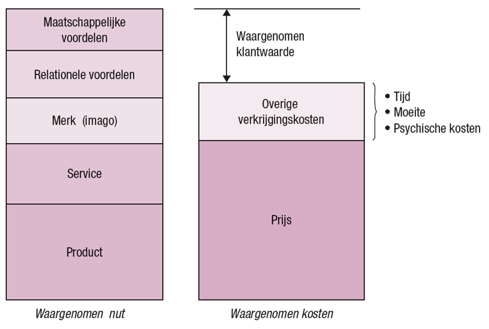

# Business & Management: Hoofdstuk 1 - Continuïteit en waardecreatie

**Doel van Business & Managment**: inzicht geven hoe een bedrijf in grote lijnen functioneert, welke keuzes er zijn die moeten gemaakt worden en hoe de IT daarin een rol kan spelen.

>[!CAUTION]
>**Business** :
> - is een zaak die met een commercieel doel wordt opgericht
> - De activiteiten die nodig zijn om een zaak draaiende te houden

## De continuïteitskring

Een organisatie die wilt voortbestaan streeft naar continuïteit. Dit kan weergegeven worden als een herhalend proces met onderstaande bouwstenen:

- **Producten**: Goederen of diensten laten de organisatie toe te beantwoorden aan klantenbehoeften en klantenwensen.
- **Klantenbehoeften**: Klantenkopen producten omdat ze een tekort ervaren.
- **Waardecreatie**: Wanneer de producten worden verkocht ontstaat er waarde voor de organisatie onder de vorm van omzet, winst, cashflow,...
- **Competenties**: Bedrijfsopbrengsten investeren in kennis en middelen om nieuwe producten te ontwikkelen.
- **Stakeholders**: Bedrijfsopbrengsten uitkeren aan belanghebbenden: aandeelhouders, medewerkers, belangengroepen,...

## Waardecreatie

Waardecreatie gebeurt als er 3 voorwaarden vervuld zijn. Deze 3 elementen vormen de basis voor een solide continuïteitskring.

### Klantenbehoeften ontdekken

- Een product heeft pas waarde voor de klant wanneer die behoeftebevreding ervaart.
- Hoe kunenn we de behoeften van de klanten voorzien? Er zijn 2 bronnen van klantenwaarde:

### Klantenwaarde creëren

**De klantenwaarde** komt overeen met het verschil tussen de waargenomen kosten (**kosten**) en het waargenomen nut (**baten**).
Het is zaak om het verschil groot genoeg te houden zodat het voor de klant nuttig blijft het product aan te schaffen. 

- _Product_: Moet voldoen aan de nodige kwaliteit, functies en design.
- _Service_: Voordelig om extra diensten aan te bieden naast de reeds beschikbare diensten, zoals garantie, installatie, onderhoud.c
- _Merk (imago)_: Elk merk heeft een imago, kennen we het merk niet zal onze perceptie van het merk minder zijn, kennen we het merk goed is dit beter en zijn we hierdoor geneigd het product eerder aan te schaffen. Onze _psychologische behoeften_ worden dus bepaald naarmate we een merk goed of slecht kennen.