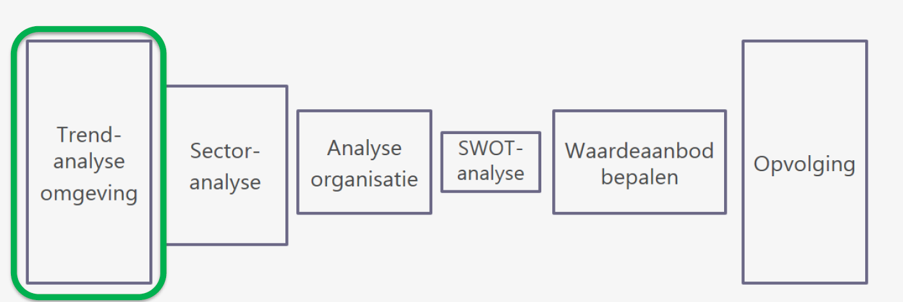
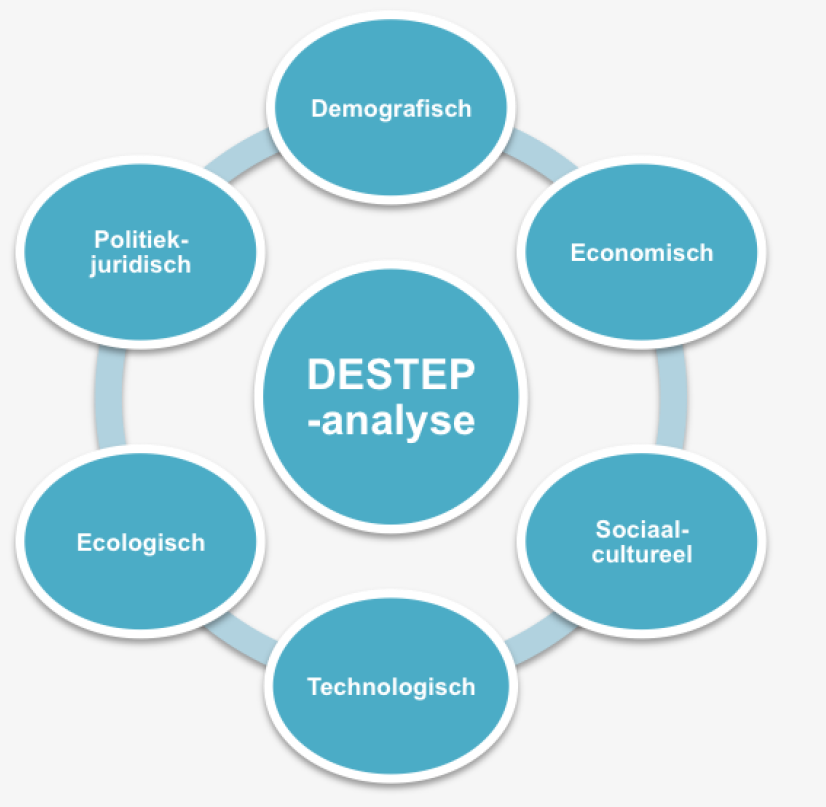

# Business & Management: Hoofdstuk 2 - Trendanalyse omgeving

Situatie in het managementsproces:

Trendanalyse speelt zicht af in de externe omgeving. Deze bestaat uit verschillende spelers en krachten die de werking van de organisatie beïnvloeden. 

De omgeving verandert constant en vaak in een snel tempo.

Deze veranderingen brengen meestal kansen of bedreigingen voort.

>[!WARNING]
> **Kansen** zijn externe ontwikkelingen met eventuele gustige invloed op realisatie van doelstellingen

De externe ontwikkelingen zijn gunstig wanneer ze:
- de realisatie van doelstellingen ondersteunen
- de realisatie van doelstellingen versnellen

>[!WARNING]
>**Bedreigingen** zijn externe ontwikkelingen met eventuele remmende invloed op de realisatie van de doelstellingen.

De externe ontwikkelingen zijn ongunstig wanneer ze:
- de realisatie van de doelstellingen vertragen
- de realisatie van de doelstellingen tegenwerken

**Wanneer heeft een bedrijf te maken met een kans of een bedreiging?**

- Een kans of een bedreiging doet zicht steeds voor in een externe omgeving.
- Een externe ontwikkeling is per definitie neutraal. (niet elke ontwikkeling, zelfs de meeste is/zijn een kans of bedreiging)
- Elke organisatie evalueert vanuit de eigen context of deze evolutie van strategisch belang is.
- Pas wanneer er strategische gevolgen worden geïdentificeerd, is er sprake van een kans of bedreiging en zal men hierop moet inspelen (_Act in de PDCA-cyclus_)
    - de kans benutten
    - de bedreiging neutraliseren

>[!CAUTION]
>Deze kansen en bedreiging zijn externe factoren en bevinden zich dus buiten de organisatie. Het zijn dus factoren waarover de organisatie geen beslissingsbevoegdheid heeft.
>
>**_Maak je zelf een beslissing kan het nooit een kans of bedreiging zijn_**

## DESTEP-model

**Het DESTEP-model** wordt gebruikt om de macro-omgeving te analyseren. Deze bestaat uit factoren of trends die invloed hebben op diverse bedrijfstakken.

Wanneer ze te laat worden opgemerkt, kan dit grote gevolgen hebben.

Het gaat dus om maatschappelijke, soms internationale, ontwikkelingen in verschillende domeinen.

>[!WARNING]
>DESTEP is een accroniem dat verwijst naar 6 verschillende domeinen waar veranderingen in de externe omgeving de werking van organisaties kan beïnvloeden.

1. **Demografische omgevingsfactoren**: de beschrijving van de bevolking naar grootte, dichtheid, plaats, leeftijd, geslacht, ras, bezigheid en andere gegevens.
2. **Economische omgevingsfactoren**: de factoren die de koopkracht en het uitgaven patroon van de consument beïnvloeden.
    - _Koopkracht_: geeft aan hoeveel goederen een huishouden kan kopen met het besteedbaar inkomen.
    - _Uitgavenpatroon_: Waaraan wordt het huishoudbudget besteed?
3. **Sociaal-culturele omgevingsfactoren**: Krachten die de sociale context vormen voor gedrag en die elementaire waarden, perceptie, de voorkeuren en het gedrag binnen een maatschappij beïnvloeden.
4. **Technologische omgevingsfactoren**: krachten die leiden tot nieuwe technologieën en zo nieuwe kansen creëren voor producten en markten.
5. **Ecologische omgevingsfactoren**: krachten die de ecologische context vormen, zoals groeiend tekort in grondstoffen en natuurlijke bronnen, milieuvervuiling en klimaatverandering. 
6. **Politiek-juridische omgevingsfactoren**: Wetten en overheden die organisaties en individuen in een maatschappij beïnvloeden en beperken.

