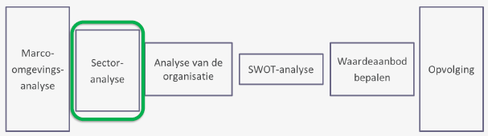
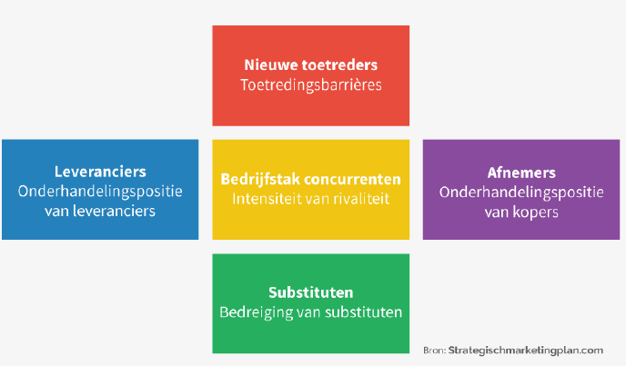
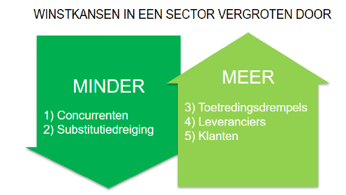

# Business & Management: Hoofdstuk 3 - Sectoranalyse

Situatie in het managementsproces:

## Meso-omgeving

Een onderneming staat in wisselwerking met verschillende spelers in een externe omgeving. Deze spelers worden de "belanghebbenden" of "stakeholders" genoemd en vormen samen de **meso-omgeving**

De meso-omgevingsactoren zijn niet beheersbaar, maar vaak wel beïnvloedbaar. Daarom is het belangrijk een goed relatie te onderhouden met de stakeholders.

## Stakeholders

**Stakeholders** zijn alle belanghebbenden in de omgeving van een onderneming die de gevolgen ondervinden van de beslissingen en acties van de organisatie.

Het zijn *beïnvloeders* die organisaties steeds vaker vragen om verantwoording voor hun gedrag af te leggen. Ze verwachten een open communicatie van de organisatie.

- *Financiële groepen*: banken, investeerders, crowdfunding-platformen
- *Overheid*:
    - Verschillende niveaus: federaal, gewesten, provincies, gemeenten
    - Ministeries, departementen, agentschappen, adviesraden, ombudsdiensten
- *Media*: kranten, radio, televisie, weekbladen, vakbladen, websites, e-mail, sociale media, blogsites, YouTube
- *Maatschappij*: meer en meer treden belangenorganisaties op om namens groeperingen standpunten te vertolken of om door onderhandelen hun belangen te verdedigen, zoals werknemers- en werkgeversorganisaties, consumentenorganisaties en actiegroepen (nationaal of lokaal). Op allerlei manieren kan vanuit een maatschappelijk belang invloed op organisaties worden uitgeoefend.

## Klanten

Organisaties ontlenen hun bestaansrecht aan het invullen van de behoeften van klanten. 
Het is de klant die betaalt voor de angeboden goederen of diensten. 
Wil een onderneming haar klanten behouden, dan moet de beloofde klantewaarde worden geleverd. 

## Leveranciers

Elke organisatie gebruikt goederen en diensten van andere organisaties.
Belangrijk om relaties te onderhouden:
- prijs
- kwaliteit
- beschikbaarheid; leveringstermijnen
- MVO

## Concurrenten

**Definitie:**
- Producten die op dezelfde markt worden aangeboden
- Waardeaanbod voor dezelfde klanten

### Soorten concurrenten

Concurrentieniveau is afhankelijk van de gekozen marktafbakening:

1. *Product- of merkconcurrentie*: andere bedrijven die een soortgelijk product of service aanbieden tegen soortgelijke prijzen.
2. *Concurrentie binnen de productcategorie*: alle organistaties die hetzelfde product of dezelfde soort producten maken: concurrentie binnen de productcategorie.
3. *Generieke concurrentie*: organisaties die producten maken die dezelfde functie invullen.
4. *Behoeftenconcurrentie*: welke behoefte primeert?
    - Alle organisaties concurrent met elkaar om het budget van de klant.
    - Het geld kan maar eenmaal uitgegeven worden 

### Substitutie

>[!warning]
>Producten uit andere markten die dezelfde behoefte bevredigend.
>Concurrentiebedreiging vanuit andere markten.

### Vijfkrachtenmodel Porter

Er zijn 5 krachten die de aantrekkelijkheid van een sector bepalen. Een onderneming is best in een sector actief waar deze krachten gunstig evolueren.

## Triple bottomline

>[!warning]
>**De triple bottomline** is een situatie waarin de organisatie de economische vatbaarheid, milieuvriendelijkheid en sociale verantwoordelijkheid uitbalanceert.

Ze bestaat uit 3 dimensies, deze komen volledig tot hun recht wanneer alle drie duidelijk belangrijk gemaakt worden in de bedrijfsvoering.

- **Profit**: goederen en diensten voortbrengen met meerwaarde als maatstaf voor de maatschappelijke waardering ervan.
- **People**: de gevolgen voor mensen en maatschappij binnen en buiten de onderneming.
- **Planet**: de effecten op het natuurlijke leefmilieu

>[!important] 
>De drie dimensies beïnvloeden elkaar, vullen elkaar aan en komen soms in conflict met elkaar. Het zoeken naar een *evenwicht* is dan ook één van de grote uitdagingen in MVO.

