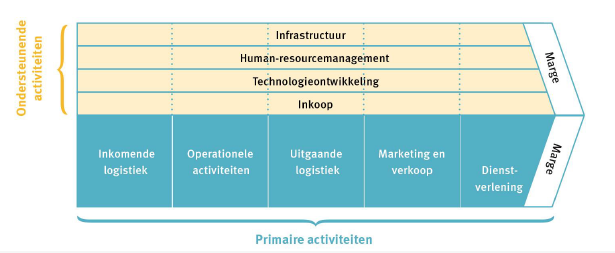
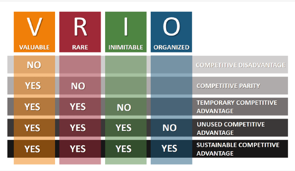
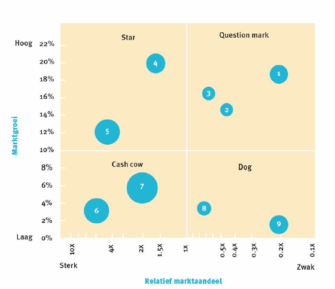

# Business & Management: Hoofdstuk 4 - Analyse van de organisatie

## Interne omgeving

De interne omgeving bestaat uit de middelen en capaciteiten van een organisatie.
- De middelen zijn bezittingen
- De capaciteiten van een organisatie zijn vaardigheden en het vermogen om de nodige activiteiten te ontplooien.

De analyse van de interne omgeving geeft inzicht in de sterkten en de zwakten van de organisatie.

### Sterkten

> Interne componenten me een eventuele gunstige invloed op de realisatie van doelstellingen.

De interne componenten kunnen een troef zijn wanneer ze:
- de realisatie van doelstellingen ondersteunen
- de realisatie van doelstellingen versnellen

### Zwakten

> Interne componenten met een eventuele ongunstige invloed op de realisatie van doelstellingen

De interne componenten vormen een rem wanneer ze:
- de realisatie van doelstellingen vertragen
- de realisatie van doelstellingen tegenwerken

### Sterkte of zwakte

De mate waarin een interne component als sterkte of zwakte wordt beoordeeld is onder andere afhankelijk van:

- de gekozen strategie van de organisatie
- de markt waarop men actief is
- de wijze waarop er op externe stituaties wordt gereageerd
- de gekozen strategie duurzaam is

### Benchmarking

> Kennis van de externe omgeving is mee bepalend om sterkten te creëren of zwakten te indentificeren.

- Volstaan de huidige middelen en capaciteiten om de concurrentie te verslaan?
- Wat kun je leren van andere bedrijven?

> **Benchmarking** is een referentiepunt of een maatstaf met als doel het bestuderen van bedrijfsprocessen bij andere organisaties om verbeterpunten voor de eigen competenties op te sporen.

## Waardeketen van Porter

> De waardeketen is een bedrijfskundig concept dat de strategisch relevante activiteiten van een organisatie met elkaar in verband brengt.

Dit model wordt ook gebruikt om de interacties met stakeholders systematisch te onderzoeken.

De waardeketen bevat primaire activiteiten en secundaire ondersteunende activiteiten.

### Primaire activiteiten

> De activiteiten die rechtstreeks waarde toevoegen aan het product van de organisatie:

- Ontvangst & Opslag
- Productie
- Fysieke distributie
- Marketing en verkoop
- Dienstverlening

### Ondersteunende activiteiten

> De activiteiten die ervoor zorgen dat de primaire activiteiten mogelijk gemaakt worden:

- Inkoopmanagement
- Technologie & ontwikkeling
- Personeel & organisatie (HRM)
- Infrastructuur

### Marge

> **De Marge** is het verschil tussen de totale kosten van alle primaire en ondersteunende activiteiten en de totale opbrengsten van de organistatie.

## VRIO-model

Helpt de onderneming om de middelen te indentificeren:
- die een (duurzaam) concurrentievoordeel opleveren als ze:
    - waardevol zijn
    - zeldzaam zijn
    - moeilijk te imiteren zijn
    - de middelen kunnen ingezet worden voor waardecreatie
- die zwak scoren

## BCG-matrix

> **De BCG-matrix** is een portfolio dat een overzicht geeft van alle producten die een bedrijf op dit ogenblik op de markt aanbiedt.

De matrix wordt gebruikt om na te gaan welke (strategische) acties de onderneming moet ondernemen.

### Twee dimensies

1e dimensie of x-as: Relatief marktaandeel

$$\frac{Eigen \text{ } marktaandeel}{Marktaandeel \text{ }van\text{ } de\text{ } grootste\text{ } concurrent}$$

2e dimensie of Y-as: groeitempo van de markt

### Strategische interpretatie

> Een strategisch gezonde organisatie zal streven naar **evenwichtige portefeuille** van producten.