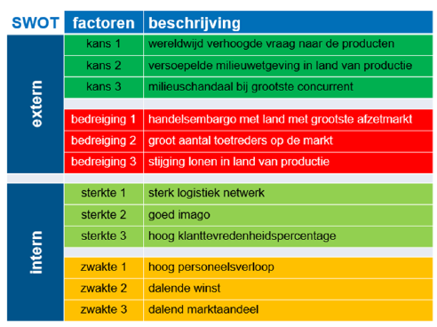
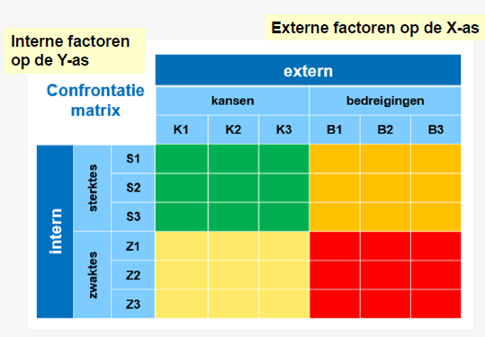
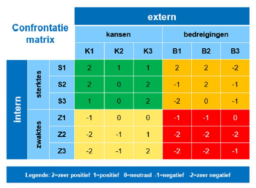
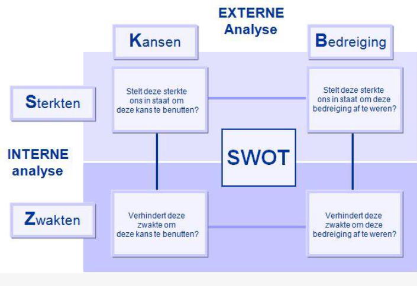
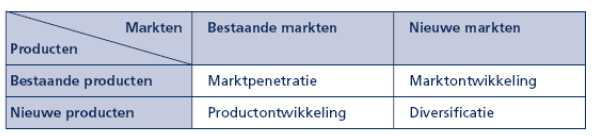
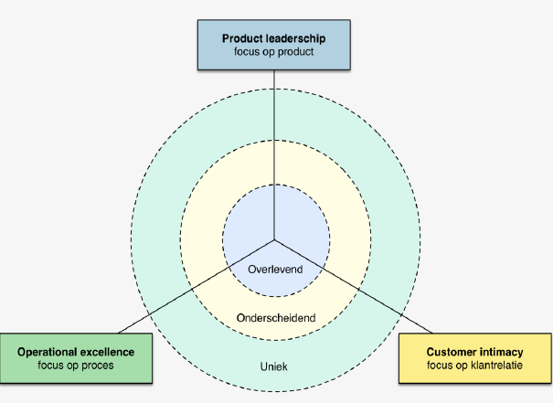

# Business & Management: Hoofdstuk 5 - SWOT-analyses

>[!important] 
>**S**trengths  
>**W**eaknesses  
>**O**pportunities  
>**T**hreats

*Doel van de SWOT-analyse*: 
- Onderbouwing voor de strategiekeuze  
    &nbsp;Hoe gaan we de continuïteit realiseren?
- Beter inspelen op een dynamische externe omgeving
    &nbsp;Inzicht in de huidige situatie helpt felexibele besluitvorming.

## Confrontatiematrix

De confrontatiematrix is een belangrijk onderdeel van de SWOT-analyse:
- De matrix laat zien hoe de organisatie aansluit op de externe omgeving
- Sterktes en zwaktes worden afgetoetst tegenover kansen en bedreigingen

>Het doel is om een nieuwe strategie te ontwikkelen om de continuïteit veilig te stellen.

### Confrontatiematrix - Werkwijze

#### Stap 1 - Selecteer de 3 belangrijkste sterkten, zwakten, kansen en bedreigingen

#### Stap 2 - Koppel in de matrix de sterkten en zwakten aan de kansen en bedreigingen

#### Stap 3 - Confronteer een factor uit de externe omgeving met een factor uit de interne omgeving

### Interpretatie van de kruispunten

1. Elk vakje of kruispunt in de matrix beoordeelt de relatie tussen 2 factoren uit de SWOT

2. Daarna selecteer je enkele kruispunten die een hoog strategisch belang hebben:
    - Omdat er een sterk gunstig effect is (+2)
    - Omdat er een sterk ongunstig effect is (-2)

## Missie al leidraad

Een missie:
- geeft de organisatie **een opdracht**
- omschrijft de **bestaansreden**
- benoemt de **kernwaarden**
- **stuurt** de continuïteitskring
- **bakent** de activiteit **af**. Wat we wel en zeker niet doen.
- zorgt ervoor dat **belanghebbenden** bereid zijn om **mee te werken** aan 'het project' van de onderneming
- helpt een **gemeenschappelijk identiteit** uit te dragen

### Kenmerken van een goede missie

|De klant staat centraal:  |  Markt georiënteerd  |
| - | - |
| **Ik word er warm van:** | **Inspirerend** |
| **Kort en krachtig:** | **Summier** |
| **Tastbaar, concreet:** | **Specifiek** |
| **Zet aan tot actie:** | **Ijverig** |
| **Voer voor discussie:** | **Omstreden** |
| **Voor een betere toekomst:** | **Nalatenschap** | 

### De missie stuurt de strategie

:arrow_right: Een missie heeft betrekking op de hele onderneming.

:arrow_right: Een missie schept duidelijkheid voor medewerkers en andere stakeholders over wat de organisatie doet en wat ze zeker niet doet.

## Strategische keuzes

### Doelen en doelstellingen

**Doel:** Een kwalitatieve omschrijving een beoogd resultaat

**Doelstelling:** Een kwantitatieve omschrijving een beoogd resultaat

 - SMART: Specifiek, meetbaar, aanvaardbaar, realistisch, tijdskader

 ### Groeistrategieën van Ansoff

 Een succesvol bedrijf is altijd op zoek naar nieuwe manieren om omzet en winst te verhogen door nieuwe klanten te werven. Welke mogelijkheden zijn het beste geschikt?
 De groeistrategieën van **de Ansoff-matrix** helpen hierbij.

1. **Marktpenetratie**: Verkoop van bestaande producten op bestaande markten verhogen.  
**Doel**: het vergroten van het huidige marktaandeel

2. **Marktontwikkeling:** Bestaande producten op nieuwe markten verkopen. (nieuwe markt = nieuwe klanten met andere behoeften, ander koopgedrag,...)

3. **Productontwikkeling:** Nieuwe producten aan bestaande klanten verkopen.

>[!warning]
>Deze matrix wordt altijd vanuit het *standpunt* van *het bedrijf* geïnterpreteerd. 

> Een nieuw product wil zeggen dat het bedrijf dit product voor het eerst zelf op de markt aanbiedt.

4. **Diversificatie:** Nieuw product in een nieuwe markt aanbieden
    - *Verwante diversificatie:* in lijn van het reeds bestaande assortiment
    - *Niet-verwante diversificatie:* de nieuwe producten verschillen in grote mate van jouw huidige business.

### Waardestrategieën van Treacy & Wiersema

#### Operational Excellence

- Voldoende kwaliteit tegen redelijke prijzen
- Koopgemak of convenience primeert

#### Product Leadership

- De beste, innovatieve producten aanbieden
- R&D is essentieel
- Topkwaliteit nastreven

#### Customer Intimacy

- Maatwerk
- Aanbod voor individuele klant
- Persoonlijk advies

## Strategie evalueren

- Is de huidige strategie nog werkbaar?
- Zijn er uit de confrontatiematrix nieuwe strategische aandachtspunten voortgekomen?
- Zijn er andere strategische mogelijkheden?

**Suitability of geschiktheid:** Kunnen we onze doelen en doelstellingen realiseren?  
**Feasibility of haalbaarheid:** Heeft de onderneming de middelen om de strategie te implementeren?  
**Acceptability of aanvaardbaarheid:** Wordt de strategie door alle belangengroepen gedragen?

### MVO

Elke activiteit van de organisatie kan getoetst worden aan **de Triple bottomline**.

Klanten, stakeholders, overheid en werknemers verwachten een verantwoorde keuze.