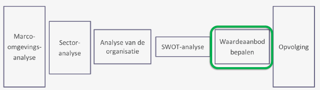
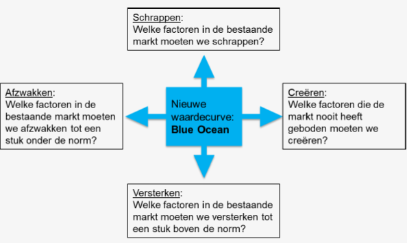
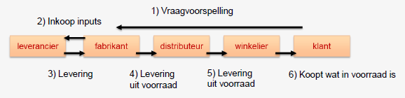
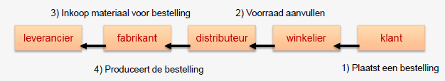
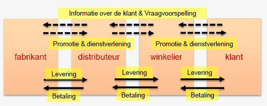
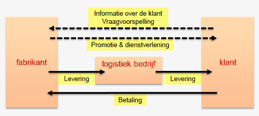

# Business & Management: Hoofdstuk 6 - Waardeaanbod bepalen

Situatie in het managementsproces:

De gekozen strategie moet nu concreet worden gemaakt:

1. *Business:*
    - Bestaande producten ondersteunen of nieuwe producten ontwikkelen om de behoeften van de klanten te blijven voorzien.

2. *Management:*
    - Allerhande activiteiten plannen, coördineren & controleren

> **Doel:** Behoeftebevrediging aanbieden en de concurrentie overtreffen 

:arrow_right: Belangrijkste manier om het verschil te kunnen maken t.o.v. de concurrentie is het creëren van unieke klantenwaarde

:arrow_right: Dit is een proces dat steeds blijft lopen *eens de concurrentie het product kan imiteren ontstaat er een concurrentiestrijd*

> :left_right_arrow: Hierdoor wordt de markt minder winstgevend

## Blue Oceanstrategie

Naarmate de concurrentie op de markt toeneemt, dalen ook de winstkansen. Er blijft weinig ruimte over om een uniek aanbod op de markt te brengen.

Deze situatie wordt in de literatuur een *'Red Ocean'* genoemd en geeft aan dat de markt te onaantrekkelijk geworden is.

> Het is tijd om een nieuwe markt te creëren: de *'Blue Ocean'*

### Kenmerken van de Red Ocean

- Concurreer in de bestaande markten
- Versla de concurrentie
- Exploiteer bestaande vraag
- Maak de afweging tussen waarde en kosten
- Stem activiteiten af op de strategische keuze tussen differentiatie en lage kosten

### Kenmerken van de Blue Ocean

- Creëer een nieuwe Markt
- Maak dat de concurrentie er niet toe doet
- Creëer en bedien nieuwe vraag
- Doorbreek de afweging tussen waarde en kosten
- Stem de activiteiten af op het nastreven van differentiatie en lage kosten

>[!warning]
>**Blauwe oceanen** zijn ook vaak voor klanten nieuw:  
>:arrow_right: Zien ze de behoeftebevrediging als een meerwaarde?  
>**Blauwe oceanen** geven als gevolg van de onbekendheid ook meer onzekerheid

## Strategische bedrijfsprocessen

Hoe onderscheidt een organisatie zich van de concurrentie?

:white_check_mark: Voldoende behoeftebevrediging aanbieden.  
:white_check_mark: Een aantrekkelijk product heeft unieke kenmerken.

### Operationele activiteiten

- Goede afstemming tussen de verschillende bedrijfsprocessen.
- Activiteiten voortdurent bijsturen:
    - Evenwicht zoeken tussen lage kostprijs voor productie en voorraadbeheer
    - Betrouwbare leveringsgraad handhaven

#### Duivelsdriehoek

Als we dat allemaal samen nemen, komen we uit op wat we de *Duivelsdriehoek* noemen.

We streven naar:

:white_check_mark: een hoge leveringsgraad  
:white_check_mark: een lage voorraadkost  
:white_check_mark: lange productieruns  

#### Just-in-time of JIT

> Levering en productie worden zodanig op elkaar afgestemd zodat er nauwelijks of geen voorraden in een bedrijf nodig zijn.

- Leveringen gebeuren binnen afgesproken tijd (kan meermaals per dag/week) :arrow_right: wegvallen van de meeste voorradkosten
- Leveranciers moeten in real time toegang hebben tot de informatie van het productieproces om tijdig te kunnen leveren. (veel vertrouwen nodig)

<table style="text-align:center;">
<thead>
<th style="text-align:center;">Voordelen</th>
<th style="text-align:center;">Nadelen</th>
</thead>
<tbody>
<tr>
<td>

:white_check_mark: Minder voorraadkosten

</td>
<td>

:white_check_mark: Geen marge voor fouten of storingen in de levering

</td>
</tr>
<tr>
<td>

:white_check_mark: Minder kapitaal dat in voorraden zit

</td>
<td>

:white_check_mark: Geen mogelijkheid om onverwachte bestellingen te plaatsen

</td>
</tr>
<tr>
<td>

:white_check_mark: Minder kans op schade, verlies of diefstal van het afgewerkte product

</td>
<td>

:white_check_mark: Geen tijd om over de leveringsvoorwaarden te onderhandelen

</td>
</tr>
</tbody>
</table>

#### Productieplanning

Een goede productieplanning helpt in het zoeken naar een evenwicht tussen een hoge leveringsgraad behalen en de kosten die erbij horen.

Bedrijven kunnen de productie organiseren op 2 manieren:
- Produceren op voorraad

- Produceren op bestelling

### Uitgaande logistiek

Bij de uitgaande logistiek gaat de aandacht naar 3 soorten activiteiten:

1. Kennis over de klanten samenbrengen om het aanbod hierop af te stemmen

2. Distributie van producten en het administratief afhandelen van de betaling

3. Klanten overtuigen door communicatieactiviteiten en dienstverlening

#### Klassiek distributiemodel

#### Nieuw distributiemodel

