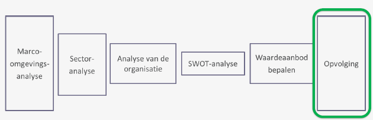
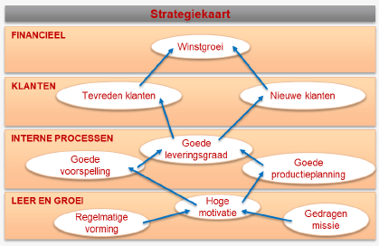
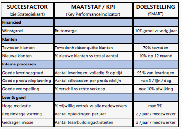
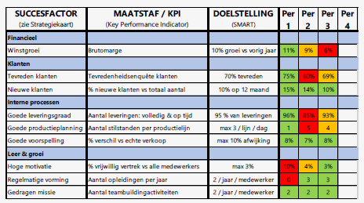
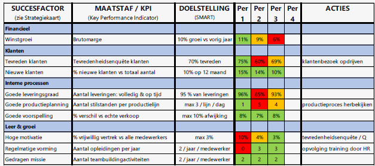

# Business & Management: Hoofdstuk 7 - Opvolging

Situatie in het managementsproces:

## De gekozen strategie realiseren

:white_check_mark: Een strategie is de gekozen koers van de organisatie om haar missie te verwezenlijken

:white_check_mark: Het management moet voortdurend activiteiten plannen, coördineren & controleren

&nbsp;&nbsp; :arrow_right: Hiervoor wordt de **PDCA-cyclus** gebruikt

- **Plan** : Activiteiten opstellen en coördineren
- **Do** : Het plan uitvoeren
- **Check** : Nagaan of alles volgens plan is verlopen (doelstellingen behaald?)
- **Act** : Waar en hoe moet het plan worden bijgestuurd?

> Bij de opvolging is het **'Check'** gedeelte heel Belangrijk
> - Is alles volgens plan verlopen? (*resultaat behaald?*)
> - Weten we waarom het werkte? (success te standaardiseren en kennis verankeren)
> - Weten we waarom het niet werkte? (welke correcties kunnen we uitvoeren en terug in de PDCA-cyclus brengen?)

## Strategiekaart

> :white_check_mark: Een instrument dat helpt de strategie te vertalen naar activiteiten  
> :white_check_mark: Handig hulpmiddel bij het analyseren van belangrijke informatie

*'Check' van de PDCA-cyclus a.d.h.v de strategiekaart:*

- **Lagging indicatoren:** deze bevatten informatie over het verleden
- **Leading indicatoren:** deze bevatten informatie over een waarschijnlijke toekomst

:arrow_right: Er is onderlinge afhankelijkheid: elk niveau stuwt het andere vooruit.

 (bv. Opgeleid gemotiveerd team :arrow_right: Goede interne processen :arrow_right: Tevreden klanten)

 ## Balanced scorecard

 De strategiekaart volstaat niet om de volledige PDCA-cyclus af te werken. Ze is het vertrekpunt voor een zeer belangrijk managementinstrument: **de balanced scorecard**.

*Bij het begin van het jaar worden de doelstellingen vastgelegd.*

**Balanced scorecard: opvolging**

