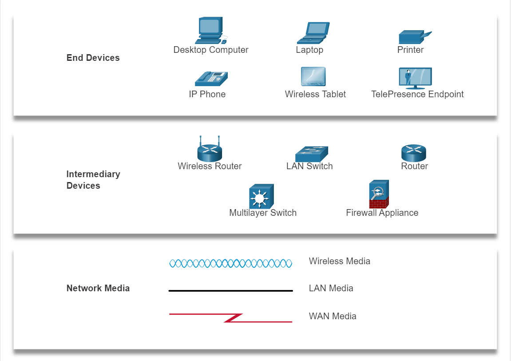
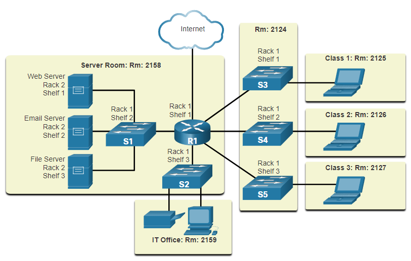
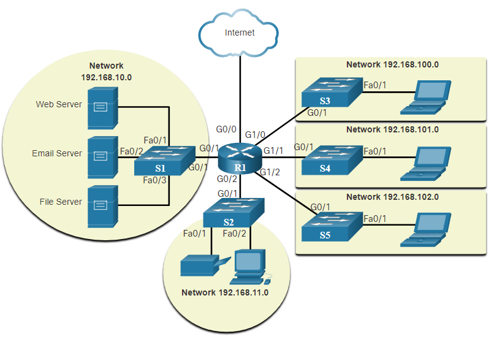
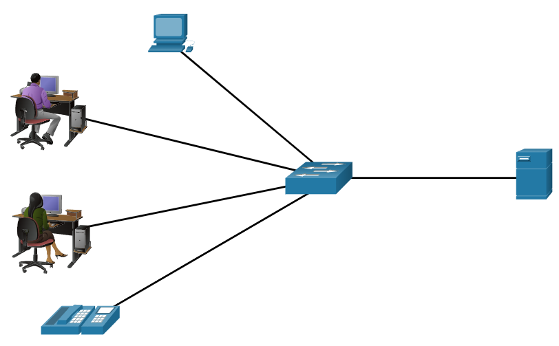
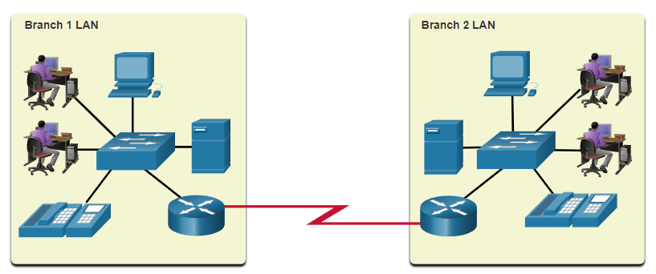
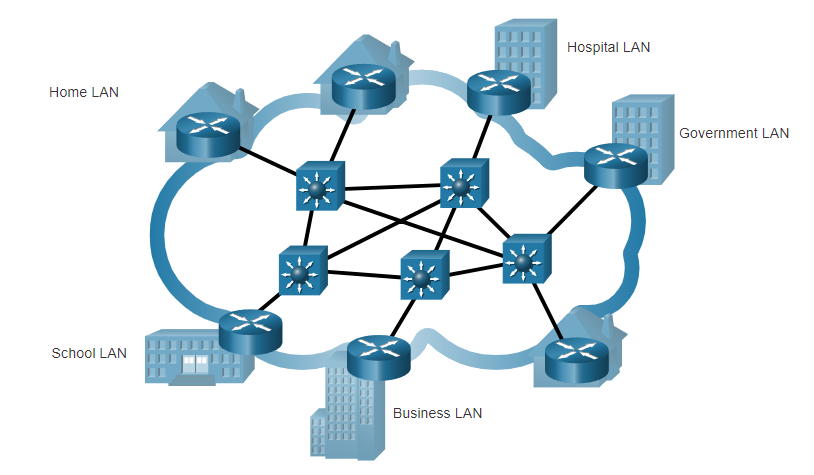
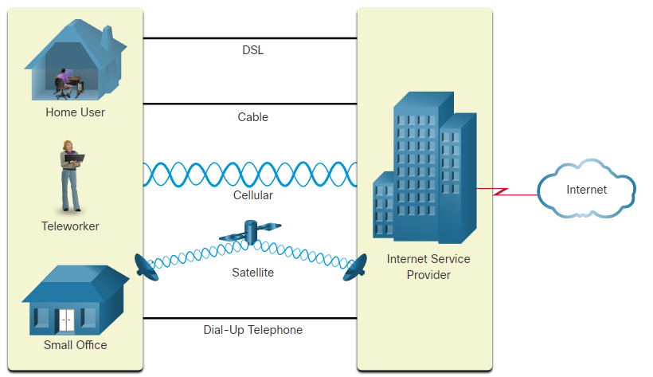
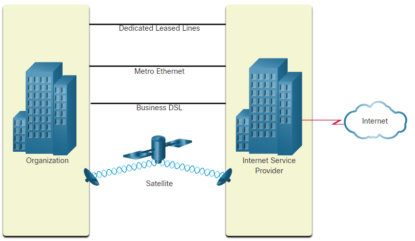

# Hoofdstuk 1 - Networking Today

Communicatie is bijna even belangrijk als water, lucht voedsel en een dak. In de wereld van vandaag zijn we verbonden door het gebruik van verschillende netwerken.

- Elke computer in een netwerk is **een host** of een **end device**
- Servers zijn computers dat informatie doorgeven aan end devices

| Server type | Description |
| ----------- | ----------- | 
| Email server | Een email server runned email software. Klanten gebruiken client software om hun email te raadplegen |
| Web server | Een webserver runned websoftware. Klanten gebruiken browser software om webpagina's te raadplegen. |
| File server | Een file server kan bedrijfs en private bestanden opslaan. Klanten hun toestellen kunnen gebruikt worden om deze bestanden te raadplegen.|

Met klanten spreken we over toestellen die de requests naar de server sturen.

## Netwerk onderdelen

### Peer-to-peer netwerk

Peer-to-peer netwerk maakt het mogelijk om zowel de client als server in het netwerk te zijn. Dit wordt enkel aangeraden voor kleinere netwerken. 

| Voordelen | Nadelen |
| --------- | ------- |
| Gemakkelijk in opzet | Geen gecentraliseerde administratie |
| Minder complex | Niet zo veilig |
| Lager in kost | Niet schaalbaar |
| Wordt gebruikt voor kleiner taken: versturen van bestanden, delen van printers | Tragere performance |

### End Devices

Een end device is een toestel vanwaar een bericht vertrekt, of waar het bericht toekomt. Data vertrekkende van een end device, loopt doorheen een netwerk en komt aan een end device aan.

### Intermediary Network Devices

= Tussenliggende netwerk apparatuur

Deze apparaten verbinden onderling end devices.
Voorbeelden hiervan zijn; een swtich, draadloze access points, routers, firewalls,...

Een van de taken van deze toestellen is ook het beheer van data dat door een netwerk vloeit:

- Data signalen regenereren en opnieuw verzenden
- Informatie bijhouden over welke paden er binnen een netwerk bestaan
- Andere apparaten berichten over fouten en communicatiefouten

### Netwerk Media

Communicatie over een netwerk gebeurd door een medium die een bericht toelaat te bewegen van de bron naar de bestemming.

| Media types | Beschrijving |
| ----------- | ------------ 
| Metalen draden in kabels | Gebruiken elektrische pulsen |
| Glazen of plastieken vezels in kabels (fiber-optic cable) | Gebruiken licht pulsen |
| Draadloze transmissie | Gebruiken modulaties van specifieke frequenties van elektromagnetische golven |

## Netwerkweergaven en begrippen

### Netwerkweergaven

Netwerk diagrammen, gebruiken vaak symbolen om toestellen binnenin een netwerk voor te stellen.

Enkele belangrijke begrippen:

- Network Interface Card (NIC)
- Physical port (fysieke poort)
- Interface

### Netwerk diagrammen

Netwerk diagrammen geven een visuele weergave over hoe het netwerk verbonden is.

**Fysieke netwerk diagrammen** illustreren de fysieke locatie van tussenliggende netwerkapparatuur en kabel installaties.

**Logische netwerk diagrammen** illustreren toestellen, poorten en het addressenschema van een netwerk

## Veel voorkomende netwerken

Er bestaan verschillende soorten netwerken deze komen vooral in verschillende groottes:

- Small Home Networks: enkel computers onderling en met het internet verbonden
- Small Office/Home Office: Is instaat een computer in een home of remote office te laten verbinden met een bedrijfs netwerk. (= SOHO)
- Medium to Large Networks: verschillende locaties met honderden of duizenden onderling verbonden computers
- World Wide Networks: Verbind duidende miljoenen computers wereldwijd (zoals het internet)

### LANs en WANs

Netwerken verschillen door:
- Grootte en bedekt gebied
- Aantal verbonden gebruikers
- Aantal en type diensten die beschikbaar zijn
- Verantwoordelijkheidsgebied

De meest voorkomende soorten netwerken zijn:
- Local Area Network (LAN): netwerk infrastructuur in een beperkt geografisch gebied
- Wide Area Network (WAN): netwerk infrastructuur in een groter geografisch gebied

| LAN | WAN |
| --- | --- |
| Verbind end devices in een beperkt gebied | Verbind LAN-netwerken in een wijder gebied |
| Beheerd door één persoon of organisatie | Vaak beheerd door verschillende service providers |
| Voorziet interne apparaten van een hoge snelheid bandbreedte | Vaak lagere snelheden tussen de LAN-netwerken |

LAN-netwerk:

    

WAN-netwerk:

    

### Het internet

Het internet is een wereldwijde collectie van onderling verbonden LAN en WAN netwerken.

- LAN-netwerken zijn onderling verbonden doormiddel van WAN-netwerken
- WAN-netwerken kunnen koperen kabels, glasvezels kabels, en draadloze transmissie gebruiken

Het internet is geen eigendom van een persoon of organisatie. Volgende groepen zijn betrokken in het onderhouden van structuur en protocollen op het internet.
- IETF: Internet Engeneering Task Force
- ICANN: Internet Corporation for Assigned Names and Numbers
- IAB: Internet Architecture Board

    

### Intranet en Extranet

Een **intranet** is een private collectie van LAN- en WAN-netwerken die intern behoren tot een organisatie. De bedoeling hiervan is dat deze enkel toegankelijk zijn voor leden van de organisatie.

Een organisatie kan gebruik maken van een **extranet** om beveiligde toegang to hun netwerk te geven voor individuelen die werken voor een andere organisatie maar nog steeds toegang to data op hun netwerk nodig hebben.

## Internet connections

### Internet Access Technologies

Er zijn verschillende manieren om gebruikers en organisaties met het internet te verbinden:
- Populaire diensten voor kleine kantoren of thuis-netwerken: broadband cable, broadband digital subscriber line (DSL), wireless WAN's en mobiele diensten.
- Organisaties hebben nood aan snellere verbindingen ter ondersteuning van IP telefoons, video conferencing en data center opslag.
- Verbindingen op business niveau worden vaak voorzien door Service providers (SP) en kunnen de volgende zijn: business DSL, leased lines, and Metro Ethernet

### Home and Small Office Internet Connections

| Verbinding | Beschrijving |
| ---------- | ------------ |
| Kabel | Hoge bandbreedte, altijd ingeschakeld, internet geleverd door kabel televisie dienstlevers |
| DSL | Hoge bandbreedte, altijd ingeschakeld, internet verbinding dat loopt over een telefonielijn |
| Cellular | Maakt gebruik van een telefoonnetwerk om verbinding te maken met het internet |
| Satellite | Groot voordeel voor landelijke regios zonder service providers |
| Dial-up telephone | Een low-cost, lage bandbreedte optie die gebruik maakt van een modem |

    

### Business Internet Connections

Zakelijke internet connecties hebben vaak het volgende nodig:
- Hogere bandbreedte
- Toegewijde verbindingen (dedicated connections)
- Beheerde diensten

| Connectie-type | Beschrijving |
| -------------- | ------------ |
| Dedicated Leased Line | Deze verbindingen zijn gereserveerde circuits binnen een service provider's |
| Ethernet WAN | Deze verbinding verlengt LAN toegangs technologie naar een WAN |
| DSL | Een zakelijke DSL lijn is beschikbaar in verschillende formaten, waaronder Symmetric Digital Subscriber Lines (SDSL) |
| Satteliet | Deze verbinding kan een connectie voorzien wanneer een bekabelde verbinding geen oplossing is |

    

### The Converging Network

Voor samengevoegde netwerken bestonden moest een organisatie aparte kabels hebben voor telefoon, video en data. Elk van deze netwerken gebruikte een verschillende technologie om dit signaal de verplaatsen.

Deze netwerken hadden ook steeds hun eigen regels en standaarden.

Samengestelde netwerken voeren verschillende diensten uit op eenzelfde link.
Samengestelde netwerken kunn dus zowel data, geluid als video over dezelfde netwerk infrastructuur opleveren. Dit netwerk gebruikt voor alle diensten dezelfde regels en standaarden.

## Vertrouwelijke netwerken

### Netwerk architectuur

**Netwerk architectuur** verwijst naar de technologieën die de infrastructuur ondersteund die de gegevens over het netwerk verplaatst.

Er zijn vier eigenschappen waaraan de onderliggende architectuur moet voldoen om de verwachting van de gebruikers te behalen:
- Fouttolerantie
- Schaalbaarheid
- Quality of Service (QoS)
- Beveiliging

#### Fouttolerantie

Een fouttolerant netwerk beperkt de impact van fouten door het aantal betrokken apparaten in te beperken. 

Betrouwbare netwerken bieden redundantie door een pakketgeschakeld netwer te implementeren:
- Pakketschakelen splits verkeer op in pakketten die over een netwerk geroute worden
- Elk pakket kan in theorie een ander pad naar de bestemming nemen.

Dit is niet mogelijk bij circuitgeschakelde netwerken, die special circuits tot stand brengen.

#### Schaalbaarheid

Een schaalbaar netwerk  kan snel en eenvoudig uitgebreid worden om nieuwe gebruikers en applicaties te ondersteunen, zonder de diensten of performantie van de reeds bestaande gebruikers te impacteren.

Netwerk designers volgen algemene standaarden en protocollen om netwerken schaalbaar te maken.

#### Quality of Service (QoS)

Geluid en live video transmissie vereisen een hogere verwachtingen om die diensten te leveren.

Vertragingen en onderbrekingen onstaan door een hogere nood aan bandbreedte en de QoS die niet geconfigureerd is.

- QoS is het hoofdzakelijke mechanisme dat gebruikt word om zeker te zijn van de betrouwbare kwaliteit van gegevens die aan de gebruikers geleverd wordt.
- Met een QoS policy kan de router makkelijker de flow van data en geluid verkeer beheren.

#### Netwerkbeveiliging

Er zijn twee hoofdzakelijke netwerbeveiligingen:
- Netwerk-infrastructuur beveiliging:
    - Fysieke beveiliging van netwerk apparatuur
    - Vermijden van onbevoegde toegang tot de apparatuur
- Informatie beveiliging:
    -  Beveiliging van de informatie of gegevens die verzonden worden over het netwerk

Er zijn drie doelen bij netwerkbeveiliging:
- Vertrouwelijk - enkel de bevoegde personen kunnen de data lezen
- Integriteit - zekerheid dat de gegevens niet gewijzigd zijn tijdens de overdracht
- Beschikbaarheid - zekerheid van tijdelijk en betrouwbare toegang tot de gegevens voor de bevoegde personen

### Netwerk trends

De rol van een netwerk moet constant bijgewerkt zijn om mee te kunnen zijn met de laatste technologieën en apparaten.

Enkel nieuwe trends die organisaties en klanten impacteren:
- Bring Your Own Device (BYOD): staat de gebruiker in zijn eigen toestel te gebruiken om informatie te raadplegen en te communiceren.
- Online collaboration: 
    - Staat gebruikers toe samen te werken voor projecten over een netwerk
    - Hoge prioriteit voor bedrijven en onderwijs
    - Tools zoals, teams, zoom,... staan gebruikers toe online te verbinden en te communiceren
- Video communications:
    - Krachtige tool om onderling te communiceren
    - Kritische requirement voor een effectieve samenwerking
- Cloud computing:
    - Laat ons toe persoonlijke bestanden op te slaan of onze data te backuppen op servers over het internet
        - We kunnen ook applicaties raadplegen door gebruik te maken van de cloud
        - Bedrijven kunnen deliverables brengen naar elk apparaat over de wereld
    - Mogelijk door data centers
    - Soorten clouds:
        1. **Public clouds**: toegankelijk voor iedereen door een pay-per-use model
        2. **Private clouds**: specifiek voor een organisaties of eenheid zoals de overheid
        3. **Hybrids clouds**: samenstelling van verschillende types clouds. Elk deel bestaat apart maar zijn verbonden door dezelfde architectuur
        4. **Custom clouds**: speciaal voor een specifieke industrie, kan zowel publiek als privè zijn

#### Technology trends at home

- Smart home technologie is een trend die toestaat dat technologieën geïntegreerd worden met dagelijkse appartuur
- Zo kan een oven weten wanneer een maaltijd klaar moet gemaakt worden door te synchroniseren met je agenda

#### Powerline technology

- Powerline netwerken kunnen toestellen toelaten te verbinden met een LAN wanneer een datanetwerkkabel of een draadloze verbinding geen optie is
- Door gebruik te maken van een standaar powerline adapter kan een toestel verbinden met een LAN waar een stopcontact beschikbaar is

> Powerline netwerken is nuttig wanneer een wireless access point niet alle apparatuur kan verbinden

#### Wireless broadband

Buiten DSL en kabel kunnen we apparaten verbinden via een draadloos breedbandnetwerk.

Deze vinden we vaker terug in een landelijke regio. Een Wireless Internet Service Provider (WISP) is een ISP dat gebruikers verbind met speciaal toegeweren access points of hotspots.

- Gebruikt dezelfde mobiele technologie als een smartphone
- Een antenna is geïnstalleerd buiten het huis

### Netwerk Security

- Netwerkbeveiliging maakt een belangrijk deel van netwerken, ongeacht de grootte van een netwerk.
- Een netwerkbeveiling dat wordt geïmplementeerd moet rekeninghouden met de omgeving bij het beveiligen van de data, maar moet tevens de quality of service behouden
- Een netwerk beveiligen heeft verschillende protocollen, technologieën, toestellen, tools, en technieken om de gegevens te beveiligen en bedreigingen te beperken

_Externe bedreigingen_:
- Virusses, worms, Trojan horses
- Spyware and adware
- Zero-day attacks
- Threat Actor attacks
- Denial of service attacks
- Data interception and theft
- Identity theft

_Interne bedreigingen_:
- Verloren of gestolen toestellen
- Per ongeluk verkeerd gebruik door werknemers
- Kwaadwillige medewerkers

#### Security Solutions

Beveiliging kan best geimplementeerd worden op verschillende lagen gebruik maken van verschillende manieren.

_Netwerkbeveiliging onderdelen voor een klein netwerk:_
- Antivirus en antispyware software op end devices
- Firewall filtering om onbevoegde toegang tot het netwerk te blokkeren

_Netwerkbeveiling onderdelen voor een groter netwerk:_
- Dedicated firewall system
- Access control lists (ACL)
- Intrusion prevention systems (IPS)
- Virtual private networks (VPN)