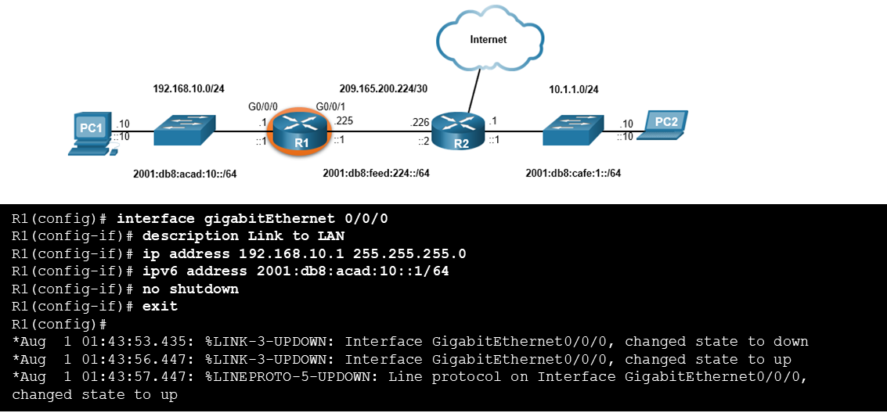
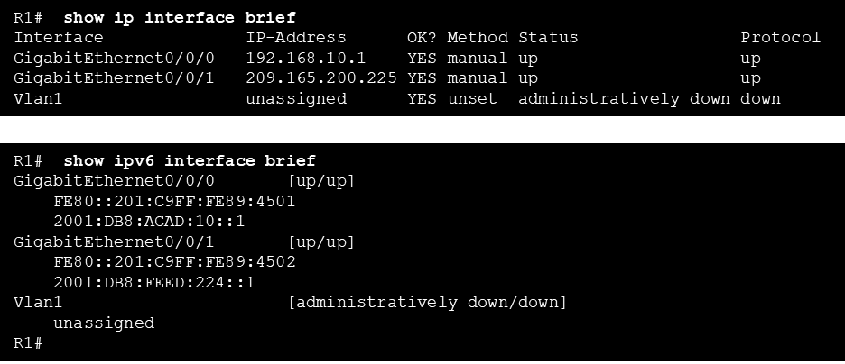

# Computer Networks - Hoofdstuk 10 - Basis Router Configuration

## Configure Initial Router Settings

### Basis Router Configuration Steps

<table>
<tr>
<td>Configure the device name</td>
<td>

```console
Router(config)# hostname <hostname>
```

</td>
</tr>
<tr>
<td>Secure priviledged EXEC mode</td>
<td>

```console
Router(config)# enable secret <password>
```

</td>
</tr>
<tr>
<td>Secure user EXEC mode</td>
<td>

```console
Router(config)# line console 0
Router(config-line)# password <password>
Router(config-line)# login
```

</td>
</tr>
<tr>
<td>Secure remote SSH access</td>
<td>

```console
Router(config)# line vty 0 4
Router(config-line)# password <password>
Router(config-line)# login
Router(config-line)# transport input {ssh | telnet}
```

</td>
</tr>
<tr>
<td>Encrypt all plaintext password</td>
<td>

```console
Router(config)# service password encryption
```

</td>
</tr>
<tr>
<td>Provide legal notification and save the configuration</td>
<td>

```console
Router(config)# banner motd # <message>  #
Router(config)# end
Router# copy running-config startup-config
```

</td>
</tr>
</table>

## Configure Interfaces

### Configure Router Interfaces

Een router interface configureren doen met behulp van volgende commando's:

```console
Router(config)# interface <type-and-number>
Router(config-if)# description <description>
Router(config-if)# ip address <ipv4-address> <subnet-mask>
Router(config-if)# ipv6 address <ipv6-address/prefix-length>
Router(config-if)# no shutdown
```

>**Best practise**: Maak gebruik van de `description` tag om een informatie over het netwerk dat verbonden is met de interface toe te voegen.

Het `no shutdown` commando activeert de interface

Voorbeeld: (interface G0/0/0 op R1)

<p align='center'></p>

### Verify Interface Configuration

Om een interface configuratie na te gaan gebruiken we de commando's `show ip interface brief` en `show ipv6 interface brief`

<p align='center'></p>

### Configure Verification Commands

<table>
<thead>
<th>Commands</th>
<th>Description</th>
</thead>
<tbody>
<tr>
<td>

```console
show ip interface brief
show ipv6 interface brief
```

</td>
<td>

Display all interfaces, their IP addresses, and their current status
```console
R1# show ip interface brief
Interface              IP-Address      OK? Method Status                Protocol 
GigabitEthernet0/0/0   192.168.10.1    YES manual up                    up 
GigabitEthernet0/0/1   209.165.200.225 YES manual up                    up 
Vlan1                  unassigned      YES unset  administratively down down 
R1#

R1# show ipv6 interface brief
GigabitEthernet0/0/0       [up/up]
    FE80::201:C9FF:FE89:4501
    2001:DB8:ACAD:10::1
GigabitEthernet0/0/1       [up/up]
    FE80::201:C9FF:FE89:4502
    2001:DB8:FEED:224::1
Vlan1                      [administratively down/down]
    unassigned 
R1#


```

</td>
</tr>
<tr>
<td>

```console
show ip route
show ipv6 route
```

</td>
<td>

Displays the contents of IP routing tables stored in RAM
```console
R1# show ip route
< output omitted>
Gateway of last resort is not set
      192.168.10.0/24 is variably subnetted, 2 subnets, 2 masks
C        192.168.10.0/24 is directly connected, GigabitEthernet0/0/0
L        192.168.10.1/32 is directly connected, GigabitEthernet0/0/0
      209.165.200.0/24 is variably subnetted, 2 subnets, 2 masks
C        209.165.200.224/30 is directly connected, GigabitEthernet0/0/1
L        209.165.200.225/32 is directly connected, GigabitEthernet0/0/1
R1#

R1# show ipv6 route
<output omitted>
C   2001:DB8:ACAD:10::/64 [0/0]
     via GigabitEthernet0/0/0, directly connected
L   2001:DB8:ACAD:10::1/128 [0/0]
     via GigabitEthernet0/0/0, receive
C   2001:DB8:FEED:224::/64 [0/0]
     via GigabitEthernet0/0/1, directly connected
L   2001:DB8:FEED:224::1/128 [0/0]
     via GigabitEthernet0/0/1, receive
L   FF00::/8 [0/0]
     via Null0, receive
R1#

```

</td>
</tr>
<tr>
<td>

```console
show interfaces
```

</td>
<td>

Display statistics for all interfaces on the device. Only displays the IPv4 addressing information
```console
R1# show interfaces gig0/0/0
GigabitEthernet0/0/0 is up, line protocol is up 
  Hardware is ISR4321-2x1GE, address is a0e0.af0d.e140 (bia  a0e0.af0d.e140)
  Description: Link to LAN
  Internet address is 192.168.10.1/24
  MTU 1500 bytes, BW 100000 Kbit/sec, DLY 100 usec, 
     reliability 255/255, txload 1/255, rxload 1/255
  Encapsulation ARPA, loopback not set
  Keepalive not supported 
  Full Duplex, 100Mbps, link type is auto, media type is RJ45
  output flow-control is off, input flow-control is off
  ARP type: ARPA, ARP Timeout 04:00:00
  Last input 00:00:01, output 00:00:35, output hang never
  Last clearing of "show interface" counters never
  Input queue: 0/375/0/0 (size/max/drops/flushes); Total output     drops: 0
  Queueing strategy: fifo
  Output queue: 0/40 (size/max)
  5 minute input rate 0 bits/sec, 0 packets/sec
  5 minute output rate 0 bits/sec, 0 packets/sec
     1180 packets input, 109486 bytes, 0 no buffer
     Received 84 broadcasts (0 IP multicasts)
     0 runts, 0 giants, 0 throttles 

<output omitted>

R1#

```

</td>
</tr>
<tr>
<td>

```console
show ip interfaces
```

</td>
<td>

Displays the IPv4 statistics for all interfaces on a router
```console
R1# show ip interface g0/0/0
GigabitEthernet0/0/0 is up, line protocol is up
  Internet address is 192.168.10.1/24
  Broadcast address is 255.255.255.255
  Address determined by setup command
  MTU is 1500 bytes
  Helper address is not set
  Directed broadcast forwarding is disabled
  Outgoing Common access list is not set 
  Outgoing access list is not set
  Inbound Common access list is not set 
  Inbound  access list is not set
  Proxy ARP is enabled
  Local Proxy ARP is disabled
  Security level is default
  Split horizon is enabled
  ICMP redirects are always sent
  ICMP unreachables are always sent
  ICMP mask replies are never sent
  IP fast switching is enabled
  IP Flow switching is disabled

<output omitted>

R1#

```

</td>
</tr>
<tr>
<td>

```console
show ipv6 interfaces
```

</td>
<td>

Displays the IPv6 statistics for all interfaces on a router
```console
R1# show ipv6 interface g0/0/0
GigabitEthernet0/0/0 is up, line protocol is up
  IPv6 is enabled, link-local address is FE80::868A:8DFF:FE44:49B0
  No Virtual link-local address(es):
  Description: Link to LAN
  Global unicast address(es):
    2001:DB8:ACAD:10::1, subnet is 2001:DB8:ACAD:10::/64
  Joined group address(es):
    FF02::1
    FF02::1:FF00:1
    FF02::1:FF44:49B0
  MTU is 1500 bytes
  ICMP error messages limited to one every 100 milliseconds
  ICMP redirects are enabled
  ICMP unreachables are sent
  ND DAD is enabled, number of DAD attempts: 1
  ND reachable time is 30000 milliseconds (using 30000)
  ND NS retransmit interval is 1000 milliseconds

R1#

```

</td>
</tr>
</tbody>
</table>

## Configure the Default Gateway

### Default Gateway on a Host

- De Default Gateway wordt gebruikt wanneer een host een pakket stuurt naar een toestel op een ander netwerk.
- De Default Gateway is meestal het router interface adres op het lokale netwerk van de host

### Default Gateway on a Switch

- Een switch moet een standaard gateway-adres geconfigureerd hebben om de switch op afstand te beheren vanaf een ander netwerk.
- Op een IPv4 default gateway te configureren op een switch gebruikt we het volgende global configuration commando;
```console
ip default-gateway <ip-address>
```