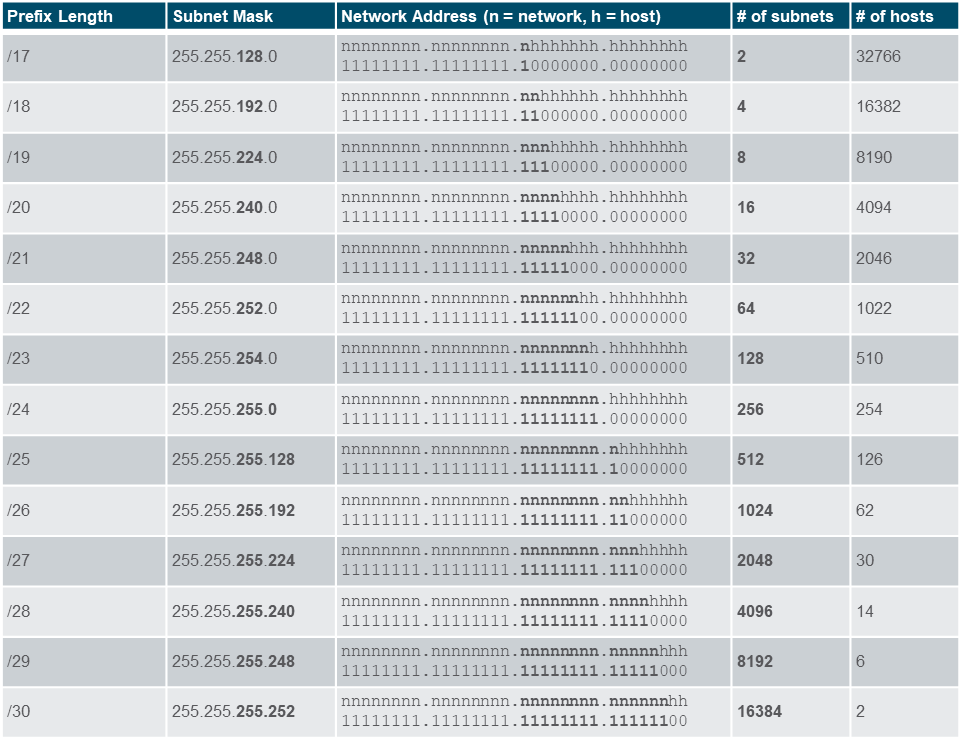

# Computer Networks - Hoofdstuk 11 - IPv4 Addressing

## IPv4 Address Structure

- Een IPv4 adres is een 32-bit hiërarchisch adres dat bestaat uit een *netwerkgedeelte* en een *hostgedeelte*
- We gebruiken een *subnet mask* om het netwerkgedeelte en het hostgedeelte te bepalen van het adres.

### The Subnet Mask

- Om de netwerk- en hostgedeelten van een IPv4 adres te bepalen vergelijken we de binaire waarde van het IPv4 adres en die van het subnet mask.
- We voeren hierop een **bitwis AND** op uit.

### The Prefix Length

- Een prefix-lengte is een eenvoudigere manier om een subnet mask te identificeren.
- Deze prefix-lengte komt overeen met het aantal bits men op 1 een plaats voor het subnet mask.
- Meestal schrijven we deze in een "/"-notatie

<table>
<thead>
<th>Subnet Mask</th>
<th>32-bit Address</th>
<th>Prefix Length</th>
</thead>
<tbody>
<tr>
<td>

`255.0.0.0`

</td>
<td>

`11111111.00000000.00000000.00000000`

</td>
<td>/8</td>
</tr>
<tr>
<td>

`255.255.0.0`

</td>
<td>

`11111111.11111111.00000000.00000000`

</td>
<td>/16</td>
</tr>
<tr>
<td>

`255.255.255.0`

</td>
<td>

`11111111.11111111.11111111.00000000`

</td>
<td>/24</td>
</tr>
<tr>
<td>

`255.255.255.128`

</td>
<td>

`11111111.11111111.11111111.10000000`

</td>
<td>/25</td>
</tr>
<tr>
<td>

`255.255.255.192`

</td>
<td>

`11111111.11111111.11111111.11000000`

</td>
<td>/26</td>
</tr>
<tr>
<td>

`255.255.255.224`

</td>
<td>

`11111111.11111111.11111111.11100000`

</td>
<td>/27</td>
</tr>
<tr>
<td>

`255.255.255.240`

</td>
<td>

`11111111.11111111.11111111.11110000`

</td>
<td>/28</td>
</tr>
<tr>
<td>

`255.255.255.248`

</td>
<td>

`11111111.11111111.11111111.11111000`

</td>
<td>/29</td>
</tr>
<tr>
<td>

`255.255.255.252`

</td>
<td>

`11111111.11111111.11111111.11111100`

</td>
<td>/30</td>
</tr>
</tbody>
</table>

### Determining the Network: Logical AND

We gebruiken een logische EN operator om het netwerk-adres te bepalen.

We voeren deze operatie uit tussen het host IPv4 adres en het subnet mask.

### Network, Host, and Broadcast Addresses

Binnen elk netwerk zijn er drie type IP adressen:
- het netwerk adres
- het host adres
- het broadcast adres

## IPv4 Unicast, Broadcast and Multicast

> Bij **unicast** wordt er een pakket verstuurd naar één IP adres.

> Bij **broadcast** wordt een pakket  naar alle IP adressen verstuurd

> Bij **multicast** wordt een pakker naar een multicast groep verstuurd.

## Types of IPv4 Address

Zoals beschreven in RFC 1918, zijn publieke IPv4 adressen globaal geroute tussen de verschillende ISP (Internet Service Providers)

- Private IP adressen zijn veel voorkomende blokken IP adressen die vaak door organisaties gebruikt worden om IPv4 adressen te assigneren aan interne hosts.

- Private IPv4 adressen zijn niet uniek en kunnen intern binnen elk netwerk gebruikt worden.

- Private IPv4 adressen kunnen niet publiek geroute worden.

<table>
    <thead>
        <th>Network Address and Prefix</th>
        <th>RFC 1918 Private Address Range</th>
    </thead>
    <tbody>
        <tr>
            <td>10.0.0.0/8</td>
            <td>10.0.0.0 - 10.255.255.255</td>
        </tr>
        <tr>
            <td>172.16.0.0/12</td>
            <td>172.16.0.0 - 172.32.255.255</td>
        </tr>
        <tr>
            <td>192.168.0.0/16</td>
            <td>192.168.255.255</td>
        </tr>
    </tbody>
</table>

### Routing to the Internet

- **Network Address Translation (NAT)** vertaald private IPv4 addressen naar Public IPv4 addressen

- NAT is typische ingeschakeld op de randrouter die de verbinding met het internet maakt.

### Special Use IPv4 Addresses

#### Loopback addresses

`127.0.0.0/8` (`127.0.0.1` tot `127.255.255.254`)

- Vaak wordt er verwezen naar een loopback adres door `127.0.0.1` (localhost)
- Wordt gebruikt op een host om te testen of TCP/IP operationeel is

#### Link-Local addresses

`169.254.0.0/16` (`169.254.0.1` tot `169.254.255.254`)

- Beter bekend als **Automatic Private IP Addressing (APIPA)** adressen of **self-assigned** adressen
- Gebruikt door Windows DHCP clients om zelf IP adressen in te stellen wanneer er geen DHCP servers beschikbaar zijn.

### Legacy Classful Addressing

RFC 790 (1981) heeft de IPv4 addressen toegewezen in volgende klassen:

- Class A: `0.0.0.0/8` tot `127.0.0.0/8`
- Class B: `128.0.0.0/8` tot `191.255.0.0./16`
- Class C: `192.0.0.0/24` tot `223.255.255.0/24`
- Class D: `224.0.0.0` tot `239.0.0.0`
- Class E: `240.0.0.0` tot `255.0.0.0`

Het grote nadeel van klassevol te adresseren is dat verschillende IPv4 adressen verloren gaan.

>[!important]
>Als antwoord op de nadelen van klassevol addresssen werd deze vervangen met klasseloos addresseren, waarbij men geen rekening meer hield met de regels van de klasse A, B en C.

### Assignment of IP Addresses

- Het **Internet Assigned Numbers Authority (IANA)** beheerd en wijst de blokken IPv4 en IPv6 adressen toe aan vijf **Regional Internet Registries (RIR's)**

- RIR's zijn verantwoordelijk voor het toewijzen van IP adressen aan ISP's, die op hun beurt verantwoordelijk zijn voor het doorgeven van kleinere blokken IP adressen aan organisaties of kleinere ISP's.

## Network Segmentation

### Broadcast Domains and Segmentation

- Verschillende protocollen gebruiken broadcast of multicast (bv. ARP gebruikt boradcast om andere toestellen te localiseren, hosts versturen DHCP discover broadcast om een DHCP server terug te vinden.)
- Switches propageren uitzendingen naar alle interfaces behalve de interface waarop ze ontvangen werden

- >[!important]
    >Het enige toestel dat een broadcast kan stopzetten is een router

- Routers verspreiden geen broadcasts
- Elke router interface verbind met een broadcast domein. (broadcasts worden enkel verspreid binnen dat domein)

### Problems with Large Broadcast Domains

- Hosts kunnen binnen een groot broadcast domein onnodige broadcasts genereren en zo een negatieve impact hebben op het netwerk.
- De oplossing om de grootte van het netwerk in te perken en zo kleiner broadcast domeinen aan te maken noemen we **subnetting**.

### Reasons for Segmenting Networks

- Subnetten kan het totale netwerkverkeer verminderen en verbeterd de performantie van het netwerk.
- Het kan gebruikt worden om security policies te implementeren tussen de verschillende subnetten
- Subnetten verminderd het aantal toestellen die geïmpacteerd zijn door onnodig broadcast verkeer
- Subnetten worden ondere andere gebruikt voor:

<table>
<tr>
<td>Location</td>
<td>Group of Function</td>
<td>Device Type</td>
</tr>
<tr>
<td>

 

</td>
<td

 

></td>
<td>

 

</td>
</tr>
</table>

## Subnet an IPv4 Network

### Subnet on an Octet Boundary

- Netwerken worden meestal gesubnet op de octetgrens van /8, /16 en /24
- Merk op: het gebruik van langere prefix lengten betekend minder aantal hosts per subnet.

<table>
<thead>
<th>Prefix Length</th>
<th>Subnet Mask</th>
<th>Subnet Mask in Binary (n = network, h = host)</th>
<th># of hosts</th>
</thead>
<tbody>
<tr>
<td>/8</td>
<td>

`255.0.0.0`

</td>
<td>

`nnnnnnnn.hhhhhhhh.hhhhhhhh.hhhhhhhh`
`11111111.00000000.00000000.00000000`

</td>
<td>16 777 214</td>
</tr>
<tr>
<td>/16</td>
<td>

`255.255.0.0`

</td>
<td>

`nnnnnnnn.nnnnnnnn.hhhhhhhh.hhhhhhhh`
`11111111.11111111.00000000.00000000`

</td>
<td>65 534</td>
</tr>
<tr>
<td>/24</td>
<td>

`255.255.255.0`

</td>
<td>

`nnnnnnnn.nnnnnnnn.nnnnnnnn.hhhhhhhh`
`11111111.11111111.11111111.00000000`

</td>
<td>254</td>
</tr>
</tbody>
</table>

#### Subnetting voorbeelden

We kunnen duidelijk zien dat in het tweeded voorbeeld er meer subnetten aanwezig zijn elk met een minder aantal hosts in het netwerk.

### Subnet within an Octet Boundary

## Subnet a Slash 16 and a Slash 8 Prefix

Onderstaande tabel toont alle mogelijkheden bij het subnetten van een /16 Prefix

### Create 100 Subnets with a Slash 16 prefix

Een subnet kunnen we maken door bits te lenen uit het IP adres.

In onderstaand voorbeeld tonen we hoe we een netwerk met /16 kunnen verdelen in verschillende subnets. We kunnen tot 14 bits lenen. 

Om te voldoen aan de vereisten (100 subnets) doen we de volgende berekening:

$$ \text{Nodig aantal bits } = {2^x} \text { waar het resultaat > of = nodig aantal bits} $$

## Subnet to Meet Requirements

### Subnet Private versus Public IPv4 Address Space

Bedrijven zullen meestal het volgende hebben:
- **Intranet**: een bedrijfs intern netwerk, meestaal door gebruik te maken van private IPv4 adressen
- **DMZ (Demilitarized Zone)**: De servers van een bedrijf die op het internet gericht zijn. Toestellen in de DMZ gebruiken publieke IPv4 adressen.
- Een bedrijf kan 10.0.0.0/8 gebruiken en subnetten naar /16 of /24

### Minimize Unused Host IPv4 Addresses and Maximise Subnets

Er zijn twee zaken waarmee we moeten rekening houden wanneer we subnetten:
- Het **aantal host adressen** die nodig zijn voor het netwerk
- Het **aantal individuele subnets** die nodig zijn

## VLSM

### IPv4 Address Conservation

Stel de volgende infrastructuur voor: 7 subnets zijn nodig (4 LAN's en 3 WAN's) en het grootst aantal host is in gebouw D met 28 hosts.

Hier zo een /27 mask 8 subnetten voorzien van 30 hosts en dus de infrastructuur ondersteunen. Echter hebben de point-to-point WAN links maar 2 adressen nodig en verliezen we daarom 28 adressen, voor een totaal van 84 ongebruikte adressen.

> Een traditioneel subnetting schema toepassen op deze infrastructuur is niet efficiënt

**VLSM** werd ontwikkeld om het verliezen van IP adressen tegen te gaan door het subnetten van een subnet mogelijk te maken.

Wanner we gebruik maken van VLSM, beginnen we best steeds met het voldoen aan de hostvereisten van het grootste subnet. Hierna subnetten we verder tot we voldoen aan de vereisten van het kleinste subnet.

## Structured Design

### IPv4 Network Address Planning

IP netwerkplanning is nodig om een schaalbaar oplossing te voorzien voor een bedrijfsnetwerk.

- Om een IPv4 netwerk adresserings-schema te ontwikkelen moeten we volgende zaken weten:
    - hoeveel subnets zijn nodig
    - hoeveel hosts heeft een specifiek subnet nodig
    - welke tostellen maken onderdeel van een subnet
    - welke delen van het netwerk maken gebruik van private IP-adressen
    - welke delen van het netwerk maken gebruik van public IP-adressen

Onderzoek de netwerkbehoeften van een organisatie en hoe de subnetten gestructureerd moeten zijn.
- Voer een netwerkvereisten studie uit door te kijken naar het volledige netwerk en te bepalen hoe elk deel opgesplits wordt.
- Bepaal hoeveel subnetten nodig zijn en hoeveel hosts elk van deze subnetten zal hebben
- Bepaal de DHCP adress pools en de Laag 2 VLAN pools

### Device Address Assignement

Binnen een netwerk zijn er verschillende type toestellen die adressen nodig hebben:
- **End user clients**: De meeste maken gebruik van DHCP om fouten te beperken en de netwerkteams te ontlasten. IPv6 clients kunnen hun adres krijgen door gebruik te maken van DHCPv6 of SLAAC
- **Servers and peripherals**: Deze zouden best een voorspelbaar statisch IP adres hebben
- **Servers that are accessible from the internet**: Servers moeten een public IPv4 adres hebben, meestal toegankelijk door NAT.
- **Intermediary devices**: Toestellen worden adressen toegewezen voor netwerkbeheer, monitoring en beveiliging.
- **Gateway**: Routers en firewall toestellen zijn gateways voor de hosts in dat netwerk.

> Wanneer je een IP adresserings schema ontwikkeld is het best practise om een verschillende patronen te hebben voor hoe je verschillende toestellen een adres geeft.

