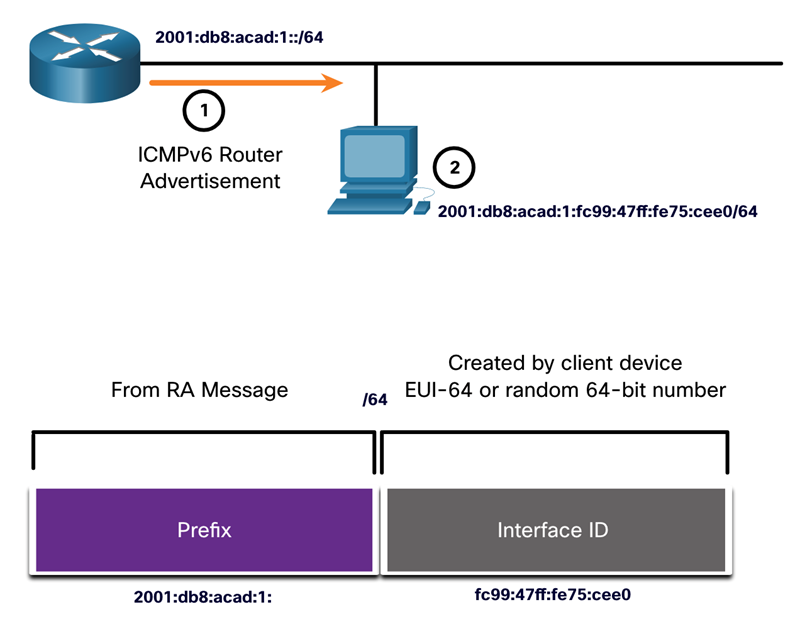
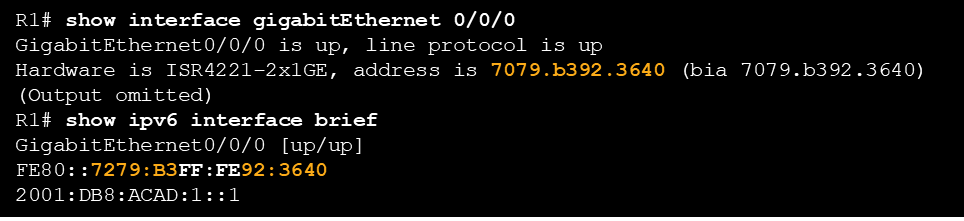

# Computer Networks : Hoofdstuk 12 - IPv6 Addressing

## IPv4 Issues

### Need for IPv6

- Het aantal IP adressen binnen IPv4 is beperkt. IPv6 is de opvolger voor IPv4 en heeft een veel grotere addresserings ruimte (128 bit adressen)

- Bij de ontwikkeling van IPv6 dacht men ook aan de beperkingen van IPv4 samen met enkele verbeteringen.

- Door het toenemend gebruik van het internet, het beperkt aantal vrije IPv4 adressen, de problemen met NAT en IoT werd het tijd om over te schakelen naar IPv6.

### IPv4 en IPv6 Coexistence

Momenteel gebruiken we nog beide IPv4 en IPv6 tezamen, de transitie naar IPv6 zal nog verschillende jaren duren.

Het IETF heeft verschillend protocollen en tools beschikbaar gesteld voor netwerkbeheerders om hun netwerken te migreren naar IPv6. Deze technieken kunnen opgesplits worden in drie groepen:

- **Dual Stack**: De toestellen gebruiken beide IPv4 en IPv6 protocollen op hetzelfde moment.
- **Tunneling**: Een transportmethode van een IPv6 pakket over een IPv4 netwerk. Het IPv6 pakket is geïnkapseld in het IPv4 pakket.
- **Translation**: *Network Address Translation (NAT64)* staat IPv6 toestellen toe om te communiceren met IPv4-enabled toestellen door gebruik te maken van een techniek die lijkt op NAT bij IPv4.

>[!note]
>Tunneling en translation zijn bedoeld voor een migratie naar native IPv6 en zouden enkel gebruikt mogen worden wanneer noodzakelijk. 

>Het 🎯 zou moeten zijn om steeds te communiceren via native IPv6 van bron naar bestemming

<p align='center'></p>

## IPv6 Address Representation

### IPv6 Addressing Formats

- IPv6 adressen zijn 128 bit en worden Hexadecimaal geschreven
- Ze zijn niet hoofdlettergevoelig
- Voorkeursformaal: `x:x:x:x:x:x:x:x` waarbij elke `x` vier hexadecimale waarden voorsteld.
- > **Een hextet** verwijst naar een sectie vier decimale waarden in het ip adres

### Rules

1. **Voorloop nullen weglaten**:
    - De eerste regel is bedoel om de notatien van IPv6 addressen te verkleinen. Hierbij laten we "leading" nullen weg (enkel bij 0 vooraan):
    - Voorbeeld:
        - 01ab kunnen we schrijven als 1ab
        - 09f0 kunnen we schrijven als 9f0
        - 00a0 kunnen we schrijven als a0

2. **Dubbel dubbelpunt**:
    - We kunnen reeks van één of meerdere 16 bit groepen van nullen vervangen door een dubbel dubbelpunt.
    - Voorbeeld: `2001:db8:cafe:1:0:0:0:1` kunne we noteren als `2001:db8:cafe:1::1`

## IPv6 Address Types

Er zijn drie verschillende IPv6 adressen:
- **Unicast**: Identificeert een unieke interface op een IPv6-enabled toestel
- **Multicast**: Wordt gebruikt om één enkel pakket naar verschillende bestemming te sturen
- **Anycast**: Dit is een IPv6 unicast adres dat kan toegewezen worden aan verschillende toestellen. Een pakket verstuurd naar een anycast adres wordt geroute naar het dichtsbijzijnde toestel met dat adres.

>[!note]
>Tegenstrijdig met IPv4 heeft IPv6 geen broadcast adressen. Er is echter wel een IPv6 all-nodes multicast adres dat hetzelfde restultaat kan opbrengen.

### IPv6 Prefix Length

De **prefix lengte** wordt voorgesteld door een slash notatie en steld het netwerkgedeelte van het IPv6 adres voor.

Een IPv6 prefix lengte kan variëren van 0 tot 128 bit. De aangeraden lengte voor LAN en de meeste netwerken is de /64.

>[!note]
>Het is sterk aangeraden om `/64` te gebruiken voor de interface ID's binnen de meeste netwerken. Dit is omdat *stateless address autoconfiguration (SLAAC)* gebruik maakt van 64 bit interface ID's. Het zorgt er ook voor dat het subnetten gemakkelijker aan te maken en te beheren is.

### Types of IPv6 Unicast Addresses

In tegenstelling tot IPv4 toestellen (dat meestal 1 uniek adres hebben), hebben IPv6 enabled toestellen meestal twee unicast adressen.

- **Global Unicast Address (GUA)**: Het adres dat het meeste vergeleken kan worden met het IPv4 adres. Dit zijn globaal unieke, internet-routable adressen.
- **Link-Local Address (LLA)**: Een vereist adres voor elke IPv6-enabled toestel, dat gebruikt wordt om te communiceren met andere toestellen op hetzelfde "local link" (binnen een LAN). LLA zijn niet "routable" en zijn beperkt tot een single link.

<p align='center'></p>

### Unique Local Addresses (ULA)

De IPv6 unieke locale adressen (range `fc00::/7 tot fdff::/7`) hebben enkele gelijkaardigeheden met RFC 1918 private IPv4 adressen, maar verschillen op volgende vlakken:
- Worden gebruik voor local addressing tussen een site of een gelimiteerd aantal sites
- Kunnen gebruikt worden voor toestellen die nooit toegang tot een ander netwerk moeten hebben.
- Worden niet globaal gerouteerd of translate naar IPv6 adressen

>[!note]
>Verschillende site make gebruik van 1918 adressen om hun netwerk te verbergen en te beveiligen. Dit was nooit de bedoeling voor ULA's

### IPv6 GUA

IPv6 global unicast addresses (GUA's) zijn globaal uniek en worden gerouteerd op het IPv6 internet.
- Momenteel worden enkel GUA's met de eerste drie bits van `001` of `2000::/3` uitgedeeld
- De huidig beschikbare GUA's beginnen met de cijfers 2 of 3 

<p align='center'></p>

### IPv6 GUA Structure

#### Global Routing Prefix

De global routing prefix is de prefix, of het netwerkgedeelte, of het adres dat wordt toegewezen door een ISP aan een klant of site. De global routing prefix kan variëren van ISP tot ISP.

#### Subnet ID

Het Subnet ID veld is het deel tussen de global routing prefix en de interface ID. Het subnet ID wordt gebruikt door een organisatie om de verschillende subnets te identificeren binnen hun site.

#### Interface ID

De IPv6 interface ID komt overeen met het hostgedeelte van een IPv4 adres. 

>**Best practise**: Het is aangeraden om /64 subnets te gebruiken, zodat er ook 64-bit interface ID's aangemaakt worden.

>[!note]
>IPV6 staat toe om de all-0's en all-1's host adressen toe te wijzen aan een toestel. De all-0's wordt gereserveerd voor een Subnet-Router anycast adres, en zou enkel aan een router mogen gegeven worden.

### IPv6 LLA

Een IPv6 link-local addres (LLA) staat een toestel instaat om te communiceren met andere IPv6-enabled toestellen op dezelfde link en enkel op dien link (subnet)

- Pakketten let een bron of een bestemming LLA kunnen niet gerouteerd worden- Elk IPv6-enabled netwerk interface moet een LLA adres hebben.
- Indien een LLA niet manueel geconfigureerd is op een interface, dan zal het toestel er automatisch een aanmaken.
- IPv6 LLA's liggen in de range `fe80::/10`

<p align='center'></p>

## GUA en LLA Static Configuration

### Static GUA Configuration on a Router

De meeste IPv6 configuratie en verificatie commando's in de Cisco routers zijn gelijkaardig aan hun IPv4 tegengangers. **In vele gevallen is het enigste verschil `ipv6` in plaats van `ip`**

- Het commando om een IPv6 GUA te configureren op een interface is

```console
R1(config)# interface gigabitethernet 0/0/0
R1(config-if)# ipv6 address 2001:db8:acad:1::1/64
R1(config-if)# no shutdown
R1(config-if)# exit
```

### Static GUA Configuration on a Windows Host

- Het manueel instellen van een IPv6 adres op een host is gelijkaardig aan het instellen van een IPv4 adres.
- De GUA en LLA van de router interface kunnen gebruikt worden als *default gateway*. 
    >**best practise** is om de LLA te gebruiken.

>[!note]
>Wanneer DHCPv6 en SLAAC gebruikt zijn, dan zal de LLA van de router automatisch gespecifieerd zijn als het default gateway adres.

### Status GUA Configuration of a Link-Local Unicast Address

Het manueel instellen van een LLA staat ons toe een gemakkelijk te herkennen en eenvoudig te onthouden adres in te stellen.

- LLA worden als volgt ingesteld:

```console
R1(config)# interface gigabitethernet 0/0/0
R1(config-if)# ipv6 address fe80::1:1 link-local
R1(config-if)# no shutdown
R1(config-if)# exit
```

>[!note]
>Hetzelfde LLA kan ingesteld worden op elke link, zolang het maar uniek is op die link. 
>
> Het is **best practise** om verschillende LLA in te stellen op elke interface van de router, om het gemakkelijk te maken de router en de specifieke interface te herkennen.

## Dynamic Addressing for IPv6 GUA's

### RS and RA Messages

Toestellen krijgen automatisch een GUA door het Internet Control Message Protocol version 6 (ICMPv6)

- **Router Solicitation (RS)** berichten worden verstuurd door host-toestellen om IPv6 routers te achterhalen
- **Router Advertisement (RA)** berichten worden door routers verstuurd naar hosts om hun te informeren hoe een IPv6 GUA te verkrijgen en om hun te berichten over interessante netwerkinformatie, zoals:
    - netwerk prefix en prefix lengte
    - default gateway adres
    - DNS adressen en domain namen

- De RA kan drie methodes voorzien om IPv6 te configureren:
    - **SLAAC** (Stateless Address Auto-configuration): *Geeft alles wat nodig is, inclusief prefix, prefix lengte en default gateway adres*
    - **SLAAC with stateless DHCPv6 Server**: *geeft zijn eigen informatie, maar de dns adressen moeten gehaald worden bij een stateless DHCPv6 server*
    - **Stateful DHCPv6 (no SLAAC)**: *geeft het default gateway adres, de andere informatie moet gehaald worden bij de stateful DHCPv6 server*

- De router moet ge-enabled zijn voor IPv6-routing (niet standaard het geval). Dit kan via het commando (in global configuration mode)

    ```console
    ipv6 unicast-routing
    ```
### Method 1: SLAAC

- SLAAC staat een toestel instaat een GUA te configureren zonder DHCPv6
- Toestellen kunne de nodige informatie verkrijgen om een GUA te configureren bij de ICMPv6 RA berichten van de local router.
- De prefix wordt gegeven door de RA en de toestellen gebruiken of het EUI-64 of een random gegenereerde methode om een interface ID aan te maken.

<p align='center'></p>

### Method 2: SLAAC and Stateless DHCP

Een RA kan een toestel de instructie geven om zowel SLAAC als stateless DHCPv6 te gebruiken.

Het RA bericht stelt dan het volgende voor:
- Dat SLAAC zijn eigen IPv6 GUA aanmaakt.
- De router LLA, welke het RA IPv6 bron adres is, als default gateway in te stellen
- Een stateless DHCPv6 server om andere informatie op te halen, zoals de DNS server en een domein naam.

<p align='center'></p>

### Method 3: Stateful DHCPv6

Een RA kan een toestel de instructie geven om een enkel een stateful DHCPv6 te gebruiken.

Stateful DHCPv6 is gelijkaardig aan de DHCP bij IPv4. Een toestel kan automatisch een GUA, een prefix lengte, en een adressen van DNS servers via een stateful DHCPv6 server verkrijgen

Het RA bericht stelt dan het volgende voor:
- De router LLA, welke het RA IPv6 bron adres is, als default gateway in te stellen
- Een stateless DHCPv6 server om het GUA, DNS server adressen, domein namen en andere informatie op te halen.

<p align='center'></p>

### EUI-64 Process vs. Randomly Generated

- Wanneer een RA bericht SLAAC of SLAAC met stateless DHCPv6 is, moet de client een eigen interface ID genereren
- De interface ID kan aangemaakt worden via een EUI-64 proces of een random gegenereerd 64-bit nummer.

<p align='center'></p>

### EUI-64 Process

De IEEE heeft het Extended Unique Identifier (EUI) of het modified EUI-64 process gedefinieerd date het volgende uitvoert:

<p align='center'></p>

### Randomly Generate Interface ID's

Afhankelijk van het operating system, kan een toestel een random gegenereerd interface ID gebruiken in plaats van een MAC adres en het EUI-64 proces.

Sinds Windows Vista gebruikt Windows een random gegenereerd interface ID in plaats van een interface ID aangemaakt via EUI-64.

>[!note]
>Om te garanderen dat een IPv6 unicast adres uniek is, gebruikt de client een proces gekend als Duplicate Address Detection (DAD). Dit is gelijkaardig aan een ARP request voor zijn eigen adressen. Is er geen antwoord, dan is het adres uniek.

## Dynamic Addressing for IPv6 LLA's

### Dynamic LLA's

- Alle IPv6 interfaces moeten een IPv6 LLA hebben
- Net zoals IPv6 GUA's kunnen ook LLA's manueel geconfigureerd worden
- De afbeelding hieronder geeft weer dat de LLA dynamisch aangemaakt is met een `fe80::/10` prefix en een interface ID gebruikmakend van het EUI-64 proces of een random gegenereerd 64-bit nummer.

<p align='center'></p>

### Dynamic LLA's on Windows

Operating Systems zoals Windows gebruiken meestal dezelfde methode voor een SLAAC-aangemaakte GUA en een dynamisch geassigneerde LLA

**EUI-64 genegereerde Interface ID**

<p align='center'></p>

**Random gegenereerd 64 bit interface id**

<p align='center'></p>

### Dynamic LLAs on Cisco Routers

Cisco routers maken automatisch een IPv6 LLA wanneer een GUA geassigneerd is aan de interface. Standaard gebruiken de Cisco Routers EUI-64 om een interface ID aan te maken voor alle LLA's op de IPv6 interfaces.

Voorbeeld van een dynamisch geconfigureerde LLA op de G/0/0/0 interface van R1:

<p align='center'></p>

## IPv6 Muticast Addresses

### Assigned IPv6 Multicast Addresses

IPv6  multicast adressen hebben de prefix ff00::/8. Er zijn twee soorten IPv6 multicast adressen:
- **Well-known** multicast adressen
- **Solicited node** multicast adressen

>[!note]
>Multicast adressen kunnen enkel bestemmingsadressen zijn en geen bronadressen.

### Well-known multicast adressen

Well-known multicast adressen worden geassigneerd en gereserveerd voor vooropgestelde groepen toestellen.

Er zijn twee veel voorkomende IPv6 multicast groepen:
- **`ff02::1` All-nodes multicast group**: Dit is een multicast groep waarin alle IPv6-enabled toestellen zitten. Een pakket verstuurd naar dit multicast adres wordt ontvangen en geprocessed door elke IPv6 interface op de link of het netwerk.
- **`ff02::2 All-routers multicast group`**: Dit is een multicast groep waarin alle IPv6 routers in zitten. Een router wordt als lid toegevoegd tot deze groep wanneer IPv6 ingeschakeld is. (door het gebruik te maken van het commando: `ipv6 unicast- routing` in global configuration mode.)

### Solicited-Node IPv6 Multicast

- Een solicited-node multicast adres is gelijkaardig aan een all-nodes multicast adres.
- Een solicited-node multicast adres is gemapped op een speciaal Ethernet multicast adres.
- De Ethernet NIC kan het frame uit filteren door het bestemmings MAC adres the onderzoeken zonder het uit te sturen njaar het IPv6 proces om te zien of het toestel de uiteindelijke bestemming is van het pakket.

<p align='center'></p>

## Subnet an IPv6 Network

### Subnet Using the Subnet ID

IPv6 werd ontwikkeld met de gedachte bij subnetting.
- Een apart subnet ID veld word gebruikt bij IPV6 GUA om subnetten aan te maken.
- Het Subnet ID verld is het gebied tussen de Global Routing Prefix en de interface ID.

<p align='center'></p>

### IPv6 Subnet Allocation

De voorbeeld infrastructuur heeft vijf subnetten nodig, een voor elke LAN en ook voor de serial link tussen R1 en R2.

De vijf IPv6 subnetten werden toegekend met het subnet ID veld 0001 tot 0005. Elk /64 subnet zal meer adressen voorzien dan nodig.

<p align='center'></p>

### Router Configured with IPv6 Subnets

Onderstaand voorbeeld toont aan dat elke router interface geconfigureerd is op een verschillend subnet.

```console
R1(config)# interface gigabitethernet 0/0/0
R1(config-if)# ipv6 address 2001:db8:acad:1::1/64
R1(config-if)# no shutdown
R1(config-if)# exit
R1(config)# interface gigabitethernet 0/0/1
R1(config-if)# ipv6 address 2001:db8:acad:2::1/64
R1(config-if)# no shutdown
R1(config-if)# exit
R1(config)# interface serial 0/1/0
R1(config-if)# ipv6 address 2001:db8:acad:3::1/64
R1(config-if)# no shutdown
```
