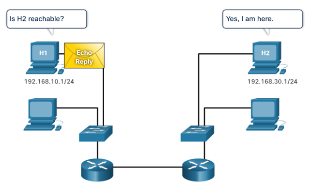
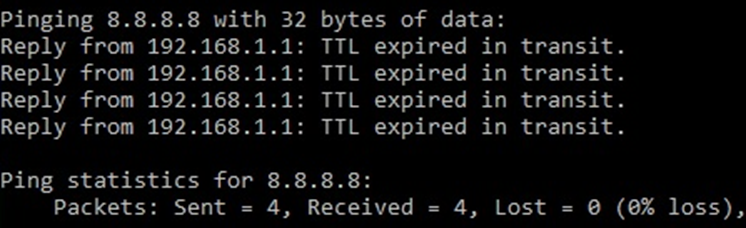

# Computer Networks : Hoofdstuk 13 - ICMP

## ICMP Messages

### ICMPv4 and ICMPv6 Messages

**Internet Control Message Protocol (ICMP)** geeft feefback over issue gerelateerd aan het processen van IP pakketten onder verschillende condities.

- ICMPv4 is het messaging protocol voor IPv4. ICMPv6 is het messaging protocol voor IPv6 en bevat meer functionaliteiten.
- De ICMP berichten bevatten zowel voor ICMPv4 als ICMPv6:
    - Host reachability
    -  Destination or Service Unreachable
    - Time Exceeded

>[!note]
>ICMP berichten zijn niet verplicht en vaak ook niet toegestaan binnen een netwerk voor veiligheids redenen.

### Host Reachability

**ICMP Echo** berichten kunnen gebruikt worden om de **bereikbaarheid** van een host in een IP netwerk te testen.

Voorbeeld:

- De local host verstuurd een ICMP Echo Request naar een host.
- Indien de host beschikbaar is, zal de bestemmingshost antwoorden met een **Echo Reply**.

### Destination or Service Unreachable

- Een ICMP Destination Unreachable bericht kan gebruikt worden om de bron te berichten dat een bestemming of een dienst niet beschikbaar is.
- Het ICMP bericht zal een code bevatten die aangeeft waarom het pakket niet gelevered kan worden.

<table>
<thead>
<th>A few Destination Unreachable codes for ICMPv4 are:</th>
<th>A few Destination Unreachable codes for ICMPv6 are:</th>
</thead>
<tbody>
<tr>
<td>

- 0 - Net Unreachable
- 1 - Host Unreachable
- 2 - Protocol Unreachable
- 3 - Port Unreachable

</td>
<td>

- 0 - No route to Destination
- 1 - Communication with the destination is administrativel prohibited (e.g., firewall)
- 2 - Beyond scope of the source address
- 3 - Address unreachable
- 4 - Port Unreachable

</td>
</tr>
</tbody>
</table>

>[!note]
>ICMPv6 heeft gelijkaardige codes met kleine verschillen voor Destination Unreachable berichten.

### Time Exceeded

-  Wanneer het "Time to Live (TLL)" veld in een pakket verminderd is naar 0, dan zal een ICMPv4 Time Exceeded bericht verstuurd worden naar de bron host.
- ICMPv6 heeft ook een Time Exceeded bericht. In plaats van het IPv4 TLL veld, zal ICMPv6 het IPv6 Hop Limit veld gebruiken om te achterhalen als een pakket al dan niet vervallen is.

