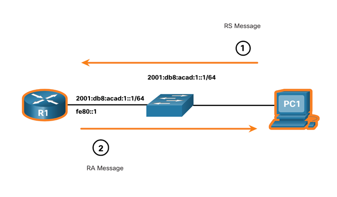
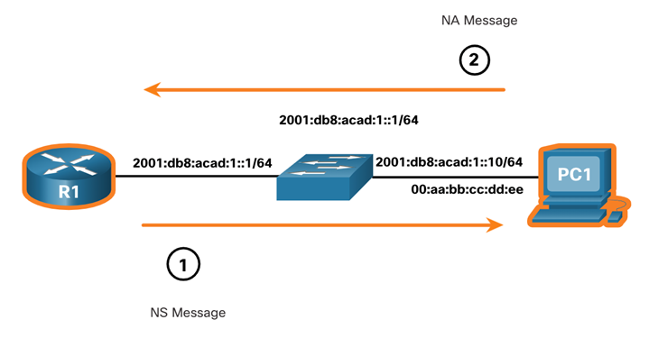
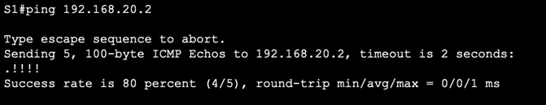
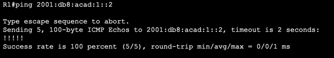

# Computer Networks : Hoofdstuk 13 - ICMP

## ICMP Messages

### ICMPv4 and ICMPv6 Messages

**Internet Control Message Protocol (ICMP)** geeft feefback over issue gerelateerd aan het processen van IP pakketten onder verschillende condities.

- ICMPv4 is het messaging protocol voor IPv4. ICMPv6 is het messaging protocol voor IPv6 en bevat meer functionaliteiten.
- De ICMP berichten bevatten zowel voor ICMPv4 als ICMPv6:
    - Host reachability
    -  Destination or Service Unreachable
    - Time Exceeded

>[!note]
>ICMP berichten zijn niet verplicht en vaak ook niet toegestaan binnen een netwerk voor veiligheids redenen.

### Host Reachability

**ICMP Echo** berichten kunnen gebruikt worden om de **bereikbaarheid** van een host in een IP netwerk te testen.

Voorbeeld:

- De local host verstuurd een ICMP Echo Request naar een host.
- Indien de host beschikbaar is, zal de bestemmingshost antwoorden met een **Echo Reply**.

<p align='center'></p>

### Destination or Service Unreachable

- Een ICMP Destination Unreachable bericht kan gebruikt worden om de bron te berichten dat een bestemming of een dienst niet beschikbaar is.
- Het ICMP bericht zal een code bevatten die aangeeft waarom het pakket niet gelevered kan worden.

<table>
<thead>
<th>A few Destination Unreachable codes for ICMPv4 are:</th>
<th>A few Destination Unreachable codes for ICMPv6 are:</th>
</thead>
<tbody>
<tr>
<td>

- 0 - Net Unreachable
- 1 - Host Unreachable
- 2 - Protocol Unreachable
- 3 - Port Unreachable

</td>
<td>

- 0 - No route to Destination
- 1 - Communication with the destination is administrativel prohibited (e.g., firewall)
- 2 - Beyond scope of the source address
- 3 - Address unreachable
- 4 - Port Unreachable

</td>
</tr>
</tbody>
</table>

>[!note]
>ICMPv6 heeft gelijkaardige codes met kleine verschillen voor Destination Unreachable berichten.

### Time Exceeded

-  Wanneer het "Time to Live (TLL)" veld in een pakket verminderd is naar 0, dan zal een ICMPv4 Time Exceeded bericht verstuurd worden naar de bron host.
- ICMPv6 heeft ook een Time Exceeded bericht. In plaats van het IPv4 TLL veld, zal ICMPv6 het IPv6 Hop Limit veld gebruiken om te achterhalen als een pakket al dan niet vervallen is.

<p align='center'></p>

### ICMPv6 Messages

ICMPv6 Messages hebben nieuwe features en een verbeterde functionaliteit die we niet hadden in ICMPv4. Zoals vier nieuwe portocollen die onderdeel zijn van de Neighbor Discovery Protocol (ND of NDP)

- Het berichtenverkeer tussen een IPv6-router en een IPv6-apparaat, met inbegrip van dynamische adrestoewijzing, ziet er als volgt uit:
    - **Router Solicitation (RS)** bericht
    - **Router Advertisment (RA)** bericht

- Het berichtenverkeer tussen IPv6 toestellen inclusief het detecteren van duplicate adressen en adres resolution, ziet er als volgt uit:
    - **Neighbor Solicitation (NS)** bericht
    - **Neighbor Advertisment (NA)** bericht

>[!note]
>ICMPv6 ND bevat ook het redirect bericht. Dit heeft een gelijkaardige functie als het redirect bericht van IPv4

- RA berichten worden door IPv6-enabled routers elke 200 seconden uitgestuurd om addresseringsinformatie te voorzien aan IPv6-enabled hosts.
- RA berichten kunnen adresseringsinformatie informatie bevatten van de host, zoals prefix lengte, DNS adres, en domeinnaam
- Een host die gebruik maakt van *Stateless Address Autoconfiguration* (SLAAC) zal zijn default gateway gelijk stellen aan het link-local adres van de router dat de RA stuurt.

- Een IPv6-enabled router zal een RA bericht uitsturen als een antwoord op een RS bericht.

<p align='center'></p>

- Een toestel dat als adres een global IPv6 unicast of link-local unicast geassigneerd heeft, mag **duplicate address detection (DAD)** uitvoeren om te achterhalen of het IPv6 adres uniek is.

- Om te bekijken of een adres al dan niet uniek is, zal het toestel een NS bericht versturen met zijn eigen IPv6 adres als het adres waar naar gezocht wordt.

- Als een ander toestel op het netwerk dit adres heeft, zal het antwoorden met een NA bericht, en zo melden aan het toestel dat het bericht uitstuurt, dat dit adres reeds in gebruik is.

>[!note]
>DAD is geen vereiste, maar RFC 4861 raad te sterkste aan dat DAD uitgevoerd wordt op unicast adressen.

- Om te achterhalen wat het bestemmings MAC adres is zal het toestel een NS bericht sturen naar het **solicited node address**
- Het bericht zal het gekende (te zoeken) IPv6 adres bevatten. Het toestel met het te zoeken IPv6 adres zal antwoorden met een NA bericht dat zijn Ethernet MAC adres bevat.

<p align='center'></p>

## Ping and Traceroute tests

### Ping - Test Connectivity

- Het `ping` commando is een IPv4 en een IPv6 testprogramma dat gebruikt maakt van ICMP echo requesten en een echo reply berichten om de verbinding te testen tussen de host. Het geeft een samenvatting dat de succesratio geeft en de gemiddelde round-trip tijd naar de bestemming
<p align='center'></p>

- Als een antwoord niet ontvangen is binnen de timeout, dan zal het `ping` commando een bericht weergaven dat meld dat er geen antwoord ontvangen is.
<p align='center'></p>

>[!important]
>Het is veelvoorkomend dat de eerste pin een timeout genereerd als address resultion (ARP of ND) uitgevoerd moet worden alvorens het ICMP Echo Request verstuurd wordt.

### Ping the Loopback

Een `ping` commando kan gebruikt worden om intern de configuratie van IPv4 of IPv6 te testen op de lokale host. 
- pingen van de het lokaal IPv4 loopback adres:

```console
ping 127.0.0.1
```

- pingen van het lokaal IPv6 loopback adres:

```console
ping ::1
```

