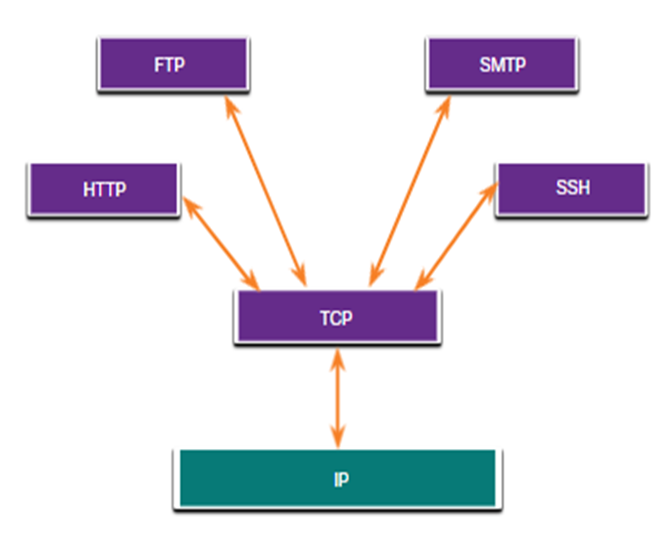
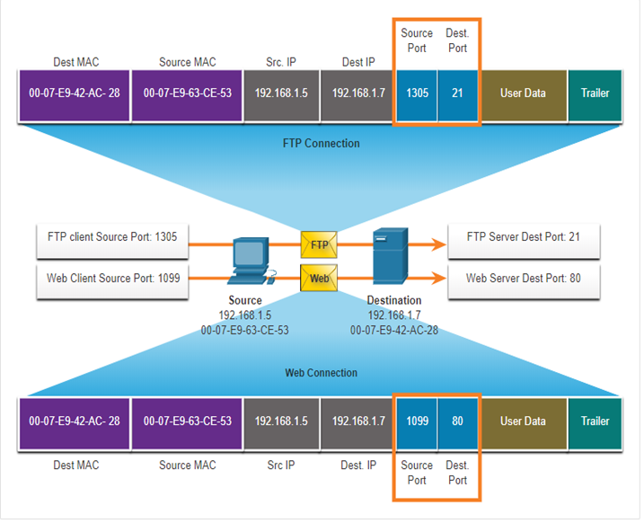

# Computer Networks : Hoofdstuk 14 - Transport Layer

## Transportation of Data

### Role of the Transport Layer

De transportlaag is:

- Verantwoordelijk voor de logische communicatie tussen applicaties die draaien op verschillende hosts.
- De link tussen de applicatielaag en de lagere lagen die Verantwoordelijk zijn voor de netwerktransmitie.

<p align='center'></p>

### Transport Layer Reponsibilities

De transportlaag heeft de volgende verantwoordelijkheden: 

- tracking of individual conversations
- Segmenting data and reassembling segments
- Header informatie toevoegen
- Identify, separate, and manage multiple conversations
- Gebruikt segmentation en multiplexing om verschillende communicatiegesprekken op hetzelfde netwerk te kunnen afwisselen.

### Transport Layer Protocols

- IP specifieert niet hoe de levering of vervoer van de pakketten plaatsvinden.
- De transportlaag protocollen specifiëren hoe we berichten overschrijven tussen hosts. Deze protocollen zijn ook verantwoordelijk voor het beheren van de betrouwbaarheidsvereisten van een gesprek.
- De transportlaag bevat het **TCP (Transmission Control Protocol)** en het **UDP (User Datagram Protocol)**

<p align='center'></p>

### Transmission Control Protocol (TCP)

**TCP** bezorgt betrouwbaarheid en flow control. Basis TCP operaties:

- Nummeren en tracken van data segmenten die uitgezonden zijn naar een specifieke host vanuit een specifieke applicatie.
- Erkennen van ontvangen data.
- Opnieuw uitsturen na een bepaalde tijd, van niet-erkende data.
- Gegevens die mogelijks in een verkeerde volgorde ontvangen zijn, ordennen.
- Data met een efficiënte ratio, aanvaard door de ontvanger, versturen.

### User Datagram Protocol (UDP)

**UDP** biedt standaard functies voor het leveren van datagrams tussen de geschikte applicaties met  weinig overhead en datacontrole.

- UDP is een verbindingsloos protocol
- UDP is gekend als een *best-effort delivery* protocol, omdat er geen erkenning als de data al dan niet ontvangen is op de bestemming.

### The Right Transport Layer Protocol for the Right Application

UDP wordt ook gebruikt door request-and-reply applicaties waar de data minimaal is en een heruitzending snel kan gebeuren.

Indien het belangrijk is dat alle data ontvangen wordn en behandeld kan worden in de juiste volgorde dan wordt TCP als het transportprotocol gebruikt.

<p align='center'></p>

## TCP Overview

### TCP Features

- **Stelt een sessie samen**: TCP is een verbindingsgericht protocol dat onderhandeld en een permanente verbinding (of sessie) opsteld tussen bron en bestemming toestellen, alvorens verkeer door te sturen.

- **Verzekerd betrouwbare levering**: Om wille van verschillende redenen kan het zijn da een segment verloren gaat wanneer het verzonden wordt over een netwerk. TCP garandeerd dat elk segment dat door de bron verstuurd wordt ook geleverd wordt op de bestemming.

- **Provides same-order delivery**: Omdat netwerken verschillende routes kunnen voorzien dat data leveren aan verschillende ratios, kan data bij een verkeerd order geleverd worden.

- **Ondersteund flow control**: Netwerk hosts hebben gelimiteerde bronnen (geheugen, process power). Indien TCP op de hoogte is dat de bronnen overbelast geraken, kan het een request uitsturen naar de applicatie om de ratio data flow te verminderen.

### TCP Header

TCP is een *stateful* protocol, dit betekend het een status bijhoudt van de communicatie sessie.

TCP houdt bij welke informatie het heeft verstuurd, en welke informatie erkend werd.

<p align='center'></p>

### TCP Header fields

<table>
    <thead>
        <th>TCP Header Field</th>
        <th>Description</th>
    </thead>
    <tbody>
        <tr>
            <td>Source Port</td>
            <td>A 16-bit field used to identify the source application by port number.</td>
        </tr>
        <tr>
            <td>Destination port</td>
            <td>A 16-bit field used to identify the destination application by port number.</td>
        </tr>
        <tr>
            <td>Sequence Number</td>
            <td>A 32-bit field used for data reassembly purposes.</td>
        </tr>
        <tr>
            <td>Acknowlegment Number</td>
            <td>A 32-bit field used to indicate that data has been received and the next byte expected from the source.</td>
        </tr>
        <tr>
            <td>Header Length</td>
            <td>1 4-bit field known as "data offset" that indicates the length of TCP segment header.</td>
        </tr>
        <tr>
            <td>Reserved</td>
            <td>A 6-bit field that is reserved for future use</td>
        </tr>
        <tr>
            <td>Control bits</td>
            <td>A 6-bit field used that includes bit codes, or flags, which indicate the purpose and function of the TCP segment</td>
        </tr>
        <tr>
            <td>Window Size</td>
            <td>A 16-bit field used to indicate the number of bytes that can be accepted at one time.</td>
        </tr>
        <tr>
            <td>Checksum</td>
            <td>A 16-bit field used for error checking of the segment header and data.</td>
        </tr>
        <tr>
            <td>Urgent</td>
            <td>A 16-bit filed used to indicate if the contained data is urgent.</td>
        </tr>
    </tbody>
</table>

### Applications that use TCP

TCP behandeld alle taken die gepaard gaan met het verdelen van de gegevensstroom in segmenten, het bieden van betrouwbaarheid, het controleren van de gegevensstroom en het herschikken van segmenten.

<p align='center'></p>

## UDP Overview

### UDP Features

- Gegevens worden hersteld in de volgorde waarop ze ontvangen zijn
- Segmenten die verloren zijn worden niet opnieuw verstuurd
- Er worden geen sessies opgezet
- De verzender is niet op de hoogte van de beschikbaarheid van bronnen

### UDP Header

De UCP header is een pak eenvoudiger dan de TCP header het heeft maar vier velden en heeft 8 bytes nodig:

<p align='center'></p>

### UDP Header Fields

<table>
    <thead>
        <th>UDP Header Field</th>
        <th>Description</th>
    </thead>
    <tbody>
        <tr>
            <td>Source Port</td>
            <td>A 16-bit field used to identify the source application by port number</td>
        </tr>
        <tr>
            <td>Destination Port</td>
            <td>A 16-bit field used to identify the destination application by port number</td>
        </tr>
        <tr>
            <td>Length</td>
            <td>A 16-bit field that indicates the length of the UDP datagram header.</td>
        </tr>
        <tr>
            <td>Checksum</td>
            <td>A 16-bit field used for error checking of the datagram header and data.</td>
        </tr>
    </tbody>
</table>

### Applications that use UDP

- **Live video and multimedia applications**: Deze applicaties kunnen een beetje data verlies verdragen maar vereisen geen of weinig vertraging.

- **Simple request and reply applications**: Applicaties met eenvoudige transacties waar een host een request stuurt die een antwoord kan (maar hoeft niet) verwachten. (bv. DNS en DHCP)

- **Applicaties die zelf betrouwbaarheid beheren**: Eenrichtingscommunicatie waarbij flow control, foutdetectie, bevestigingen van foutherstet, niet nodig zijn of door de applicatie zelf kunnen afgehandeld worden. (bv. SNMP en TFTP)

<p align='center'></p>

## Port Numbers

### Multiple Separate Communications

TCP en UDP transportlaag protocollen gebruiken poortnummers om verschillende gelijktijdige communicaties te beheren.

Het bron poortnummer wordt geassocieerd met de oorspronkelijke applicatie op de lokale host waarbij het bestemmings poortnummer wordt geassocieerd met bestemmings applicatie op de externe host.

### Socket Pairs

- De bron en bestemmingspoort worden in het segment geplaatst
- De segmenten worden dan geïnkapseld met een IP pakket
- De combinatie van het bron IP adres en poortnummer samen met het bestemmings IP adres en poortnummer kennen we als een **socket**
- Sockets staan toe verschillende processen die draaien op een client of verschillende connecties naar een server om zich te onderscheiden van elkaar

<p align='center'></p>

### Port Number Groups

<table>
<thead>
<th>Port Group</th>
<th>Number Range</th>
<th>Description</th>
</thead>
<tbody>
<tr>
<td>Well-known Ports</td>
<td>0 to 1 023</td>
<td>

- These port numbers are reserved for common popular services and applications such as web browsers, email clients, and remote access clients
- Defined well-known ports for common server applications enables clients to easily identify the associated service required.

</td>
</tr>
<tr>
<td>Registered Ports</td>
<td>1024 tot 49151</td>
<td>

- These port numbers are assigned by IANA to a requesting entity to use with specific processes or applications.
- These processes are primarily individual applications that would receive a well-known port number
- For example, Cicso has registered port 1812 for its RADIUS server authentication process.

</td>
</tr>
<tr>
<td>Private and/or Dynamic Ports</td>
<td>49151 to 65535</td>
<td>

- These ports are also kown as *ephemeral ports*
- The client's OS usually assign port numbers dynamically when a connection to a service is initiated
- The dynamic port is then used to identify the client application during communication

</td>
</tr>
</tbody>
</table>

<table>
    <thead>
        <th>Port Number</th>
        <th>Protocol</th>
        <th>Application</th>
    </thead>
    <tbody>
        <tr>
            <td>20</td>
            <td>TCP</td>
            <td>File Transfer Protocol (FTP) - Data</td>
        </tr>
        <tr>
            <td>21</td>
            <td>TCP</td>
            <td>File Transfer Protocol (FTP) - Control</td>
        </tr>
        <tr>
            <td>22</td>
            <td>TCP</td>
            <td>Secure Shell (SSH)</td>
        </tr>
        <tr>
            <td>23</td>
            <td>TCP</td>
            <td>Telnet</td>
        </tr>
        <tr>
            <td>25</td>
            <td>TCP</td>
            <td>Simple Mail Transfer Protocol (SMTP)</td>
        </tr>
        <tr>
            <td>53</td>
            <td>UDP/TCP</td>
            <td>Domain Name Service (DNS)</td>
        </tr>
        <tr>
            <td>67</td>
            <td>UDP</td>
            <td>Dynamic Host Configuration Protocol (DHCP) - Server</td>
        </tr>
        <tr>
            <td>68</td>
            <td>UDP</td>
            <td>Dynamic Host Configuration Protocol (DHCP) - Client</td>
        </tr>
        <tr>
            <td>69</td>
            <td>UDP</td>
            <td>Trivial File Transfer Protocol (TFPT)</td>
        </tr>
        <tr>
            <td>80</td>
            <td>TCP</td>
            <td>Hypertext Transfer Protocol (HTTP)</td>
        </tr>
        <tr>
            <td>110</td>
            <td>TCP</td>
            <td>Post Office Protocol version 3 (POP3)</td>
        </tr>
        <tr>
            <td>143</td>
            <td>TCP</td>
            <td>Internet Message Access Protocol (IMAP)</td>
        </tr>
        <tr>
            <td>161</td>
            <td>TCP</td>
            <td>Simple Network Management Protocol (SNMP)</td>
        </tr>
        <tr>
            <td>443</td>
            <td>TCP</td>
            <td>Hypertext Transfer Protocol Secure (HTTPS)</td>
        </tr>
    </tbody>
</table>

### The `netstat` Command

Onverklaarbare TCP verbindingen kunnen een groot security risco inhouden. `netstat` is hiervoor een belangrijke tool om deze verbindingen te controleren.

```console
C:\> netstat 
Active Connections 
Proto Local Address 			Foreign Address 				State 
TCP   192.168.1.124:3126		192.168.0.2:netbios-ssn 		ESTABLISHED 
TCP   192.168.1.124:3158 		207.138.126.152:http 			ESTABLISHED 
TCP   192.168.1.124:3159		207.138.126.169:http 			ESTABLISHED 
TCP   192.168.1.124:3160		207.138.126.169:http 			ESTABLISHED 
TCP   192.168.1.124:3161		sc.msn.com:http 				ESTABLISHED 
TCP   192.168.1.124:3166		www.cisco.com:http   			ESTABLISHED
```

## TCP Communication Process

### TCP Server Processes

Elke applicatie proces die draait op een server is geconfigureerd om een poortnummer te gebruiken.

- Een individuele server kan geen twee services hebben die aan hetzelfde poortnummer geassigned zijn met dezelfed transportlaag diensten.

- Een actieve server applicatie toegewezen aan een poortnummer wordt aanschouwdt als open. Dit betekend dat de transportlaag toestaat dat processen segmenten richten aan die poort.

- Elk binnenkomende client request, toegewezen aan de juiste poort, wordt geaccepteerd en de data daarop verstuurd naar de applicatie server.

<p align='center'></p>

### TCP Connection Establishment

**Three-way handshake**

- STAP 1: **SYK**: De initiërende client vraagt een client-to-servercommunicatie aan met de server
- STAP 2: **SYN, ACK**: De server erkend de client-to-servercommunicatie sessie en vraagt een server-to-clientcommunicatie sessie aan.
- STAP 3: **ACK**: De initiërende client erkend de server-to-clientcommunicatie sessie.

<p align='center'></p>

### Session Termination

- STAP 1: Wanneer de client geen data meer te versturen heeft in de stroom, stuurt het een segment uit met de **FIN-vlag** ingesteld.
- STAP 2: De server stuurd een **ACK** om het erkennen van ontvangst van **FIN** te bevestigen en de sessie tussen client en server te beëindigen.
- STAP 3: De server stuurd een **FIN** naar de client om de server-to-client sessie te beëindigen.
- STAP 4: De client antwoord met een **ACK** om het erkennen van de **FIN** van de server.

<p align='center'></p>

### TCP Three-Way Handshake Analysis

Functies van de Three-Way Analysis:
- Het stelt vast dat het bestemmingstoestel aanwezig is in het Netwerk
- Het controleert dat het bestemmingstoestel een actieve service heeft en dat de bestemmingspoort requests aanvaard die verstuurd worden op de poort die de initiating client zal gebruiken.
- Het informeert het bestemmingstoestel dat het brontoestel een verbinding wil maken op dat specifieke poortnummer.

Nadat de communicatie voltooid is wordt de verbinding stopgezet. Deze verbindings- en sessietechnieken staan de betrouwbaarheid van TCP toe.

De zes controle bits vlaggen zijn:
- **URG**: Urgent pointer field significant
- **ACK**: Acknowlegment flag used in connection establishment and session termination
- **PSH**: Push function
- **RST**: Reset the connection when an error or timeout occurs
- **SYN**:  Synchronize sequence numbers used in connection establishment
- **FIN**: No more data from sender and user in session termination

## Reliability and Flow Control

### TCP Reliability- Guaranteed and Ordered Delivery

- TCP kan helpen de flow van pakketten te beheren zodat toestellen niet overladen worden.
- Het kan voorkomen dat TCP segmenten niet of buiten order toekomen op hun bestemming.
- Alle data moet ontvangen worden en terug gemonteerd worden naar de originele volgorde.
- Sequentienummers worden in de header van elk pakket toegevoegd om dit te bereiken.

<p align='center'></p>

### TCP Reliability - Data Loss and Retransmission

Ongeacht hoe goed het netwerk in elkaar zit kan er steeds gegevensverlies voorkomen.

TCP voorziet methodes om deze verliezen te beheren en in te perken. Onder andere is er een methode voor het opnieuw versturen van segement voor niet erkende data.

<p align='center'></p>

Host Operating Systems maken vandaag de dag gebruik van een optioneel TCP feature genaamd **selective acknowlegment (SACK)** tijdens de three-way handshake.

Indien beide hosts SACK ondersteunen, kan de ontvanger expliciet erkennen welke segmenten (bytes) ontvangen waren gedurende de onderbroken segmenten.

<p align='center'></p>

### TCP Flow Control - Window Size and Acknowlegments

TCP zorgt ook voor technieken gerelateerd aan flow control:

- Flow control is de hoeveelheid gegevens een bestemming betrouwbaar kan ontvangen en verwerken.
- Flow control helpt de betrouwbaarheid van TCP transmissie beheren door de ratio gegevensstroom tussen bron en bestemming gedurende een sessie, aan te passen.

<p align='center'></p>

### TCP Flow Control - Maximum Segment Size

De **Maximum Segment Size (MSS)** is de maximale hoeveelheid gegevens dat een bestemmingstoestel kan ontvangen.

- Veelvoorkomend MSS is 1460 bytes bij IPv4.
- Een host berekend zijn MSS door de IP en TCP headers van de **Ethernet Maximum transmission unit** af te trekken (MTU = standaard 1500 bytes)
- 1500 bytes - 40 bytes (20 IP header, 20 TCP header) = 1460 bytes

<p align='center'></p>

### TCP Flow Control - Congestion Avoidance

Wanneer een opstopping in het netwerk zich voordoet, resulteert dit in het discarden van pakketten door de overbelastte router.

Om opstoppingen te vermijden en te controleren zal TCP verschillende technieken gebruiken, zoals timers en algoritmen.

<p align='center'></p>

## UDP Communication

### UDP Low Overhead versus Reliability

UDP brengt geen verbinding tot stand. UDP zorgt voor een lage overhead aan gegevens transport omdat het een kleine datagram header en geen netwerkbeheer verkeer heeft.

<p align='center'></p>

### UDP Datagram Reassembly

- UDP houdt de sequentienummers niet bij zoals TCP dat doet
- UDP kan niet de volgorde van de datagrammen terug wijzigingen naar de transmissie volgorde
- UDP zet de gegevens gewoon weer in elkaar in de volgorde waarop ze ontvangen zijn en stuurt ze door naar de applicatie

<p align='center'></p>

### UDP Server Processes and Requests

UDP-based server applicaties worden well-known of geregistreerde poortnummers toegewezen.

UDP ontvangt een datagram bedoeld voor een van deze poorten, het stuurt de applicatie data door naar de bedoelde applicatie, gebaseerd op het poortnummer.

<p align='center'></p>

### UDP Client Processes

- Het UDP client process selecteert op een dynamische manier een poortnummer uit de range en gebruikt dit als bron poort voor de conversatie
- De bestemmingspoort is meestal een well-known of een geregistreerd poortnummer geassigneerd aan het server proces.
- Nadat een client het bron en bestemmingspoortnummer geselecteerd heeft, wordt hetzelfde paar poorten gebruikt in de header cvan alle datagrammen (gegevensbestanden) in de transactie.

<p align='center'></p>

