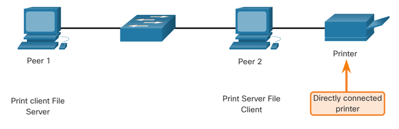

# Computer Networks : Hoofdstuk 15 - Application Layer

## Application, Presentation and Session

### Application Layer

>[!important]
>De bovenste drie lagen van het OSI model (application, presentation and session) bepalen de functies van de TCP/IP laag

- De **applicatielaag** zorgt voor de interface die gebruikt worden om te communicereren tussen de applicaties, de gebruikers, en het onderliggende netwerk waarover de berichten verstuurd worden.

- Meestvoorkomende applicatielaag protocollen: HTTP, FTP, TFTP, IMAP en DNS

### Presentation and Session Layer

De **presentatielaag** heeft drie voornamelijke functies:

- **Formatting**, of het presenteren, van data aan het brontoestel naar een compatibel formaat dat kan ontvangen worden door het bestemmingstoestel.
- **Compressing** van gegevens op een manier dat het ge-decomppresseerd kan worden door het bestemmingstoestel.
- **Encrypting** van de data voor het uitzenden en decrypteren van de gegevens bij ontvangst.

De **sessielaag** heeft volgende functies:

- Het maakt en beheert dialogen tussen bron- en doelapplicaties.
- Het behandeld het uitwisselen van data om de dialogen te initialiseren, hen actief te houden, en om sessies die onderbroken, of voor lange periode idle waren, te herstarten.

### TCP/IP Application Layer Protocols

- Het TCP/IP applicatie protocol specifieert het formaat en de controle informatie die nodig zijn voor verschillende vaak gebruikte internet communicatie functies.

- Applicatielaag protocollen worden zowel door de bron als doeltoestellen gebruikt tijdens een communicatiesessie.

- Om ervoor te zorgen dat de communicaties sucessvol verlopen, moeten de applicatieprotocollen die geïmplementeerd worden tussen bron en doel, compatibel zijn.

<table>
    <thead>
        <th>Name System  DNS - Domain Name System (or service)</th>
        <th>Host Config  DHCP - Dynamic Host Configuration Protocol</th>
        <th>Web  HTTP - Hypertext Transfer Protocol</th>
    </thead>
<tbody>
<tr>
<td>

- TCP, UDP, client 53
- Translates domain names, such as cisco.com into IP addresses

</td>
<td>

- UCP client 68, server 67
- Dynamically assigns IP addresses to be re-used when no longer needed

</td>
<td>

- TCP 80, 8080
- A set of rules for exchanging text, graphic images, sound, video, and other multimedia on the World Wide Web

</td>
</tr>
</tbody>
</table>

## Peer-to-Peer

### Client-Server Model

> Client en server processen worden behandeld in de applicatielaag

- In het client/server model, wordt een toestel dat informatie aanvraagt de **client** genoemd en het toestel dat antwoord op de request de **server** genoemd.
- De applicatielaagprotocollen beschrijven het formaat van de requesten en antwoorden tussen clients en servers.

### Peer-to-Peer Networks

- In een **Peer-to-Peer (P2P) network**, worden twee toestellen over een netwerk verbonden en kunnen ze bronnen (printers, bestanden) delen zonder gebruik te maken van een dedicated server.
- Elk verbonden toestel (= peer) kan functioneren zowel als een server als een client
- Een computer kan voor de ene transactie fungeren als een server terwijl hij voor een andere transactie de client is. 

>De rollen voor server of client worden op request-basis ingesteld.

### Peer-to-Peer Applications

> Een P2P applicatie stelt de toestellen in staat om tijdens dezelfde communicatie te fungeren als een clien of een server.

Sommige P2P applicaties maken gebruik van een *hybrid system* waarbij elke peer een *index server* raadpleegt om de locatie van de bronnen opgeslagen op een andere peer te achterhalen.

### Common P2P Applications

Bij P2P applicaties, kan elke computer binnen een netwerk die de applicatie draait fungeren als een client of een server voor de andere computers binnen het netwerk die ook de applicatie draaien.

Veelvoorkomende P2P applicaties zijn:

- BitTorrent
- Direct Connect
- eDonkey
- Freenet

## Web and Email Protocols

### Hypertext Transfer Protocol and Hypertext Markup Language

Wanneer een **webadres of Uniform Resource Locator (URL)** ingetypt wordt in een web browser, zal de web browser een verbinding opstellen met de web service. De web service draait op een server gebruiktmakend van het **HTTP** protocol.

#### STAP 1: De browser interpreteert de drie onderdelen van een **URL**:

    - http (het protocol of schema)
    - www.cisco.com (de server naam)
    - index.html (het specifieke bestand dat opgevraagd wordt) 

#### STAP 2: De browser controleert met de name server (= DNS) om `www.cisco.com` te converteren naar een numeriek IP adres, en gebruikt het IP adres om de verbinding met de server te maken.

De client initieert een HTTP request naar een server door het sturen van een GET request naar die server en het opvragen van de `index.html` bestand

#### STAP 3: Als antwoord op de request, stuurt de server de HTML code voor de webpagina naar de browser

#### STAP 4: De browser ontcijferd de HTML code en formateert de pagina in het browser scherm

### HTTP and HTTPS

**HTTP** is een request/respond protocol dat specifieert welke berichttypes gebruikt worden voor de communicatie.

Er zijn drie veel gebruikte berichttypes:
- **GET**: Een client request voor data. Een client (web browser) stuurt het GET bericht naar de webserver om de HTML pagina aan te vragen.
- **POST**: Dit upload gegevensbestanden naar een webserver (vaak form data)
- **PUT**: Dit upload bronnen naar de webserver, zoals een afbeelding

>[!note]
>HTTP is niet een beveiligd protocol. Voor beveiligde communicaties over het internet zou **HTTPS** gebruikt moeten worden.

### Email Protocols

Email is een store-and-forward methode van sturen, opslaan en ontvangen van electronische berichten over een netwerk. Email berichten worden opgeslagen in databases op mail servers. Email clients communiceren met de mail servers om emails te versturen en ontvangen.

De email protocollen die gebruikt worden zijn:

- **Simple Mail Transfer Protocol (SMTP)**: gebruikt om mails te versturen
- **Post Office Protocol (POP) & IMAP**: gebruikt door clients om mails te ontvangen.

### SMTP, POP and IMAP

- Wanneer een client een email stuurt, verbind de client's SMTP proces met een SMTP server op de well-known poort 25
- Nadat de verbinding tot stand is gebracht probeert de client de mail te versturen naar de server over de verbinding.
- Wanneer de server het bericht ontvangt, plaatst hij het in een lokaal account, als de ontvanger lokaal is, of hij stuurt het bericht door naar een andere mail server voor ontvangst.
- Indien de email server niet online of bezig is zal de SMTP spools het bericht op een later tijdstip versturen.

>[!note]
>Een SMTP bericht formaat heeft een message header nodig (ontvanger emailadres en afzender emailadres) en een message body.

**POP** wordt gebruikt door een applicatie om een mail te ontvangen van een mailserver. Wanneer de mail gedownload wordt van de server naar de client gebruiktmakend van POP, worden de mails verwijderd van de server.

- De server start de POP service door passief te luisteren op de TCP poort 110 voor client connection requests.
- Wanneer een client gebruik wil maken van de service, stuurt het een request uit om een TCP verbinding tot stand te brengen met de server.
- Wanneer deze verbinding succesvol opgezet is, zal de POP server een begroetingsbericht sturen.
- De client en POP server zullen dan onderling commando's en antwoorden uitwisselen tot de verbinding gesloten of afgebroken wordt.

>[!note]
>Aangezien POP geen berichten opslaat, is dit protocol niet aangeraden voor kleinere bedrijven die een gecentraliseerde backup nodig hebben.

**IMAP** is een ander protocol gebruikt voor ontvangst van een email

- In tegenstelling tot POP worden er kopiën van de berichten gedownload naar de client applicaiton wanneer een user verbinding maakt met de IMAP server. De originele berichten blijven op de server bewaard tot wanneer ze manueel verwijderd worden.
- Wanneer een user beslist een bericht te verwijderen synchroniseert de server automatisch deze acties en verwijderd hij het bericht van de server.

## IP Addressing Services

### Domain Name Service

- Domeinnamen werden aangemaakt om numerieke IP adressen naar een simple, gemakkelijker leesbare naam te converteren.
- **Fully-qualified domain names (FQDN's)** zoals http://www.cisco.com zijn gemakkelijker te onthouden dan `198.133.219.25`
- Het **DNS** protocol beschrijft een automatische service die resource namen match met de numerieke netwerk adressen. Het bevat het formaal voor de queries, antwoorden en gegevens.

### DNS Format Message

De DNS server slaat verschillende type bronvermeldingen die gebruikt worden om namen op te lossen. Ze bevatten de naam, adres, en het type van het record.

Enkele types:

- **A**: Een end device IPv4 adres
-  **NS**: Een gezaghebbende nameserver
- **AAAA**: een end device IPv6 adres (uitgesproken: quad-A)
- **MX**: Een mail exchange record

Wanneer een client een query maakt, zal het DNS process eerst op de server tussen zijn eigen records kijken. Als het de naam niet kan oplossen door het gebruiken van opgeslagen records, contacteert het andere servers om de naam op te lossen.

Nadat een match gevonden is, zal de originele server het numerieke adres tijdelijk opslaan, in geval dat dezelfde naam opnieuw opgevraagd wordt.

DNS gebruikt hetzelfde bericht formaat tussen servers. Het bevat volgende velden:

<table>
    <thead>
        <th>DNS message section</th>
        <th>Description</th>
    </thead>
    <tbody>
        <tr>
            <td>Question</td>
            <td>The question for the name server</td>
        </tr>
        <tr>
            <td>Answer</td>
            <td>Resource Records answering the question</td>
        </tr>
        <tr>
            <td>Authority</td>
            <td>Resource Records pointin toward an authority</td>
        </tr>
        <tr>
            <td>Additional</td>
            <td>Resource Records holding additional information</td>
        </tr>
    </tbody>
</table>

### DNS Hierarchy

- DNS maakt gebruikt van een hiërarchisch systeem om een database te maken voor naamresolutie
- Elke DNS server beheerd een specifiek database bestand en is enkel verantwoordelijk voor het beheerd van name-to-IP mappings voor dat klein gedeelte van de volledige DNS structuur.

- Wanneer een DNS server een request ontvangt voor een naamvertaling, dat niet in zijn DNS zone valt, zal de DNS server de request doorsturen naar de DNS server binnen in de juiste zone voor vertaling.

- Top-level domains:
    - .com - a business or industry
    - .org - a non-profit organisation
    - .au - Australia

### The `nslookup` Command

- `nslookup` is een computer operation system tool dat een gebruiker instaat steld om manueel aan de DNS servers geconfigureerd op het toestel een query te sturen om naam op te lossen.
- De tool kan ook gebruikt worden om naamresolutie problemen op te losen en de status van de name servers na te gaan.
- Wanneer het `nslookup` commando uitgevoerd word, zal de DNS server die als default geconfigureerd is op het toestel weergegeven worden.
-  De naam van een host of domein kan ingegeven worden in de prompt.

- Dig is de equivalent op linux-based OS

### Dynamic Host Configuration Protocol

- Het **Dynamic Host Configuration Protocol (DHCP)** voor IPv4 service automatiseerd het toewijzen van IPv4 adressen, subnet masks, gateways, en andere IPv4 parameters.
- DHCP wordt aanschouwdt als dynamische addressering tegenover de statische adressering. (manueel ingegeven IP adres informatie)
- Wanneer een host verbinding maakt met het netwerk, zal de DHCP server gecontacteerd worden, en een adres aangevraagd worden. De DHCP server kiest een adres uit een geconfigureerde range van adressen (= *pool*) en wijst dit toe aan de host (leasen).
- Verschillende netwerken gebruiken beide DHCP en statische adressering. DHCP wordt meestal gebruikt voor hosts, zoals end user devices. Statische adressering wordt gebruikt voor netwerk toestellen, zoals gateway routers, switches, servers en printers.

>[!note]
>DHCP voor IPv6 (DHCPv6) voorziet gelijkaardige diensten voor IPv6 clients. DHCPv6 kan echter wel geen default gateway adres voorzien. Dit kan alleen verkregen wordtn van een Router Advertisement message.

### DHCP Operation

Het DHCP proces:

- Wanneer een IPv4, DHCP-geconfigureerd toestel opstart of verbinding maakt met het netwerk, broadcast de client een **DHCP discover (DHCPDISCOVER)** bericht om de beschikbare DHCP servers op het netwerk te identificeren.
- Een DHCP Server antwoord met een **DHCP offer (DHCPOFFER)** bericht, dit bied de lease aan de client aan. (krijgt de client verschillende aanbiedingen (meerdere DHCP servers in het netwerk) dan moet het er een kiezen)
- De client stuurt een **DHCP request (DHCPREQUEST)** bericht dat de expliciete server identificeert en het lease offer aanvaard.
- De server antwoord met een **DHCP acknowledgement (DHCPACK)** bericht dat erkent dat de lease van de client gefinaliseerd is
- Indien het offer niet meer geldig is, zal de geselecteerde server antwoorden met een **DHCP negative acknowledgement (DHCPNACK)** bericht en moet het process opnieuw gestart worden met een DHCPDISCOVER bericht.

>[!note]
>DHCPv6 heeft een reeks berichten die gelijkaardig zijn aan de DHCPv4 berichten. (SOLICIT, ADVERTISE, INFORMATION REQUEST, REPLY)

## File Sharing Services

### File Transfer Protocol

**FTP** werd ontwikkeld om gegevensoverdrachten tussen client en server toe te staan. Een FTP client is een applicatie die runned op een computer en gebruikt wordt om gegevens te "pushen" en "pullen" van een FTP server.

#### STAP 1:

De client maakt een verbinding met de server voor verkeercontrole op TCP-poort 21.

Het verkeer bevat client commando's en server antwoorden

#### STAP 2:

De client stelt een tweede verbinding op met de server voor de effectiefe gegevensoverdrachten op TCP-poort 20. Deze connectie wordt elke keer aangemaakt wanneer gegevens worden overgezet.

#### STAP 3:

De gegevensoverdrachten kunnen in beide richtingen plaatsvinden. De client kan gegevens downloaden (pull) van de server, of hij kan gegevens uploaden (push) naar de server.

### Server Message Block

De **Server Message Block (SMB)** is een client/server, request-response gegevensoverdracht protocol. Servers kunnen hun eigen bronnen beschikbaar stellen aan clients op het netwerk?

SMB berichten hebben drie functies:

- Start, authenticate, and terminate sessions
- Control file and printer access
- Een applcatie toestaan berichten te sturen of ontvangen naar of van een ander toestel.

In tegenstelling tot bestandsoverdracht, ondersteund door FTP, stellen clients bij SMB langdurige verbindingen op met de servers. Nadat de verbinding tot stand is gebracht kan de client de bronnen van de server raadplegen net zoals het lijkt dat deze zicht lokaal op de client bevinden.