# Computer Networks : Hoofdstuk 17 - Build a Small Network

## Devices in a Small Network

### Small Network Topologies

- De meeste bedrijven zijn klein, hierdoor zijn de meeste netwerken ook klein.
- Het netwerkdesign van een klein netwerk is redelijk eenvoudig.
- Kleine netwerken hebben meestal één enkele WAN connectie, voorzien door een DSL kabel of een Ethernet connectie.
- Grotere netwerken hebben een IT departement nodig voor het beheren, beveiligen (o.a. van bedrijfsgegevens) en het troubleshooten van netwerktoestellen. Kleine netwerken worden meestal beheerd door een lokale IT technieker of door een betaalde professional.

### Device Selection for a Small Network

Net zoals grotere netwerken, hebben kleinere netwerken ook planning en design nodig om de aan de gebruiker zijn vereisten te voldoen. Planning zorgt er dat men nadenkt over alle vereisten, kost factoren, en ontwikkelingensmogelijkheden. Een van de grootse factoren om na te gaan is te kijken welke tussenapparaten er gebruikt zullen worden om het netwerk te ondersteunen.

Factoren waarmee rekening moet gehouden worden wanneer we netwerktoestellen selecteren:

- kost
- snelheid en type poorten/interfaces
- schaalbaarheid
- features en services van het operating system

### IP Addressing for a Small Network

Wanneer we een netwerk opstellen, is het best een IP addresseringsschema op te stellen en ook te gebruiken. Alle hosts en toestellen binnen een internetwerk moeten een uniek adres hebben. Toestellen die we betrekken in het IP addresseringsschema zijn:

- End user devices: Het aantal en type verbindingen (bekabeld, draadloos, extern toegankelijk)
- Servers en peripheral devices (printers, security camera's)
- Tussenapparaten zoals switches, access points.

Het is aangeraden om te plannen, documenteren en beheren van een IP addresseringsschema gebasseerd op het toesteltype. Het gebruik van een geplanned addresseringsschema maakt het gemakkelijker om een type toestel te identificeren en problemen te troubleshooten.

### Redundancy in a Small Network

Om een hoge betrouwbaarheid te garanderen is *redundantie* nodig in het netwerkdesign. Het helpt om single points of failure te elimineren.

Redundantie kan bereikt worden door dubbele apparaten te installeren. Ook kan het bereikt worden door dubbele netwerk links te voorzien op critische plaatsen.

<p align='center'>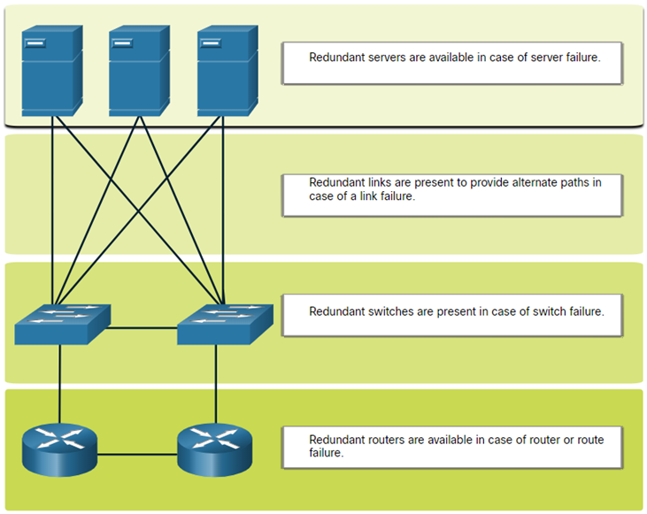</p>

### Traffic Management

- Het doel voor een goed netwerk design is de productiviteit van de werknemers te verhogen en het minimaliseren van *downtime*.
- De routers en switches in een klein netwerk zouden best geconfigureerd worden om real-time verkeer, zoals voice en video, te ondersteunen. 
- Priority queuing heeft voor wachtrijen. De wachtrij met hoge prioriteit wordt altijd als eerste geleegd.

<p align='center'></p>

## Small Network Applications and Protocols

### Common Applications

Nadat het netwerk is opgezet zijn enkele applicaties en protocollen nodig om te kunnen functioneren.

Er zijn twee soorten programma's of processen die toegang to het netwerk geven:

- **Network Applications**: Applicaties die de applicatielaagprotocollen implementeren en direct kunnen communiceren met de lagere lagen of de protocol stack.
- **Application Layer Services**: Applicaties die niet op de hoogte van het netwerk zijn. De applicaties die een interface hebben met het netwerk en de gegevens klaarmaken voor een transfer.

### Common Protocols

Netwerkprotocollen ondersteunen de applicaties en diensten die door de werknemers gebruikt worden in een klein netwerk.
- Netwerk administatoren hebben vaak toegang nodig tot de netwerktoestellen en servers. De twee meest voorkomende remote access oplossingen zijn *Telnet* en *Secure Shell (SSH)*
- Hypertext Transfer Protocol (HTTP) en Hypertext Transfer Protocol Secure (HTTPS) worden gebruikt tussen webclients en web servers.
- Simple Mail Transfer Protocol (SMTP) wordt gebruikt om mails te sturen, Post Office Protocol (POP3) of Internet Mail Access Protocol (IMAP) worden gebruikt door de clients om mails te ontvangen.
- File Transfer Protocol (FTP) en Security File Transfer Protocol (SFTP) worden gebruikt om bestanden te downloaden en uploaden tussen client en FTP server.
- Dynamic Host Configuration Protocol (DHCP) wordt door clients gebruikt om een IP adres te bemachtigen van de DHCP server.
- De Domain Name Service (DNS) lost domeinnamen op naar IP adressen.

>[!note]
>Een server kan verschillende netwerk diensten voorzien. Bv. Een server kan email, FTP en SSH server zijn.

Bovenstaande protocollen bevatten de belangrijkste toolset voor een netwerkprofessional. Ze beschrijven:
- processen aan beide kanten van de communicatie
- Type berichten
- Syntax van de berichten
- Betekenis van de informatieve velden
- Hoe berichten verzonden worden en wat het verwacht antwoord is
- Interactie met de volgende lagere laag.

Verschillende bedrijven hebben policies opgesteld over het gebruik van de beveiligde versies (SHH, SFTP, HTTPS) van deze protocollen waar mogelijk.

### Voice and Video Applications

- Bedrijven vandaag de dag gebruiken meer en meer IP telefonie en media-streaming om te communiceren met klanten, business partners en de collega's die remote werken.
- De netwerk administrator moet garanderen dat het juiste materiaal geïnstalleerd is op het netwerk en dat de netwerktoestellen geconfigureerd zijn om priority delivery te garanderen.
- Netwerk administatoren moeten rekening houden met de het volgende wanneer ze real-time applicaties willen ondersteunen:
    - **Infrastructure**: Heeft het de nodige capaciteit en kwaliteit?
    - **VoIP**: Voice over IP is vaak goedkoper dan IP telefonie maar beperkt ook de kwaliteit
    - **IP telephony**: Maakt gebruik van dedicated servers voor gesprekscontrole en signalering.
    - **Real-time Applications**: Het netwerk moet QoS technieken ondersteunen om latentie te limiteren. *Real-Time Transport Protocol (RTP)* en *Real-Time Transport Control Protocol (RTCP)* zijn twee protocollen die real-time applicaties ondersteunen.

## Scale to Larger Networks

### Small Network Growth

> Idealiter heeft de netwerkadministrator genoeg tijd om intelligente beslissingen te maken over de groei van het netwerk in overeenstemming met de groei van het bedrijf.

Om een netwerk te kunnen uitbreiden zijn volgende zaken nodig:
- **Network Documentation**: Physical en logical topology
- **Device inventory**: Lijst van toestellen die het netwerk gebruiken of omvatten
- **Budget**: Gedetailleerd IT budget, inclusief budget voor aankoop van IT materiaal voor het fiscale jaar.
- **Traffic analysis**: Protocols, applications en diensten waarvan hun specifiek verkeer vereisten gedocumenteerd moeten zijn.

### Protocol Analysis

Het is belangrijk om te weten welk soort verkeer en welke verkeersstroom er over het netwerk gaat. Er zijn verschillende managementtools om deze zaken na te gaan.

Om verkeersstroom patronen te bepalen is het volgende belangrijk:
- Vang het verkeer op tijdens de peakmomenten om een correcte representatie van de verschillende verkeertypes op te vangen.
- Voer de opvangen van deze data uit op verschillende segmenten in het netwerk, aangezien sommig verkeer naar een specifiek segement zal zoeken.
- De informatie die we verzamelen evalueren we gebaseerd op de bron, bestemming en het soort verkeer.
- Deze analyse kunnen we gebruiken om beslissing te maken hou we het verkeer efficiënter kunnen beheren.

### Employee Network Utilization

Verschillende operating systemen voorzien built-in tools om het netwerkgebruik te visualiseren.
Deze tools kunnen gebruikt worden om een "snapshot" van de volgende informatie te nemen:
- OS en OS versie
- CPU gebruik
- RAM gebruik
- Schijf gebruik
- Niet-netwerk applicaties
- Netwerk applicaties

## Verify Connectivity

### Verify Connectivity with Ping

Of het netwerk nu klein is, of je bent het aan het opschalen zal je altijd willen controleren dat de onderdelen correct met elkaar en met het internet verbonden zijn.

- het `ping` commando, beschikbaar op de meeste OS, is de meeste effectieve manier om op een rappe manier een Laag 4 connectie test uit te voeren tussen bron en doel IP adres.
- het `ping` commando maakt gebruik van het *Internet Control Message Protocol (ICMP)* echo  (ICMP Type 8) en echo reply (ICMP type O) berichten.

<p align='center'>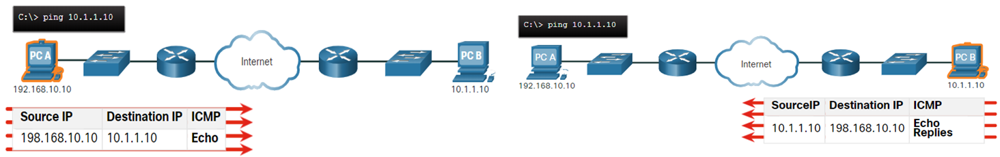</p>

Op een Windows 10 host stuurt het `ping` commando 4 ICMP echo berichten en verwachte het ook vier ICMP echo antwoorden. De IOS ping stuurt vijf ICMP echo berichten uit en toont een indicator voor elke ICMP bericht dat ontvangen is.

IOS Ping Indicatoren:

<table>
    <thead>
        <th>Element</th>
        <th>Description</th>
    </thead>
<thbody>
<tr>
<td>!</td>
<td>

- Exclamation mark indicates succesful receipt of an echo reply message
- It validates a Layer 3 connection between source and destination

</td>
</tr>
<tr>
<td>.</td>
<td>

- A period means that the time expired waiting for an echo reply message
- This indicates a connectivity problem occured somewhere along the path

</td>
</tr>
<tr>
<td>U</td>
<td>

- Uppercase U indicates a router along the path responded with an ICMP Type 3 "destination unreachable" error message
- Possible reasons include the router does not know the direction to the destination network or it could not find the host on the destination network

</td>
</tr>
</thbody>
</table>

### Extended `ping`

De Cisco IOS bied een "extended" `ping` aan.

De extended `ping` wordt in EXEC mode ingegeven door `ping` te typen zonder een ip adres. Hierna komen er enkele prompts.

>[!note]
>Op `enter` drukken aanvaard de indicated default values. Analoog gebruiken we `ping ipv6` voor een extended IPv6 ping.

### Verify Connectivity with traceroute

Het `ping` commando is nuttig om snel te achterhalen als er Laag 3 connectie problemen zijn.
Het commando geeft ons echter niet de mogelijkheid om te achterhalen waar op de route het probleem ligt.

- `traceroute` kan helpen om Laag 3 problemen te identificeren in het netwerk. Het geeft een lijst van hops terug net wanneer een pakket gerouteerd wordt door het netwerk.
- de syntax kan verschillen van OS tot OS

<p align='center'>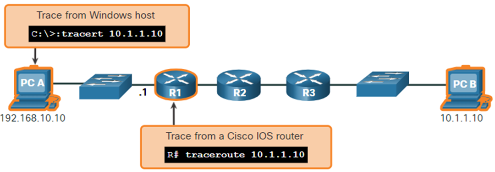</p>

#### Voorbeeld `tracert` commando op een Windows 10 host:

>[!tip]
>Gebruik `CTRL + C` om een `tracert` commando te onderbreken.

```console
PS C:\Users\Ward Segers> tracert 8.8.8.8

Tracing route to dns.google [8.8.8.8]
over a maximum of 30 hops:

  1     1 ms     1 ms     1 ms  <lokaal ip-adres>
  2    12 ms    12 ms    11 ms  94-224-114-1.access.telenet.be [94.224.114.1]
  3    13 ms    12 ms    12 ms  dD5E0CCA2.access.telenet.be [213.224.204.162]
  4     *        *        *     Request timed out.
  5    18 ms    16 ms    15 ms  dD5E0F932.access.telenet.be [213.224.249.50]
  6    15 ms    14 ms    13 ms  72.14.204.36
  7    17 ms    16 ms    15 ms  142.251.253.191
  8    22 ms    18 ms    12 ms  209.85.254.113
  9    14 ms    15 ms    12 ms  dns.google [8.8.8.8]

Trace complete.
```

#### Voorbeeld `traceroute` commando van R1:

<p align='center'>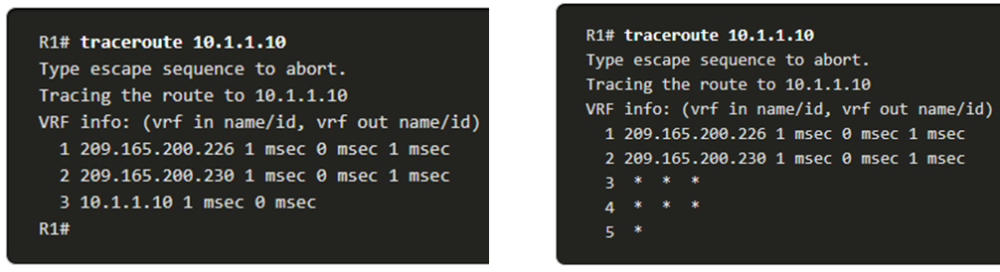</p>

- Links zien we dat dat de trace gevalideerd is en PC B kan bereiken
- Rechts zien we dat de host `10.1.1.10` niet bereikbaar was. De uitvoer toont ons een "*" op waar de antwoorden time-outen. De Timeouts geven een potentieel netwerk probleem aan.

>[!tip]
>Gebruik `CTRL + SHIFT + 6` om een `traceroute` commando te onderbreken in CISCO IOS.

>[!note]
>De versie van traceroute op Windows (tracert) verstuurd ICMP Echo Requests. Cisco IOS en Linux maken gebruik van UDP met een ongeldig poortnummer. De finale bestemming zal een ICMP Port unreachable bericht teruggeven.

### Extended `traceroute`

Net zoals bij `ping` heeft ook `traceroute` een extended versie. Het stelt de netwerkadministrator in staat om parameters mee te geven aan het commando.

Het Windows `tracert` commando staat toe om enkele parameters om te geven als opties in de command line. Deze zijn echter niet zou begeleidend als het extended `traceroute` IOS commando. 

Windows `tracert` commando opties:

```console
PS C:\Users\Ward Segers> tracert /?

Usage: tracert [-d] [-h maximum_hops] [-j host-list] [-w timeout]
               [-R] [-S srcaddr] [-4] [-6] target_name

Options:
    -d                 Do not resolve addresses to hostnames.
    -h maximum_hops    Maximum number of hops to search for target.
    -j host-list       Loose source route along host-list (IPv4-only).
    -w timeout         Wait timeout milliseconds for each reply.
    -R                 Trace round-trip path (IPv6-only).
    -S srcaddr         Source address to use (IPv6-only).
    -4                 Force using IPv4.
    -6                 Force using IPv6.
```

- De extended `traceroute` wordt ingegeven in de priviledged EXEC mode door `traceroute` te typen zonder een IP adres te specifiëren. 
- Door te drukken op `enter` worden de waardes geaccepteerd.

<p align='center'>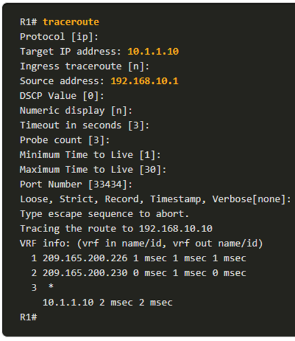</p>

### Network Baseline

- Een van de meest effectieve tools voor het monitoren en troubleshooten van netwerkperformance is het opzetten van een netwerk baseline.
- Een methode voor het starten van een netwerk baseline is het kopiëren van de resultaten van ping, trace, en andere commando's naar een tekst bestand. Deze bestanden kunnen opgeslagen worden in een archief met de datum en later opgehaald worden om te vergelijken.
- Andere zaken die we kunnen bekijken zijn foutberichten en de reactietijden van host naar host.

## Host and IOS Commands

### IP Configuration on a Windows Host

In Windows 10, kan je de IP adres gegevens gemakkelijk raadplegen vanuit het **Network and Sharing Center**. We vinden er vier belangrijke instellingen: adres, mask, router en DNS.

Deze info kunnen we ook zien doormiddel van het `ipconfig` commando uit te voeren.
- `ipconfig /all`: toont MAC adres en details omtrent Laag 3 addressering van het toestel.
- Indien een host geconfigureerd is als een DHCP client, kan de IP adres configuratie vernieuwd worden door het commando `ipconfig /release` en `ipconfig /renew`
- De DNS Client service op een Windows PC optimaliseert ook de performantie van DNS naam resolutie door het opslaan van opgeloste namen uit het verleden. We kunnen deze cached DNS entries tonen door het commando `ipconfig /displaydns` uit te voeren.

<p align='center'>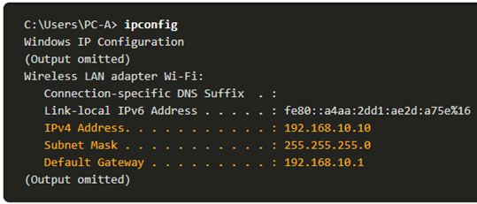</p>

### IP Configuration on a Linux Host

- IP instellingen weergeven in de GUI op een Linux host kan verschillen van distributie tot distributie
- In de commandline gebruiken we het commando `ifconfig` om de status van de actieve interfaces en hun IP configuratie weer te geven.
- `ip address` wordt gebruikt om de adressen en hun eigenschappen weer te geven. We kunnen het ook gebruiken om adressen te verwijderen.

<p align='center'>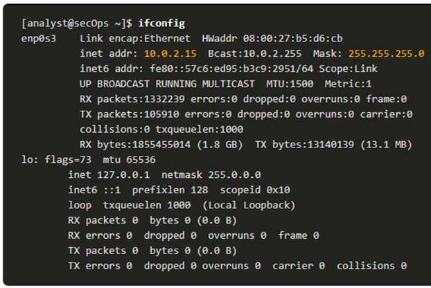</p>

### IP Configuration on a macOS Host

- In de GUI van een Mac host kunnen we de IP informatie weergeven door **Network Preferences > Advanced** te openen.
- Het `ifconfig` commando kan gebruikt worden in de commandline om de configuratie van de interfaces na te gaan.
- Andere nuttige macOS commando's om de host IP instellingen na te gaan zijn:
    - `networksetup -listallnetworkservices`
    - `networksetup -getinfo`

<p align='center'>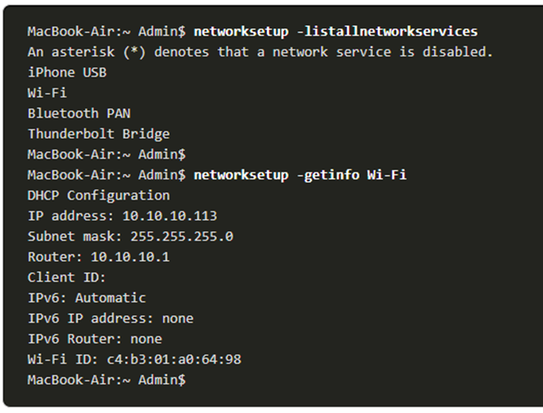</p>

### The `arp` command

Het `arp` commando bestaat zowel voor Windows, Linux, als Mac. Het commando geeft een lijst van toestellen in de ARP cache van de host weer.

- `arp -a`; geeft de gekende IP adres en Mac adres binding weer. (enkel van recent gebruikte toestellen)
- Om zeker te zijn dat er een ARP cache entry is, `ping` het toestel
- De cache kan manueel geleegd worden door `netsh interface ip delete arpcache` 

>[!note]
>Administrator toegang kan nodig zijn om `netsh interface ip delete arpcache` uit te voeren.

### Common `show` commands Revisited

<table>
    <thead>
        <th>Command</th>
        <th>Description</th>
    </thead>
<tbody>
<tr>
<td>

`show running-config`

</td>
<td>Verifies the current configuration and settings</td>
</tr>
<tr>
<td>

`show interfaces`

</td>
<td>Verifies the interface status and displays any error messages</td>
</tr>
<tr>
<td>

`show ip interface`

</td>
<td>Verifies the Layer 3 information of an interface</td>
</tr>
<tr>
<td>

`show arp`

</td>
<td>Verifies the list of known hosts on the local Ethernet LANs</td>
</tr>
<tr>
<td>

`show ip route`

</td>
<td>Verifies the Layer 3 routing information</td>
</tr>
<tr>
<td>

`show protocols`

</td>
<td>Verifies which protocols are operational</td>
</tr>
<tr>
<td>

`show version`

</td>
<td>Verifies the memory, interfaces, and licenses of the device</td>
</tr>
</tbody>
</table>

### The `show cdp neighbors` Command

CDP voorziet volgende  informatie over elk CDP neighbor device:

- **Device Identifiers**: De geconfigureerde host name van een switch, router, of een ander toestel.
- **Address list**: Tot één netwerklaag adres voor elk van de ondersteunde protocollen
- **Port identifier**: De naam van de lokale en remote poort in de vorm van een ACII karakter string, zoals `FastEthernet 0/0`
- **Capabilities list**: Geeft weer of een toestel een Laag 2 of een Laag 3 switch is
- **Platform**: Het hardware platform van het toestel

Het `show cdp neighbors detail` commando geeft het IP adres van het "buurtoestel" weer.

### The `show ip interface brief` Command

Een van de meest gebruikte commando's is `show ip interface brief`.
Het commando geeft een afgekorte uitvoer in vergelijking met `show ip interface`.
Het geeft alle key informatie van alle netwerk interfaces in een router weer.

<p align='center'>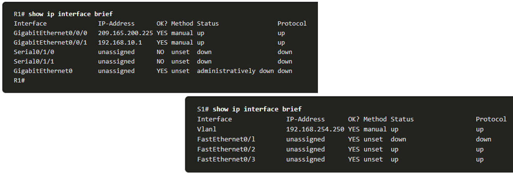</p>

## Troubleshooting Methodologies

<table>
    <thead>
        <th>Step</th>
        <th>Description</th>
    </thead>
<tbody>
<tr>
<td style="font-weight:bold">Step 1. Identify the Problem</td>
<td>

- This is the first step in the troubleshooting process.
- Allthough tools can be used in this step, a conversation with the user is often helpful.

</td>
</tr>
<tr>
<td style="font-weight:bold">Step 2. Establish a Theory of Probable Causes</td>
<td>

- After the problem is identified, try to establish a theory of probable causes.
- This step often yields more than a few probable causes to the problem

</td>
</tr>
<tr>
<td style="font-weight:bold">Step 3. Test the Theory to Determine Cause</td>
<td>

- Based on the probable causes, test your theories to determine which one is the cause of the problem.
- A technician may apply a quick fix to test and see if it solves the problem.
- If a quick fix does not correct the problem, you might need to research the problem further to establish the exact cause.

</td>
</tr>
<tr>
<td style="font-weight:bold">Step 4. Establish a Plan of Action and Implement the Solution</td>
<td>

After you have determined the exact cause of the problem, establish a plan of action to resolve the problem and implement the solution.

</td>
</tr>
<tr>
<td style="font-weight:bold">Step 5. Verify Solution and Implement Preventive Measures</td>
<td>

- After you have corrected the problem, verify full functionality.
- If applicable, implement preventive measures

</td>
</tr>
<tr>
<td style="font-weight:bold">Step 6. Document Findings, Actions and Outcomes</td>
<td>

- In the final step of the troubleshooting process, document your findings, actions and outcomes.
- This is very important for future reference.

</td>
</tr>
</tbody>
</table>

### Resolve or Escalate?

- In sommige gevallen kan het zijn dat het probleem niet direct op te lossen is. Een probleem zou moeten geescaleerd worden wanneer een manager's beslissing, specifieke expertise of specifieke netwerk toegang (niet beschikbaar voor de persoon die troubleshoot), nodig is.
- Een bedrijfs policy zou duidelijk moeten stellen wanneer en aan wie een technieker een probleem moet escaleren.

### The `debug` command

- Het IOS `debug` commando stelt een administrator in staat om de OS processen, protocollen, mechanismen en event berichten, in real-time weer te geven voor analyse.
- Alle `debug` commando's worden in priviledge EXEC mode ingegeven. 
- Om een lijst weer te geven van beschikbare `debug` commando's gebruiken we `debug ?`
- Om een specifieke debug-feature uit te schakelen, voeg het `no` keyword voor het `debug` commando
    - Alternatief kan ook het `undebug` commando ingegeven worden
    - Om alle debug commando's uit te schakelen gebruiken we `undebug all`

>[!note]
>Let op bij het gebruik van `debug` commando's. Deze kunnen een groot aantal output genereren en kunnen een groot deel van de systeem bronnen gebruiken. Hierdoor kan de router zo bezig geraken met het weergeven van de debug output dat het niet genoeg processing power kan hebben voor het uitvoeren van de netwerkfuncties.

### The `terminal monitor` Command

- `debug` en andere IOS output berichten worden niet automatisch weergegeven bij remote verbindingen. Dit is omdat log berichten niet worden weergegeven op VTY lines.
- Om deze log berichten toch weer te geven op een terminal gebruiken we het commando `terminal monitor` in privileged EXEC mode. 
- Om te stoppen met monitorren gebruiken we het commando `terminal no monitor` in privileged EXEC mode. 

<p align='center'>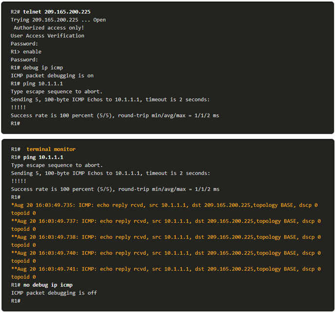</p>

## Troubleshooting Scenarios

### Duplex and Mismatch Issues

- Onderling verbonden Ethernet interfaces moeten in dezelfde duplex opereren voor de beste communicatie performance en om inefficiëntie en latentie te vermijden op deze link.
- De Ethernet autonegotiation feature vergemakkelijkt de configuratie, minimaliseert problemen, en maximaliseert de link performance tussen twee onderling verbonden Ethernet links. Beide verbonden toestellen geven eerst hun ondersteunde mogelijkheden, waarna de hoogste performance mode wordt gekozen die beide toestellen ondersteunen.
- Indien een van beide toestellen in full-duplex mode opereert en de andere in half-duplex, doet zich een *duplex mismatch* voor. Gegevenscommunicatie is nog steeds mogelijk, maar de link performance zal laag zijn.
- Duplex mismatch gebeurd meestal door een verkeerd geconfigureerde interface of door een zeldzaam geval van een gefaalde autonegotiation. Duplex mismatch kan moeilijk te troubleshooten zijn, aangezien beide toestellen nog communiceren.

### IP Addressing Issues on IOS Devices

- Twee veel voorkomende redenen van incorrecte IPv4 adres toewijzingen zijn manuele toewijzigsfouten of DHCP-gerelateerde fouten.
- Netwerk administatoren meoten vaak manueel IP adressen toewijzen aan toestellen zoals servers en routers. Indien tijdens de toewijzing een fout is gebeurd, zuller er hoogstwaarschijnlijk communicatie problemen tussen de toestellen zijn.
- Gebruik op een IOS toestel het commando `show ip interface` of `show ip interface brief` om na te gaan welke IPv4 adressen toegewezen zijn aan de netwerk interfaces.

<p align='center'>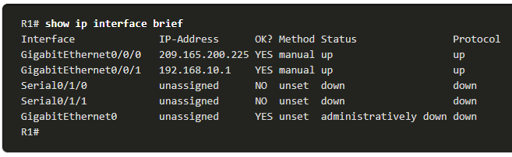</p>

### IP Addressing issue on End Devices

- Wanneer een toestel op een Window-based pc geen DHCP server kan contacteren, zal Windows automatisch een adres uit de range `169.254.0.0/16` geven. Deze feature noemen we **Automatic Private IP Addressing**
- Een toestel met een APIPA adres zal hoogstwaarschijnlijk niet kunnen communiceren met andere toestel op het netwerk, aangezien zijn meestal niet behoren tot dezelfde range.

>[!note]
>Andere OS zoals Linux en OS X maken geen gebruik van APIPA

- Indien een toestel niet kan communiceren met de DHCP server, dan kan de server geen IPv4 adres toewijzen voor dat netwerk en kan het toestel niet communiceren.
- Om de toegewezen IP adressen na te gaan op een Windows host gebruik het commando `ipconfig`

### Default Gateway issues

- De default gateway voor een end device is het dichtsbijzijnde netwerktoestel, dat behoord tot hetzelfde netwerk en verkeer kan doorsturen naar andere netwerken. Indien een toestel geen of een incorrecte default gateway geconfigureerd heeft, dan kan het toestel niet communiceren met toestellen op een remote netwerk.
- Net zoals bij IPv4 addresserings issue, kunnen default gateway problemen ook ontstaan door verkeerde configuratie (bij manuele toewijzing) of door DHCP problemen (bij automatische toewijzing)
- Om de default gateway na te gaan op Windows hosts gebruiken we het commando `ipconfig`
- Op een router kunnen we `show ip route` gebruiken om de routing table op te lijsten en na te gaan hoe de default gateway (= default route) is ingesteld. 

### Troubleshooting DNS Issues

- DNS server addressen kunnen manueel of automatisch toegewezen worden via DHCP
- Vele bedrijven gebruiken hun eigen DNS server, echter zijn er ook bereikbare publieke DNS servers.
- Cisco biedt OpenDNS aan. (`208.67.222.222` en `208.67.220.220`)
- Gebruik `ipconfig /all` om na te gaan welke DNS server gebruikt wordt door de Windows PC
- We kunnen `nslookup` gebruiken om manueel DNS queries te plaatsen en het DNS antwoord te analyseren.