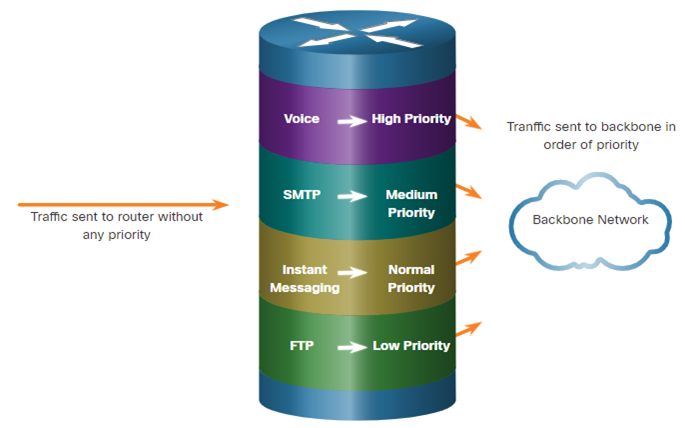

# Computer Networks : Hoofdstuk 17 - Build a Small Network

## Devices in a Small Network

### Small Network Topologies

- De meeste bedrijven zijn klein, hierdoor zijn de meeste netwerken ook klein.
- Het netwerkdesign van een klein netwerk is redelijk eenvoudig.
- Kleine netwerken hebben meestal één enkele WAN connectie, voorzien door een DSL kabel of een Ethernet connectie.
- Grotere netwerken hebben een IT departement nodig voor het beheren, beveiligen (o.a. van bedrijfsgegevens) en het troubleshooten van netwerktoestellen. Kleine netwerken worden meestal beheerd door een lokale IT technieker of door een betaalde professional.

### Device Selection for a Small Network

Net zoals grotere netwerken, hebben kleinere netwerken ook planning en design nodig om de aan de gebruiker zijn vereisten te voldoen. Planning zorgt er dat men nadenkt over alle vereisten, kost factoren, en ontwikkelingensmogelijkheden. Een van de grootse factoren om na te gaan is te kijken welke tussenapparaten er gebruikt zullen worden om het netwerk te ondersteunen.

Factoren waarmee rekening moet gehouden worden wanneer we netwerktoestellen selecteren:

- kost
- snelheid en type poorten/interfaces
- schaalbaarheid
- features en services van het operating system

### IP Addressing for a Small Network

Wanneer we een netwerk opstellen, is het best een IP addresseringsschema op te stellen en ook te gebruiken. Alle hosts en toestellen binnen een internetwerk moeten een uniek adres hebben. Toestellen die we betrekken in het IP addresseringsschema zijn:

- End user devices: Het aantal en type verbindingen (bekabeld, draadloos, extern toegankelijk)
- Servers en peripheral devices (printers, security camera's)
- Tussenapparaten zoals switches, access points.

Het is aangeraden om te plannen, documenteren en beheren van een IP addresseringsschema gebasseerd op het toesteltype. Het gebruik van een geplanned addresseringsschema maakt het gemakkelijker om een type toestel te identificeren en problemen te troubleshooten.

### Redundancy in a Small Network

Om een hoge betrouwbaarheid te garanderen is *redundantie* nodig in het netwerkdesign. Het helpt om single points of failure te elimineren.

Redundantie kan bereikt worden door dubbele apparaten te installeren. Ook kan het bereikt worden door dubbele netwerk links te voorzien op critische plaatsen.

### Traffic Management

- Het doel voor een goed netwerk design is de productiviteit van de werknemers te verhogen en het minimaliseren van *downtime*.
- De routers en switches in een klein netwerk zouden best geconfigureerd worden om real-time verkeer, zoals voice en video, te ondersteunen. 
- Priority queuing heeft voor wachtrijen. De wachtrij met hoge prioriteit wordt altijd als eerste geleegd.

## Small Network Applications and Protocols

### Common Applications

Nadat het netwerk is opgezet zijn enkele applicaties en protocollen nodig om te kunnen functioneren.

Er zijn twee soorten programma's of processen die toegang to het netwerk geven:

- **Network Applications**: Applicaties die de applicatielaagprotocollen implementeren en direct kunnen communiceren met de lagere lagen of de protocol stack.
- **Application Layer Services**: Applicaties die niet op de hoogte van het netwerk zijn. De applicaties die een interface hebben met het netwerk en de gegevens klaarmaken voor een transfer.

### Common Protocols

Netwerkprotocollen ondersteunen de applicaties en diensten die door de werknemers gebruikt worden in een klein netwerk.
- Netwerk administatoren hebben vaak toegang nodig tot de netwerktoestellen en servers. De twee meest voorkomende remote access oplossingen zijn *Telnet* en *Secure Shell (SSH)*
- Hypertext Transfer Protocol (HTTP) en Hypertext Transfer Protocol Secure (HTTPS) worden gebruikt tussen webclients en web servers.
- Simple Mail Transfer Protocol (SMTP) wordt gebruikt om mails te sturen, Post Office Protocol (POP3) of Internet Mail Access Protocol (IMAP) worden gebruikt door de clients om mails te ontvangen.
- File Transfer Protocol (FTP) en Security File Transfer Protocol (SFTP) worden gebruikt om bestanden te downloaden en uploaden tussen client en FTP server.
- Dynamic Host Configuration Protocol (DHCP) wordt door clients gebruikt om een IP adres te bemachtigen van de DHCP server.
- De Domain Name Service (DNS) lost domeinnamen op naar IP adressen.

>[!note]
>Een server kan verschillende netwerk diensten voorzien. Bv. Een server kan email, FTP en SSH server zijn.

Bovenstaande protocollen bevatten de belangrijkste toolset voor een netwerkprofessional. Ze beschrijven:
- processen aan beide kanten van de communicatie
- Type berichten
- Syntax van de berichten
- Betekenis van de informatieve velden
- Hoe berichten verzonden worden en wat het verwacht antwoord is
- Interactie met de volgende lagere laag.

Verschillende bedrijven hebben policies opgesteld over het gebruik van de beveiligde versies (SHH, SFTP, HTTPS) van deze protocollen waar mogelijk.

### Voice and Video Applications

- Bedrijven vandaag de dag gebruiken meer en meer IP telefonie en media-streaming om te communiceren met klanten, business partners en de collega's die remote werken.
- De netwerk administrator moet garanderen dat het juiste materiaal geïnstalleerd is op het netwerk en dat de netwerktoestellen geconfigureerd zijn om priority delivery te garanderen.
- Netwerk administatoren moeten rekening houden met de het volgende wanneer ze real-time applicaties willen ondersteunen:
    - **Infrastructure**: Heeft het de nodige capaciteit en kwaliteit?
    - **VoIP**: Voice over IP is vaak goedkoper dan IP telefonie maar beperkt ook de kwaliteit
    - **IP telephony**: Maakt gebruik van dedicated servers voor gesprekscontrole en signalering.
    - **Real-time Applications**: Het netwerk moet QoS technieken ondersteunen om latentie te limiteren. *Real-Time Transport Protocol (RTP)* en *Real-Time Transport Control Protocol (RTCP)* zijn twee protocollen die real-time applicaties ondersteunen.

## Scale to Larger Networks

### Small Network Growth

> Idealiter heeft de netwerkadministrator genoeg tijd om intelligente beslissingen te maken over de groei van het netwerk in overeenstemming met de groei van het bedrijf.

Om een netwerk te kunnen uitbreiden zijn volgende zaken nodig:
- **Network Documentation**: Physical en logical topology
- **Device inventory**: Lijst van toestellen die het netwerk gebruiken of omvatten
- **Budget**: Gedetailleerd IT budget, inclusief budget voor aankoop van IT materiaal voor het fiscale jaar.
- **Traffic analysis**: Protocols, applications en diensten waarvan hun specifiek verkeer vereisten gedocumenteerd moeten zijn.
