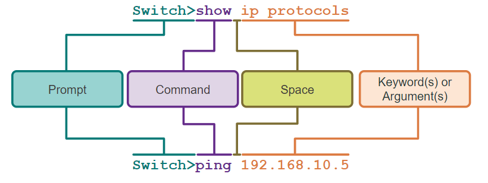

# Hoofdstuk 2 - Basic switch and End Device configuration

## IOS (Internetwork Operating System) Access 

### Operating Systems

- **Shell**: De user interface dat de gebruiker toelaat specifieke taken aan de computer te vragen. Deze kunnen zowel via de CLI als de GUI gevraagd worden
- **Kernel**: De communicatielaag tussen de hardware en software van een computer. Deze laag beheerd hoe de hardware resources gebruikt worden om de software requirements te behalen.
- **Hardware**: De fysieke onderdelen van een computer, inclusief de electronica

### GUI (Graphical User Interface)

Een GUI laat de gebruiker toe interactie te beleven met een het systeem door een omgeving van grafische iconen, menus en schermen.

Algemeen is een GUI gebruiksvriendelijker en vereist dit minder kennis van de onderlinge commandostructuur.

Voorbeelden: Windows, macOS, Linux KDE, Apple iOS en Android

Een nadeel van GUI is data deze kunnen crashen of niet voldoen aan de verwachtingen. Om deze zaken te vermijden worden netwerk end devices typisch aangesproken doormiddel van een CLI.

### Doel van een OS

Een Operating System van een pc laat de gebruiker toe het volgende te doen:
- Een muis gebruiken om selecties te maken en programma's te runnen
- Tekst en tekst-gebaseerde commando's in te voeren

Een CLI-gebaseerd netwerk operating system laat een netwerk technieker toe volgende zaken uit te voeren:
- Een toetsenbord gebruiken om CLI-gebaseerde netwerk programma's te runnen
- Een toetsenbord gebruiken om tekst en tekst-gebaseerde commando's in te voeren
- Ouput weergeven op een scherm

### Access Methods

- **Console**: Een fysieke beheerpoort die wordt gebruikt om toegang te krijgen tot een apparaat voor onderhoud, zoals het uitvoeren van de eerste configuratie
- **Secure Shell (SSH)**: Opstellen van een beveiligde afstands CLI connectie naar een toestel, doormiddel van een virtuele interface over een netwerk.

> [!TIP]
> Best practise: Gebruik SSH om remotely te verbinden met een device

- **Telnet**: Opstellen van een onveilige afstands CLI verbinding met een toestel over het netwerk.

> [!CAUTION]
> Bij telnet wordt de gebruikers authenticatie, passwoord en commando's over het netwerk in tekstvorm verzonden!

### Terminal Emulation Programs

Terminal Emulation Programs zijn programma's die gebruikt worden om verbinding te maken met een netwerk apparaat door een console poort of door een SSH/Telnet verbinding. (voorbeelden: PuTTY, Tera Term en SecureCRT)

## IOS Navigation

### Primary Command Modes

- **User Exec Mode**:
    - Geeft toegang tot een gelimiteerd aantal basic monitoring commando's
    - Herkenbaar door het `>` symbool in de console

    ```
    Router>

    Switch>
    ```
- **Privileged Exec Mode**:
    - Geeft toegang tot alle mogelijke commando's
    - Herkenbaar door het `#` symbool in de console

    ```
    Router#

    Switch#
    ```

### Configuration Mode and Subconfiguration Modes

- **Gobal Configuration Mode**: Wordt gebruikt om de configuratie opties op het toestel te raadplegen
```
Switch(config)#
```
- **Line Configuration Mode**: Wordt gebruikt om de console, SSH, Telnet of AUX toegangen te configureren
```
Switch(config-line)#
```
- **Interface Configuration Mode**: Gebruikt om de switch port of een router interface te configureren
```
Switch(config-if)#
```

### Navigation Between IOS Modes

- **Privileged Exec Mode**: Om om te schakelen van gebruiker EXEC mode naar privilege EXEC mode gebruiken we het commando `enable`
```
Switch> enable
Switch#
```

- **Global Configuration Mode**: Om te schakelen tussen global configuration mode, maken we gebruik van het `configure terminal` commando. Om terug te keren naar de privilege EXEC mode gebruiken we het `exit` commando.
```
Switch(config)#
Switch(config)# exit
Switch#
```

- **Line Configuration Mode**: Om te schakelen tussen de line configuration mode gebruiken we het `line` commando gevolgd door het "management line type". Om terug te keren naar de global configuration mode gebruiken we het `exit` commando.
```
Switch(config)#line console 0
Switch(config-line)#exit
Switch(config)#
```

- **Subconfiguration Modes**: 

1. Om eender welke subconfiguration mode te verlaten en terug naar de global configuration mode te gaan gebruiken we het commando `exit`. Om terug te keren naar de privilege EXEC mode gebruiken we het `end` commando of doormiddel van de toetsencombinatie `ctrl + z`. 

```
Switch(config)#line console 0
Switch(config-line)#end
Switch(config)#
```
2. Om direct van een subconfiguratie naar een andere te schakelen, voeren we het commando in dat overeenkomt met de subconfiguratie. In het voorbeeld veranderd de command prompt van `(config-line)#` naar `(config-if)#`

```
Switch(config-line)#interface FastEthernet 0/1
Switch(config-if)#
```

## The command structure

### Basis IOS Command Structure

<p align="center">
    
</p>

- **Keyword**: Een specifieke parameter gedefinieerd door het operating system (hier ip protocollen)
- **Argument**: Niet ge-predefinieerd, een waarde of variabele gespecifieerd door de gebruiker (hier ip-adres **192.168.10.5**)

### IOS Command Syntax Check

Een commando kan een of meerdere argumenten nodig hebben. Om te achterhalen welke keywoorden of argumenten nodig zijn voor een commando bekijken we de commando syntax.
- Vetgedrukte tekst geeft de commandos of keywoorden weer die ingevoerd worden zoals ze getoond worden
- Schuingedrukte tekst bedoelt een argument waarvoor de gebruiker een waarde moet ingeven

| Regel | Beschrijving |
| ----- | ------------ |
| **boldface** | Vetgedrukte tekst toont commandos en keywoorden leterlijk zoals ze getoond worden |
| _italics_ | Schuingedrukte tekst bedoelt argumenten waarvoor een waarde moet ingegeven worden |
| **[x]** | Vierkante haakjes geven een optioneel element weer (keyword of argument) |
| **{x}** | Accolades indiceert een verplichte waarde (keyword of argument) |
| **[x {y &#124; z}]** | Accolades en verticale lijnen binnenin vierkante haakjes geven een verplichte keuze weer binnenin een optioneel element. Spaties worden gebruikt om delen van het commando op te splitsen |

- De commando syntax heeft een patroon, formaat dat gebruikt wordt wanneer het commando wordt ingegeven.

- Het commando `ping` of `traceroute` heeft een user defined argument, namelijk het ip-adres. <ins>Voorbeeld</ins>: 
    - `ping ip-adres` `ping 192.168.10.5` 
    - `traceroute ip-adres` `traceroute 192.168.10.5` 

- Een commando met verschillende parameters kan er als volgt uitzien:
`Switch(config-if)# switchport port-security aging {static | time time | type {absolute | inactivity}}`

### IOS Help Features

Er zijn twee verschillende soorten help beschikbaar: context-sensitive help en command syntaxt help

| Context-sensitve | Command syntax |
| ---------------- | -------------- |
| <ul><li>Welke commando's zijn beschikbaar in welke mode?</li><li>Welke commando's starten met specifieke characters of groep van characters</li><li>Welke argumenten en keywords zijn beschikbaar in sommige commando's?</li></ul> | <ul><li>Gaat na indien een correct commando werd ingegeven door de gebruiker</li><li>Als het ingegeven commando niet begrepen werd, zal er feedback geschreven worden omtrent wat er verkeerd is met het commando</li></ul> |
|`Router#ping ?`||

<table>
    <tr>
        <td>test</td>
        <td>test</td>
    </tr>
</table>