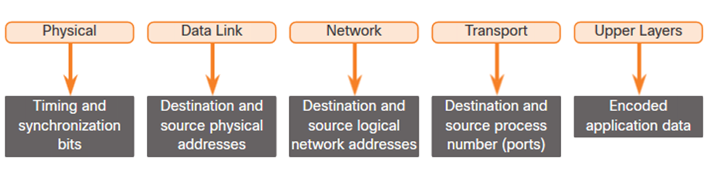

# Computer Networks - Hoofdstuk 3 - Protocols and Models

## The rules

Netwerken kunnen verschillen in grootte en compleciteit. Daarom is het niet genoeg om een verbinding te hebben. De apparaten moeten ook afstemmen hoe ze communiceren.

Voor elke succesvolle communicatie bestaan er volgende onderdelen:
- Er is een afzender (_source_)
- Er is een bestemming (_receiver/destination_)
- Er is een kanaal of medium (_channel/media_) dat voor een pad voor de communicatie zorgt

Alle communicatie worden beheerd door protocollen.
Deze protocollen zijn de regels die de verschillende communicaties zullen volgen.
De verschillende regels hangen af van de verschillende protocollen.

### Rule Establishement

- Individueen moeten de vastgestelde regels of afspraken gebruiken om de communicatie te sturen.
- **Protocollen** moeten rekening houden met de volgende vereisten:
    - Een geïdentificeerde verzender en ontvanger
    - Gemeenschappelijke taal en grammatica
    - Snelheid en timing van de levering
    - Bevestiging van de vereisten

### Netwerk Protocol Requirements

Veel gebruikte computer protocollen moeten overeenkomen en de volgende vereisten bevatten:
- Codering van berichten
- Berichtopmaak en -inkapseling
- Berichtgrootte
- Timing van de berichten
- Opties voor het afleveren van de berichten

### Message Encoding

>[!warning]
>**Encoding** is het proces van het converteren van informatie naar een aanvaardbare vorm van transmissie

>[!warning]
>**Decoding** is de inverse van encoding waarbij de informatie geïnterpreteerd wordt.

Encoding tussen hosts moet in een toepasbaar formaat zijn voor het medium.
- Berichten die verzonden worden over een netwerk worden geconverteerd naar bits.
- Deze bits worden gecodeerd naar een patroon van licht, geluid of electrische impulsen.
- De bestemmingshost moet deze signalen decoderen om het bericht te kunnen interpreteren.

### Message Formatting and Encapsulation

- Wanneer een bericht verzonden is moet dit een speciaal formaat of structuur hanteren.
- Het formaat van het bericht hangt af van het type bericht en het medium dat gebruikt wordt om het bericht te verzenden.

### Message Size

- Wanneer een groot bericht verzonden wordt van de ene host naar de andere over een netwerk, is het noodzakelijk _het bericht op te splitsen in kleiner stukken_
- De regels die de grootte van deze stukken of frames beheren zijn zeer strikt en worden overheen het hele netwerk gecommuniceerd. Ze kunnen tevens verschillen naar gelang het kanaal dat gebruikt wordt. Frames die te groot of te klein zijn worden niet bezorgd bij de ontvanger.
- Bij de ontvangende host worden de frames terug samengesteld in het orginele bericht.

### Message Timing

Message time bestaat uit:

- **Flow control**: beheerd de snelheid van de gegevensoverdracht en bepaalt de hoe hoeveelheid data die verzonden kan worden aan welke snelheid.
- **Response Timeout**: beheerd hoelang een apparaat wacht wanneer het geen antwoord ontvangt van de bestemming.
- **Access method**: beheerd wanneer iemand een bericht kan sturen.
    - Er kunnen zijn verschillende regels die problemen beheren zoals "collisions".    

>[!important]
>**Collisions** is het fenomeen wanneer meer dan één apparaat op hetzelfde moment berichten stuurt en deze berichten corrupt worden
- 
    - Sommige protocollen zijn proactief en properen dus "collisions" te vermijden, terwijl andere protocollen corrigeren werken en een recovery methode bevatten nadat de collision voorkomt.

### Message Delivery Options

Message Delivery Options kan een van volgende zijn:

- **Unicast**: one to one communication
- **Multicast**: one to many communication (meestal niet alle)
- **Broadcast**: one to all communication

>[!note]
>Broadcast worden gebruikt in IPv4 netwerken, maar zijn geen optie in IPv6. 

  

**_Deze mogelijkheden worden soms ook als volgens voorgesteld_**

## Protocols

### Netwerk Protocol Overview

Netwerk protocollen definiëren een aantal regels:
- Kunnen geimplementeerd worden op zowel hardware als software, of beide
- Protocollen hebben hun eigen functie, formaat en regels

<table>
<thead>
<tr>
<th>Protocol Type</th>
<th>Beschrijving</th>
</tr>
</thead>
<tbody>
<tr>
<td>Netwerk Communications</td>
<td>Schakel twee of meerder apparaten in om met elkaar over een of meerdere netwerken te communiceren</td>
</tr>
<tr>
<td>Netwerk Security</td>
<td>Gegevens beveiligen om authenticatie, gegevensintegriteit en gegevenscodering te voorzien</td>
</tr>
<tr>
<td>Routing</td>
<td>Schakel routers in om route informatie uit te wisselen, pad informatie te vergelijken, en het beste pad te selecteren</td>
</tr>
<tr>
<td>Service Discovery</td>
<td>Gebruikt voor automatisch detectering van toestellen of diensten</td>
</tr>
</tbody>
</table>

### Netwerk Protocol Functions

:heavy_exclamation_mark:  Apparaten gebruiken vooraf afgesproken protocollen om te communiceren.

<table>
<thead>
<tr>
<th>Functie</th>
<th>Beschrijving</th>
</tr>
</thead>
<tbody>
<tr>
<th>Addressing</th>
<td>Identificeerd de zender en ontvanger</td>
</tr>
<tr>
<th>Reliability</th>
<td>Verzorgt gegarandeerde levering</td>
</tr>
<tr>
<th>Flow Control</th>
<td>Zorgt voor een efficiënte gegevensstroom</td>
</tr>
<tr>
<th>Sequencing</th>
<td>Geeft een uniek label aan elk van de verstuurde segmenten data</td>
</tr>
<tr>
<th>Error Detection</th>
<td>Bepaald indien de gegevens corrupted zijn gedurende de transmissie</td>
</tr>
<tr>
<th>Application Interface</th>
<td>Process-to-Process communicatie tussen netwerk applicaties</td>
</tr>
</tbody>
</table>
 

### Protocol Interaction

 

<table>
<thead>
<tr>
<th>Protocol</th>
<th>Functie</th>
</tr>
</thead>
<tbody>
<tr>
<th>Hypertext Transfer Protocol (HTTP)</th>
<td>

- Beheerd de manier waarop een webserver en een webclient interageren
- Bepaald de inhoud en het formaat

</td>
</tr>
<tr>
<th>Transmission Control Protocol (TCP)</th>
<td>

- Beheerd individuele conversaties
- Verzekert een gegarandeerde levering
- Beheerd de gegevensstroom

</td>
</tr>
<tr>
<th>Internet Protocol (IP)</th>
<td>Bezorgd berichten globaal gezien van zender naar ontvanger. Wordt door routers gebruikt om berichten over netwerken te versturen</td>
</tr>
<tr>
<th>Ethernet</th>
<td>Verzend bericht van het ene NIC naar de andere NID op hetzelfde Ethernet Local Area Network (LAN)</td>
</tr>
</tbody>
</table>

## Protocol Suites

### Network Protocol Suites

Het is noodzakelijk dat protocollen onderling met elkaar kunnen werken.

>[!warning]
>**Protocol Suites** is een groep van onderling verbonden protocollen die nodig zijn om de communiceren. 
>Een aantal regels die samenwerken om een probleemstelling te verhelpen.

Protocollen worden aanzien vanuit verschillende lagen:
- Higher layers
- Lower layers: hebben de taak om gegevens en diensten te bezorgen aan de "higher layers"

### Evolution of Protocol Suites

- **Internet Protocol Suite or TCP/IP**: de meest gebruikte protocol suite en beheer door _the Internet Engineering Task Force_
- **Open Systems Interconnection (OSI) protocols**: Ontwikkels door _the International Organization for Starndardization (ISO)_ en _the International Telecommunications Union (ITU)_
- **AppleTaks**: Proprietary suite release by _Apple Inc_
- **Novell NetWare**: Proprietary suite developped by _Novell Inc_

### TCP/IP Protocol Example

- TCP/IP protocollen werken op applicatie, transport en internet lagen.
- De meest gebruikte LAN netwerklaag zijn Ethernet en WLAN (wireless LAN). 

 

### TCP/IP Protocol Suite

- De TCP/IP protocol suite wordt gebruikt door het internet en bevat verschillende protocollen.
- TCP/IP is:
    - Een open-standaard protocol suite dat vrij toegankelijk is voor een publiek en door elke verkoper gebruikt kan worden
    - Een op standaarden gebaseerde protocolsuite die wordt onderschreven door de netwerkindustrie en goedgekeurd door een standaardenorganisatie om interoperabiliteit te garanderen 

### TCP/IP Communication Process

<table>
<tr>
<td>Een webserver enkapselt en stuurt de webpagina naar een client</td>
<td>Een client die de webpagina decapsuleert voor de webbrowser</td>
</tr>
<tr>
<td>

</td>
<td>

</td>
</tr>
</table>

## Standards Organizations

- Open standards encourage:
    - interoperability
    - competition
    - innovation
- Standards Organizations:
    - vendor-neutral
    - non-profit organizations
    - established to develop and promote the concept of open standards.

### Internet Standards

- **Internet Society (ISOC)**: Bevordert de development and evolution of internet.
- **Internet Architecture Board (IAB)**: Verantwoordelijk voor het beheer en ontwikkeling van internet standaarden.
- **Internet Engineering Task Force (IETF)**: Ontwikkeld, update en onderhoud internet en TCP/IP technologieën.
- **Internet Research Task Force (IRTF)**: Focus ligt op het langetermijn onderzoek omtrent internet en TCP/IP protocollen.

Standaardiseringsorganisaties betrokken bij het ontwikkelen en ondersteunen van TCP/IP:
- **Internet Corporation for Assigned Names and Numbers (ICANN)**: Coordineert de toewijzing van IP-adressen, het beheer van domeinnamen, en toewijzen van andere informatie.
- **Internet Assigned Numbers Authority (IANA)**: Overziet en beheert IP-adres toewijzing, domeinnaam management, en protocol-indentificatie voor ICANN.

### Electronic and Communications Standards

- **Institute of Electrical and Electronics Engineers (IEEE)**: Toegewijdt voor het maken van standaarden in kracht en energie, gezondheid, telecommunicatie en netwerken.
- **Electronic Industries Alliance (EIA)**: Ontwikkeld standaarden gerelateerd aan elektrische kabels, connectoren, en 19-inch racks gebruikt om netwerk apparatuur aan te sluiten.
- **Telecommunications Industry Association (TIA)**: Ontwikkeld communicatie standaarden in radio toestellen, telefoonmasten, Voice over IP (VOIP) toestellen, satelliet communicatie, en meerdere
- **International Telecommunications Union-Telecommunication Standardization Sector (ITU-T)**: Definieert standaarden voor video compressie, Internet Protocol Television (IPTV), en bandbreedte communicaties, zoals digital subscriber line (DSL)

## Reference Models

### The Benefits of Using a Layered Models

Complexe concepten zoals hoe een netwerk werkt, zijn moeilijk te begrijpen en uit te leggen.

Two layered models (lagenmodel) beschrijven netwerk operaties:
- Open System Interconnection (OSI) Reference Model
- TCP/IP Reference Model

Voordelen bij het gebruiken van het lagenmodel:
- Helpen bij het ontwerpen van protocollen omdat protocollen die op een specifieke laag werken gedefinieerde informatie hebben waarop ze reageren en een gedefinieerde interface naar de lagen erboven en eronder.
- Bevorder de concurrentie omdat producten van verschillende leveranciers kunnen samenwerken
- Voorkomen dat veranderingen in technologie of mogelijkheden in één laag invloed hebben op andere lagen erboven en eronder
- Een gemeenschappelijke taal voorzien die netwerkfuncties en mogelijkheden beschrijft.

### The OSI Reference Model

<table>
    <thead>
        <th>OSI Model Layer</th>
        <th>Description</th>
    </thead>
    <tbody>
        <tr>
            <td>7 - Application</td>
            <td>Contains protocols used for process-to-process communications.</td>
        </tr>
        <tr>
            <td>6 - Presentation</td>
            <td>Provides for common representation of the data transferren between application layer services.</td>
        </tr>
        <tr>
            <td>5 - Session</td>
            <td>Provides services to the presentation layer and to manage data exchange.</td>
        </tr>
        <tr>
            <td>4 - Transport</td>
            <td>Defines services to segment, transfer, and reassemble the data for individual communications.</td>
        </tr>
        <tr>
            <td>3 - Network</td>
            <td>Provides services to exchange the individual pieces of data over the network.</td>
        </tr>
        <tr>
            <td>2 - Data Link</td>
            <td>Describes methods for exchanging data frames over a common media</td>
        </tr>
        <tr>
            <td>1 - Physical</td>
            <td>Describes the means to activate, maintain, and de-activate physical connections.</td>
        </tr>
    </tbody>
</table>

### The TCP/IP Reference Model

<table>
    <thead>
        <th>TCP/IP Model Layer</th>
        <th>Description</th>
    </thead>
    <tbody>
        <tr>
            <td>Application</td>
            <td>Represents data to the user, plus encoding and dialog control.</td>
        </tr>
        <tr>
            <td>Transport</td>
            <td>Supports communication between various devices across divers networks.</td>
        </tr>
        <tr>
            <td>Internet</td>
            <td>Determines the best path through the network</td>
        </tr>
        <tr>
            <td>Network Access</td>
            <td>Controls the hardware devices and media that make up the network.</td>
        </tr>
    </tbody>
</table>

### OSI and TCP/IP Model Comparison

- Het OSI model verdeel de netwerk access laag en de applicatie laag van het TCP/IP model in verschillende lagen.
- De TCP/IP protocol suite specifieert niet welke protocollen moeten gebruikt worden wanneer we uitzenden over een fysiek medium.
- OSI-lagen 1 en 2 bespreken de noodzakelijke procedures om toegang te krijgen tot de media en de fysieke middelen om gegevens over een netwerk te verzenden.

## Data Encapsulation

### Segmenting Messages

> **Segmenting** (= segmentering) is het proces dat berichten in verschillende kleiner deeltjes opsplits. 

> **Multiplexing** zijn de processen die verschillende streams van gesegmenteerde data nemen en ze terug "samenweven".

*Segmentering heeft twee voordelen*:
- Toenemende snelheid: Groot aantal gegevens kunnen over een netwerk verzonden worden zonder een communicatieverbinding te verstoren.
- Toenemende efficiëntie: Enkel segmenten van de data die niet op hun bestemming toekomen moeten opnieuw verzonden worden.

### Sequencing

> **Sequencing** van berichten is het proces dat de segmenten van een bericht benummert zodat deze op de bestemming terug kunnen samengesteld worden.

:arrow_right: TCP is verantwoordelijk voor de sequencing van individuele segmenten.

### Protocol Data Units (PDU)

> **Encapsulation of inkapseling** is het process waar protocollen hun informatie aan de data toevoegen.

- Op elk stadium van het proces, heeft een PDU een verschillende naam om zijn verschillende functies te reflecteren.
- Er is geen universele conventie voor de benaming van de PDU's. (wij gebruiken de benamingen volgens de TCP/IP protocol suite)
- PDU's volgens orde op de stack zien er als volgend uit:
     1. Data (Data stream)
     2. Segment
     3. Packet
     4. Frame
     5. Bits (Bit stream)

**Voorbeeld inkapseling**:

:arrow_right: Inkapseling is een "top down" proces. De vorige laag/level voert zijn processen uit en geeft het dan door aan het volgende level. Dit proces blijft herhaalt worden todat alle lagen verstuurd worden als een bit stream.

**Voorbeeld ontkapseling**:

De data wordt "ontkapselt" naarmate het naar boven op de stack verplaatst.

Wanneer een laag zijn processen vervolledigd, verwijderd het zijn header en geeft het door aan de volgende laag om geprocessed te worden. Dit proces blijft herhaald worden tot het een data stream is dat de applicatie kan processen.

1. Ontvangen als bits (bit stream)
2. Frame
3. Packet
4. Segment
5. Data (data stream)

## Data Access

### Addresses

Beide de data link en netwerk lagen gebruiken adressen om data van bron naar bestemming te verzenden.

- *Netwerklaag bron- en bestemming adressen* zijn verantwoordelijk voor het leveren van een IP pakket van de originele bron naar de bestemming
- *Data-link laag bron- en bestemming adressen* zijn verantwoordelijk voor het leveren van het data-link frame van de ene netwerk interface card (NIC) naar de andere NIC **op hetzelfde netwerk**.

### Layer 3 Logical Address

Het IP pakket bevat 2 IP adressen:
- **Bron IP adres** (afkomstig van de verzender)
- **Bestemming IP adres** (finale bestemming)

>Deze kunnen op hetzelfde of verschillende netwerken zijn

Een IP-adres bevat 2 delen:
- *Netwerkgedeelte (IPv4) of Prefix (IPv6)*:
    - Het meest linkse gedeelte van het adres
    - Elke LAN of WAN zal hetzelfde netwerkgedeelte hebben
- *Hostgedeelte (IPv4) of Interface (IPv6)*:
    - De rest (rechtergedeelte) bepaald aan welk uniek toestel dit adres behoord.

>Wanneer toestellen op hetzelfde netwerk verbonden zijn zullen de bron en het bestemmings hetzelfde netwerkgedeelte hebben in hun IP-adres

Wanneer toestellen op hetzelfde Ethernet verbonden zijn, zal het datalink frame het effectieve MAC-adres van de bestemming NIC gebruiken. 

>**Mac-adressen** zijn fysiek ingebed in de Ethernet NIC en zijn een lokale adressering.

### Different IP Networks

Wanneer de bestemming remote is, zal het een verschillend netwerkgedeelte hebben tov. het ip-adres van de bron.

De 3e laag zal aan de 2e de lokale default gateway doorgeven. 

- **De default gateway (DGW)** is het ip-adres van de router. (het handeld als een deur voor alle verkeer naar en van buiten (remote traffic)) 

### Data Link Addresses

Aangezien data link adressen lokale adressen zijn, zal het steeds een bron en bestemming hebben voor elk segment of hop op de weg naar de bestemming.

- De MAC-adressering is het eerste segment:

Over alle hops wordt het pakket niet veranderd. Echter veranderd het frame wel (andere mac-adressen)