# Computer Networks - Hoofdstuk 4 - Physical Layer

## Purpose of the Physical Layer

### The Physical Connection

- Alvorens om het even welke netwerk communicatie kan plaatsvinden, moet er een fysieke connectie met het lokaal netwerk opgezet zijn.
- Deze connectie kan zowel draadloos als bekabeld zijn (naargelang de opzet van het netwerk)
- Een Network Interface Card (NIC) verbind een toestel met een netwerk.
- Sommige toestellen hebben één of meerdere NIC's. (draadloos en/of bekabeld)
- Niet alle fysieke connectie hebben dezelfde performantie.

### The Physical Layer

- Vervoert bits over de netwerk medium
- Aanvaard een volledig frame van de Data Link Laag en codeert het als een serie van signale die verzonden worden naar de locale media. (laaste stap in het inkapseling proces)
- Het volgende toestel op de route naar de bestemming ontvangt de bits en ontkapselt het frame. Hierna beslist het toestel wat ermee moet gebeuren.

## Physical Layer Characteristics

### Physical Layer Standards

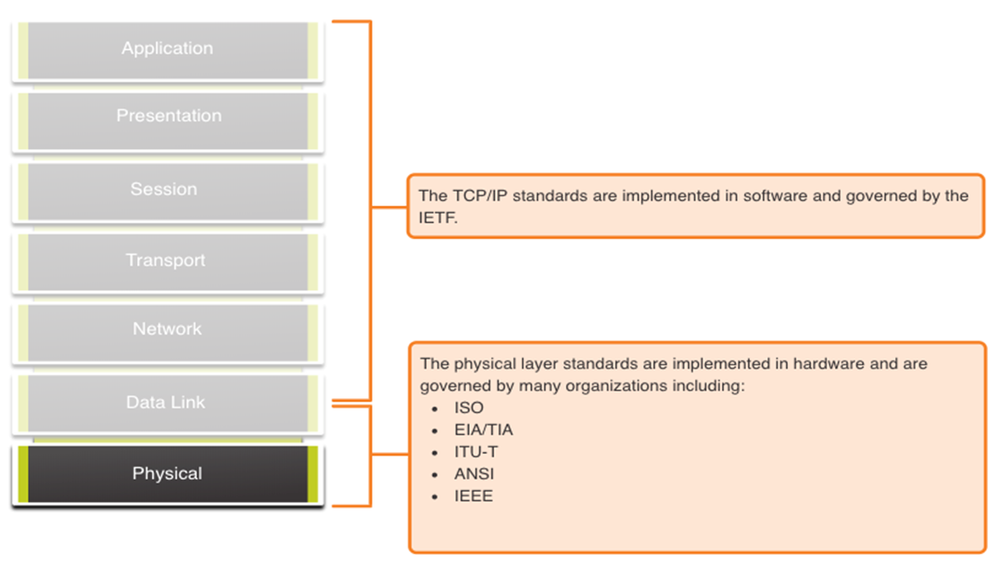

De normen van de Fysieke Laag richten zich op 3 functionele gebieden:

- **Fysiek componenten (physical components)**: Dit zijn hardware toestellen, media en andere connectoren die signalen overbrengen dat de bits vertegenwoordigen.
    - Hardware onderdelen zoals NIC's, interfaces en connectoren, kabel materialen en designs, zijn allemaal beschreven in de normen die horen bij de fysieke laag.
- **Encoding**: Zet de stroom van bits om in een formaat dat herkend wordt door het volgende toestel op de netwerkroute.
    - Voorziet voorspelbare patronen die kunnen herkend worden door het volgende toestel.
- **Signaling**: De manier waarop de bitwaarden voorgesteld worden in het medium.
    - De signalingmethode kan variëren naargelang het type medium dat gebruikt wordt.

### Bandwidth

> **Bandwidth of bandbreedte** is de capaciteit waarmee een medium gegevens kan vervoeren.

Digitale bandbreedte berekend de hoeveelheid data dat van de ene plaats naar de andere kan stromen binnen een gespecifieerd tijdspanne.

Dit kan beïnvloed worden door de eigenschappen van het medium, technologiëen en de fysica.

<table>
    <thead>
        <th>Unit of Bandwidth</th>
        <th>Abbreviation</th>
        <th>Equivalence</th>
    </thead>
    <tbody>
        <tr>
            <td>Bits per second</td>
            <td>bps</td>
            <td>1 bps = fundamental unit of bandwidth</td>
        </tr>
        <tr>
            <td>Kilobits per second</td>
            <td>Kbps</td>
            <td>1 Kbps = 1 000 bps = 103 bps</td>
        </tr>
        <tr>
            <td>Megabits per second</td>
            <td>Mbps</td>
            <td>1 Mbps = 1 000 000 bps = 106 bps</td>
        </tr>
        <tr>
            <td>Gigabits per second</td>
            <td>Gbps</td>
            <td>1 Gbps = 1 000 000 000 bps = 109 bps</td>
        </tr>
        <tr>
            <td>Terabits per second</td>
            <td>Tbps</td>
            <td>1 Tbps = 1 000 000 000 000 bps = 1012 bps</td>
        </tr>
    </tbody>
</table>

#### Bandwidth Terminology

- **Latency of latentie**: De hoeveelheid tijd, inclusief de vertraging, die gegevens nodig hebben om van het ene punt naar het andere te verplaatsen
- **Throughput of doorvoer**: Het gemeten aantal bits die verplaatsen over een medium gedurende een gegeven tijdspanne. (komt overeen met het resultaat van een speedtest)
- **Goodput**: De meting van bruikbare gegevens die in een bepaalde periode zijn overgedragen. 
    $$Goodput = {Throughput - traffic\text{ } overhead}$$

## Copper Cabling

### Characteristics of Copper Cabling

Koperen bekabeling is vandaag de dag de meest voorkomende vorm van kabels gebruikt in netwerken. 

*Voordelen*:
- goedkoop
- gemakkelijk te installeren
- lage weerstand tegen elektrische stroom

*Beperkingen*:
- Verzwakking - hoe langer elektrische signalen moeten reizen, hoe zwakker ze worden
- Het elektrische signaal is gevoelig voor storing van twee bronnen, die de gegevenssignalen kunnen vervormen en beschadigen (Electromagnetic Interference (EMI) and Radio Frequency Interference (RFI) and Crosstalk).

*Matigingen*:
- Strikte naleving van de kabellengtebeperkingen vermindert de demping
- Sommige soorten koperkabel beperken EMI en RFI door metalen afscherming en aarding te gebruiken.
- Sommige soorten koperkabel verminderen overspraak (Crosstalk) door tegengestelde aders van een circuitpaar in elkaar te draaien.

### Types of Copper Cabling

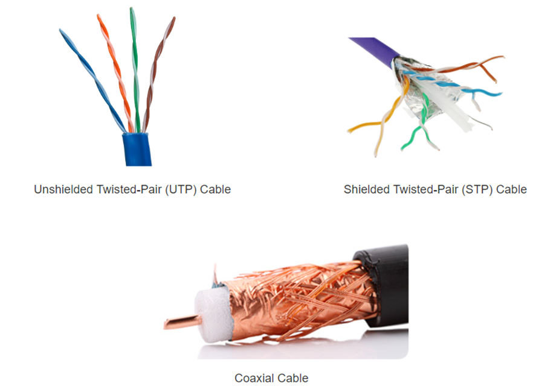

#### Unshielded Twisted Pair (UTP)

>*UTP* is het meest voorkomende netwerk medium

- Verbindingen zijn RJ-45 connectoren
- Verbind hosts met tussenliggende netwerkapparaten

*Eigenschappen van UTP*: 

1. Het omhulsel beschermd de koperkabel van fysieke schade
2. Getwiste paren beschermen het signaal tegen storing.
3. De kleurgecodeerde plastic isolatie isoleert de draden van elkaar en identificeert elk paar.

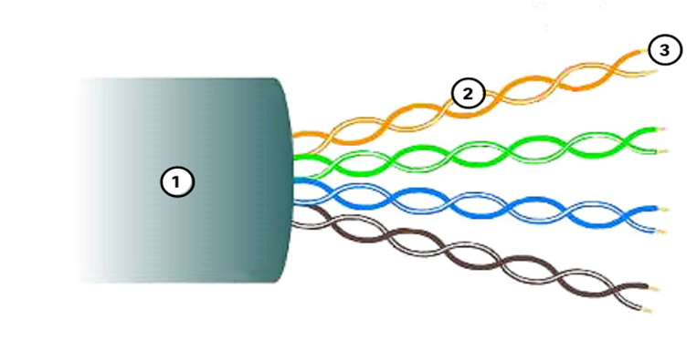

#### Shielded Twisted Pair (STP)

- Betere ruis beveilging dan UTP
- Duurder dan UTP
- Moeilijker te installeren dan UTP
- Verbindingen zijn RJ-45 connectoren
- Verbind hosts met tussenliggende netwerkapparaten

*Eigenschappen van STP*: 

1. Het omhulsel beschermd de koperkabel van fysieke schade
2. Gevlochten of folieschild biedt EMI/RFI-bescherming
3. Folieafscherming voor elk dradenpaar biedt EMI/RFI-bescherming
4. De kleurgecodeerde plastic isolatie isoleert de draden van elkaar en identificeert elk paar.

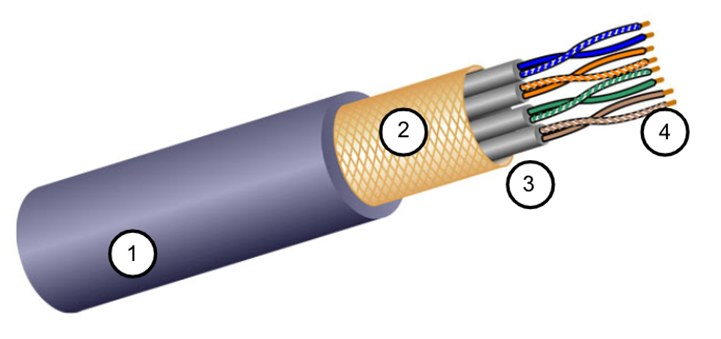

#### Coaxial cable

*Gebruikt voor:*
- Draadloze installaties (verbind antennes met draadloze toestellen)
- Kabel internet installaties  

*Bestaat uit het volgende:*
1. Omhulsel dat fysieke schade beperkt
2. Een gevlochten koperen vlecht, of metaalfolie, fungeert als de tweede draad in het circuit en als afscherming voor de binnenste geleider.
3. Een laag flexibele isolatie
4. Een koperen geleider wordt gebruikt om de elektronische signalen door te geven.

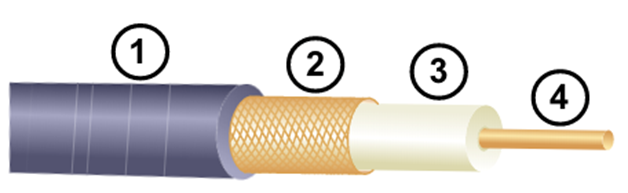

Er zijn verschillende soorten connectoren die gebruikt worden met coax kabels:

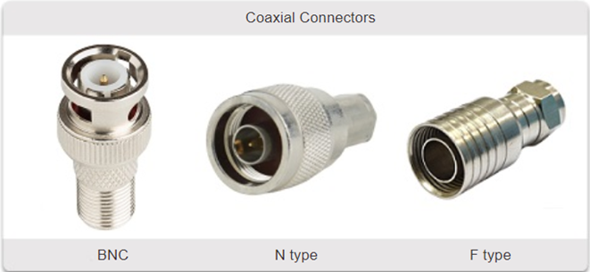

## UTP Cabling

### Properties of UTP Cabling

UTP heeft vier paar kleurgecodeerde koperdraden in elkaar gedraaid en omhuld met een flexibele plastic mantel. Er wordt geen afscherming gebruikt. UTP vertrouwt op de volgende eigenschappen om overspraak (crosstalk) te beperken:

- *Annulering* - Elke draad in een dradenpaar heeft een tegenovergestelde polariteit. De ene draad is negatief, de andere positief. Ze worden in elkaar gedraaid en de magnetische velden heffen elkaar effectief op en buiten EMI/RFI.
- *Variatie in twists per voet* in elke draad - Elke draad is anders getwist, wat overspraak tussen de draden in de kabel helpt voorkomen.

### UTP Cabling Standards and Connectors

Standards for UTP are established by the TIA/EIA. TIA/EIA-568 standardizes elements like:
- Kabel type
- Kabellengte
- Verbindingen
- Kabelbevestiging
- Testing Methodes

Electrical standards for copper cabling are established by the IEEE, which rates cable according to its performance. 

Examples include:
- Category 3
- Category 5 and 5e
- Category 6

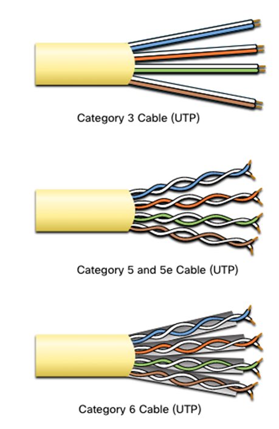

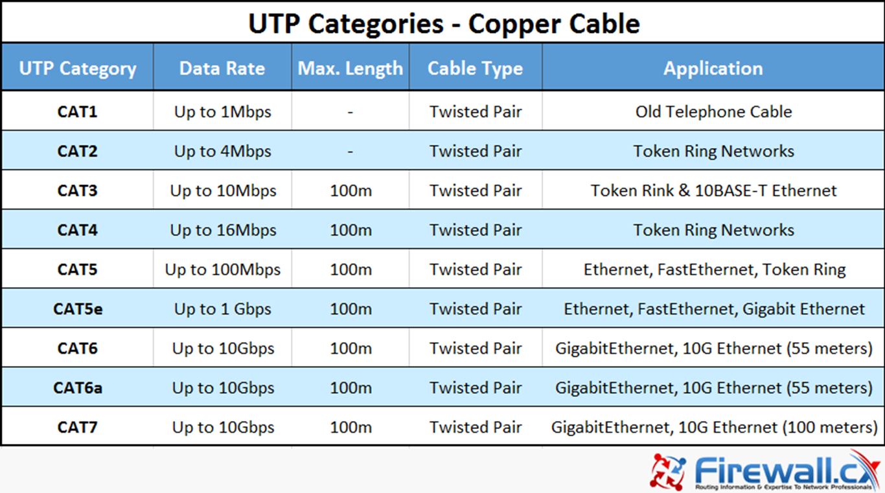

### Straight-through and Crossover UTP Cables

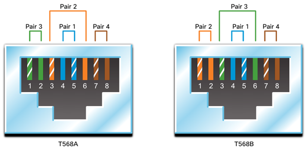

<table>
    <thead>
        <th>Kabel-type</th>
        <th>Standaard</th>
        <th>Applicatie</th>
    </thead>
    <thbody>
        <tr>
            <td>Ethernet Straight-through</td>
            <td>Beide uiteinden T568A of T568B</td>
            <td>Host naar Netwerk Device</td>
        </tr>
        <tr>
            <td>Ethernet Crossover (outdated)</td>
            <td>Een einde T568A en het andere T568B</td>
            <td>Host-to-Host, Switch-to-Switch, Router-to-Router</td>
        </tr>
        <tr>
            <td>Rollover</td>
            <td>Cisco Proprietary</td>
            <td>Host serial port to Router or Switch Console Port, using an adapter</td>
        </tr>
    </thbody>
</table>

## Fiber-Optic Cabling

### Properties of Fiber-Optic Cabling

- Mindervoorkomend als UTP (door kost)
- Ideaal voor specifieke netwerk scenarios
- Verstuurd data over langere afstanden tegen een grotere bandbreedte
- Minder gevoelig voor verzwakking en volledig immuun voor EMI/RFI
- Gemaakt uit flexibel, extreem dune vezels van zeer zuiver glas
- Maakt gebruik van een laser of LED om bits te coderen als lichtpulsen
- De glasvezel kabel fungeert als een golfgeleider die licht verstuurd tussen beide uiteinden. (minimale signaal verlies)

### Types of Fiber media

<table>
<thead>
<th>Single-Mode Fiber</th>
<th>Multimode Fiber</th>
</thead>
<tbody>

<tr>
<td>
 

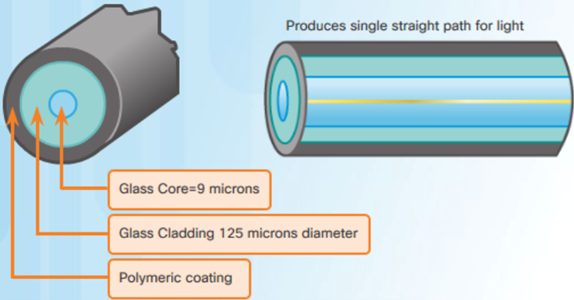

</td>
<td>
 

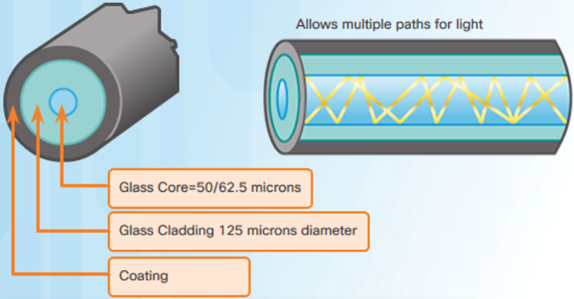

</td
></tr>

<tr>
<td>

- Zeer kleine kern
- Gebruikt dure lasers
- Lange afstand applicaties

</td>
<td>

- Grotere kern
- Gebruikt goedkopere LED's
- LED's versturen via verschillende hoeken
- Tot 10  Gbps over 550m

</td>
</tr>
</tbody>
</table>

### Fiber-Optic Cable Usage

Glasvezel kabels worden voornamelijk in deze vier industrieën gebruikt:
- **Enterprise Networks**: Gebruikt voor backbone bekabelingstoepassingen en het onderling verbinden van infrastructuurapparaten
- **Fiber-to-the-Home (FTTH)**: Gebruikt voor het voorzien van "altijd-aan" breedband diensten voor thuis en kleine bedrijven
- **Long-Haul Networks (lange afstand)**: Gebruikt door service providers om landen en steden te verbinden
- **Submarine Cable Networks**: Gebruikt om een betrouwbare, hoge snelheid, hoge capaciteit netwerk oplossing te voorzien, die tevens bestend zijn tegen de moeilijkheden onder water en over transoceanische afstanden.

### Fiber-Optic Connectors

<table>
<tr>
<td>
 

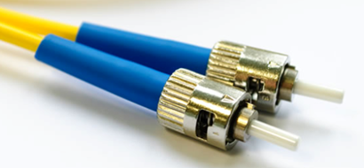

</td>
<td>

 

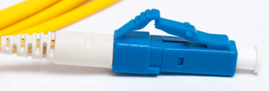

</td>
</tr>
<tr>
<td>Straight-Tip (ST) aansluiting</td>
<td>Lucent Connector (LC) Simplex aansluitingen</td>
</tr>
<tr>
<td>

 

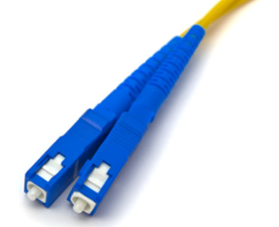

</td>
<td>

 

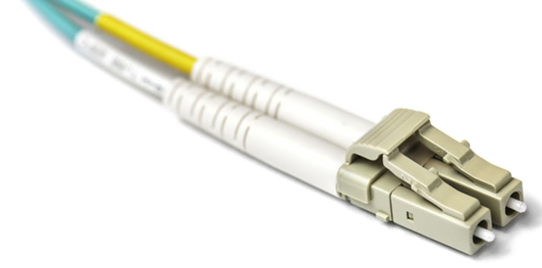

</td>
</tr>
<tr>
<td>Subscriber Connector (SC) aansluitingen</td>
<td>Duplex Multimode LC aansluitingen</td>
</tr>
</table>

### Fiber Patch Cords

<table>
<tr>
<td>

 

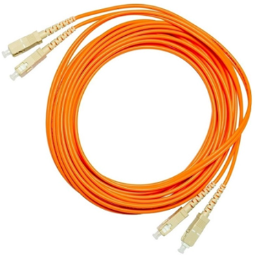

</td>
<td>

 

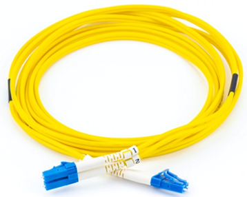

</td>
<td>

 

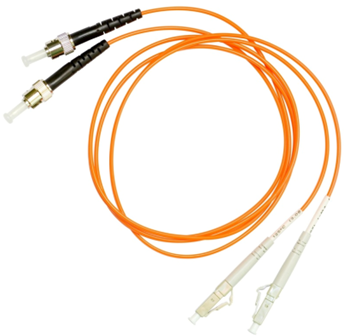

</td>
<td>

 

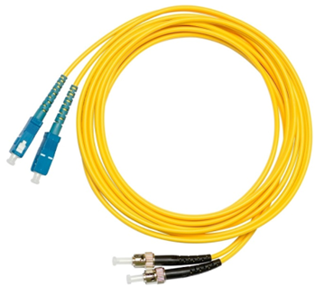

</td>

</tr>
<tr>
<td>SC-SC MM Patch Cord</td>
<td>LC-LC SM Patch Cord</td>
<td>ST-LC MM Patch Cord</td>
<td>ST-SC SM Patch Cord</td>
</tr>
</table>

Een geel omhulsel is voor single-mode vezelkabels en oranje (of aqua) voor multimode vezelkabels.

### Fiber versus Copper

Optische glasvezel wordt hoofdzakelijk gebruikt als de backbone voor hoog verkeer, point-to-point verbindingen tussen datadistributiefaciliteiten en voor de onderlinge verbinding van gebouwen in campussen met meerdere gebouwen.

<table>
    <thead>
        <th>Implementation issues</th>
        <th>UTP Cabling</th>
        <th>Fiber-Optic Cabling</th>
    </thead>
    <tbody>
        <tr>
            <td>Bandwidth supported</td>
            <td>10Mb/s - 10Gb/s</td>
            <td>10Mb/s - 100Gb/s</td>
        </tr>
        <tr>
            <td>Distance</td>
            <td>Relatively short (1 - 100m)</td>
            <td>Relatively long (1 - 100 000m)</td>
        </tr>
        <tr>
            <td>Immunity to EMI and RFI</td>
            <td>Low</td>
            <td>High (completely immune)</td>
        </tr>
        <tr>
            <td>Immunity to electrical hazards</td>
            <td>Low</td>
            <td>High (completely immune)</td>
        </tr>
        <tr>
            <td>Media and connector costs</td>
            <td>Lowest</td>
            <td>Highest</td>
        </tr>
        <tr>
            <td>Installation skills required</td>
            <td>Lowest</td>
            <td>Highest</td>
        </tr>
        <tr>
            <td>Safety precautions</td>
            <td>Lowest</td>
            <td>Highest</td>
        </tr>
    </tbody>
</table>

## Wireless Media

### Properties of Wireless Media

Het transporteert elektromagnetische signalen die binaire cijfers voorstellen met behulp van radio- of microgolffrequenties. Dit biedt de grootste mobiliteitsoptie. Het aantal draadloze verbindingen blijft stijgen.

*Beperkingen*:
- **Dekkingsgebied**: Effectieve dekking kan aanzienlijk worden beïnvloed door de fysieke kenmerken van de uitrollocatie.
- **Storing**: Draadloos is gevoelig voor interferentie en kan worden verstoord door veel gangbare apparaten.
- **Security**: Draadloze communicatie vereist geen toegang tot een fysieke onderdeel van het medium, dus iedereen kan toegang krijgen tot de transmissie.
- **Gedeeld medium**: WLAN's werken in half-duplex, wat betekent dat slechts één apparaat tegelijk kan zenden of ontvangen. Veel gebruikers die tegelijkertijd toegang hebben tot het WLAN resulteren in een verminderde bandbreedte voor elke gebruiker.

### Types of Wireless Media

De standaarden van IEEE en de telecommunicatie-industrie voor draadloze datacommunicatie hebben betrekking op zowel de datalink- als de fysieke laag. 

- Coderingsmethoden voor gegevens naar radiosignaal
- Frequentie en vermogen van transmissie
- Vereisten voor signaalontvangst en decodering
- Antenneontwerp en -bouw

Draadloze standaarden;
- **Wi-Fi (IEEE 802.11)** - Wireless LAN (WLAN) technologie
- **Bluetooth (IEEE 802.15)**: Wireless Personal Area Network (WPAN) standaard
- **WiMAX (IEEE 802.16)**: Gebruikt een point-to-multipoint topologie om draadloze breedbandtoegang te voorzien
- **Zigbee (IEEE 802.15.4)**: Communicatie met lage datasnelheid en laag energieverbruik, voornamelijk voor Internet of Things (IoT)-toepassingen

### Wireless LAN

Over het algemeen heeft een Wireless LAN (WLAN) de volgende apparaten nodig:
- **Wireless Access Point (AP)** - Concentreert draadloze signalen van gebruikers en maakt verbinding met de bestaande koperen netwerkinfrastructuur.
- **Draadloze NIC-adapters** - bieden draadloze communicatiemogelijkheden aan netwerkhosts.

Er zijn een aantal WLAN-standaarden. Let bij de aanschaf van WLAN-apparatuur op compatibiliteit en interoperabiliteit.

Netwerkbeheerders moeten een streng beveiligingsbeleid en strenge beveiligingsprocessen ontwikkelen en toepassen om WLAN's te beschermen tegen ongeautoriseerde toegang en schade.