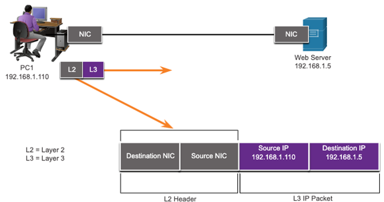
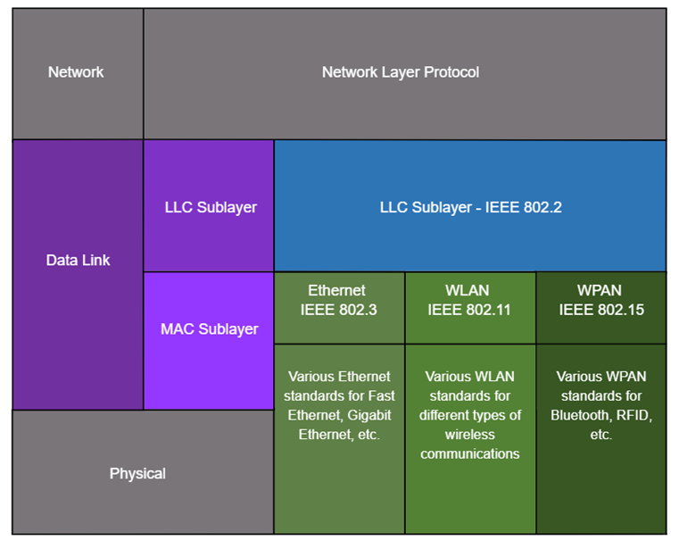
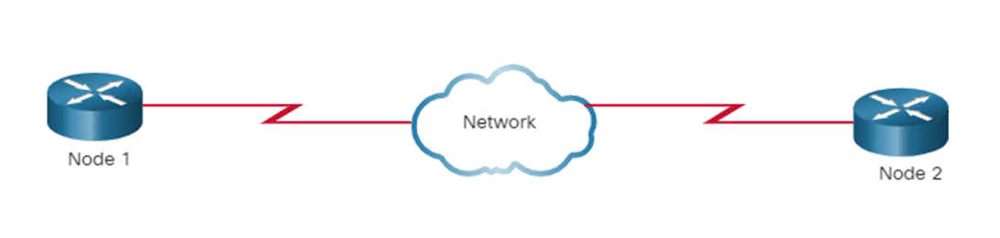
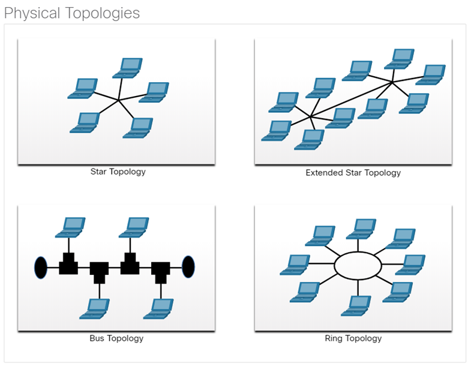
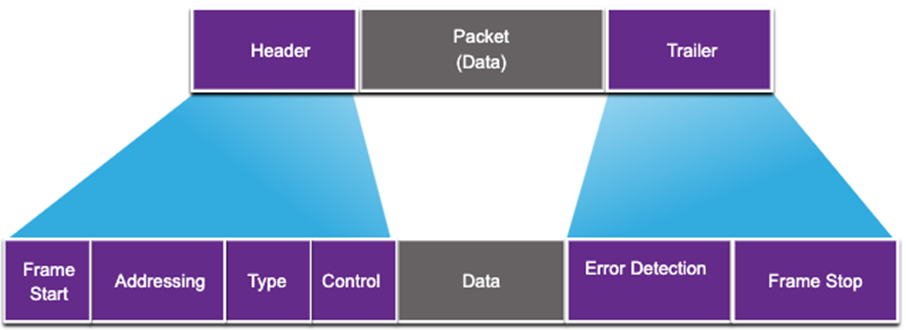

# Computer Networks - Hoofdstuk 6 - Data Link Layer

## Purpose of the Data Link Layer

- De Data Link Laag is verantwoordelijk voor de communicatie tussen end-devices en netwerk interface cards.
- Het staat hogere laag protocollen toe om het medium van de fysieke data laag te raadplegen en kapselt Laag 3 pakketten (IPv4 en IPv6) in naar Laag 2 frames.
- Verder voert het ook error detection uit en reject het corrupte frames.

### IEEE 802 LAN/MAN Data Link Sublayers

IEEE 802 LAN/MAN normen zijn specifiek voor het type netwerk. (Ethernet, WLAN, WPAN,...)

De Data Link Laag bestaat uit 2 sublagen:

- **Logical Link Control (LLC)**: communiceert tussen de netwerk software op de bovenste lagen en de hardware op de lagere lagen.
- **Media Access Control (MAC)**: verantwoordelijk voor de data inkapseling en de toegangscontrole to de media

### Providing Access to Media

Pakketten die worden uitgewisseld tussen nodes kunnen verschillende datalinklagen en mediaovergangen meemaken.

Op elke hop langs het pad voert de router de volgende vier standaard Laag 2 functies uit:
- Aanvaard een frame van een netwerk medium
- De-encapsuleert het frame om het ingekapselde pakket bloot te leggen.
- Hercapsuleert het pakket in een nieuw frame.
- Stuurt het nieuw frame door op het medium van het nieuwe netwerk segment.

### Data Link Layer Standards

De protocollen van de Data Link Laag zijn opgesteld door volgende organisaties:
- Institute for Electrical and Electronic Engineers (IEEE)
- International Telecommunications Union (ITU)
- International Organizations for Standardization (ISO)
- American National Standards Insitute (ANSI)

## Topologies

### Physical and Logical Topologies

>**De topologie van een netwerk** is de rangschikking en relatie van de netwerkapparaten en de onderlinge verbindingen.

Er zijn twee verschillende topologiëen due we gebruiken om netwerken te beschrijven:
- **Physical topology**: toont de fysieke connecties en hoe de toestellen onderling verbonden zijn
- **Logical topology**: identificeert de virtuele connecties tussen de toestellen die device interfaces en IP addressing schema's gebruiken.

### WAN Topologies

Er zijn drie verschillende WAN topologiëen:
- **Point-to-point**: de eenvoudigste en meest gebruikte WAN topologie. Bestaat uit een permanente link tussen twee endpoints.
- **Hub and spoke**: gelijkaardig aan de stertopologie waar een centrale site takken onderling verbindt door point-to-piont links
- **Mesh**: biedt een hoge beschikbaarheid, maar vereist dat elk end system verbonden is met elk ander end system.

### Point-to-Point WAN Topology

- Fysieke point-to-point topologiëen die rechtstreeks twee nodes verbind.
- De nodes mogen niet de media delen met andere hosts
- Omdat alle frames op het medium enkel kunnen verplaatsen naar of van een van nodes. (point-to-point WAN protocollen kunnen heel eenvoudig zijn.)

### LAN Topologies

End devices op LAN's zijn typisch verbonden via een ster-of uitgebreide stertopologie. Deze zijn zeer eenvoudig te installeren, zee uitbreidbaar en gemakkelijk te troubleshooten.

Vroegere Ethernet en Legacy Token Ring technologies voorzagen nog de volgende topologiëen:
- **Bus**: Alle end devices aan elkaar geketend en op het einde beëindigd.
- **Ring**: Elk end device is verbonden met zijn "buur" in een vorm van ring.

### Half and Full Duplex Communication

#### Half-duplex communication

- Staat enkel één end device toe om te ontvangen of verzenden op een gedeeld medium
- Gebruikt op WLAN's and legacy bus topologiëen met Ethernet hubs

#### Full-duplex communication

- Hiermee kunnen beide toestellen simultaan transmitten en ontvangen op een gedeeld medium.
- Ethernet switches opereren in full-duplex modus

### Access Control Methods

#### Contention-based access

Alle nodes werken in half-duplex, ze strijden voor het gebruik van het medium.

Voorbeelden:
- *Carrier sense multiple access with collision detection (CSMA/CD)* as used on legacy bus-topology Ethernet.
    - Gebruikt door legacy Ethernet LAN's
    - Werken in half-duplex mode waar enkel één toestel verzend of ontvangt
    - Gebruikt een **collision detection process** om te reguleren wanneer een toestel kan verzenden, en wat er gebeurd wanneer verschillende toestellen tegelijkertijd willen verzenden
        - Toestellen die simultaan verzenden zal resulteren in een signal collision op het gedeelde medium
        - Toestellen kunnen de collision detecteren
        - Toestellen wachten een willekeurige periode waarna ze de data opnieuw kunnen versturen
- *Carrier sense multiple access with collision avoidance (CSMA/CA*) as used on Wireless LANs.
    - Gebruikt door IEEE 802.11 WLAN's
    - Werken in half-duplex mode waar enkel één toestel verzend of ontvangt
    - Gebruikt een **collision avoidance process** om te reguleren wanneer een toestel kan verzenden, en wat er gebeurd wanneer verschillende toestellen tegelijkertijd willen verzenden
        - Toestellen geven bij het verzenden ook de duurtijd van de transmissie mee
        - Andere toestellen krijgen die duurtijd en weten hoelang het medium onbeschikbaar is.

#### Controlled access

- Deterministische toegang waarbij elke node zijn eigen tijd op het medium heeft.
- Wordt gebruikt op legacy netwerken, zoals Token Ring en ARCNET

## Data Link Frame

### The Frame

De gegevens zijn ingekapseld door de data link laag met een header en een trailer en vormen samen een frame.

Een **data link frame** heeft drie onderdelen: 
- Header
- Data
- Trailer

De velden van de header en de trailer verschillen naargelang het data link laag protocol.

### Frame Fields

<table align="center">
    <thead>
        <th>Field</th>
        <th>Description</th>
    </thead>
    <tbody>
        <tr>
            <td>Frame Start and Stop</td>
            <td>Identifies beginning and end of frame</td>
        </tr>
        <tr>
            <td>Addressing</td>
            <td>Indicates source and destination nodes</td>
        </tr>
        <tr>
            <td>Type</td>
            <td>Identifies encapsulated Layer 3 protocol</td>
        </tr>
        <tr>
            <td>Control</td>
            <td>Identifies flow control services</td>
        </tr>
        <tr>
            <td>Data</td>
            <td>Contains the frame payload</td>
        </tr>
        <tr>
            <td>Error Detection</td>
            <td>Used to determine transmission errors</td>
        </tr>
    </tbody>
</table>

### Layer 2 Addresses

- Ookwel physical address (fysiek adres)
- Vervat in de header
- Enkel gebruikt voor de locale levering van een frame op de link
- Geupdate door elk toestel dat het frame doorstuurd

### LAN and WAN Frames

De Logische topologie en de fysieke media bepalen het data link protocol dat gebruikt wordt:
- Ethernet
- 802.11 Wireless
- Point-to-Point (PPP)
- High-Level Data Link Control (HDLC)
- Frame-Relay