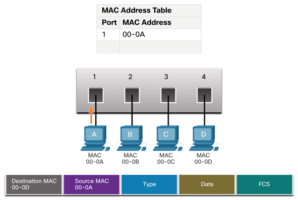
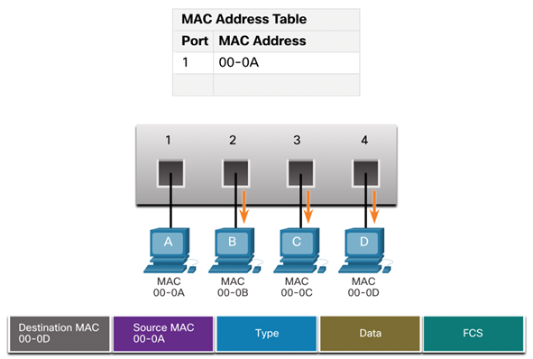
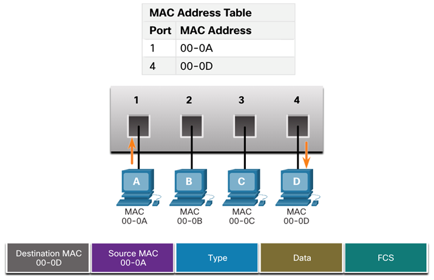
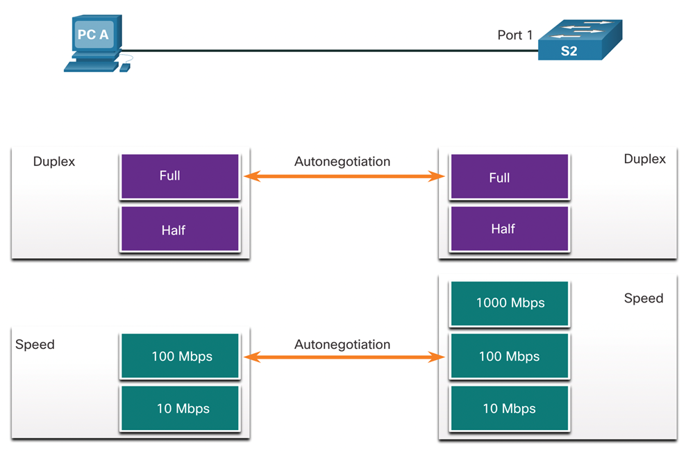
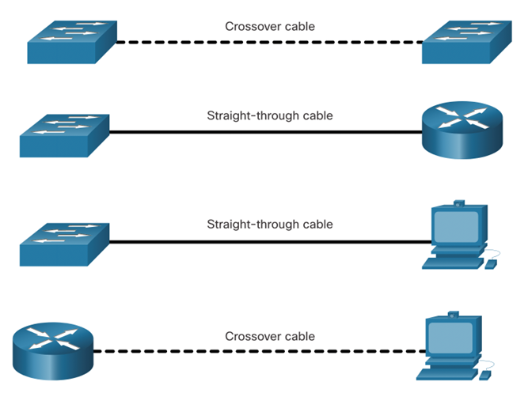

# Computer Networks - Hoofdstuk 7 - Ethernet Switching

## Ethernet Frames

### Ethernet Encapsulation

- Ethernet werkt binnen de data link laag en de fysieke laag.
- Het is een familie van technologiëen bepaald in de IEEE 802.2 en 802.3 standaarden

### Data Link Sublayers

De 802 LAN/MAN standaarden, onder andere Ethernet, gebruiken twee verschillen sublagen van de data link laag om te kunnen werken:
- **LLC Sublaag**: (IEEE 802.2) Plaatst informatie in het frame om te kunnen identificeren welk netwerkprotocol gebruikt is voor het frame
- **MAC Sublaag**: (IEEE 803.2, 802.11 of 802.15) Verantwoordelijk voor de gegevensinkapseling en media access control. Het voorziet ook de data link laag addressering. 

### MAC Sublayer

#### Gegevensinkapseling

IEEE 802.3 gegevensinkapseling bevat:
- **Ethernet frame**: De interne structuur van het Ethernet frame
- **Ethernet Addressing**: Het Ethernet frame bevat zowel het MAC adres van de bron als van de bestemming om het frame van de ene Ethernet NIC naar de andere Ethernet NIC op hetzelfde LAN te leveren.
- **Ethernet Error detection**: Het Ethernet frame bevat een *frame check sequence (FCS)* trailer die gebruikt wordt voor foutdetectie.

#### Media Access

- De IEEE 802.3 MAC sublaag bevat de specificaties voor verschillende Ethernet communicatie standaarden over verschillende type media, zoals koper en fiber.
- Legacy Ethernet gebruikt een bus topologie of hubs, het is een gedeeld, half-duplex medium. Ethernet over a **half-duplex medium** gebruikt een contention-based access method, *carrier sense multiple access/collision detection (CSMA/CD)*
- Ethernet LAN's vandaag gebruiken switches die in full-duplex mode werken. *Full-duplex communicaties met Ethernet switches hebben geen access control dmv. CSMA/CD nodig*

### Ethernet Frame Fields

- De **minimum** grootte van een Ethernet Frame is *64 bytes* en de **maximum** grootte is *1518 bytes*.
- Elk frame kleiner dan 64 bytes wordt aanschouwdt als een **collision fragment** of een **runt frame** en worden automatisch weggegooid. Frames groter dan 1518 bytes worden aanschouwdt als **jumbo** of **baby giant frames**
- *Als de grootte van het frame kleiner is als het minimum of groter als het maximum, dan zal het ontvangende toestel het frame **weggooien***. Weggegooide frames zijn vaak het resultaat van collisions of ongewilde signalen. Ze worden aanzien als **ongeldig**. Jumbo frames worden vaak wel nog ondersteund door de meeste Fast Ethernet en Gigabit Ethernet switches en NIC's.

## Ethernet MAC Address

- Een **Ethernet MAC address** bestaat uit een 48-bit binaire waarde, uitgedrukt in 12 hexadecimale waarden.
- Deze kunnen weergegeven worden op verschillende hexadecimale notaties; 0x73, 73H, 7316

- In een Ethernet LAN zijn alle netwerk toestellen verbonden met hetzelfde gedeelde medium. MAC adressering zorgt ervoor dat de toestellen geïdentificeerd kunnen worden op het niveau van de data link laag van het OSI model.
- Alle MAC adressen zijn uniek voor het Ethernet toestel of de Ethernet interface. Om dit te garanderen moeten alle verkopers die Ethernet toestellen verkopen zich registreren bij de IEEE en krijgen ze een unieke 6 hexadecimale code (24-bit, 3 bytes), nl. **organizationally unique identifier (OUI)**
- Een Ethernet MAC address bestaat uit een 6 hexadecimale vendor OUI gevolgd door een 6 hexadecimale waarde toegewezen door de vendor.

### Frame Processing

- Wanneer een toestel een bericht doorstuurd ofer een Ethernet Netwerk zal de Ethernet header een bron en bestemming MAC adres bevatten.
- Wanneer een NIC het Ethernet frame ontvangt, zal het eerst het bestemmings MAC adres onderzoeken om te kijken of dit overeenkomt met het MAC adres dat is opgeslagen in het RAM-geheugen. Als er geen match is wordt het frame weggegooid. Is er een match dan gaan we verder op de OSI-lagen.

>Ethernet NIC's aanvaarden frames met als bestemmings MAC adres een broadcast of een multicast waarvan de host een lid is.

- Elk toestel dat een bron of een bestemming van een Ethernet frame is, zal een Ethernet NIC hebben, en daarom een MAC adres. (workstations, servers, printers, mobiele toestellen, routers)

>[!important]
>Het bestemmings MAC-adres zal eerst staan in het frame (voor juist de controle)

### Unicast MAC Address

In Ethernet zijn er verschillende MAC adressen die gebruikt worden voor Laag 2 unicast, broadcast en multicast.

- Een **unicast MAC adres** is een uniek adres dat gebruik wordt wanneer een frame verstuurd wordt van een single transmitting device naar een single destination device.
- Het proces dat een bron host gebruikt om te achterhalen welk bestemmings MAC adres bij een IPv4 adres hoort noemen we het **Address Resolution Protocol (ARP)**. Het proces gebruikt om het MAC adres dat bij een IPv6 adres hoort te achterhalen noemen we **Neighbor Discovery (ND)**.

>Het bron MAC adres moet steeds een unicast adres zijn.

### Broadcast MAC address

Een **Ethernet broadcast frame** wordt ontvangen en verwerkt door elk toestel op het Ethernet LAN. 

- Het heeft een bestemmings MAC adres van `FF-FF-FF-FF-FF-FF`
- Het wordt overspoeld vanuit alle Ethernet-switchpoorten behalve de inkomende poort. Het wordt niet doorgestuurd door een router.
- Als de ingekapselde gegevens een IPv4 broadcast pakket is, betekent dit dat het pakket een bestemmings IPv4 adres bevat dat allemaal enen (1s) heeft in het host gedeelte. Deze nummering in het adres betekent dat alle hosts op dat lokale netwerk (broadcast domein) het pakket zullen ontvangen en verwerken.

### Multicast MAC Address

Een **Ethernet multicast frame** wordt ontvangen en verwerkt door een groep van toestellen die behoren tot dezelfde multicast groep.

- Er is een bestemmings-MAC-adres van 01-00-5E wanneer de ingekapselde gegevens een IPv4 multicast-pakket zijn en een bestemmings-MAC-adres van 33-33 wanneer de ingekapselde gegevens een IPv6 multicast-pakket zijn.
- Er zijn andere gereserveerde multicast bestemmings-MAC-adressen voor wanneer de ingekapselde gegevens geen IP zijn, zoals Spanning Tree Protocol (STP).
- Het wordt overspoeld vanuit alle Ethernet-switchpoorten behalve de inkomende poort, tenzij de switch is geconfigureerd voor multicast snooping. Het wordt niet doorgestuurd door een router, tenzij de router is geconfigureerd om multicastpakketten te routeren.
- Omdat multicast adressen een groep adressen vertegenwoordigen (soms een hostgroep genoemd), kunnen ze alleen worden gebruikt als bestemming van een pakket. De bron zal altijd een unicast adres zijn.
- Net als bij de unicast- en broadcastadressen heeft het multicast IP-adres een bijbehorend multicast MAC-adres nodig.

## The MAC Address Table

### Switch Fundamentals

- Een Laag 2 switch maakt gebruik van Laag 2 MAC adressen om forward beslissing te maken. De switch beseft niet welk gegevens protocol er zit in het gegevens gedeelte van het frame. (zoals een IPv4 pakket, IPv6 ND pakket, een ARP bericht)

    :arrow_right: De switch maakt zijn forwarding beslissingen enkel en alleen gebasseerd op de Laag 2 Ethernet MAC adressen.

- Een Ethernet switch bekijkt zijn **MAC adres tabel** om een doorstuur beslissing te nemen. (in tegenstelling to legacy ethernet hubs die de bits naar alle poorten, buiten de inkomende poort stuurden.)

- Wanneer men een switch aanzet is de MAC adres tabel leeg.

>[!note]
> De MAC adres tabel wordt soms ook de *content addressable memory (CAM) * tabel genoemd.

### Switch Learning and Forwarding

#### Learn - Onderzoek het MAC adres van de bron

Elke keer een frame binnenkomt op de switch wordt deze gecontroleerd op informatie waar we uit kunnen leren. Dit gebeurd door het bron MAC adres van het binnenkomende frame en de poort waarop het frame binnenkomt te onderzoeken. 

Indien het bron MAC adres nog niet bestaat wordt dit aan de tabel toegevoegd. (samen met het poortnummer).

Indien het bron MAC adres wel reeds bestaat, update de switch de **refresh timer**. Standaard behouden Ethernet switches een invoer (bv. MAC adres) voor 5 min in de tabel. 

>[!important]
> Indien het bron MAC adres reeds in de tabel staat, maar onder een andere poort, dan zal de switch dit aanschouwen als een nieuwe invoer. De vorige wordt vervangen en geupdate met het nieuwe poortnummer

#### Forward - Vind het MAC adres van de bestemming

Indien het MAC adres van de bestemming een unicast adres is, dan zal de switch zoeken naar een match in MAC adres tabel tussen het bestemmings MAC adres in het frame en een reeds ingevoerd MAC adres in de tabel.

1. Bestemmings MAC adres **kan** gevonden worden in de tabel
    :arrow_right: Het frame wordt doorgestuurd naar de specifieke poort
2. Bestemmings MAC adres **kan niet** gevonden worden in de tabel
    :arrow_right: Het frame wordt doorgestuurd naar alle poorten, buiten de inkomende poort. (= *unkown unicast of flooding*)

>[!important]
> Indien het bestemmings MAC adres een broadcast, of een multicast adres is, zal het frame ook naar alle poorten buiten de inkomende poort "overspoeld" worden.

### Filtering Frames

Een switch ontvangt verschillende frames van verschillende toestellen, de switch is instaat om zijn MAC adres tabel aan te vullen door het onderzoeken van elk bron MAC adres van een frame. Wanneer de MAC adres tabel een bron MAC adres bevat, kan het dit frame er uit filteren en doorsturen naar één enkele poort.

## Switch Speeds and Forwarding Methods

### Frame Forwarding Methods on Cisco Switches

Switches gebruiken een van volgende forwarding methodes voor het schakelen van gegevens tussen de netwerkpoorten:

- **Store-and-forward switching**: Deze methode ontvangt een volledig frame en berekent de CRC (= *Cyclic Redundancy Check*). Indien de CRC geldig is zal de switch het bestemmingsadres opzoeken, wat de uitgaande interface bepaald. Daarna wordt het frame door de correcte poort doorgestuurd.

    *Voordelen*:

    - Bepaalt of er fouten zijn alvorens het frame door te sturen
    - Als een fout gedetecteerd word, gooien we het frame weg
    - Het weggooien van een frame bespaard bandbreedte

- **Cut-through switching**: Bij deze methode reageert de switch van zodra het frame ontvangen is. Hij leest het minimaal aantal gegevens om net het bestemmingsadres te lezen en zo te kunnen bepalen naar welke poort hij het frame doorstuurd. De switch voert geen foutdetectie uit. Er zijn twee soorten:
    - **Fast-forward switching**: 
        - Biedt het laagste niveau van latentie door een frame onmiddellijk door te sturen na het lezen van het bestemmingsadres.
        -  Omdat fast-forward switching begint met doorsturen voordat het hele frame is ontvangen, kan het voorkomen dat frames met fouten worden doorgestuurd.
        - De bestemmings-NIC verwijdert het foutieve pakket bij ontvangst.
        - Fast-forward switching is de typische cut-through methode van switching.
    - **Fragment-free switching**:
        -  Een compromis tussen de hoge latency en hoge integriteit van store-and-forward switching en de lage latency en gereduceerde integriteit van fast-forward switching
        - De switch slaat de eerste 64 bytes op en voert daarop een fout-controle uit alvorens het door te sturen.
        - Meeste netwerkfouten en collisions bevinden zich in de eerste 64 bytes, dit garandeerd dat er geen collision heeft plaatsgevonden voor dat het frame wordt doorgestuurd.

>[!note]
>Store-and-forward switching is nodig voor Quality of Service (QoS) analyse op geconvergeerde netwerken waar frame classificatie voor verkeersprioritering nodig is. Voice over IP (VoIP) datastromen moeten bijvoorbeeld voorrang krijgen op web-browsing verkeer.

### Memory buffering on Switches

Een Ethernet switch kan verschillende buffering technieken gebruiken om een frame op te slaan voor het door te sturen, of wanneer de bestemmingspoort bezig is door opstropping.

<table>
<thead>
<th>Methode</th>
<th>Beschrijving</th>
</thead>
<tbody>
<tr>
<td>Port-based Memory</td>
<td>

- Frames worden opgeslagen in queues gelinkt aan specifiek inkomende en uitgaande poorten
- Een frame wordt enkel doorgestuurd naar een uitgaande poort wanneer de voorgaande frames in de queue succesvol doorgestuurd zijn.
- Het kan gebeuren dat één enkel frame de volledige queue tegenhoud door een bestemmingspoort die bezig is
- Deze vertraging gebeurd ookal kunnen de frames doorgestuurd naar openstaande bestemmingspoorten

</td>
</tr>
<tr>
<td>Shared memory</td>
<td>

- Alle frames worden in een memory buffer gedeponeert die gedeeld wordt door alle switchpoorten. Het aantal geheugen nodig voor een poort wordt dynamisch toegewezen.
- De frames in de buffer worden dynamisch gelinkt aan een bestemmingspoort en staan dus toe een pakket te ontvangen van de ene poort en door te sturen naar een andere poort, dit zonder het door te sturen naar een andere queue.

>**Voordeel**: staat toe grotere frames door te sturen met minder dropped frames. Dit is belangrijk bij asymmetrisch schakelen dat verschillende gegevenssnelheden op verschillende poorten toelaat. Daarom kan er meer bandbreedte toegewezen worden aan bepaalde poorten (bv. serverpoort).

</td>
</tr>
</tbody>
</table>

### Duplex and Speed Settings

Basis instellingen voor elke poort op een switch: **bandbreedte (snelheid)** en **duplex**

>[!important]
>Het is belangrijk dat de bandbreedte en de duplex instellingen matchen tussen de switch poort en de verbonden toestellen

Er zijn twee verschillende duplex instellingen die gebruikt kunnen worden voor communicatie op een Ethernet netwerk:
- **Full-duplex**: beide einden van de verbinding kunnen tegelijk versturen en ontvangen
- **Half-duplex**: één enkel uiteinde kan tegelijk versturen of ontvangen

**Autonegotiation** is een optionele functie die op de meeste Ethernet-switches en NIC's te vinden is. Hiermee kunnen twee apparaten automatisch onderhandelen over de beste snelheid en duplexmogelijkheden.

>[!important]
> Gigabit Ethernet poorten werken enkel in full-duplex

- **Duplex mismatch** is één van de meest voorkomende oorzaken van prestatieproblemen op 10/100 Mbps Ethernetverbindingen. Het treedt op wanneer één poort op de link op half-duplex werkt terwijl de andere poort op full-duplex werkt.
- Kan voorkomen wanneer een van beide poorten op een link gereset worden, en het autonegotiation proces niet resulteert in dezelfde configuratie voor beide link partners.
- Het kan ook voorkomen wanneer men vergeet een van beide kanten te configureren. 

>[!note]
> Beide kanten in een link zouden autonegotiation ingeschakeld of beide uitgeschakeld hebben

>[!note]
> **Best practise**: Ethernet switch poorten configureren als full duplex

### Auto-MDIX

Voor verbindingen tussen apparaten was vroeger een crossover- of straight-through-kabel nodig. Welk type kabel nodig was, hing af van het type apparaten dat met elkaar verbonden was.

>[!important]
> Een directe verbinding tussen een router en een host heeft nog steeds een cross-over verbinding nodig

De meeste switches ondersteunen nu de **automatic medium-dependent interface crossover (auto-MDIX)**. Wanneer deze ingeschakeld is detecteert de switch automatisch welke kabel aangesloten is en configureert hij de interfaces zoals verwacht.

:arrow_right: auto-MDIX staat aan by default maar kan uitgeschakeld worden (kan opnieuw ingeschakeld worden door `mdix auto` commando)

>[!note]
> **Best practise**: Gebruik steeds het correcte kabeltype en vertrouw niet op auto-mdix

