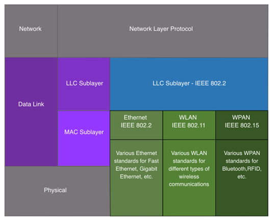
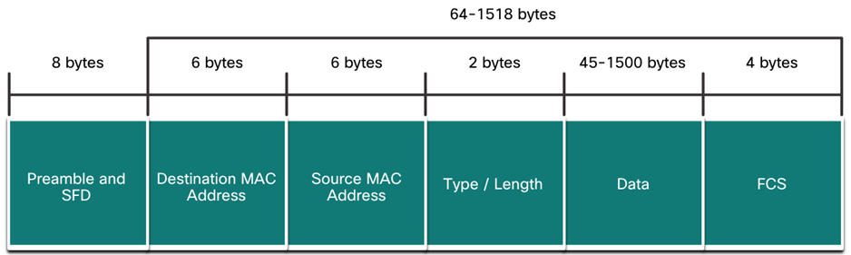
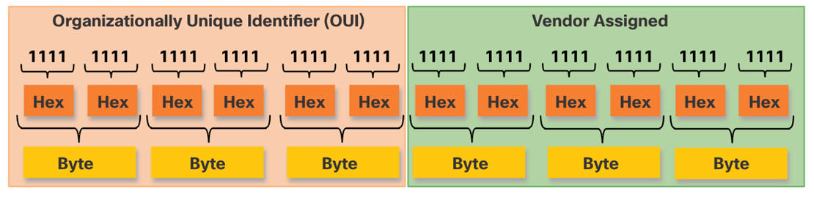
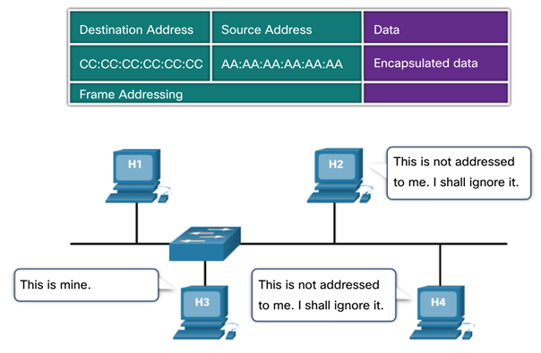
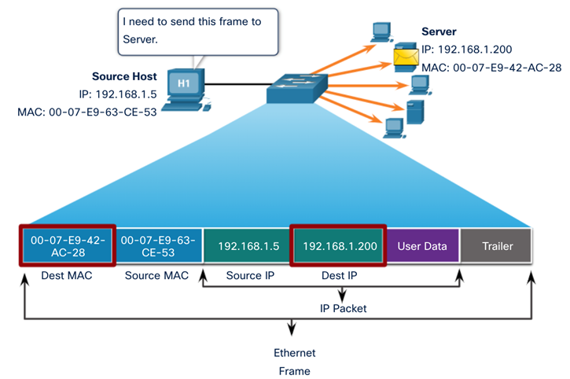
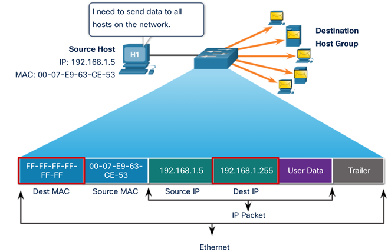
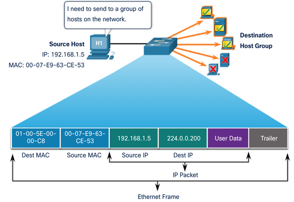

# Computer Networks - Hoofdstuk 7 - Ethernet Switching

## Ethernet Frames

### Ethernet Encapsulation

- Ethernet werkt binnen de data link laag en de fysieke laag.
- Het is een familie van technologiëen bepaald in de IEEE 802.2 en 802.3 standaarden

### Data Link Sublayers

De 802 LAN/MAN standaarden, onder andere Ethernet, gebruiken twee verschillen sublagen van de data link laag om te kunnen werken:
- **LLC Sublaag**: (IEEE 802.2) Plaatst informatie in het frame om te kunnen identificeren welk netwerkprotocol gebruikt is voor het frame
- **MAC Sublaag**: (IEEE 803.2, 802.11 of 802.15) Verantwoordelijk voor de gegevensinkapseling en media access control. Het voorziet ook de data link laag addressering. 

### MAC Sublayer

#### Gegevensinkapseling

IEEE 802.3 gegevensinkapseling bevat:
- **Ethernet frame**: De interne structuur van het Ethernet frame
- **Ethernet Addressing**: Het Ethernet frame bevat zowel het MAC adres van de bron als van de bestemming om het frame van de ene Ethernet NIC naar de andere Ethernet NIC op hetzelfde LAN te leveren.
- **Ethernet Error detection**: Het Ethernet frame bevat een *frame check sequence (FCS)* trailer die gebruikt wordt voor foutdetectie.

#### Media Access

- De IEEE 802.3 MAC sublaag bevat de specificaties voor verschillende Ethernet communicatie standaarden over verschillende type media, zoals koper en fiber.
- Legacy Ethernet gebruikt een bus topologie of hubs, het is een gedeeld, half-duplex medium. Ethernet over a **half-duplex medium** gebruikt een contention-based access method, *carrier sense multiple access/collision detection (CSMA/CD)*
- Ethernet LAN's vandaag gebruiken switches die in full-duplex mode werken. *Full-duplex communicaties met Ethernet switches hebben geen access control dmv. CSMA/CD nodig*

### Ethernet Frame Fields

- De **minimum** grootte van een Ethernet Frame is *64 bytes* en de **maximum** grootte is *1518 bytes*.
- Elk frame kleiner dan 64 bytes wordt aanschouwdt als een **collision fragment** of een **runt frame** en worden automatisch weggegooid. Frames groter dan 1518 bytes worden aanschouwdt als **jumbo** of **baby giant frames**
- *Als de grootte van het frame kleiner is als het minimum of groter als het maximum, dan zal het ontvangende toestel het frame **weggooien***. Weggegooide frames zijn vaak het resultaat van collisions of ongewilde signalen. Ze worden aanzien als **ongeldig**. Jumbo frames worden vaak wel nog ondersteund door de meeste Fast Ethernet en Gigabit Ethernet switches en NIC's.

## Ethernet MAC Address

- Een **Ethernet MAC address** bestaat uit een 48-bit binaire waarde, uitgedrukt in 12 hexadecimale waarden.
- Deze kunnen weergegeven worden op verschillende hexadecimale notaties; 0x73, 73H, 7316

- In een Ethernet LAN zijn alle netwerk toestellen verbonden met hetzelfde gedeelde medium. MAC adressering zorgt ervoor dat de toestellen geïdentificeerd kunnen worden op het niveau van de data link laag van het OSI model.
- Alle MAC adressen zijn uniek voor het Ethernet toestel of de Ethernet interface. Om dit te garanderen moeten alle verkopers die Ethernet toestellen verkopen zich registreren bij de IEEE en krijgen ze een unieke 6 hexadecimale code (24-bit, 3 bytes), nl. **organizationally unique identifier (OUI)**
- Een Ethernet MAC address bestaat uit een 6 hexadecimale vendor OUI gevolgd door een 6 hexadecimale waarde toegewezen door de vendor.

### Frame Processing

- Wanneer een toestel een bericht doorstuurd ofer een Ethernet Netwerk zal de Ethernet header een bron en bestemming MAC adres bevatten.
- Wanneer een NIC het Ethernet frame ontvangt, zal het eerst het bestemmings MAC adres onderzoeken om te kijken of dit overeenkomt met het MAC adres dat is opgeslagen in het RAM-geheugen. Als er geen match is wordt het frame weggegooid. Is er een match dan gaan we verder op de OSI-lagen.

>Ethernet NIC's aanvaarden frames met als bestemmings MAC adres een broadcast of een multicast waarvan de host een lid is.

- Elk toestel dat een bron of een bestemming van een Ethernet frame is, zal een Ethernet NIC hebben, en daarom een MAC adres. (workstations, servers, printers, mobiele toestellen, routers)

>[!important]
>Het bestemmings MAC-adres zal eerst staan in het frame (voor juist de controle)

### Unicast MAC Address

In Ethernet zijn er verschillende MAC adressen die gebruikt worden voor Laag 2 unicast, broadcast en multicast.

- Een **unicast MAC adres** is een uniek adres dat gebruik wordt wanneer een frame verstuurd wordt van een single transmitting device naar een single destination device.
- Het proces dat een bron host gebruikt om te achterhalen welk bestemmings MAC adres bij een IPv4 adres hoort noemen we het **Address Resolution Protocol (ARP)**. Het proces gebruikt om het MAC adres dat bij een IPv6 adres hoort te achterhalen noemen we **Neighbor Discovery (ND)**.

>Het bron MAC adres moet steeds een unicast adres zijn.

### Broadcast MAC address

Een **Ethernet broadcast frame** wordt ontvangen en verwerkt door elk toestel op het Ethernet LAN. 

- Het heeft een bestemmings MAC adres van `FF-FF-FF-FF-FF-FF`
- Het wordt overspoeld vanuit alle Ethernet-switchpoorten behalve de inkomende poort. Het wordt niet doorgestuurd door een router.
- Als de ingekapselde gegevens een IPv4 broadcast pakket is, betekent dit dat het pakket een bestemmings IPv4 adres bevat dat allemaal enen (1s) heeft in het host gedeelte. Deze nummering in het adres betekent dat alle hosts op dat lokale netwerk (broadcast domein) het pakket zullen ontvangen en verwerken.

### Multicast MAC Address

Een **Ethernet multicast frame** wordt ontvangen en verwerkt door een groep van toestellen die behoren tot dezelfde multicast groep.

- Er is een bestemmings-MAC-adres van 01-00-5E wanneer de ingekapselde gegevens een IPv4 multicast-pakket zijn en een bestemmings-MAC-adres van 33-33 wanneer de ingekapselde gegevens een IPv6 multicast-pakket zijn.
- Er zijn andere gereserveerde multicast bestemmings-MAC-adressen voor wanneer de ingekapselde gegevens geen IP zijn, zoals Spanning Tree Protocol (STP).
- Het wordt overspoeld vanuit alle Ethernet-switchpoorten behalve de inkomende poort, tenzij de switch is geconfigureerd voor multicast snooping. Het wordt niet doorgestuurd door een router, tenzij de router is geconfigureerd om multicastpakketten te routeren.
- Omdat multicast adressen een groep adressen vertegenwoordigen (soms een hostgroep genoemd), kunnen ze alleen worden gebruikt als bestemming van een pakket. De bron zal altijd een unicast adres zijn.
- Net als bij de unicast- en broadcastadressen heeft het multicast IP-adres een bijbehorend multicast MAC-adres nodig.

## The MAC Address Table