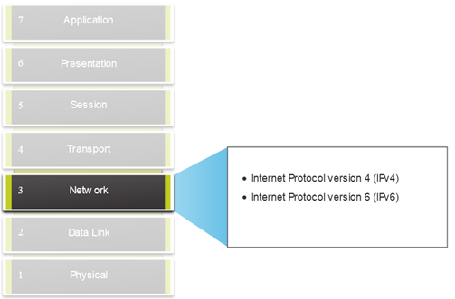
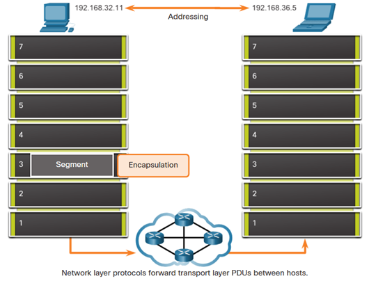
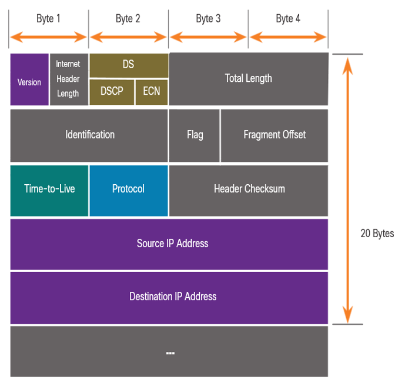

# Computer Networks - Hoofdstuk 8 - Network Layer

## Network Layer Characteristics

- Voorziet diensten om end devices instaat te stellen gegevens te verwisselen
- IP version 4 (IPv4) en IP version 6 (IPv6) zijn der voornamelijkste netwerklaag communicatieprotocollen
- De netwerklaag voert 4 basis operaties uit:
    - Adressering van end devices
    - Inkapseling
    - Routing
    - Ontkapseling

<table>
<td>
 

</td>
<td>
 

</td>
</table>

### IP Encapsulation

- IP inkapselt het transportlaag segment
- IP kan zowel een IPv4 en een IPv6 pakket gebruiken zonder het segment van Laag 4 te beïnvloeden.
- Het IP pakket zal onderzocht worden door alle toestellen op Laag 3 als het door het netwerk vloeit.
- De IP adressering veranderd niet van bron naar bestemming

>[!note]
> NAT zal de adressering veranderen

### Characteristics of IP

IP is bedoelt om weinig overhead te hebben en kunnen we beschrijven als:

- **Verbindingloos**:
    - IP maakt geen verbinding met de bestemming voor het pakket te versturen
    - Er is geen controle informatie nodig (synchronisatie, bevestiging,...)
    - De bestemming zal het pakket ontvangen wanneer het aankomt, maar er worden geen vooraankondigingen verzonden door IP
    - Als er behoefte is aan een verbindingsgericht verkeer, dan zal een ander protocol dit behandelen (vaak TCP op het niveau van de transportlaag)
- **Best effort**:
    - IP kan het leveren van het pakket niet garanderen
    - IP heeft een lage overhead, aangezien er geen mechanisme is om data opnieuw te versturen die niet is toegekomen
    - IP verwacht geen bevestiging
    - IP weet niet of het andere toestel operationeel is en indien het pakket ontvangen is
- **Media onafhankelijk**:
    - *IP is onbetrouwbaar*:
        - Het kan niet corrupte of niet-geleverde pakketen beheren of repareren
        - IP kan niet opnieuw uitzenden na een fout
        - IP kan pakketten buiten volgorde niet opnieuw uitlijnen
        - IP moet beroep doen op andere protocollen voor deze functies
    - *IP is media onafhankelijk*:
        - IP houdt geen rekening met het type frame dat nodig is op de data link laag of het type medium dat nodig is op de fysieke laag
        - IP can verstuurd worden over elk media: koper, fiber, of draadloos
    - De netwerklaag brengt het **Maximum Transmission Unit (MTU)** tot stand
        - De netwerklaag ontvangt dit van controle informatie die verstuurd word door de data link laag.
        - Het netwerk stelt hierop de MTU groote vast.
    - **Fragmentation** gebeurd wanneer Laag 3 het IPv4 pakket in kleiner onderdelen splitst.
        - Veroorzaakt latentie
        - IPv6 fragmenteerd geen pakketen

## IPv4 Packet

### IPv4 Packet Header

IPv4 is het primaire communicatieprotocol voor de netwerklaag.

De netwerkheader heeft verschillende doelen:
- Hij zorgt ervoor dat het pakket verstuurd word in de juiste richting (naar de bestemming)
- Hij bevat informatie voor de verwerking op de netwerklaag in verschillende velden
- De informatie in de header wordt gebruikt door alle toestellen op Laag 3 die het pakket behandelen

#### IPv4 Packet Header Fields

IPv4 netwerk header kenmerken:
- het is binair
- Bevat verschillende velden met informatie
- Het diagram wordt van links naar rechts gelezen steeds met 4 bytes per lijn
- De twee belangrijkste velden zijn de bron en bestemming

De protocollen kunnen verschillende functies hebben.

Belangrijkste velden in de IPv4 header:

<table>
    <thead>
        <th>Functie</th>
        <th>Beschrijving</th>
    </thead>
    <tbody>
        <tr>
            <td>Version</td>
            <td>Zal v4 zijn ipv v6, een 4 bit veld = 0100</td>
        </tr>
        <tr>
            <td>Differentiated Services</td>
            <td>Used for QoS: DiffServ - DS field or the older IntServ - ToS or Type of Service</td>
        </tr>
        <tr>
            <td>Header Checksum</td>
            <td>Detect corruption in the IPv4 header</td>
        </tr>
        <tr>
            <td>Identification, Flag, Fragment Offset</td>
            <td>Gebruikt om pakketten te fragmenteren. Flag = 1 als het pakket gefragmenteerd is. Identification, identificeert het gefragmenteerde pakket en fragment the offset nummers</td>
        </tr>
        <tr>
            <td>Time to Liv (TTL)</td>
            <td>Laag 3 hop teller. Wanneer deze O is zal de router het pakket weggooien</td>
        </tr>
        <tr>
            <td>Protocol</td>
            <td>I.D.'s next level protocol: ICMP (1), TCP (6), UDP (7)</td>
        </tr>
        <tr>
            <td>Source IPv4 Address</td>
            <td>32 bit source address</td>
        </tr>
        <tr>
            <td>Destination IPv4 Address</td>
            <td>32 bit destination address</td>
        </tr>
    </tbody>
</table>

## IPv6 Packets

IPv4 heeft drie grootte beperkingen:
- IPv4 adres uitputting (te weinig adressen)
- **Lack of end-to-end connectivity**: Om IPv4 zolang te laten overleven zijn privat addressing en NAT gemaakt. Dit stopte de directe communicatie met publieke adressen.
- **Toegenomen netwerk complexiteit**: NAT werkt gemaakt als een tijdelijk oplossing en zorgt voor problemen op het netwerk als een side effect van het manipuleren van de netwerk headers addressing. NAT zorgt voor latentie en troubleshooting issues