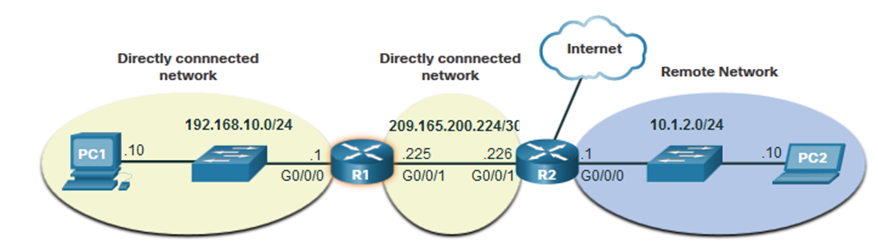
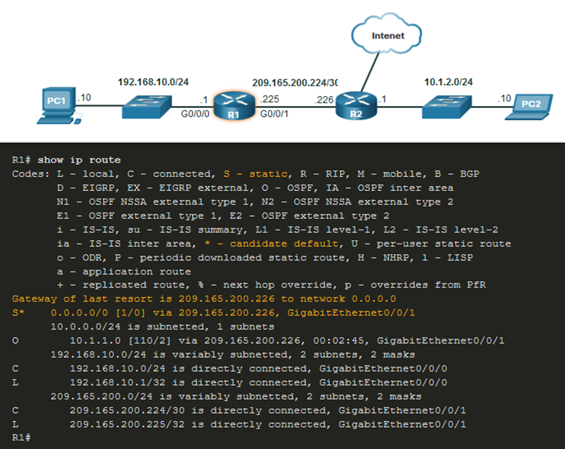

# Computer Networks - Hoofdstuk 8 - Network Layer

## Network Layer Characteristics

- Voorziet diensten om end devices instaat te stellen gegevens te verwisselen
- IP version 4 (IPv4) en IP version 6 (IPv6) zijn der voornamelijkste netwerklaag communicatieprotocollen
- De netwerklaag voert 4 basis operaties uit:
    - Adressering van end devices
    - Inkapseling
    - Routing
    - Ontkapseling

<table>
<td>
 

</td>
<td>
 

</td>
</table>

### IP Encapsulation

- IP inkapselt het transportlaag segment
- IP kan zowel een IPv4 en een IPv6 pakket gebruiken zonder het segment van Laag 4 te beïnvloeden.
- Het IP pakket zal onderzocht worden door alle toestellen op Laag 3 als het door het netwerk vloeit.
- De IP adressering veranderd niet van bron naar bestemming

>[!note]
> NAT zal de adressering veranderen

### Characteristics of IP

IP is bedoelt om weinig overhead te hebben en kunnen we beschrijven als:

- **Verbindingloos**:
    - IP maakt geen verbinding met de bestemming voor het pakket te versturen
    - Er is geen controle informatie nodig (synchronisatie, bevestiging,...)
    - De bestemming zal het pakket ontvangen wanneer het aankomt, maar er worden geen vooraankondigingen verzonden door IP
    - Als er behoefte is aan een verbindingsgericht verkeer, dan zal een ander protocol dit behandelen (vaak TCP op het niveau van de transportlaag)
- **Best effort**:
    - IP kan het leveren van het pakket niet garanderen
    - IP heeft een lage overhead, aangezien er geen mechanisme is om data opnieuw te versturen die niet is toegekomen
    - IP verwacht geen bevestiging
    - IP weet niet of het andere toestel operationeel is en indien het pakket ontvangen is
- **Media onafhankelijk**:
    - *IP is onbetrouwbaar*:
        - Het kan niet corrupte of niet-geleverde pakketen beheren of repareren
        - IP kan niet opnieuw uitzenden na een fout
        - IP kan pakketten buiten volgorde niet opnieuw uitlijnen
        - IP moet beroep doen op andere protocollen voor deze functies
    - *IP is media onafhankelijk*:
        - IP houdt geen rekening met het type frame dat nodig is op de data link laag of het type medium dat nodig is op de fysieke laag
        - IP can verstuurd worden over elk media: koper, fiber, of draadloos
    - De netwerklaag brengt het **Maximum Transmission Unit (MTU)** tot stand
        - De netwerklaag ontvangt dit van controle informatie die verstuurd word door de data link laag.
        - Het netwerk stelt hierop de MTU groote vast.
    - **Fragmentation** gebeurd wanneer Laag 3 het IPv4 pakket in kleiner onderdelen splitst.
        - Veroorzaakt latentie
        - IPv6 fragmenteerd geen pakketen

## IPv4 Packet

### IPv4 Packet Header

IPv4 is het primaire communicatieprotocol voor de netwerklaag.

De netwerkheader heeft verschillende doelen:
- Hij zorgt ervoor dat het pakket verstuurd word in de juiste richting (naar de bestemming)
- Hij bevat informatie voor de verwerking op de netwerklaag in verschillende velden
- De informatie in de header wordt gebruikt door alle toestellen op Laag 3 die het pakket behandelen

#### IPv4 Packet Header Fields

IPv4 netwerk header kenmerken:
- het is binair
- Bevat verschillende velden met informatie
- Het diagram wordt van links naar rechts gelezen steeds met 4 bytes per lijn
- De twee belangrijkste velden zijn de bron en bestemming

De protocollen kunnen verschillende functies hebben.

Belangrijkste velden in de IPv4 header:

<table>
    <thead>
        <th>Functie</th>
        <th>Beschrijving</th>
    </thead>
    <tbody>
        <tr>
            <td>Version</td>
            <td>Zal v4 zijn ipv v6, een 4 bit veld = 0100</td>
        </tr>
        <tr>
            <td>Differentiated Services</td>
            <td>Used for QoS: DiffServ - DS field or the older IntServ - ToS or Type of Service</td>
        </tr>
        <tr>
            <td>Header Checksum</td>
            <td>Detect corruption in the IPv4 header</td>
        </tr>
        <tr>
            <td>Identification, Flag, Fragment Offset</td>
            <td>Gebruikt om pakketten te fragmenteren. Flag = 1 als het pakket gefragmenteerd is. Identification, identificeert het gefragmenteerde pakket en fragment the offset nummers</td>
        </tr>
        <tr>
            <td>Time to Liv (TTL)</td>
            <td>Laag 3 hop teller. Wanneer deze O is zal de router het pakket weggooien</td>
        </tr>
        <tr>
            <td>Protocol</td>
            <td>I.D.'s next level protocol: ICMP (1), TCP (6), UDP (7)</td>
        </tr>
        <tr>
            <td>Source IPv4 Address</td>
            <td>32 bit source address</td>
        </tr>
        <tr>
            <td>Destination IPv4 Address</td>
            <td>32 bit destination address</td>
        </tr>
    </tbody>
</table>

## IPv6 Packets

IPv4 heeft drie grootte beperkingen:
- IPv4 adres uitputting (te weinig adressen)
- **Lack of end-to-end connectivity**: Om IPv4 zolang te laten overleven zijn privat addressing en NAT gemaakt. Dit stopte de directe communicatie met publieke adressen.
- **Toegenomen netwerk complexiteit**: NAT werkt gemaakt als een tijdelijk oplossing en zorgt voor problemen op het netwerk als een side effect van het manipuleren van de netwerk headers addressing. NAT zorgt voor latentie en troubleshooting issues

### IPv6 Overview

- IPv6 is ontwikkeld door het *Intenet Engineering Task Force (IETF)*
- IPv6 heeft als doel te beperkingen van IPv4 wegwerken.
- Verbeteringen die IPv6 voorziet:
    - **Toegenomen aantal beschikbare adressen**: IPv6 is gebaseerd op 128 bit adressen, niet 32 bit
    - **Verbeterde pakketverwerking**: eenvoudigere header met minder velden
    - **Elimineert de nood aan NAT**: aangezien er groot aantal adressen zijn, is er geen nood meer aan interne private adressen.

>[!caution]
>340 undecillion IPv6 adressen!

### IPv4 Packet Header Fields in the IPv6 Packet Header

- De IPv6 header is eenvoudiger, maar niet kleiner
- De header heeft een vast groote van 40 Bytes/Octets
- Verschillende IPv4 velden zijn verwijderd om de performantie te verbeteren
    - Flag
    - Fragment offset
    - Header Checksum

### IPv6 Packet Header

De meeste belangrijke velden in de IPv6 header:

<table>
    <thead>
        <th>Function</th>
        <th>Description</th>
    </thead>
    <tbody>
        <tr>
            <td>Version</td>
            <td>v6, in tegenstelling to v4, 4 bit veld = 0110</td>
        </tr>
        <tr>
            <td>Traffic Class</td>
            <td>Gebruikt voor QoS: equivalent met DiffServ - DS Field</td>
        </tr>
        <tr>
            <td>Flow Label</td>
            <td>Informeert een toestel om identieke flow labels op dezelfde manier te behandelen, 20 bit veld</td>
        </tr>
        <tr>
            <td>Payload Lenght</td>
            <td>Dit 16-bit veld geeft de lengte van het gegevensdeel of de payload van het IPv6 pakket aan</td>
        </tr>
        <tr>
            <td>Next Header</td>
            <td>I.D's next level protocol: ICMP, TCP, UDP</td>
        </tr>
        <tr>
            <td>Hop Limit</td>
            <td>Vervangt het TTL Laag 3 hop teller veld</td>
        </tr>
        <tr>
            <td>Source IPv6 Address</td>
            <td>128 bit source address</td>
        </tr>
        <tr>
            <td>Destination IPv6 Address</td>
            <td>128 bit destination address</td>
        </tr>
    </tbody>
</table>

Een IPv6 pakket kan ook **extension headers (EH)** bevatten.

De kenmerken van deze headers zijn:
- voorzien van extra netwerklaag informatie
- zijn optioneel
- bevinden zich tussen de IPv6 header en de payload
- mogen gebruikt worden voor fragmentatie, beveiliging, mobility support,...

>[!important]
>In tegenstelling to IPv4 headers fragementeren routers de IPv6 pakketten niet.

## How a Host Routes

### Host Forwarding Decision

- Pakketten worden altijd gemaakt bij de bron
- Elke host toestel maakt zijn eigen **routing tabel**
- Een host kan pakketten versturen naar:
    - **Zichzelf**: `127.0.0.1 (IPv4)` `::1 (IPv6)`
    - **Local Hosts**: bestemming ligt op hetzelfde LAN
    - **Remote Hosts**: toestellen zitten niet op hetzelfde LAN

- Het bestemmingstoestel bepaald steeds of de bestemming local of remote is.
- Bepalingsmethode:
    - IPv4: Bron gebruikt zijn eigen IP adres en subnet mask, samen met het bestemmings IP adres
    - IPv6: Bron gebruikt het netwerk adres en een prefix aangeboden door de lokale router
- Lokaal verkeer wordt gedumpt naar een hostinterface om afgehandeld te worden door een tussenliggend toestel
- Afstandsverkeer wordt direct doorgestuurd naar de default gateway op het LAN

### Default Gateway

Een router of een Laag 3 switch kan een default gateway zijn

Kenmerken van een default gateway (DGW):
- Het moet een IP adres hebben in dezelfde range als de rest van het LAN
- Het kan gegevens ontvangen van het LAN en is instaat om verkeer door te sturen naar het LAN
- Het kan naar andere netwerken routeren.

>[!important]
>Als een toestel geen of een verkeerde default gateway heeft, kan het geen verkeer versturen buiten het LAN

### A Host Routes to the Default Gateway

- De host zal steeds de default gateway kennen, of statisch of door DHCP in IPv4
- IPv6 stuurt de DGW door een "router solicitation (RS)" of kan manueel geconfigureerd zijn.
- Een DGW is een statische route die de laatste mogelijke route in de routing tabel is.
- Alle toestellen in een LAN zullen de DGW van de router nodig hebben willen ze afstandsverkeer versturen.

### Host Routing Tables

- Op Windows kunnen commandos `route print` of `netstat -r` gebruikt worden om de PC routing tabel te printen
- Drie verschillende secties worden weergegeven
    - Interface lijst (met alle mogelijke interfaces en hun MAC adressen)
    - IPv4 Routing tabel
    - IPv6 Routing tabel

## Introduction to Routing

### Router Packet Forwarding Decision

Wat gebeurd er wanneer de router een pakket van een host ontvangt?

### IP Router Routing Tabel

Er zijn drie type routes in een routers routing table:

- **Directly Connected**: Deze routes zijn automatisch toegevoegd door de router, enkel indien de interface actief is en adressering heeft.
- **Remote**: Dit zijn de routes waar de router geen directe verbinding mee heeft maar die geleerd kunnen worden:
    - Manueel met een statische route
    - Dynamisch door het gebruik te maken van een routing protocol waar routers onderling informatie delen
- **Default route**: Deze stuurt al het verkeer door naar een specifiek richting wanneer er geen match gevonden is in de routing tabel.

### Static Routing

Kenmerken:

- Moet manueel geconfigureerd worden
- Moet manueel aangepast worden door de administrator wanneer er een wijziging in topologie is.
- Goed voor kleine niet-redundante netwerken
- Vaak gebruikt in combinatie met een dynamisch routingprotocol voor het configureren van een standaardroute

### Dynamic Routing

**Dynamic Routing** voert volgende zaken automatisch uit:

- Externe netwerken ontdekken
- Informatie up-to-date bijhouden
- Beste route kiezen voor de bestemming
- Beste route aanpassen wanneer er veranderingen in topologie zijn

Dynamic routing kan ook statisch standaard routes delen met andere routers.

### Introduction to an IPv4 Routing Table

Het commando `show ip route` toont ons de volgende route bronnen:

- **L** : Direct verbonden met een lokaaln interface IP adres
- **C** : Direct verbonden netwerk
- **S** : Statisch route was manueel geconfigureerd door een administrator
- **O** : OSPF (Open Shortest Path First)
- **D** : EIGRP (Enhanced Interior Gateway Routing Protocol)

Het commando toont verschillende type routes:
- Direct verbonden: C en L
- Externe routes: O, D,...
- Standaard routes: S*

