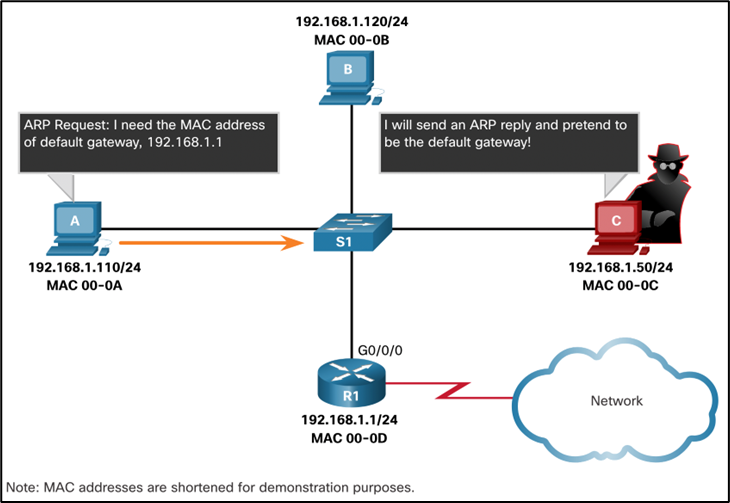

# Computer Networks - Hoofdstuk 9 - Address Resolution

## MAC and IP

### Destination on Same Network

Er zijn twee hoofdzakelijk adressen die toegewezen worden aan een toestel op een LAN:
- **Laag 2 fysiek (physical) adres:** *het MAC adres*
    - Gebruikt om frames NIC naar NIC op hetzelfde netwerk te versturen
- **Laag 3 logisch (logical) adres:** *het IP adres*
    - Gebruikt om paketten te versturen van een bron naar een bestemming.

Wanneer het bestemmings IP adres op hetzelfde netwerk ligt, zal het bestemmings MAC adres, dat van het bestemmingstoestel zijn.

### Destination on Remote Networks

Wanneer het IP adres op een extern netwerk, zal het bestemmings MAC adres dat van de default gateway zijn.
- **Address Resolution Protocol (ARP)** word door IPv4 gebruikt om het juiste IPv4 addres van een toestel te associëren met het juist MAC adres van de NIC van het toestel.
- **ICMPv6** wordt gebruikt door IPv6 om het juiste IPv6 addres van een toestel te associëren met het juist MAC adres van de NIC van het toestel.

## ARP

### ARP Overview

Een toestel gebruikt ARP om het bestemmings MAC adres te achterhalen van een lokaal toestel wanneer het zijn IPv4 adres kent.

ARP voorziet deze twee basis functies:
- **Oplossen** van IPv4 adressen naar MAC adressen
- **Onderhouden** van een ARP tabel met IPv4 en MAC adres mappings

### ARP Functions

Om een frame te kunnen versturen, zal een toestel in zijn ARP tabel zoeken naar het IPv4 adres en het bijhorende MAC adres.
- Ligt IPv4 adres van de bestemming van het pakket in hetzelfde netwerk, dan zal het toestel zoeken in zijn ARP tabel naar het IPv4 bestemmingsadres.
- Ligt IPv4 adres van de bestemming van het pakket in een ander netwerk, dan zal het toestel zoeken in zijn ARP tabel naar het adres van de default gateway.
- Als het IPv4 adres gevonden wordt zal het bijhorende MAC adres gebruikt worden als het bestemmings MAC adres in het frame
- Wordt er geen ARP tabel invoer gevonden, dan zaln het toestel een ARP request uitsturen.

### Removing Entries from an ARP Table

- De invoer in een ARP tabel worden niet permanent bijgehouden. Deze worden verwijderd wanneer de ARP cache timer verloopt na een specifieke tijdspanne.
- De duur van de ARP cache timer verschilt van OS to OS
- Een ARP invoer kan ook manueel verwijderd worden door de administrator

### ARP Tables on Networking Devices

- Via het commando `show ip arp` kunnen we de ARP tabel lezen op cisco switches
- Via het commando `arp -a` tonen we de ARP tabel op een een Windows PC

### ARP Issues - ARP Broadcasting and ARP Spoofing

- ARP request worden door elke toestel op een lokaal netwerk ontvangen en geprocessed.
- **Buitensporige ARP-uitzendingen** kunnen zorgen voor een verlies in performantie
- ARP antwoorden kunnen gespoofed worden door een bedreigende actor om zo een *ARP poisoning attack* uit te voeren.
- Enterprise level switches beschikken over technieken die beschermen tegen ARP aanvallen.

## IPv6 Neighbor Discovery

**IPv6 Neighbor Discovery (ND) protocol** zorgt voor:
- Address Resolution
- Router Discovery
- Redirection services
- **Device-to-device messaging** zoals address resolution=
    - ICMPv6 Neighbor Solicitation (NS)
    - Neighbor Advertisement (NA)
- **Device-Router messaging** for router discovery:
    - ICMPv6 Neighbor Solicitation (NS)
    - Neighbor Advertisement (NA)

>ICMPv6 redirect berichten worden door routers gebruikt om een betere next-hop selectie te maken.

- IPv6 toestellen maken gebruik van ND om het oplossen van een MAC adres vanuit een gekend IPv6 adres
- ICMPv6 Neighbor Solicitation berichten worden verzonden via een speciaal Ethernet en IPv6 multicast adressen