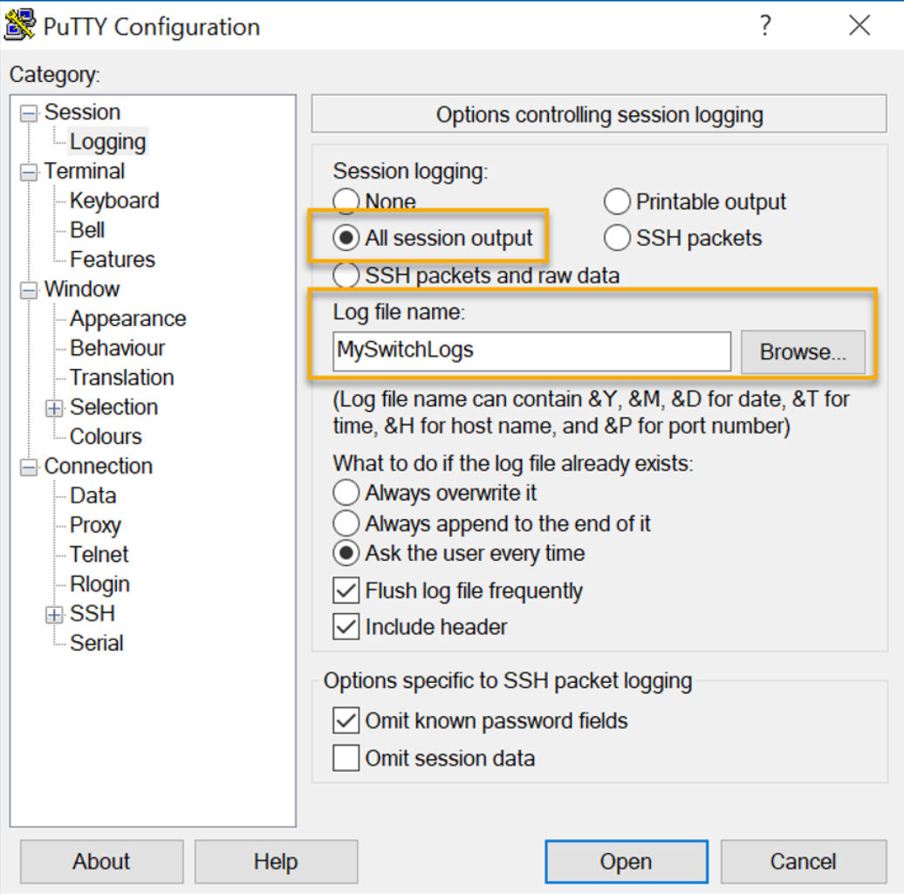
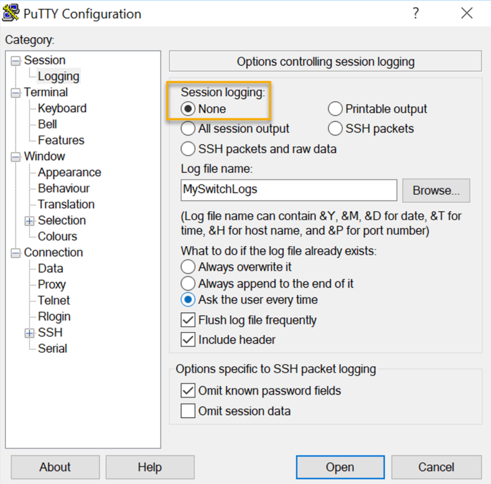

### Capture configuration to a text File

Configuratie bestanden kunnen ook opgeslagen en gearchiveerd worden naar een tekst bestand

- **Stap 1**: Open een terminal emulation software, zoals PuTTY of Tera Term, dat reeds met een switch verbonden is.
- **Stap 2**: Schakel het aanmelden bij de terminalsoftware in en wijs een naam en bestandslocatie toe om het logbestand op te slaan. De afbeelding toont dat "All session output" wordt opgeslagen naar het gespecifieerd bestand.

<p align="center"></p>

- **Stap 3**: Voer de commando's `show running-config` en `show startup-config` uit in privileged EXEC mode. De tekst die weergegeven wordt in het terminal scherm zal in het gekozen tekst-bestand worden weergegeven.
- **Stap 4**: Schakel het aanmelden in de terminal software uit. Door de optie "none" te selecteren bij session logging option. (zie afbeelding)

<p align='center'></p>


>[!NOTE]
>Het aangemaakte bestand kan gebruikt worden als record over hoe het toestel geimplementeerd is.

## Ports and addresses

### IP Addresses

- Het gebruik van ip-addressen is de hoofdzakelijkste manier om een toestel een ander apparaat te laten localiseren en een end-to-end communicatie op te zetten over het internet. vb. `192.168.1.10`
- De structuur van een IPv4 adres noemt met een "dotted decimal notation" and wordt voorgesteld door 4 decimale nummer tussen 0 en 255.
- Een IPv4 subnet mask is een 32-bit waarde dat het netwerk onderdeel van het host onderdeel onderscheidt. Samen met het IPv4 adres, bepaald het subnet mask tot welk subnet een apparaat behoord. vb. `255.255.255.0`
- Het default gateway adres is het ip-adres van de router, waar de host gebruikt van zal maken om toegang tot verschillende externe netwerken (incl. het internet) zal krijgen. vb. `192.168.1.1`
- IPv6 addressen zijn 128 bits in lengte en geschreven als strings van hexadecimale waarden. Elke 4 bits is voorgesteld door één hexadecimaal cijfer. (een totaal van 32 hexadecimale cijfers). Groepen van 4 hexadecimale cijfers worden gescheiden door een `:`. vb. `2a02:1811:d38:cc00:187a:ab5:a2:FastEthernet5e`
- IPv6 addressen zijn niet hoofdlettergevoelig.

>[!NOTE]
> In deze cursus gebruiken we IP voor zowel IPv4 als IPv6 (meest recente versie).

### Interfaces and Ports

- Netwerkcommunicaties hangen af van end user device interfaces, networking device interfaces, en de kabels die ze verbind.
- Netwerk media types: twisted copper cables, fiber-optic cables, coaxial cables, of draadloos.
- De verschillende netwerk media types hebben verschillende functies en voordelen. Enkele verschillen:
    - Afstand waarover de media het signaal succesvol kan dragen
    - Omgeving in welke de media geïnstalleerd kan worden
    - Hoeveelheid gegevens en de snelheid waarmee deze moeten worden verzonden
    - Kost van de media en installatie ervan

## Configure IP Addressing

### Manual IP Address Configuration for End Devices

- End devices op een netwerk hebben een ip-adres nodig om met ander apparaten op het netwerk te kunnen communiceren.
- IPv4 informatie kan manueel in het end device gegeven worden of automatisch via het Dynamic Host Configuration Protocol (DHCP)
    - Om manueel een IPv4 adres op een windows pc te configureren ga naar: **Control Panel > Network Sharing Center > Change adapter settings** en kies hier de adapter. Klik hier na rechts en selecteer **Properties** om de **Local Area Connection Properties** weer te geven.
    - Klik hierna op **Properties** om het **Internet Protocol Version 4 (TCP/IPv4) Properties** scherm te openen. Configureer hierna het IPv4 adres, subnet mask en default gateway.

### Automatic IP Address Configuration for End Devices

- DHCP staat een automatische IPv4 configuratie toe voor alle end devices die DHCP-enabled zijn.
- End devices gebruiken in de meeste gevallen standaard DHCP voor een automatische IPv4 configuratie.
    - Om DHCP in te stellen op een windows pc open **Control Panel > Network Sharing Center > Change adapter settings** en kies een adapter. Klik rechts op de adapter en kies **Properties** om de **Local Area Connection Properties** weer te geven.
    - Klik hierna op **Properties** om het **Internet Protocol Version 4 (TCP/IPv4) Properties** scherm te openen. Selecteer hierna **Obtain an IP address automatically** en **Obtain DNS server address automatically**

### Switch Virtual Interface Configuration

Om extern toegang te hebben tot een switch moet een ip-adres en een subnet mask geconfigureerd zijn op de SVI (Switch Virtual Interface).

Configureren van een SVI op een switch:
- Voer het `interface vlan 1` commando in vanuit global configuration mode
- Geef hierna een IPv4 adres door gebruik te maken van `ip address` met als parameters eerst het _ip-adres_ gevolgd door het _subnet mask_.
- Als laatste schakel je de virtual interface in door een `no shutdown` commando.

```shell
Switch# configure terminal
Switch(config)# interface vlan 1
Switch(config-if)# ip address 192.168.1.20 255.255.255.0
Switch(config-if)# no shutdown
```