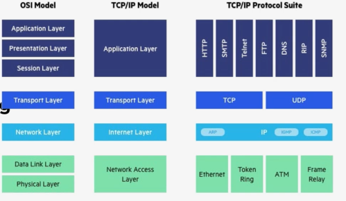

=> Samenvatting van de verschillende lagen.

Peer-to-peer => torrent, printers

Torrent => elke pc op peer tot peer houdt een deel van een stuk van een file bijhouden.

Intermediary devices sturen signalen opnieuw uit => versterken opnieuw het signaal opnieuw

=> Foto's van kabels nog toevoegen

Functie router => verschillende netwerken verbinden
Functie switch => verschillende toestellen verbinden