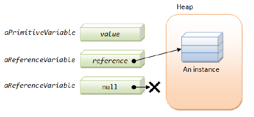

# OOSD II - Hoofdstuk 1 - Overerving

>[!warning]
>**Overerving** is is een mechanisme waarbij software opnieuw wordt gebruikt: nieuwe klassen worden gecreëerd van bestaande klassen, waarbij eigenschappen en gedrag worden geërfd van _de superklasse_ en uitgebreid met nieuwe mogelijkheden, noodzakelijk voor de nieuwe klasse die men _de subklasse_ noemt.

## Herhaling

### Java Types

| Primitief type | Referentie type |
| -------------- | --------------- |
| boolean | klassetype |
| byte, short, int, long, char | arraytype |
| float, double |  |

In het geval van een primitief datatype zit het datatype effectief op de plaats in het RAM. Terwijl bij referentie types zit daar enkel de verwijzing naar het adres in de Heap. In de heap bevindt zicht dan het datatype.

>[!tip]
>Een type limiteert welke waarde aan een variabele kan toegekend worden. Deze waarde kan ook het resultaat van een expressie zijn. Het type van een waarde beperkt ook het aantal operaties dat mogelijk is.

Een variabele met als type een referentietype omvat een referentie. Deze is ook een bepaalde waarde, met _een speciale betekenis_: Het is een verwijzing naar een object. 

>[!tip]
>Bevat een referentie variabele de waarde `null`, dan verwijst de referentie niet naar een concreet object. Indien je op een referentie met de waarde `null` een methode aanroept dan krijg je bij het uitvoeren een `NullPointerException`

<p align='center'></p>

### Object

>[!warning]
>Een **object** is een instantie van een klasse of instantie van een array.

Referentiewaarden (of referenties) zijn:
- pointers (=verwijzingen) naar deze objecten
- of een `null` referentie, dewelke aangeeft dat er geen objecten bestaan om naar te refereren.

### Klasse

>[!warning]
>Klasse declaraties definiëren nieuwe referentie types en beschrijven de implementatie ervan. Ze zijn _het grondplan_ op basis waarvan één of meerdere objecten kunnen geïntstantieerd worden.

Declaratie van een klasse:

```java
public class MijnKlasse{
    //attributen, constructor(s)
    //methode declaraties
}
```