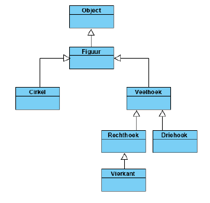
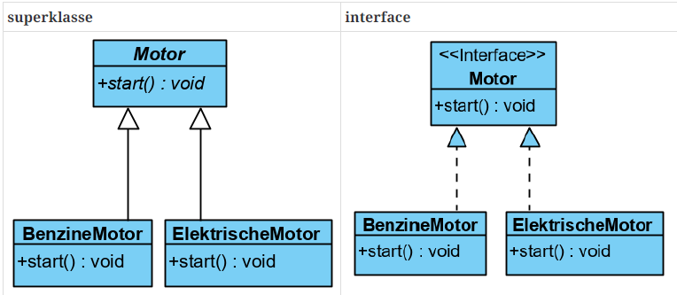

# OOSD II - Hoofdstuk 2 - Polymorfisme en interfaces

## Polymorfisme

Binnen Java betekent polymorfisme dat een referentie variabele van een bepaald type kan verwijzen naar objecten van verschillende types: het type zelf of één van zijn subtypes.

>[!tip]
>Dankzij polymorfisme kan je achteraf nog subklasse toevoegen die de eigenschappen en het gedrag van de subklasse overnemen. 

**Polymorfisme of veelvormigheid** komt voort uit een "IS EEN" relatie: overerving. 

<p align='center'></p>

Een superklasse referentie kan refereren naar een instantie van een subklasse. Dit noemt men _upcasting_

Een superklasse referentie kan enkel toegekend worden aan een subklasse referentie na een *downcast*.

>[!caution]
>Let op met een downcast. Ga eerst na of de referentie wel refereert naar een object van het juiste type. <br>
>Gebruik het keyword `instanceof` om na te gaan of een object van een specifiek type is.

**Voorbeeld downcast via keyword `instanceof`**

```java
if(Figuur f instanceof Vierkant v)
    //doe nu iets met het object v dat gedowncast is naar een Vierkant-type
```

### Regels voor toekenning

Polymorfisme bepaalt duidelijke regels voor toekenning van referenties:

De rechteroperand van een toekenning, kan ofwel `null` zijn ofwel een referentie met als type:
- dezelfde klasse
- een subklasse van die klasse

:arrow_right: Nooit kan een superklasse toegekend worden.

### Gekende methodes van een referentie

>[!important]
>Instantiemethodes kunnen enkel aangeroepen worden via een referentievariabele als en slechts als de methodenaam gekend is binnen het type van die referentievariabele.

*Is het type van de variable gekend, dan zijn de gekende instantiemethodes:*
- de zichtbare methodes gedeclareerd binnen die klasse.

    >[!caution]
    >Binnen de klasse zelf zijn alle methodes die binnen die klasse gedeclareerd zichtbaar, dus ook de `private`-klassen

- de zichtbare methodes gedeclareerd binnen een superklasse van die klasse
- de zichtbare methodes gedeclareerd in een interface die de klasse implementeert

*Is het type van de variabele een interface, dan zijn de gekende instantiemethodes:*
- de methodes gedeclareerd binnen die interface
- de zichtbare methodes gedeclareerd in een superinterface van die interface

>[!important]
>Is het type van een variabele een klasse, en verwijst deze naar een object van een subklasse van die klasse, dan zijn de instantiemethodes waarmee de subklasse werd uitgebreid niet gekend voor die variabele!

### static en dynamic binding

>Het linken van een methode declaratie aan zijn implementatie noemt met *binding*. Er zijn twee soorten:
- **static binding**: gebeurt tijdens het compileren (@compile time) <br>

    :arrow_right: Enkel mogelijk indien het type van het object, waarop de methode wordt uitgevoerd gekend is tijdens het compileren.

    **voorbeeld**: *static*, *private* en *final* methodes kunnen niet overschreven worden.

- **dynamic binding**: gebeurt tijdens de uitvoering (@runtime)

    :arrow_right: Door *polymorfisme* kan een superklasse referentie verwijzen naar een object van een subklasse. Hierdoor is de implementatie en declaratie van een methode tijdens het compileren niet altijd te leggen.

    >Er moet gewacht worden tot het type van het object waarnaar de referentie verwijst, gekend is. Dit kan enkel tijdens de uitvoering van een programma en noemen we *dynamic binding*.

    **voorbeeld**: overschrijven van een methode in de subklasse. Beide de super- als subklasse hebben dezelfde declaratie en kunnen pas geïmplementeerd worden wanneer het precieze type gekend is.

 >[!caution]
 >Bij *dynamic binding* bepaald het type van het object welke implementatie zal uitgevoerd worden. NIET het type van de referentie.

 ### `abstract` klasse bij polymorfisme

 Een **abstracte klasse** is een klasse die gedeclareerd is met het keyword `abstract`
 - Een abstracte klasse kan niet geïnstantieerd worden, maar kan wel subklassen hebben
 - Een subklasse van een abstracte klasse kan eveneens een abstracte klasse zijn.
 - Een abstracte klasse mag abstracte methodes bevatten, maar dit is niet verplicht.

 :arrow_right: Wordt gebruikt om een hoger niveau van generalisatie te bereiken.

 Een **abstracte methode** is een methode declaratie zonder implementatie (zonder {}), gevolgd door een puntkomma.

### Dependency injection

Een abstracte methode dwingt gedrag af dat kan verwacht worden voor het type, maar dat nog niet kan geïmplementeerd worden op dat niveau in de hiërarchie. Een hogere laag in software kan gebruik maken van abstracte methodes, waarvan de eigenlijke implementatie op een later moment geïnjecteerd wordt, dit noemen we **dependency injection**.

Op een later tijdstip kunne we verschillende types inplementeren van de abstacte methode. De klasse in een hogere laag die gebruikt maakt van de abstracte methode hoeft niet te weten welk type ze gebruiken. Enkel dat ze een abstracte klasse heeft.

Op het moment van creatie wordt meegegeven welk type we zullen gebruiken.

## Interfaces

Een interface is een referentietype, vergelijkbaar met een klasse, dat enkel het volgende kan bevatten:
- constanten
- abstracte methodes (enkel de signatuur, zonder de implementatie)
- `default` methodes: *impliciet `public` met een correcte implementatie, als de klasse die de interface implementeert geen override voorziet dan gebruikt ze de default-definitie*
- `static` methodes met implementatie: *kunnen net als bij klassemethodes aangeroepen worden via de naam van de interface*

>[!tip] 
>Een `default`-methode laat toe nieuwe methodes aan een interface toe te voegen, zodat deze automatisch beschikbaar zijn binnen een implementatie van de interface. <br> <br>
>Een interface methode zonder private, default, of static modifier is impliciet public en abstract.<br> <br>
>Elk attribuut gedeclareerd binnen de body van een interface is impliciet public, static en final.

>[!caution]
>Een interface heeft GEEN constructor. Ze kan dus nooit geïnstantieerd worden.

>**Een functionele interface** is een interface die slechts één abstracte methode declareert.

Als het type van de variabele een interface is, kan in een toekenning de rechter operand ofwel `null` zijn ofwel een een referentie met als type:
- dezelfde interface
- een sub-interface van die interface
- een klasse die de interface implementeert
- een klasse die een subinterface van die interface implementeert

**Een klasse kan een interface implementeren door de abstracte methoden uit de interface concreet te maken**

<p align='center'></p>

```java
//superklasse
public class ElektrischeMotor extends Motor{
    @Override
    public void start(){
        System.out.println("Gedrag van een elektrische motor");
    }
}
```

```java
//interface
public class ElketrischeMotor implements Motor{
    @Override
    public void start(){
        System.out.println("Gedrag van een elektrische motor");
    }
}

```

>Een klasse toont met het keyword `implements` aan dat het een interface implementeert.

### Toepassingen van interfaces

#### **Objecten samenbrengen in een context**

Instanties van klassen die niets met elkaar te maken hebben, kunnen in een bepaalde context samen komen door de implementatie van een gemeenschappelijke interface. (=implementatie van de abstracte methodes van die interface.)

>Ook op een interface kunnen we polymorfisme toepassen. 

>Vele namen van interfaces in het Engels eidigen op -able. (Serializable, Comparable, AutoCloseable, Runnable). In het Nederlands hanteren we de benaming eindigend op -baar voor zulke interfaces. (Verkoopbaar, Tekenbaar,...)

>[!tip]
>**Code best practise:** <br>
>Code moet gemakkelijk uit te breiden zijn met nieuwe klasses en methodes, maar moet beschermd zijn tegen wijzigingen in onze bestaande methodes.

>[!important]
>Een Java klasse kan slechts één super klasse hebben. Meervoudige overerving is niet toegelaten. Een interface is echter geen klasse. Een klasse kan meerdere interfaces implementeren en een interface kan meerdere interfaces uitbreiden.

```java
public interface Hokey extends Sports, Event {}

public class Sleutel extends Voorwerp implements Draagbaar, Kosten {}

```

#### Objecten Sorteren

##### Comparable interface

Deze veelgebruikte interface legt een 'orde' vast tussen objecten van klassen die de interface implementeren.

>**De Comparable interface** laat je toe om objecten te sorteren. Deze manier van sorteren op basis van de comparable interface noemt men de **natuurlijke sortering**. (*cijfers: van groot naar klein, letters: alfabetisch*)

```java
public interface Comparable<T>{
    public int compareTo(T o);
} 
```

De `compareTo`-methode vergelijkt het argument van de methode met het object waarop de methode wordt aangeroepen. 

>Het resultaat is een negatief, 0, of een positief geheel getal `int` afhankelijk of het argument kleiner dan, gelijk aan `equals`, of groter dan het eigenlijke object zelf is. Kan het argument niet vergeleken worden dan gooit de methode een  `ClassCastException`


##### Comparator interface

>**De Comparator interface** laat toe om objecten te sorteren op een andere manier dan op natuurlijke wijze.

```java
public interface Comparator<T>{
    int compare(T o1, T o2);
}
```

De `compare`-methode vergelijkt twee argumenten met elkaar.

>Het resultaat is een negatief, 0, of een positief geheel getal `int` afhankelijk of het eerste argument kleiner dan, gelijk aan `equals`, of groter dan het tweede argument.

### Wanneer een interface en wanneer een abstracte klasse gebruiken?

Wanneer we praten over abstracte klasses definiëren we eigenschappen van een type object: we specifiëren wat een bepaald object is.

Als we het over een interface hebben, definiëren we mogelijkheden waarvan we beloven dat we ze zullen voorzien: we leggen een contract vast met informatie over wat een object kan doen.

- `abstracte klasse`: als we iets implementeren van de vorm "A is een B"
- `interface`: als we iets implementeren van de vorm "A kan hetgene uit B doen"

Volgens Oracle:

1. `Abstracte klassen`:
    - als je code wilt delen tussen sterk gerelateerde klasses
    - als je verwacht dat je klasse van je abstracte klasse veel gemeenschappelijke methodes of attributen zullen hebben of andere toegangsrechten dan `public` zullen nodig hebben
    - als je attributen wil declareren dien niet `static` of `final` zijn

2. `Interfaces`:
    - je verwacht verschillende klasses die op het eerste zicht weinig met elkaar te maken hebben. 
    - je wil een bepaald gedrag speciefiëren voor een bepaald datatype, maar je maakt je zorgen over wie het gedrag zal implementeren.
    - je wil meervoudige overerving kunnen gebruiken.