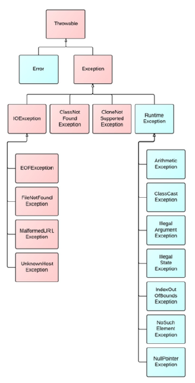

# OOSD II : Hoofdstuk 4 - Exception handling

## Exception handling

> De term **exception handling** (uitzondering) is een verkorting van de uitdrukking 'exceptional event'.

>**Een exception** is een uitzonderlijke gebeurtenis, die zich voordoet bij het uitvoeren van een applicatie en die de normale voortgang van de applicatie onderbreekt.

Via exception handling kan die uitzonderlijke gebeurtenis opgevangen worden. Zo kunnen we robuuster programma's ontwikkelen die kunnen omgaan met probleemsituaties.

Een voorbeeld van zo een uitzonderlijke gebeurtenis is het uitvoeren van een deling door nul. *Indien we de exception niet afhandelen zal de applicatie 'crashen'*.

**Voorbeeld**:

```java
public class DivideByZeroNoExceptionHandling{
    public static int berekenQuotient(int teller, int noemer){
        return teller / noemer;
    }
    public static void main(String[] args){
        Scanner scanner = new Scanner(System.in);

        System.out.print("Geef een integere waarde voor de teller: ");
        int teller = scanner.nextInt();
        System.out.print("Geef een integere waarde voor de noemer :");
        int noemer = scanner.nextInt();

        int quotient = berekenQuotient(teller, noemer);
        System.out.printf("%nResultaat: %d / %d = %d%n", teller, noemer, quotient);

        scanner.close();
    }
}
```

Bij het crashen zal "een stack trace" afgedrukt worden met de volgende informatie:

- soort fout wordt aangegeven <br>
    in het voorbeeld:
    ```java
    Exception in thread "main" java.lang.ArithmeticException: / by zero
    ```
- er wordt ook aangegeven waar de fout zicht voordoet <br>
    in het voorbeeld:
    ```java
    at main.DivideByZeroNoExceptionHandling.berekenQuotient(DivideByZeroNoExceptionHandling.java:9)
    at main.DivideByZeroNoExceptionHandling.main(DivideByZeroNoExceptionHandling.java:21)
    ```
De stack trace toont ook aan welke methodes aangeroepen worden en waar het precies fout liep.
- weergave aanroep methode: klasse, methode, bestandsnaam, regelnummer.
- Al je het chronologisch in de tijd wil volgen, lees je van onder naar boven.
- Het bovenste punt (hier lijn 9 in berekenQuotient) noemen we het **throw procesactiviteiten**. Daar is de fout ontstaan?

>[!tip]
>In *Eclipse* kan je klikken in *de stack trace* op "bestandsnaam:regelnummer" en dan spring je naar die plaats in de code.

>[!important]
>Indien het optreden van een exception niet wordt afgehandeld, dan stopt het programma bruusk. 
> <br>:arrow_right: we kunnen dit oplossen door de exceptions "af te handelen" zodat deze robuster worden.

### Exception object gooien

Als er tijdens het uitvoeren van een methode een exception optreedt kan deze methode een exception object aanmaken en gooien:

```java
if(mijnString == null || mijnString.isBlank()){
    throw new IllegalArgumentException();
}
```

- de methode maakt een instantie van een exception object en levert dit object aan het runtime systeem.
    - dit object is het *exception object*
- het exception object bevat informatie over de excpetie:
    - zijn type (welke exceptie is er opgetreden)
    - de toestand waarin het programma zich bevond toen de exception optrad.

>De creatie van een exception object en het doorgeven van dit object aan het runtime systeem noemt men **throwing an exception** (vandaar het keyword `throw`)

#### De gegooide exception verwerken

Wanneer een methode een exception object wierp zal het runtime systeem iets proberen zoeken die de exceptie kan afhandelen. (zoeken naar het catch-blok)

Dit zoeken we in de lijst van methoden die aangeroepen werden om tot de methode te komen waar de exceptie optrad. Deze lijst van methode noemen we de **call stack**

Indien er niets gevonden wordt om de exceptie af te handelen zal het programma bruusk eindigen en is het o.a. deze **call stack** die via de error stream op het scherm wordt geplaatst.

>De code die de exceptie zal afhandelen noemt met de **exception handler** 

Eerst wordt naar deze exception handler gezocht in de code waar de exceptie optrad, waarn verder wordt gezocht doorheen de call stack in de omgekeerde volgorde waarin de methodes opgeroepen werden.

>Wanneer een gepaste exception handler gevonden wordt zal het runtime systeem het exception object als argument doorgeven aan deze exception handler.

>[!important]
>Een exception handler is pas geschikt om een exception af te handelen als het type van het exception object overeenstemt met het type dat de exception handler kan afhandelen: het type van de exception parameter.

De exception handler die de exceptie afhandelt vangt het exception object op. (**catching an exception**)

#### Hoe een exceptioe gooien

>[!tip]
>Als je eigen code een exception kan gooien, vermeld dit dan zeker in de documentatie (Javadoc). Je kan hiervoor `@throws` of `@exception` gebruiken. Ook kan je gebruik maken van `@return` om aan te geven wat een methode teruggeeft aan het runtime systeem

##### Het `throw` statement

Iedere methode gebruikt het `throw` statement om een exceptie te gooien. Dit statement verwacht één argument: een object dat gegooid kan worden. Een object dat gegooid kan worden is een instantie van een subklasse van de klasse `Throwable`.

*Syntax*:

```java
throw someThrowableObject;
```


### Opvangen en afhandelen van exceptions (catching and handling)

>[!tip]
>Gebruik je code van iemand anders, ga da steeds in de documentatie na welke methodes welke excepties kunnen gooien.

Een applicatie kan exceptions opvangen door gebruik te maken van een `try/catch` blok, eventueel met een `finally`

- het `try`-blok identificeert een blok code waarin een exception kan optreden. <br><br>
    >[!important]
    >Een exception kan enkle afgehandel worden indien deze binnen een `try` blok optreedt.

- Het `catch`-blok identificeert een blok code, de exception handler, die een specifieke exception (= het type van de exception parameter) kan afhandelen

- Het `finally`-blok identificeert een blok code, waarvan gegarandeerd is dat het zal uitgevoerd worden (onafhankelijk of er een error optreedt of niet).
<br><br>
    >[!tip]
    >Dit is de geschikte plaats om resources af te sluiten en alles uit het `try` blok op te ruimen.

#### Het `try` blok

*Syntax*:

```java
try {
    //code
}catch{ //if needed

}finally{ //if needed

}

```

In het `try` blok schrijven we alle geldige code die een exceptie kan gooien. Ook schrijven we hier de code die niet meer mag uitgevoerd worden eens er een uitzonderingssituatie is opgetreden.

#### Het `catch` blok

Exception handlers worden aan een `try` blok gekoppeld door één of meer `catch` blokken direct na het `try` blok te plaatsen.

*Syntax*:

```java
try {
    //code
}catch (ExceptionType name){ //if needed
    //error handling
}catch (OtherExceptionType name){ //if needed
    //error handling
}

```

- Elke catch-declaratie is een exception handler die het type exceptie kan afhandelen vermeld in zijn parameterlijst.

- Het `catch` blok bevat code die uitgevoerd wordt als de exception handler wordt aangeroepen. Het runtime systeem zal deze exception handler aanroepen als het de eerst is in de call stack wiens exception parameter type overeenkomt met de exceptie die gegooid werd.

>[!caution]
>Let op voor polymorfisme! De eerste exception handler waarvan het type van een exception parameter overeenkomt met het type van de gegooide exception object zal uitgevoerd worden.

>[!tip]
>Vermeld eerste de exception handlers (`catch` blokken) voor de subklassen, daarna pas voor de superklasse.

Een exception handler is in staat meer te doen dan enkel een foutboodschap tonen
of de applicatie te stoppen. Een error kan hersteld worden, de gebruiker kan een
boodschap krijgen of de exception kan ingevoegd worden in een exception ketting
om deze te propageren naar een hoger niveau.

*Één Exception handler voor meerdere types*

>één enkel catch-blok kan meerdere exceptie types afhandelen!

```java
catch (IOException|SQLException ex) { 
    logger.log(ex);
    throw ex;
}
```

#### De `finally` blok

>Een `finally` blok wordt **altijd** uitgevoerd als het try blok afloopt.

```java
finally {
    if (out != null) {
        System.out.println("Closing PrintWriter");
        out.close(); 
    } else {
        System.out.println("PrintWriter not open");
    }
}
```

>[!caution]
>Het finally blok is het meest geschikt om het lekken van resources te voorkomen.Zo is het best om het sluiten van een bestand of andere resources altijd in dit blok te plaatsen.

### Voordelen van exception handling

1. **Error-Handling afzonderen van "gewone" code**

    Excepties laten ons toe om het afhandelen van fouten gescheiden te houden van het normale verloop van de applicatie. 

2. **Propagatie van een exception**

    Exception handling laat toe om een exceptie op een hoger niveau af te handelen.

    >[!tip]
    >Voor een bepaalde soort exceptions (checked exceptions) zal de compiler zelfs nagaan of deze wordt afgehandeld. Indien niet krijg je bij het compileren een foutboodschap. De compiler gaat ervan uit dat het zinloos is om een fout te detecteren en te gooien zonder ze achteraf op te vangen en af te handelen.

### The try-with-resource statement

>**Het try-with-resources statement** is een try statement dat één of meerdere resources declareert. Een resource is een object dat **moet** gesloten worden nadat een applicatie afsluit of nadat het niet meer nodig is.

>[!important]
>Elk object dat de interface java.lang.AutoCloseable implementeert, inclusief alle objecten die de interface java.io.Closeable implementeren, kunnen in het try-with-resources statement gebruikt worden.

```java
static String readFirstLineFromFile(String path) throws IOException {
    try (BufferedReader br = new BufferedReader(new FileReader(Paths.get(path))){①
        return br.readLine();
    }
}
```

>[!important]
>De close methode van resources worden aangeroepen in omgekeerde volgorde van hun declaratie/creatie!

>[!tip]
>Resources die aangeroepen worden in het try-blok worden automatisch afgesloten.

### Soorten exceptions

<p align='center'></p>

We kunnen zelf klassen toevoegen aan dit diagram door ze te laten erven van een van de exception-klassen.

**Errors**: Events waar de applicatie geen vat op heeft, waarop niet geanticipeerd kan worden en waarvan de applicatie zich ook niet kan herstellen.

**Runtime Exceptions**: Events binnen de applicatie, waarop meestal niet geanticipeerd kan worden en waarvan de applicatie zich niet kan herstellen. <br>
:arrow_right: Meestal software bugs, logische fouten of onjuist gebruik van een API.

Runtime exceptions hoeven niet omringd te worden door een try-catch clausule en een methode hoeft ook niet aan te geven da ze een RuntimeException kan gooien.

>Errors en runtime exceptions zijn gekend als **unchecked exceptions**.

#### Checked exceptions

Op sommige uitzonderlijke gebeurtenissen in een applicatie kan geanticipeerd worden. Deze gebeurtenissen zouden moeten opgevangen worden, waarbij de gebruiker een boodschap kan ontvangen.

Om te garanderen dat een exception wordt opgevangen, worden *checked* exceptions gebruikt.

>Een *checked* exception **moet** omringd worden door een try clausule en **moet** een geschikte catch clausule bevatten. Indien dit niet het geval is moet de methode aangeven in zijn declaratie dat het deze exception kan gooien (`throws`). De verantwoordelijkheid van het afhandelen van de exception wordt zo op een hoger niveau gebracht.

Alle exceptions zijn *checked* exceptions, behalve deze van het type Error en RuntimeException of hun subklassen.

#### Checked vs Unchecked exceptions

De compiler maak een verschil tussen *checked* en *unchecked* exceptions:
- Een *checked* exception moet afgehandeld worden of moet expliciet gepropageerd worden (catch-or-declare requirement)
- Bij compilatie wordt dit gecontroleerd. De compiler waarschuwt wanneer je een mogelijke fout niet afhandeld.

Deze controle gebeurd niet bij een *unchecked* exception.

>Als een methode zelf niet de **checked exceptions** opvangt die mogelijk gegooid kunnen worden, dan moet deze methode aangeven dat het deze exception zou kunnen gooien!

:arrow_right: Om dit te specifiëren dient een *throws* clausule toegevoegd te worden aan de declaratie van de methode.

```java
public void writeList() throws IOException, IndexOutOfBoundsException {}
```

### Zelf een Exception klasse definiëren

Een eigen Exception klasse zal altijd erven van een bestaande Exception klasse.

- Moet het programma zich kunnen herstellen na de exception. Maak dan steeds een checked exception. (erven van Exception niet van RuntimeException)
-  Kan de exception genegeerd worden, maak dan een unchecked Exception en erf van RuntimeException

>**Best practise**:
>Geef de Exception klasse een naam die eindigt op -Exception

**Voorbeeld:**

```java
package exceptions;
public class EmailException extends RuntimeException{
    
    public EmailException(){
        //super(); -> Wordt impliciet aangeroepen.
        //of een algemene foutmelding:

        super("Er loopt iets fout met het e-mailadres.");
    }

    public EmailException(String message){
        super(message);
    }

    public EmailException(String message, Throwable cause){
        super(message, cause);
    }
    public EmailException(Throwable cause){
        super(cause);
    }
}
```

### Excepties in een ketting

Een ketting van excepties is handig als een exceptie die opgevangen wordt resulteert in een nieuwe exceptie. De eerste is de oorzaak van de tweede.

```java
try{

}catch(IOException e){
    throw new SampleException("Other IOException",e);
}
```

>[!tip]
>Via de methode `getCause()` uit de klasse Throwable kan je terugvinden welke subklasse van Throwable intieel de Exception veroorzaakt heeft.

### Toegang tot de `Stack Trace` informatie

Een 'stack trace' bevat informatie over de executie geschiedenis van een thread.
Deze omvat o.a. de namen van klassen en methoden die werden aangeroepen tot
het punt waar de exceptie optrad.

```java
catch(Exception cause){
    StackTraceElement elements[] = cause.getStackTrace();
    //doe iets met de stacktrace elementen
}
```