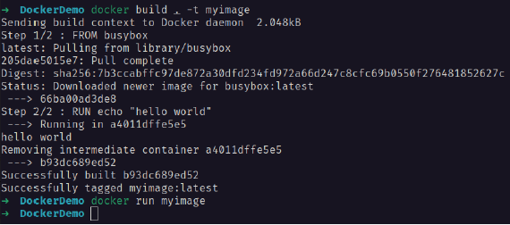
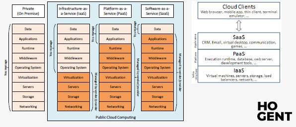
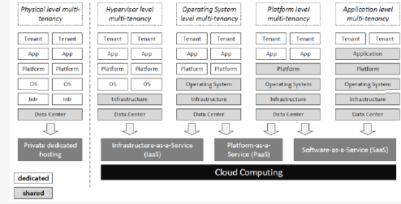

# Operating Systems : Hoofdstuk 2 - Virtualisatie

## Wat is virtualisatie?

> In de IT-wereld verwijst virtualisatie naar het creëren van een virtuele versie van iets, zoals virtuele computer hardware, virtuele opslagapparaten of virtuele netwerkbronnen.

### Virtuele architectuur

#### Traditionele vs. virtuele architectuur

Traditioneel gebruiken we een besturingssysteem. Dat besturingssysteem spreekt de hardware aan, en één of meerdere applicaties die draaien bovenop het besturingssysteem. Traditioneel kunnen we niet verschillende besturingssystemen tegelijkertijd opstarten. (installeren kan echter wel)

Met behulp van virtualisatie kan dit echter wel. We draaien virtuele computers, deze zijn geen fysieke computers, maar delen wel de onderliggende fysieke hardware.

#### Virtuele hardware

Een traditionele computer bestaat uit verschillende hardware bronnen, zoals processor, het geheugen, netwerkkaart en harde schijven. Doormiddel van virtualisatiesoftware gaan we van deze bronnen een virtuele versie maken.

Elke virtuele machine krijgt:
- vCPU - virtuele processor
- vRAM - virtueel geheugen
- één of meerdere virtuele netwerkkaarten
- één of meerdere virtuele harde schijven (virtual disks)

De virtualisatiesoftware zorgt er voor dat de fysieke hardware gedeeld wordt over de virtuele hardware. Zo worden virtuele harde schijven bewaard als bestanden op de fysieke harde schijf, zal elke virtuele machine een stukje van het fysieke geheugen reserveren, en zullen virtuele processoren met behulp van schedulling el een deel krijgen van de beschikbare processorcapaciteit.

### Voordelen van virtualisatie

- We kunnen de hardware van een machine optimaal benutten. (doormiddel van virtualisatie kunnen we  verschillende besturingssystemen met eigen applicaties op dezelfde hardware tegelijkertijd draaien)

- Gebruik van virtuele computers is goedkoper

- Mogelijke stroombesparing (mindere fysieke apparatuur)

### Nadelen van virtualisatie

- Niet alle software leent zich tot virtualisatie
- Performantie van applicaties lijdt soms onder virtualisatie
- Virtualisatie vereist technische kennis en een goede strategie rond de opzet ervan binnen een bedrijf, zeker in combinatie met cloud computing. (Anders kan het lijden tot een wildgroei aan virtuele servers met hogere beheerskosten als gevolg.)

### Virtualisatiesoftware

Veel verschillende soorten virtualisatie;

- VMware (virtualisatie mogelijk op Intel-platform)
- Microsoft Hyper-V
- Xen
- KVM (Kernel-based Virtual Machine)
- Oracle VirtualBox
- Parallels Desktop (geoptimaliseerd voor Mac)
- Docker - redelijk recent, specialere vorm van virtualisatie, gebruikt geen virtuele machines, maar een Linux kernel gedeeld door meerdere containers

## Concepten van virtualisatie

### Virtuele machine

> **Een virtuele machine (VM)** is een computerprogramma dat een volledige computer nabootst, waar andere (besturings)programma's op kunnen uitgevoerd worden.

We kunnen bij virtuele machines ook verschillende hardwarebronnen configureren:
- Virtueel geheugen (vRAM)
- één of meerdere virtuele processoren (vCPU)
- één of meerdere virtuele harde schijven (virtual disk)

> Virtuele machines worden beheerd door een **hypervisor**

#### Soorten virtuele machines

1. **Programmeertaal-specifiek**: Een virtuele machine voor een programmeertaal biedt een *abstractielaag* voor de werkelijke computer. (een verzameling basisfuncties waar programma's in de programmeertaal gebruik van moeten maken om de functies van de computer aan te spreken.) 
Dit gebeurd bij een besturingssysteem. Een dergelijke virtuele machine fungeert dus als een besturingssysteem voor de in die programmeertaal geschreven programma's. We spreken van een virtuele machine aangezien deze vaak een programma is dat uitgevoerd wordt op een bestaand besturingssysteem. De op de virtuele machine uitgevoerde code spreekt niet rechtstreeks de 'echte' hardware aan, maar gebruikt de functies die aangeboden worden door de virtuele machine. <br>
:arrow_right: Deze virtuele machines zijn *platform-onafhankelijk*: programma's kunnen worden uitgevoerd op elk systeem waarvoor de virtuele machine geïmplementeerd is. <br>
:arrow_right: Voorbeeld: **JVM** (Java Virtual Machine) - resultaat van een compilatie javacode noemen we bytecode. Een JVM kan deze bytecode één voor één interpreteren door ze te vertalen naar één of meerdere echte machine-instructies. (sommige compilers kunnen ook de bytecode *Just in time* compileren.)

2. **Emulatie**: Een virtuele machine die de hardware van de computer emuleert, niet gericht op een programmeertaal, maar emuleert een fysieke computer (processor en hardware) zodanig dat een besturingssysteem kan draaien op deze emulatie. 

3. **Applicatie-specifiek**: Deze vorm is vrij recent en wordt er meestal geen volledige computer nagebootst. <br>
:arrow_right: Voorbeeld: *Docker* - Applicaties draaien in een zogenaamde container, deze container spreken rechtstreeks de kernel aan van een Linux besturingssysteem dat op de host computer draait.

#### Hypervisor

> **Een hypervisor of Virtual Machine Monitor** is de software die gebruikt wordt om virtuele machines aan te maken en op te starten. 

De hypervisor zorgt ervoor dat de fysieke hardware gedeeld wordt over de verschillende virtuele machines.

##### Type hypervisors

1. *Type 1 hypervisor*: ligt direct op de hardware (geen tussenliggend besturingssysteem) hierdoor kunnen er meer resources aan de virtuele machines gegeven worden. 
    - Nadeel: technische kennis vereist om mee te kunnen werken
    - Hoofdzakelijk gebruikt voor en door servers
    - Voorbeelden: VMWare ESXi, Citrix Xen, KVM & Microsoft Hyper-V

2. *Type 2 hypervisor*: ligt niet rechtstreeks op de hardwarelaag, er ligt dus een besturingssysteem tussen. 
    - Voordeel: Niet veel technische kennis vereist.
    - Nadeel: Niet zo krachtig en efficiënt
    - Voorbeelden: Oracle VirtualBox, VMWare Workstation, Parallels Desktop.

> Wanneer op een toestel een Type 1 hypervisor geïnstalleerd is, kan je geen Type 2 er naast installeren. Wel kan je meerdere Type 2 hypervisors op hetzelfde fysiek toestel installeren.

## Docker 

> **Docker** is een virtualisatiesoftware die containers kan bouwen, uitvoeren en beheren. Het bootst geen volledige computer na maar de containers spreken rechtstreeks de kernel van het besturingssysteem van de host aan.

Applicaties worden geïsoleerd in containers.

### Wat is een container?

> **Containers** zijn een uitvoerbare versie van een container image

Containers voeren bepaalde code uit en gebruiken hiervoor rechtstreeks de kernel van de host. 
- Voor de container lijkt het dat hij alleen aanwezig is op de host. (**sandboxed proces** - container is volledig geïsoleerd van andere processen)

- Containers kunnen via het netwerk of een gedeeld volume wel met elkaar communiceren.

- Een container gedraagt zich identiek op elk systeem.

- Docker gebruikt kernel namespaces en cgroups

### Wat is een container image?

> **Een container image** is de blauwdruk voor een container. Een draaiende container gebruikt een geïsoleerd bestandssysteem. **De container image** bevat het bestandssysteem voor de container

Het bevat alles wat nodig is om de applicatie te starten:
- alle dependencies
- configuraties
- scripts
- binaire bestanden

Het kan ook andere info bevatten:
- environment variables
- standaard commando's bij het starten van de container
- andere metadata

### Dockerfile

> **De Dockerfile** is het belangrijkste bestand van een container image. Dit bestand specifieert hoe de image er uit zal zien.

- Welke bestanden worden gekopieerd naar de image?
- Welke environment variables zijn er?
- Welke commando's worden uitgevoerd wanneer de image gebouwd wordt?
- Welke commando's worden uitgevoerd wanneer de container start.

<p align='center'></p>

Bij een container image kan je vertrekken vanuit een bestaand base-image. Door het specifiëren van `FROM <base-image>`

Een commando uitvoeren tijdens het bouwen van de image doe je door `RUN <commando>`

Het bouwen van een image doe je door `docker build . -t <image_name>`

- `.` - geeft aan dat Docker de Dockerfile in de huidige map moet zoeken
- `-t` - geeft de naam van de image (`<image_name>`)

Het starten van een container doe je door `docker run <image_name>`

Een commando uitvoeren bij het starten van de container doe je door `CMD <commando>` of door `ENTRYPOINT <commando>`

:arrow_right: Bij `CMD` kan het `run`-commando het commando overschrijven, dit kan bij `ENTRYPOINT` niet

### Port bindings

- Containers krijgen een IP-adres in een Docker netwerk
    - Een container kan in meerdere Docker netwerken zitten
    - Een docker netwerk is een intern virtueel netwerk
- Standaard worden geen poorten beschikbaar gemaakt op de host
- Met port bindings kan je een poort van de container beschikaar maken op de host
- Je koppelt dus een poort van de container aan een poort op de host.

Port bindings zullen ook enkel en alleen werken als de container image deze poorten beschikbaar maakt voor binding via het `EXPOSE` commando in de Dockerfile

#### Voorbeeld

```bash
docker run -p 8080:80 httpd
```

- poort op host 8080
- poort in container 80

We gebruiken de **httpd** container image. Dit is een image voor een simpele Apache webserver. (standaard toont deze een webpagina op poort 80 met de zin "It works!")

- Met de optie `-p` geven we aan welke poort van de host gekoppeld moet worden aan welke poort in de container.

### Volumes

Containers hebben hun eigen bestandssysteem :arrow_right: indien we de container verwijderen zijn we ook onze data in de container kwijt. 

Dit komt doordat de host standaard niet aan de data van de container kan. 

Een oplossing hiervoor zijn **docker volumes**, ze worden gebruikt om data van containers te persisteren of om data te delen tussen host en container. 

We kunnen volumes bijvoorbeeld gebruiken om data van een databank uit de container te halen voor een backupscript. Of om code in een container te updaten tijdens development.

#### Type volumes

- **Volume**: deze wordt volledig beheerd door Docker. Docker maakt in zijn "Docker area" een map aan en plaatst deze in de container.

- **Bind mount**: een map vanop de host (eender welke locatie) wordt in de container geplaatst. Volledige controle vanop op de host (hangt af van het bestandssysteem op de host)

- **tmpfs mount**: bedoeld voor tijdelijke opslag, alles wordt in het geheugen van de host opgeslagen en is dus niet persistent.

#### Voorbeeld

```bash
docker run -v /my/own/website:/usr/local/apache2/htdocs/ \ -p 8080:80 httpd
```

We breiden het voorbeel van de port bindings uit met een *bind mount* We koppelen de map /my/own/website op de host aan de map /usr/local/apache2/htdocs in de container (wwwroot in de container)

### Docker Compose

> Tool om meerdere (samenhorende) Docker containers te beheren.

- de containers worden gedefineerd in een YAML-bestand: `docker-compose.yml`

- verschillende acties (`start`, `stop`,...) kunnen via docker-compose met één commando gebeuren voor alle dockers. (individueel blijft nog steeds mogelijk)

> We bewaren typisch enkel de containers die van elkaar afhankelijk zijn in één `docker-compose.yml` bestand.

#### Voorbeeld

```bash
docker run -p 8080:80 httpd
```
`docker-compose.yml`:

```bash
version: '3'
services:
    webserver:
        image: httpd
        ports:
            - 8080:80
```

Voorbeeld van webserver enkel pagina's terug, met daaronder hetzelfde voorbeeld via een `docker-compose.yml` bestand.

- alle containers staan onder 'services'
- 'Version' is verplicht (geeft aan in welk formaat het document geschreven is.)

Het starten van de deze containers doe je door het runnen van het commando `docker compose up` in de map die het YAML-bestand bevat.

## Multi-tenancy

**Single-Tenant**: bijvoorbeeld een persoonlijke computer. Beter afgezonderd, bied meer bescherming

**Multi-Tenant**: bijvoorbeeld fysieke server in een datacenter. Toegankelijk door verschillende personen.

### Kenmerken multi-tenancy

- Bronnen worden gedeeld, in tegenstelling tot een dedicated of isolated omgeving

- Een tenant (huurder) is een gebruiker of groep van gebruikers met gemeenschappelijke toegang

- Multi-tenancy kan geïmplementeerd worden in verschillende vormen, zowel op niveau van hardware als software

- Virtualisatie speelt een belangrijke rol bij multi-tenancy

- Multi-tenancy is een belangrijk kenmerk van Cloud Computing

### Voor- en nadelen

<table>
<thead>
<th>Voordelen</th>
<th>Nadelen</th>
</thead>
<tbody>
<tr>
<td>

Efficiënter gebruik van de beschikbare bronnen. Meerdere gebruikers kunnen bediend worden door één toestel of instantie van een applicatie

</td>
<td>

Minder isolatie en verhoogde beveiligingsrisico's, in het geval van een inbreuk op de beveiliging van één enkele instantie kunnen meerdere tenants getroffen worden.

</td>
</tr>
<tr>
<td>

Daardoor leidt multi-tenancy tot lagere operationele kosten dus goedkoper voor de eindgebruiker.

</td>
<td>

Minder prestatie-isolatie, grote tenants kunnen de prestaties van kleinere tenants negatief beïnvloeden.

</td>
</tr>
</tbody>
</table>

> Een goede multi-tenant omgeving moet zowel een duidelijke scheiding van presaties als gegevens garanderen. Hoewel één hardware- of software-instantie wordt gedeeld, moet deze zich ten opzichte van elke tenant als een aparte instantie gedragen.

## Cloud Computing

> Bij cloud computing worden computerbronnen, zoals hardware, software en gegevens, op aanvraag beschikbaar gesteld via een netwerk. (vaak het internet).

(term: afkomstig uit schematechnieken, waar een groot decentraal netwerk met behulp van een wolk wordt aangeduid)

### Kenmerken van Cloud Computing

- Bronnen zijn beschikbaar op aanvraag, vaak zonder tussenkomst van een fysiek persoon
    - bronnen = hardware, software en/of opslag
    - vaak: groot aantal servers in een datacenter die door iedereen gehuurd kunnen worden, bijvoorbeeld als VM's

- Vaak via **pay-as-you-go** pricing model (kostprijs afhankelijk van effectief verbruik)

- **Elasticiteit**: mogelijkheid om automatisch aan te passen in functie van vraag

### Opkomst van Cloud Computing

- Eerste definitie 1997 (Ramnath K. Chellappa)
- 2000 opkomst Software as a Service
- 2005-2007 opkomst Cloud Computing
    - Amazon, Google, IBM en universiteiten
    - Hand in hand met opkomst virtualisatie
        - VMWare, VirtualBox, Microsoft, Citrix
- Analogie met mainframes (servers) en terminals (clients)
    - Geen centraal mainframe maar een gedistribueerde omgeving

### Cloud

- Soort van wolk van computers
- Virtualisatie van serveromgeving
    - eindgebruiker weet niet waar de instanties draaien
    - eindgebruiker weet soms ook niet op hoeveel servers
    - eindgebruiker is geen eigenaar meer van de hardware/software
    - eindgebruiker is niet verantwoordelijk voor het onderhoud
- Schaalbare, virtuele infrastructuur

### Deployment modellen

1. **Publieke** Cloud omgeving

    - Beschikbaar voor iedereen via het internet

2. **Private** Cloud omgeving

    - Toegang beperkt tot één of meerdere organisaties
    - Kan in privaat (self hosted) of publiek (colocated) datacenter
    - Gebruiker heeft zelf controle over data, beveiliging en kwaliteit van de dienst.

3. **Hybride** Cloud omgeving

    - Combinatie van meerdere modellen
    - Dit kan door legale redenen (gevoelige data mag in sommige landen niet in het buitenland bewaard worden. Men kan deze dan opslaan op een private cloud, terwijl het zwaar rekenwerk op een publieke cloud kan gebeuren)

> Algemeen zijn publieke Cloud omgevingen veel groter dan private cloud omgevingen. 

*Om een private cloud op te starten heb je niet veel nodig. Een krachtige computer met enkele virtuele machines kan voldoende zijn. Samen met een gratis software zoals **OpenStack***.

### Service modellen

Binnen de Cloud worden diensten vaak aangeboden volgens één van volgende service modellen:

- **Infrastructure as a Service (IaaS)** - infrastructuur wordt aangeboden via virtualisatie of hardware-integratie. 

    - Gebruiker heeft controle over besturingssysteem, software en (virtuele) hardware.
    - Infrastructuur wordt virtueel aangeboden aan de eindgebruiker waarop men extern kan inloggen (via bv. ssh)
    - voorbeeld: Amazon EC2

- **Platform as a Service (PaaS)** - aanbieder biedt enkel diensten bovenop de infrastructuur.

    - Platform en diensten (bv. toegangsbeheer) aangeboden
    - Gebruiker heeft controle over software, maar niet over onderliggende hardware
    - Bevat vaak één of meerdere frameworks (Python, .NET, Java)
    - voobeeld: Microsoft Azure App Service, Google AppEngine,...

- **Software as a Service (SaaS)** - aanbieder biedt eindapplicaties aan "via de cloud"

    - Aanbieden van applicaties
    - De dienstaanbieder heeft volledige controle over de applicaties, klant kan vaak wel de applicatie configureren.
    - In vele gevallen zijn "SaaS"-applicaties te gebruiken via de webbrowser
    - voorbeeld: Gmail, Office 365, Salesforce,...


<p align='center'></p>

> [!warning]
> **Belangrijk** verschil in de modellen is welke delen (lagen) beheerd worden door de Cloud provider en welke door de gebruiker. 

### Virtualisatie

Virtualisatie speelt een belangrijke rol binnen Cloud Computing. Bij Cloud computing worden dan ook vaak virtuele bronnen beschikbaar gesteld aan de eindgebruiker, bijvoorbeeld in de vorm van virtuele machines. 

Soort virtualisaties:

- server virtualisatie
- virtualisatie van opslag
- netwerk virtualisatie
- virtualisatie van applicaties
- virtualisatie van volledige desktopomgevingen

### Elasticiteit van de Cloud

> **Elasticiteit** is de mate waarin het aanbod zich afstemt op eens stijgende of  dalende vraag. 

***Concreet:*** meer virtuele bronnen worden ingezet wanneer er meer gebruikers de cloud applicatie gebruiken (= **piekbelasting**). Tevens kunnen er bronnen vrijgegeven worden wanneer de belasting daalt.

- Automatische provisie van benodigd aantal instanties

    - sommige cloud omgevingen kunnen dit voorzien
    - Hoe correct de benodigde instanties inschatten?
        - Proactief: proberen te voorspellen op voorhand
        - Reactief: reageren op op de wijziging in vraag
    - Vaak maken cloud omgevingen gebruik van zelflerende modellen op basis van historische data


- Publieke Cloud: "oneindige" hoeveelheid bronnen

Idealiter voorzien we net voldoende bronnen voor de verschillende applicaties, afhankelijk van de huidige belasting van de eind gebruikers. Dit is vaak verkeerd ingeschat, hierbij spreken we van **over- of under-provisioning**

**over-provisioning**: meer middelen toegewezen dan nodig. (onnodige kosten). Bij vele providers worden de provisioned aantal bronnen aangerekend en niet de effectief gebruikte.

**under-provisioning**: minder middelen beschikbaar dan nodig om de applicaties correct te kunnen laten draaien. 

### Cloud Computing = Multi-tenancy

<p align='center'></p>

Cloud Computing is een mooi voorbeeld van multi-tenancy. Vaak maken verschillende gebruikers gebruik van dezelfde set fysieke hardware.

