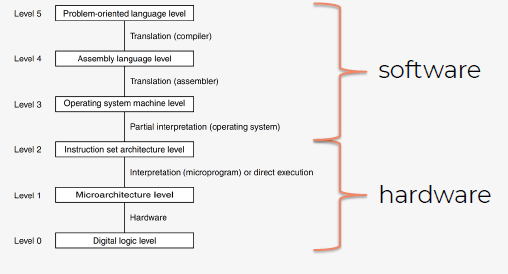
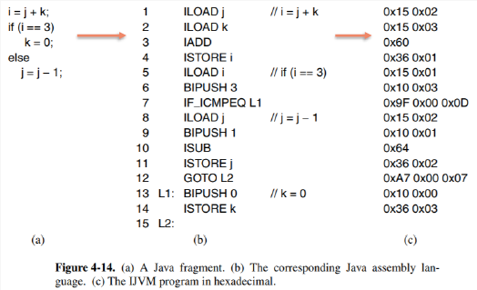
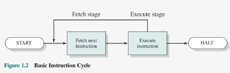
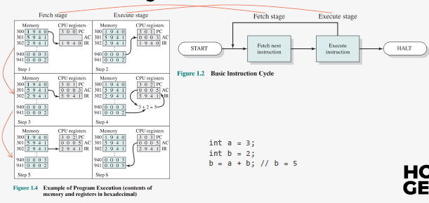
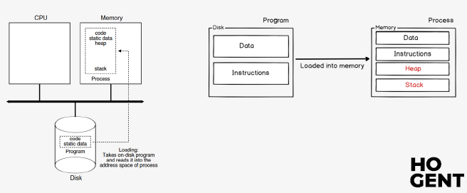
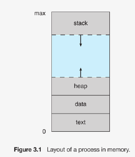
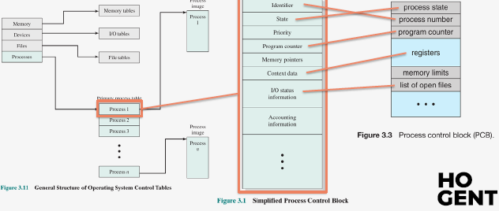

# Operating Systems : Hoofdstuk 3 - Processen

## Van programma tot proces

### Compileren

Wanneer we een programma schrijven in een programmeertaal is dat niet meteen uitvoerbaar door de hardware. De CPU verstaat deze programmeertalen niet. Elke type CPU heeft een bepaalde verzameling instructies die het begrijpt (= **instructieset** van dat type CPU). 

Elk programma moet dus omgezet worden can de programmeertaal tot een verzameling instructies uit de instructieset (= **compileren**).

<p align='center'></p>

**Een Java-fragement met bijhorende Java Assembly Language en binaire code**

<p align='center'></p>

### Instructieset

De instructieset is uniek per type CPU. Er zijn verschillende types:

- x86: de 32-bits instructieset die vroegere door Intel en AMD werd gebruikt voor gebruiker-laptop en -desktops.

- x86-64: vervangt de "x86". De instructieset die tegenwoordig door de meeste Intel en AMD processoren gebruikt wordt

- ARM: Dit type processor wordt gebruikt op bv de Raspberry Pu, smartphones, tablets. Hoofdzakelijk door de lage kost en het lage energieverbruik.

- MIPS: Wordt gebruikt in embedded devices, zoals routers, switches, printers, smartphones, tablets en zelfs supercomputers.

- JVM: De Java Virtual Machine. Compileert de javacode naa bytecode. (soort tussentaal met een instructieset voor een virtuele machine, JVM. De programmeur moet enkel compileren naar bytecode, daarna zal dit verder werken op elke CPU)

- 8051: Wordt soms nog gebruikt in embedded devices en in het onderwijs.


> Een programmeur dient dus zijn programma te compileren naar elk type CPU waarop het programma moet kunnen uitgevoerd worden.

### Instructiecyclus

De computerhardware werkt steeds oneindig lang volgens hetzelfde stappenplan. Het eenmalig uitvoeren van dit stappenplan noemt men een **cyclus**:

<p align='center'></p>

In de meest eenvoudige vorm bestaat deze uit:
- *Fetch*: Haal de volgende uit te voeren instructie op.
- *Execute*: Voer deze instructie uit

#### Voorbeeld

<p align='center'></p>

In dit voorbeeld wordt een simpel programma uitgevoerd dat 2 getallen optelt en het resultaat opslaat. Dit zou bv het volgende programma kunnen zijn:

```java
int a = 3;
int b = 2;
int b = a + b; // b = 5
```

De instructies voor de hardware van dit systeem zijn als volgt:

- `1xxx` : Kopieer de waarde op adres `xxx` in het geheugen naar het AC register.

- `2xxx` : Sla de waarde in het AC register op in het geheugen op adres `xxx`

- `5xxx` : Tel de waade op adres `xxx` in het geheugen op bij de waarde in het AC register en sla het resultaat op in het AC register.

We zien hier de volgende CPU registers:

- *PC - Program Counter*: Dit register houdt het adres bij van de uit te voeren instructie.
- *IR - Instruction Register*: Dit register houdt de uit te voeren instructie bij. De hardware analyseert de bits in dit register om de handeling van de instructie uit te voeren.
- *AC - Accumulator*: Een hulpregister voor tussenresultaten op te slaan van bewerkingen.

Het programma is gecompileerd naar de volgende instructies van de CPU:
- 1940 : Kopieer de waarde op adres 940 in het geheugen naar het AC register
- 5941 : Tel de waarde op adres 941 in het geheugen op bij de waarde in het AC register en sla het resultaat op in het AC register
- 2941 : Sla de waarde in het AC register op in het geheugen op adres 941

We zien per cyclus de volgende stappen:

1. *Fetch*: Kopieer de uit te voeren instructie op het adres volgens de PC van het geheugen naar het IR register Verhoog de PC met 1 zodat deze klaar staat voor de juiste instructie op te halen voor de volgende cyclus.

2. *Execute*: Analyseer de instructie in het IR register en voer deze uit.

### Interrupts

Bij computersystemen treden er soms events op: er wordt een nieuw apparaat aangesloten, de gebruiker voert iets uit, er treed ergens een fout op, er is een timer afgegaan. De computer moet hierop kunnen reageren. Zulke onderbrekingen noemen we **Interrupts**

De *fetch-cyclus* kan uitgebreid om *interrupts* mogelijk te maken, hiervoor wordt na de *execute-cyclus* een extra stap toegevoegd voor de interrupts. 

Bij de interrupts stap wordt er gekeken of er een interrupt is opgetreden:

- **geen interrupt opgetreden**, men gaat verder naar de volgende cyclus.
- **er is wel een interrupt opgetreden**: de uitvoering van het programma wordt onderbroken. We slaan de huidige toestand van het programma op. We slaan ook het PC register op zodat we niet vergeten op welke plek het programma werd onderbroken. Het systeem voert hierna de instructies voor de interrupt uit via de *fetch-excecute-cyclus*.
Het wisselen van het ene programma naar het andere noemen we een *context switch*.
De verzameling instructies vanuit de interrupt noemen we *de interrupt handler*. Eens de interrupt is afgehandeld, wordt de toestand van het oude programma herstelt en wordt het oude programma verder uitgevoerd.

<p align='center'></p>

### Binaries

> Het bestand gegenereerd door een compiler wordt ook wel **binary of een executable** genoemd.

- **Windows:** gecompiled naar een PE formaat (Portable Executable). In de volksmond `.exe`-formaat

- **Linux:** gecompiled naar het ELF formaat (Executable and Linkable Format) 

- **Mac:** gecompiled naar het Mach-O (Mach Object) formaat


Besturingssystemen bieden verschillende functies aan programmeurs aan:
Zo is bv. het aanmaken van een venster in GUI  verschillend voor elk besturingssysteem.

> Hierdoor zal een programmeur een specifieke versie moeten maken voor een besturingssysteem en deze compileren. 

Zo kan bijvoorbeeld standaard een `.exe` gecompileerd bestand niet uitgevoerd worden op Linux systeem. (wel via 3rd party applicaties zoals `Wine`)

### Van binary to proces

Eenmaal de binary is aangemaak, is deze simpelweg een bestand dat opgeslagen is op de hdd of ssd. Wanneer de gebruiker het programma wil uitvoeren worden de instructies gekopieerd naar het RAM geheugen. 

> Deze instantie van het programma in het RAM geheugen wordt **een proces** genoemd.

Het bestand op de schijf (programma) is niet hetzelfde als het proces. Het bestand op de schijf is iets passief: pas wanneer een instantie daarvan wordt ingeladen in het RAM geheugen krijgen we iets actief, nl. het proces.

<p align='center'></p>

## Opbouw van een proces

> **Een proces** is een instantie van een programma dat uitgevoerd wordt op het systeem

Wanneer we 2x een programma openen, dan draaien er 2 instanties van dat programma. Ondanks er maar een bestand op het systeem staat. Die 2 instanties van dat programma worden binnen een besturingssysteem voorgesteld door processen. 

Een proces is dus een soort container die alles bevat om een programma te kunnen uitvoeren. Dankzij processen kunnen besturingssystemen programma's die uitgevoerd worden beheren. Ook kan het besturingssysteem er voor zorgen via het gebruik van processen dat er verschillende programma's tegelijkertijd uitgevoerd worden. 

Een proces in het RAM geheugen kan enkel een bepaald deel van het RAM geheugen aanspreken om de inhoud ervan te lezen of ernaar te schrijven.

> Dit gedeelte van noemt men **de address space** van dat proces.

De address space bevat onder andere de uitvoerbare instructies en de data van het programma.

### Proces Image

> **De process image** is hoe het proces er uit ziet in het RAM geheugen. Het is een momementopname van de address space van een proces. 

Dit bevat in het algemeen de volgende zaken:

- *Text*: de uit te voeren instructies
- *Data*: de globale variabelen
- *Stack*: tijdelijke opslag voor variabelen, functie parameters, adressen voor return functies,... (als er geen plaats meer is op de stack, door bv. een te diepe of oneindige recursie, dan krijgt men de befaamde *stackoverflow error*)
- *Heap*: dynamisch gealloceerd geheugen. Als iets te groot is om op de stack te plaatsen, of als er iets beschikbaar moet zijn over de grenzen van functies heen, dan is de stack geen bruikbare optie. In dat geval kunnen we gebruik maken van de heap om iets dynamisch te alloceren. *De heap werkt wel niet zoals de stack, alles wat erop wordt bewaard, blijft beschikbaar tot door de programmeur wordt opgekuist.*

> De exacte vorm van een process image is sterk afhankelijk van het besturingssysteem

<p align='center'></p>

### Proces Control Block

> Het besturingssysteem heeft een overzicht van alle actieve processen. Dit overzicht heeft de vorm van een tabel en wordt ook wel de **proces table** genoemd. 

> Elk element in de tabel bevat informatie over het proces en wordt **een process control block (PCB)** genoemd.

Een PCB bevat volgende informatie:

- Unieke identificatie informatie over het proces
- Informatie om de staat van het proces bij te houden bij context switches
- Informatie om het proces te beheren. 

> De vorm van een PCB is sterk afhankelijk van het besturingssysteem. 

<p align='center'></p>

## Soorten processen

