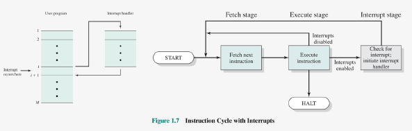

# Operating Systems : Hoofdstuk 3 - Processen

## Van programma tot proces

### Compileren

Wanneer we een programma schrijven in een programmeertaal is dat niet meteen uitvoerbaar door de hardware. De CPU verstaat deze programmeertalen niet. Elke type CPU heeft een bepaalde verzameling instructies die het begrijpt (= **instructieset** van dat type CPU).

Elk programma moet dus omgezet worden can de programmeertaal tot een verzameling instructies uit de instructieset (= **compileren**).

<p align='center'></p>

**Een Java-fragement met bijhorende Java Assembly Language en binaire code**

<p align='center'></p>

### Instructieset

De instructieset is uniek per type CPU. Er zijn verschillende types:

- x86: de 32-bits instructieset die vroegere door Intel en AMD werd gebruikt voor gebruiker-laptop en -desktops.

- x86-64: vervangt de "x86". De instructieset die tegenwoordig door de meeste Intel en AMD processoren gebruikt wordt

- ARM: Dit type processor wordt gebruikt op bv de Raspberry Pu, smartphones, tablets. Hoofdzakelijk door de lage kost en het lage energieverbruik.

- MIPS: Wordt gebruikt in embedded devices, zoals routers, switches, printers, smartphones, tablets en zelfs supercomputers.

- JVM: De Java Virtual Machine. Compileert de javacode naa bytecode. (soort tussentaal met een instructieset voor een virtuele machine, JVM. De programmeur moet enkel compileren naar bytecode, daarna zal dit verder werken op elke CPU)

- 8051: Wordt soms nog gebruikt in embedded devices en in het onderwijs.


> Een programmeur dient dus zijn programma te compileren naar elk type CPU waarop het programma moet kunnen uitgevoerd worden.

### Instructiecyclus

De computerhardware werkt steeds oneindig lang volgens hetzelfde stappenplan. Het eenmalig uitvoeren van dit stappenplan noemt men een **cyclus**:

<p align='center'></p>

In de meest eenvoudige vorm bestaat deze uit:
- *Fetch*: Haal de volgende uit te voeren instructie op.
- *Execute*: Voer deze instructie uit

#### Voorbeeld

<p align='center'></p>

In dit voorbeeld wordt een simpel programma uitgevoerd dat 2 getallen optelt en het resultaat opslaat. Dit zou bv het volgende programma kunnen zijn:

```java
int a = 3;
int b = 2;
int b = a + b; // b = 5
```

De instructies voor de hardware van dit systeem zijn als volgt:

- `1xxx` : Kopieer de waarde op adres `xxx` in het geheugen naar het AC register.

- `2xxx` : Sla de waarde in het AC register op in het geheugen op adres `xxx`

- `5xxx` : Tel de waade op adres `xxx` in het geheugen op bij de waarde in het AC register en sla het resultaat op in het AC register.

We zien hier de volgende CPU registers:

- *PC - Program Counter*: Dit register houdt het adres bij van de uit te voeren instructie.
- *IR - Instruction Register*: Dit register houdt de uit te voeren instructie bij. De hardware analyseert de bits in dit register om de handeling van de instructie uit te voeren.
- *AC - Accumulator*: Een hulpregister voor tussenresultaten op te slaan van bewerkingen.

Het programma is gecompileerd naar de volgende instructies van de CPU:
- 1940 : Kopieer de waarde op adres 940 in het geheugen naar het AC register
- 5941 : Tel de waarde op adres 941 in het geheugen op bij de waarde in het AC register en sla het resultaat op in het AC register
- 2941 : Sla de waarde in het AC register op in het geheugen op adres 941

We zien per cyclus de volgende stappen:

1. *Fetch*: Kopieer de uit te voeren instructie op het adres volgens de PC van het geheugen naar het IR register Verhoog de PC met 1 zodat deze klaar staat voor de juiste instructie op te halen voor de volgende cyclus.

2. *Execute*: Analyseer de instructie in het IR register en voer deze uit.

### Interrupts

Bij computersystemen treden er soms events op: er wordt een nieuw apparaat aangesloten, de gebruiker voert iets uit, er treed ergens een fout op, er is een timer afgegaan. De computer moet hierop kunnen reageren. Zulke onderbrekingen noemen we **Interrupts**

De *fetch-cyclus* kan uitgebreid om *interrupts* mogelijk te maken, hiervoor wordt na de *execute-cyclus* een extra stap toegevoegd voor de interrupts. 

Bij de interrupts stap wordt er gekeken of er een interrupt is opgetreden:

- **geen interrupt opgetreden**, men gaat verder naar de volgende cyclus.
- **er is wel een interrupt opgetreden**: de uitvoering van het programma wordt onderbroken. We slaan de huidige toestand van het programma op. We slaan ook het PC register op zodat we niet vergeten op welke plek het programma werd onderbroken. Het systeem voert hierna de instructies voor de interrupt uit via de *fetch-excecute-cyclus*.
Het wisselen van het ene programma naar het andere noemen we een *context switch*.
De verzameling instructies vanuit de interrupt noemen we *de interrupt handler*. Eens de interrupt is afgehandeld, wordt de toestand van het oude programma herstelt en wordt het oude programma verder uitgevoerd.

<p align='center'></p>

### Binaries

> Het bestand gegenereerd door een compiler wordt ook wel **binary of een executable** genoemd.

- **Windows:** gecompiled naar een PE formaat (Portable Executable). In de volksmond `.exe`-formaat

- **Linux:** gecompiled naar het ELF formaat (Executable and Linkable Format) 

- **Mac:** gecompiled naar het Mach-O (Mach Object) formaat


Besturingssystemen bieden verschillende functies aan programmeurs aan:
Zo is bv. het aanmaken van een venster in GUI  verschillend voor elk besturingssysteem.

> Hierdoor zal een programmeur een specifieke versie moeten maken voor een besturingssysteem en deze compileren. 

Zo kan bijvoorbeeld standaard een `.exe` gecompileerd bestand niet uitgevoerd worden op Linux systeem. (wel via 3rd party applicaties zoals `Wine`)

### Van binary to proces

Eenmaal de binary is aangemaak, is deze simpelweg een bestand dat opgeslagen is op de hdd of ssd. Wanneer de gebruiker het programma wil uitvoeren worden de instructies gekopieerd naar het RAM geheugen. 

> Deze instantie van het programma in het RAM geheugen wordt **een proces** genoemd.

Het bestand op de schijf (programma) is niet hetzelfde als het proces. Het bestand op de schijf is iets passief: pas wanneer een instantie daarvan wordt ingeladen in het RAM geheugen krijgen we iets actief, nl. het proces.

<p align='center'></p>

## Opbouw van een proces

> **Een proces** is een instantie van een programma dat uitgevoerd wordt op het systeem

Wanneer we 2x een programma openen, dan draaien er 2 instanties van dat programma. Ondanks er maar een bestand op het systeem staat. Die 2 instanties van dat programma worden binnen een besturingssysteem voorgesteld door processen. 

Een proces is dus een soort container die alles bevat om een programma te kunnen uitvoeren. Dankzij processen kunnen besturingssystemen programma's die uitgevoerd worden beheren. Ook kan het besturingssysteem er voor zorgen via het gebruik van processen dat er verschillende programma's tegelijkertijd uitgevoerd worden. 

Een proces in het RAM geheugen kan enkel een bepaald deel van het RAM geheugen aanspreken om de inhoud ervan te lezen of ernaar te schrijven.

> Dit gedeelte van noemt men **de address space** van dat proces.

De address space bevat onder andere de uitvoerbare instructies en de data van het programma.

### Proces Image

> **De process image** is hoe het proces er uit ziet in het RAM geheugen. Het is een momementopname van de address space van een proces. 

Dit bevat in het algemeen de volgende zaken:

- *Text*: de uit te voeren instructies
- *Data*: de globale variabelen
- *Stack*: tijdelijke opslag voor variabelen, functie parameters, adressen voor return functies,... (als er geen plaats meer is op de stack, door bv. een te diepe of oneindige recursie, dan krijgt men de befaamde *stackoverflow error*)
- *Heap*: dynamisch gealloceerd geheugen. Als iets te groot is om op de stack te plaatsen, of als er iets beschikbaar moet zijn over de grenzen van functies heen, dan is de stack geen bruikbare optie. In dat geval kunnen we gebruik maken van de heap om iets dynamisch te alloceren. *De heap werkt wel niet zoals de stack, alles wat erop wordt bewaard, blijft beschikbaar tot door de programmeur wordt opgekuist.*

> De exacte vorm van een process image is sterk afhankelijk van het besturingssysteem

<p align='center'></p>

### Proces Control Block

> Het besturingssysteem heeft een overzicht van alle actieve processen. Dit overzicht heeft de vorm van een tabel en wordt ook wel de **proces table** genoemd. 

> Elk element in de tabel bevat informatie over het proces en wordt **een process control block (PCB)** genoemd.

Een PCB bevat volgende informatie:

- Unieke identificatie informatie over het proces
- Informatie om de staat van het proces bij te houden bij context switches
- Informatie om het proces te beheren. 

> De vorm van een PCB is sterk afhankelijk van het besturingssysteem. 

<p align='center'></p>

## Soorten processen

Er bestaan 3 soorten processen:
- **Interactief proces**: 

    - Opstarten en controleren vanuit een terminal sessie
    - Kunnen zowel in voorgrond (foreground) als achtergrond (background) draaien
    - Foreground proces: blokkeert terminal zolang het loop
    - Background proces: blokkeert terminal enkel bij opstart van het proces, nadien kan de terminal andere taken uitvoeren

- **Automatische processen**:

    - Ook wel "batch" processen genaamd
    - Verzameling van processen die in een wachtrij worden geplaatst wachten op uitvoering
    - Bij uitvoering worden alle processen één voor één uit de wachtrij uitgevoerd. (volgens het **FIFO** principe: First In, First Out)
    - voorbeeld: automatisch een back-up maken elke dag om middernacht

- **Daemons**: 

    - Processen die continu draaien
    - Veelal gestart bij opstarten van systeem
    - Wachten in de achtergrond tot ze nodig zijn
    - Ook gekend als services
    - Voorbeeld: onedrive synchronisatie client, e-mail server

## Beheer van processen

### Ontstaan van processen

Het ontstaan van processen verschilt van besturingssysteem tot besturingssysteem. We bekijken hier *Linux*.

> Op een Linux systeem heeft elke proces een **Process Identifier (PID)**, een uniek ID-nummer.

Bij het opstarten van een Linux-systeem start als eerst het proces met `PID = 1`, in de recentere systemen is dit het proces `systemd`, op oudere systemen is dit nog het proces `init`.

`systemd` is dus bij recentere linux distro's de moeder van alle processen. Alle andere processen worden als kinderen van een ouderproces aangemaakt. Er onstaat een *proces-boom*

<p align='center'></p>

- `systemd` - moederproces
- `logind` - proces dat ervoor zorgt dat gebruikers kunnen inloggen
- `python` - proces dat ervoor zorgt dat python programma's kunnen uitgevoerd worden
- `sshd` - proces dat ervoor zorgt dat gebruikers kunnen inloggen via SSH
- `bash` - Een gebruiker is ingelogd en kan via dit proces een bash-shell weergeven
- `ps` en `vim` - processen uitgevoerd in de bash-shell
- `tcsh` - een gebruiker is ingelogd via SSH en gebruikt dit kindproces

Het aanmaken van een proces in Linux bestaat uit het aanroepen van 2 functies:

- `fork()`: Deze functie maakt een exacte kopie van het proces in het RAM geheugen (een kopie van diens address space) en vult de PID van het proces in met een nieuw ongebruikt procesnummer. Daarnaast vult de functie het PPID (Parent Process Identifier) in met het PID van het ouderproces

- `exec()`: Het nieuw aangemaakt kindproces wordt overschreven met de nodige waarden voor het gewenst proces. Zo worden bv. de juiste instructies, waarden,... ingelezen naar het procesbeeld van het kindproces.

### Afbraak van processen

- `exit()`: Commando dat er voor zorgt wanneer een proces zijn taak heeft volbracht of er een fout optreedt, het wordt afgeloten.

    - parameter 0: proces is correct afgewerkt
    - parameter verschillend van 0: fout opgetreden. (getal is **foutcode** die vertelt welke fout is opgetreden)

- Indien het proces is afgesloten, wordt het procesbeeld (proces image) verwijderd en alle resources (bestanden, geheugen) dat het proces in gebruik had worden vrijgegeven.

- PCB in de proces table mag nog niet meteen vrijgegeven worden. Het bevat de foutcode die aangeeft waarom het proces is afgesloten. (bij direct afsluiten kan ouderproces niet achterhalen waarom kindproces is afgesloten)

> **Zombieproces** is een proces waarvan enkel de PCB nog bestaat.

Deze bestaan normaal slechts kort, de PCB wordt snel na het afsluiten van het kindproces gelezen door het ouderproces waardoor het PCB verwijderd mag worden.

> **Orphan proces** is een zombieproces waarvan nooit de foutcode gelezen wordt. 

Het Besturingssysteem kan hier niet meer aan de PCB's en deze vervuilen dus de process table van het besturingssysteem. 

### States

De processen kunnen zich in verschillende toestanden, ookwel *states* bevinden. 

#### 2-state schedulling model

- *running*: dit proces wordt uitgevoerd op de CPU
- *not running*: dit proces wordt niet uitgevoerd op de CPU

Processen die staan te wachten op de CPU worden in een queue geplaatst. Nieuwe processen krijgen een PCB in de process table, en worden aan de queue toegevoegd. 

> Nieuwe processen hebben dus steeds de *not running state* tenzij ze rechtstreeks door de CPU mogeen gebruikt worden.

<p align='center'></p>

#### 5-state schedulling model

Meeste besturingssystemen zijn complexer dan het 2-state-schedulling model. Zo kan het zijn dat processen wachten op een antwoord van I/O. In dat geval draait het proces nog niet op de CPU en staat het ook nog niet in de queue. We hebben dus extra toestanden nodig:

- *New*: nieuw aangemaakt proces door het besturingssysteem. Meestal met reeds een aagemaakt PCB toegevoegd aan de process table maar nog niet ingeladen in het geheugen. Soms wordt er een limiet gezet op de processen in de queue. Als deze vol is mogen processen van de "new" state niet overgaan naar de "ready" state.

- *Ready*: Een proces dat wacht tot het op de CPU mag

- *Running*: Het proces wordt uitgevoerd op de CPU

- *Blocked*: Een proces dat staat te wachten op iets (zoals lezen/schrijven uit of naar het RAM, geheugen, harde schijf, SSD, netwerk, ...)

- *Exit*: Een afgewerkt proces.

>[!caution]
>De exit-toestand zegt niets over het feit dat het proces correct is afgewerkt of er een fout is opgelopen.

**Enkele belangrijke overgangen:**

- Ready :arrow_right: Running : Het proces dat als eerste staat in de wachtrij mag op de CPU

- Running :arrow_right: Ready : Processen mogen vaak slechts een bepaalde maximum tijd op de CPU. (maximum tijd wordt **quantum of time slice** genoemd) Wanneer de tijd is verlopen, wordt het proces van de CPU gehaald en achteraan de wachtrij geplaatst. (**pre-emption** = het onderbreken van een proces)

- Running :arrow_right: Blocked : Het proces moet wachten op iets (bv I/O) en wordt van de CPU gehaald zodata deze gebruikt kan worden door een ander process dat de CPU tijd kan gebruiken

- Blocked :arrow_right: Ready : Het proces heeft gedaan met wachten (bv. I/O). Dit is vaak het resultaat van een gebeurtenis (event) (bv. data is gelezen van hdd) Het proces heeft opnieuw CPU tijd nodig en wordt dus achteraan de wachtrij geplaatst.

#### 6-state schedulling model

Processen in het 5-state schedulling model bevinden zich allemaal in het RAM geheugen van het systeem. 

Soms kan het RAM geheugen echter vol geraken. Om dit op te lossen kan het systeem bepaalde processen die in wacht staan uit het RAM geheugen halen en naar de harde schijf of SSD verplaatsen. 

> Dit concept wordt ook wel **swapping** genoemd.

Zulke processen bevinden zicht dan in de *Suspend* toestand. Wanneer het systeem terug genoeg vrij geheugen in het RAM heeft, kan het systeem terug processen vanop de harde schijf of SSD verplaatsen naar het RAM. De processen krijgen dan terug de *Ready* toestand.

#### Swapping (suspend)

Het wegschrijven naar de harde schijf en de SSD gebeurd op Windows naar de `swapfile.sys` en de `pagefile.sys` bestanden. Op Linux is er echter een volledige partitie voorzien waarnaar deze processen geschreven worden. 

**Swappen is echter een intensief en traag proces. De HDD of SSD is veel trager als het RAM-geheugen.** 

## Schedulling

### Multiprogramming

- CPU zo optimaal mogelijk gebruiken
    - I/O is trager dan CPU
    - Sommige processen moeten wachten op iets 
- Wanneer een proces moet wachten, kan een ander proces gebruik maken van de CPU. 

> Percentage dat de CPU in gebruik is noemt men ook wel **CPU utilization**

$$CPU \text{ } Utilization = \frac{CPU \text{ } Usage \text{ }Time} {Total \text{ }Time}$$

Wanneer een geen activiteit op de CPU is, is de CPU idle. 

> Het besturingssysteem probeert de CPU Utilization zo hoog mogelijk te houden en de CPU idle time zo laag mogelijk. 

$$CPU \text{ } Idle = \frac{CPU \text{ } Idle \text{ }Time} {Total \text{ }Time}$$

Hierbij zijn wel enkele valkuilen.

- Snelheid van de CPU ligt hoger dan de rest van de hardware. 
- Elke keer een programma dus iets van opslag of netwerk nodig heeft moet het dus wachten en verliezen we tijd op de CPU.
- Om dat op te lossen wordt er reeds een ander proces op de CPU geplaatst. 
- Wanneer het eerste proces gedaan heeft met wachten op de I/O vraagt het terug CPU tijd aan.

> Dit volledige proces noemen we **Multiprogramming**. Het zorgt ervoor dat de CPU continu bezig blijft en dat er dus geen CPU tijd verloren gaat. 

*De CPU kan best net geen 100% draaien. Wanneer de CPU aan 100% draait zal de volgende interrupt die binnenkomt niet kunnen afgehandeld worden.*

### Time-Sharing

> **Time-Sharing** is het concept waarbij de CPU de uitvoering van de processen afwisselt om zo de gebruiker de ilusie te geven dat de processen simultaan worden uitgevoerd.

- processen op de CPU wisselen elkaar (snel) af
- OS moet bepalen hoelang processen op de CPU mogen
    - te kort: niet efficiënt, CPU steekt te veel tijd in het afwisselen.
    - te lang: gebruiker kan dit opmerken

>[!important]
>**Multiprogramming** en **Time-Sharing** hebben dus een verschillend doel:
> - **Multiprogramming**: de CPU te volle benutten
> - **Time-Sharing**: de illusie van parallele processen creeëren

### Context switch

> **Een context switch** is het nemen van een snapshot van een volledig proces en het opslaan in het geheugen. 

Telkens wanneer we overschakelen van het ene proces op de CPU naar het andere, wordt de snapshot van het nieuwe proces ingeladen en slaat men van het oude proces de snapshot opnieuw op.

Het proces doet verder daar waar de snapshot is opgenomen.

*Een klein nadeel, het nemen en inladen van een snapshot neemt wat geheugen in, volgende zaken moeten ondere andere ingeladen worden:*

- de stack
- de heap
- data
- registers

### Scheduler

> **De scheduler** is het onderdeel in het besturingssysteem dat beslist wanneer een bepaald proces CPU tijd krijgt. 

Meestal het First Come First Serve principe: Het eerste proces op de queue zal al eerste uitgevoerd worden. 

We beschouwen de volgende type processen:

- **Batch programma's**: bestaan uit processen die een na een moeten uitgevoerd worden en vaak geen interactie met de gebruiker hebben. (vaak een reeks opdrachten die uitgevoerd worden) Hier volstaat een wachtrij systeem.

- **Interactieve programma's**: bestaan uit processen op command line of GUI waarmee we het meest vertrouwd zijn. We kunnen ze uitvoeren door zaken te typen of op knoppen te drukken. Deze programma's kunnen blijven hangen wanneer *de scheduler* zijn werk niet goed doet.

- **Real-time systemen** zijn systemen die een hoge snelheidsrespons nodig hebben. Streamen bv. heeft een grote inpakt op de gebruiker wanneer er kleine vertragingen optreden en er zo lag voordoet. *Schedulers doen er goed aan om zulke processen voorrang te geven*.

### Preemption

> **Preemption** is wanneer het systeem het huidig proces onderbreekt. 

- Nodig wanneer een proces het systeem wil monopoliseren
- Wisselen van proces zorgt voor extra overhead (extra resources die al dan niet overbodig door het systeem gebruikt worden)
- Huidig proces wordt terug in de wachtrij gezet indien niet voltooid

**Theoretisch probleem**: Een nieuw proces komt toe net op het moment dat een running proces wordt onderbroken. Welk proces wordt het eerste aan de wachtrij toegevoegd?
- In praktijk komt dit zelden of nooit voor (steeds een klein verschil)
- In voorbeelden in de cursus komt dit wel voor (werken met discrete tijdswaarden.)

### Starvation

In sommige gevallen kan het zijn dat bepaalde processen nooit geen CPU tijd krijgen:

- De scheduler geeft voorrang aan kort processen
- Er komen steeds nieuwe korte processen in het systeem

:arrow_right: zorgt ervoor dat de langere processen steeds uitgesteld worden.

### Scheduler-types

- **Non-preemptive**: processen die geen gebruik maken van context switches en dus pas wisselen van proces wanneer een proces volledig afgewerkt is. 
- **Preemptive**: processen die gebruik maken van context switches om processen op de CPU te onderbreken en te wisselen van proces. 

1. **First Come First Serve**