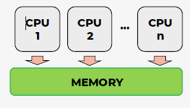
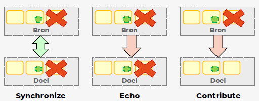
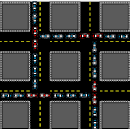

# Operating Systems : Hoofdstuk 4 - Concurrency

## Wat is concurrency?

In de meeste moderne computers kunnen er meerdere processen gelijktijdig actief zijn. Ze kunnen al dan niet gelijktijdig uitgevoerd worden. 

We kunnen een onderscheid maken tussen:

- **Multiprogramming**: het beheer van meerdere processen in het systeem met één processor

- **Multiprocessing**: het beheer van meerdere processen in het systeem met meerdere processoren

- **Gedistribueerde verwerking**: het beheer van meerdere processen die worden uitgevoerd op een aantal verspreide (= gedistribueerde) computersystemen

> **Concurrency** verwijst naar processen of activiteiten die gelijktijdig uitgevoerd worden. 

Deze processen onderling laten samenwerken (bv. door informatie uit te wisselen of bronnen te delen) is een hele challenge. 

:arrow_right: Het tegenovergestelde van concurrency zijn sequentiele processen. Hierbij worden alle stappen na elkaar uitgevoerd.

Doordat het mogelijk werd een grote rekencapaciteit in een kleine chip te steken, zijn **multiprocessors** de nieuwe standaard geworden. 

> **Een multiprocessor** is een computersysteem met twee of meer processoren. 

**Concurrency** verhoogt productiviteit, maar zorgt ook voor uitdagingen:
- Communicatie tussen processen
- Delen van, en vechten om bronnen
- Synchronisatie van meerdere procesactiviteiten
- Verdelen van processortijd over processen

**Concurrency** komt in verschillende situaties voor:

- *Meerdere toepassingen*: dynamisch verdelen processortijd over aantal actieve toepassingen
- *Gestructureerde toepassing*: toepassingen geprogrammeerd als een verzameling gelijktijdige processen
- *Structuur van het besturingssysteem*: besturingssystemen geïmplementeerd als een verzameling processen

**Concurrency** betekent dat een toepassing vooruitgang boekt op meer dan één taak. Dit kan echter niet wanneer de computer slechts één CPU heeft. Om vooruitgang te boeken met meer dan één taak, schakelt de CPU tussen de verschillende taken tijdens de uitvoering.

### Parallel Execution

> **Parallel Execution of parallele uitvoering** treedt op wanneer een computer meer dan één CPU of CPU-kern heeft en tegelijkertijd voortgang boekt op meer dan één taak. 

> [!important]
> Parallel Execution is niet hetzelfde als parallellisme!.

### Parallel Concurrent Execution

> Bij **Parallel Concurrent Execution** worden de taken verdeeld over verschillende CPU's. De taken op dezelfde CPU worden gelijktijdig uitgevoerd, terwijl de taken op verschillende CPU's parallel worden uitgevoerd.

### Parallellisme

> **Parallellisme** betekent dat de toepassing zijn werk opsplits in kleinere subtaken die parallel kunnen verwerkt worden.

Om echte parallellisme te bereiken moet een toepassing meer dan 1 subtaak hebben die wordt uitgevoerd, en elke subtaak moet op afzonderelijke CPU's / CPU-cores / GPU-cores draaien.

## Wederzijdse uitsluiting (mutual exclusion)

Processen die gelijktijdig gebruik willen maken van gedeelde computerbronnen (gemeenschappelijk RAM geheugen aanspreken), kan voor conflicten en inconsistensies zorgen.

> **Een kritieke sectie** zijn de instructies (code) voor het aanspreken van die gedeelde bronnen (bijvoorbeeld lezen of schrijven naar gemeenschappelijke data).

> **Wederzijdse uitsluiting** is een term uit de informatica waarmee de eis bedoeld wordt dat wanneer een proces zich in een kritieke sectie bevindt en er gebruikgemaakt wordt van gedeelde bronnen, er geen andere processen zijn die zich ook in een kritieke sectie bevinden waarbij dezelfde bronnen worden gebruikt. 

Het regelen van toegang tot gedeelde bronnen is een belangrijk probleem in de computerwetenschappen. 

### Voorbeeld - Wederzijdse uitsluiting

- Stel we hebben een *globale variabel* **getal** (geheel getal) 

- 2 processen willen deze variabele aanpasse, via volgende instructies:
    1. Lees de huidige waarde van de variabele **getal** vanuit het geheugen
    2. Verhoog deze waarde met 1
    3. Schrijf de nieuwe waarde van **getal** weg naar het geheugen

- Als beide processen om beurt de instructies uitvoeren is er geen probleem, maar wat als het eerste proces onderbroken wordt na het uitvoeren van de eerste instructie?
    - De variabele **getal** zal, afhankelijk van de volgende uitvoering verhoogd zijn met 1 of 2
    - Een oplossing is om 3 instructies te groeperen als *kritieke sectie*, en hiervoor een wederzijdse uitsluiting af te dwingen. 

>Stel de instructies proces A = A1, A2, A3 en proces B = B1, B2, B3.
>
>Wanneer het proces A onderbroken wordt kan de uitvoering er als volgt uitzien: A1, B1, B2, B3, A2, A3.  
>Het proces A kent nog de originele waarde van het getal. Hier zal het getal dus met 1 verhoogd worden en niet met 2.

### Wederzijdse uitsluiting bij multiprocessing

Niet alleen processen, maar ook activiteiten binnen één proces kunnen parallel worden uitgevoerd.
Als processen of activiteiten niet gemeenschappelijk gebruiken, is er geen probleem. De moeilijkheden ontstaan wanneer de processen het gemeenschappelijk geheugen aanspreken.

### Wederzijdse uitsluiting bij multiprogramming

Ook wanneer een computersysteem maar één processor heeft, zijn gelijklopende processen mogelijk. De processen kunnen niet op hetzelfde moment (parallel) uitgevoerd worden. Maar ze kunnen wel op hetzelfde moment de controle van de CPU proberen te krijgen. 

Wanneer twee van zo een processen het gemeenschappelijke geheugen willen aanspreken, kunnen nog steeds problemen ontstaan, en kan wederzijdse uitsluiting nodig zijn.

### Wederzijdse uitsluiting afdwingen.

In praktijk is het afdwingen van wederzijdse uitsluiting niet eenvoudig.  
Een mogelijke oplossing is het gebruik maken van een boolean variabele die bijhoudt of er een proces in een kritieke sectie zit. Echter verschuiven we dan het probleem naar de toegang tot deze globale variabele.

Er bestaan verschillend algoritmes die een oplossing bieden voor het probleem van wederzijdse uitsluiting:

- **Algoritme van Dekker**: beperkt to wederzijdse uitsluiting voor 2 parallelle processen
- **Peterson's algoritme**: wederzijdse uitsluiting voor meer dan 2 processen

Buiten deze algoritmes bestaat er ook een alternatieve methodes:

- **Afdwingen van wederzijdse uitsluiting via semaforen**:
    - Bedacht door *Dijkstra*
    - >**Semafoor** is een soort van integer variabele die slechts door enkele primitieve operaties gewijzigd kan worden.
    - >**Een primitieve operatie** is een operatie die niet onderbroken kan worden. 
        - Operatie wordt volledig uitgevoerd
        - Of, Operatie wordt volledig ongedaan gemaakt

- **Afdwingen van wederzijdse uitsluiting via monitoren**
    - > **Een monitor** is een constructie in een programmeertaal die een functionaliteit biedt die vergelijkbaar is met semaforen, maar gemakkelijker te besturen is.

### Meer dan toegang tot gedeeld geheugen

Tot nu zagen we wederzijdse uitsluiting exclusief bij het regelen van toegang tot het gedeeld geheugen.
 Er bestaan echter andere vormen van wederzijdse uitsluiting:

- Wederzijdse uitsluiting kan ook gebruikt worden om **de toegang naar bestanden te regelen**, en bijvoorbeel te voorkomen dat 2 processen gelijktijdig naar hetzelfde bestand willen schrijven (en zo elkaars wijzigingen ondermijnen)

- Wederzijdse kan nuttig zijn om **toegang tot bepaalde hardware bronnen te regelen**. (bv. gelijktijdig taken sturen naar een printer :arrow_right: printertaken worden bijgehouden in printqueue zodat de taken één voor één afgedrukt worden)

## Synchronisatie

### Wat is synchronisatie?

> **Synchronisatie** is het proces of het resultaat van iets gelijktijdig maken.

- Ontstaan in 19e eeuw: treinen reden zo snel dat een verschil in lokale tijd begon op te vallen. Gelijk zetten van de klokken was een noodzaak. (ook veiligheids vereiste voor spoorlijnen met een enkele spoor, zo kon vermeden worden dat treinen op hetzelfde moment op hetzelde spoor reden)

- Binnen concurrency: *Het opleggen van een dwingende volgorde aan events die door concurrente, asynchrone processen worden uitgevoerd.*

    - Bij concurrente processen weten we niet welk proces wanneer aan bod komt, via synchronisatie willen we garanderen dat de uitvoering ervan (of delen ervan) in een bepaalde volgorde verlopen.

### Het filosofenprobleem

Voorbeeld probleem synchronisatie ter illustratie:

**Stel**: er zitten 5 filosofen aan een ronde tafel. Op die tafel liggen 5 vorken, er ligt één
vork tussen elke twee filosofen dus elke filosoof heeft een vork aan zijn linker- en
rechterkant. Een filosoof kan twee dingen doen: eten of denken (maar niet
tegelijkertijd).

Om te eten heeft elke filosoof twee vorken nodig. Er zijn echter slechts vijf vorken. Zo
heeft elke filosoof één vork aan zijn linker en één aan zijn rechterhand; de filosoof
kan die oppakken als die op tafel ligt, maar moet de vorken één voor één oppakken.
Het probleem is nu om de filosofen zodanige instructies te geven dat ze niet zullen
verhongeren. In welke volgorde moeten de filosofen de vorken oppakken? En hoe
lang mag een filosoof eten, voor hij de vork terug op tafel legt?

We moeten dus met andere woorden een planning vinden voor het oppakken en
neerleggen van de vorken. Als we dit bovendien eerlijk willen doen, moeten we er in
de planning voor zorgen dat elke filosoof even veel tijd krijgt om te eten, met andere
woorden: elke filosoof zou na verloop van tijd even lang 2 vorken vastgehad moeten
hebben. Dit soort problemen zijn in het algemeen niet zo eenvoudig op te lossen,
maar illustreren mooi het probleem van synchronisatie.

#### Eerste poging

De filosofen willen meteen eten en nemen elk de vork aan de linkerkant op. Iedereen heeft een vork vast, maar geen van de filosofen kan de rechter vork nemen (in het hand van de filosoof rechts van hen). Ook wil geen van de filosofen hun vork neerleggen.

Er treedt een **deadlock** op: er is geen voortgang meer mogelijk.

>**Deadlock**: elk proces wacht op een ander proces dat ook aan het wachten is op een ander proces in een circulaire structuur.

#### Tweede poging

Filosofen krijgen een nummer, lagere nummers krijgen voorrang. Heeft de buur een lager nummer en een vork vast? Dan moet de filosoof zijn vork neerleggen en wachten tot de buur gedaan heeft met eten.

- Deadlock probleem is opgelost door een volgorde op te leggen
- Systeem is wel niet eerlijk
    - Een filosoof met een laag nummer zou eeuwige kunnen blijven eten
    - Een filosoof met een hoog nummer moet lang/eeuwig wachten (**starvation** kan optreden)

>**Starvation** Een proces moet wachten en kan voor onbepaalde tijd geen toegang hebben tot bronnen.

#### Eerlijke poging

- We eisen dat een filosoof niet oneindig kan blijven eten.

- Een filosoof die even stop met eten krijgt een nieuw nummen (hoogste + 1)

- Deadlock en starvation problemen opgelost

### Bestandssynchronisatie

Bestandssynchronisatie is een voorbeeld van synchronisatie hierbij wordt aan de hand van bepaalde regels gezorgd dat de bestand automatisch gesynchroniseerd worden zodat deze op twee of meerdere plaatsten hetzelfde zijn.

Vroeger gebeurde dit manueel (floppy disk, flashdrive), sinds de opkomst van netwerken is het eenvoudiger om dit via een netwerk te laten verlopen.

- Stap 1: kiezen welke mappen gesynchroniseerd moeten worden
    - Vaak werken we met één bronmap en één of meerdere doelmappen
        - Doelmappen bevatten een kopie van de bronbestanden
        - Doelmappen kunnen lokaal of remote zijn

- Stap 2: Extra regels toevoegen
    - Filteren welke bestanden wel/niet gesynchroniseerd worden
    - Mogelijk om submappen uit te sluiten, fiteren op basis van bestandstype, verborgen bestanden niet synchroniseren

- Stap 3: Type synchronisatie kiezen
    - Continue synchronisatie
        - Nuttig voor het samenwerken met meerdere personen
    - Periodiek synchronisatie
        - Nuttig voor het maken van back-ups op specifieke momenten

### Soorten bestandssynchronisatie

We kunnen onderscheid maken tussen verschillende soorten bestandssynchronisatie:

- **Synchronize**: inhoud van bron- en doelmap worden gelijk gehouden. Elke wijziging zal zichtbaar zijn in kopie.
- **Echo**: nieuwe en gewijzigde bestanden worden van doel- naar bronmap gekopieerd. Hernoemde of verwijderde berichten worden gesynchroniseerd. Synchronisatie gebeurd maar in 1 richting
- **Contributie**: gelijkaardig aan **echo** maar in de doelmap worden geen bestanden verwijderd als die in de bronmap is gebeurd.

## Deadlocks

> **Een deadlock of impasse** is een situatie waarbij een bepaalde actie is vastgelopen op wederzijdse uitsluiting.

Voorbeeld uit de echte wereld: gridlock (= verkeersinfarct)

### Deadlocks bij processen

Binnen de informatica treedt een deadlock op wanneer 2 of meer processen voor onbepaalde tijd wachten op een gebeurtenis die enkel door een van de wachtende processen kan veroorzaakt worden. Als elk van de processen reeds één bron toegekend heeft, en weigert deze bron vrij te geven, dan zullen de processen eeuwig op elkaar blijven wachten.

Het is de taak van het besturingssysteem om deadlocks te voorkomen, of indien ze voorkomen, deze op te sporen en op te lossen.

Algemeen zijn er 2 manieren om om te gaan met deadlocks:
- Gebruik een protocol om een deadlock te voorkomen
- Laat toe dat het systeem in een deadlock-situatie komt te zitten, maar zorg dat het besturingssysteem een deadlock-situatie kan detecteren en los de situatie dan op.

### Deadlocks behandelen

- **Deadlocks voorkomen**: OS beperkt het gebruik van gemeenschappelijke bronnen
- **Deadlocks vermijden**: Alle aanvragen voor bronnen in details onderzoeken. Heeft een toewijzing van een bron een risico, dan weigert het OS de gevraagde toegang.
- **Deadlocks signaleren**: Processen zitten in een wacht-toestand, is dit wachten permanent?
- **Deadlocks herstellen**: Wat moet een OS doen om de processen te bevrijden uit een deadlock-situatie?

### Voowaarden deadlock

Deadlocks kunnen ontstaan indien er aan volgende 4 situaties voldaan is:

- **Wederzijdse uitsluiting**: gemeenschappelijk gebruik van bronnen moet onder wederzijdse uitsluiting gebeuren.
- **Bezet houden en wachten (Hold and Wait)**: Een proces kan meerdere bronnen aanvragen zonder de eerder toegewezen bronnen vrij te geven. Er moet dus een proces bestaan dat één bron bezet houdt en wacht op het verkrijgen van één of meerdere andere bronnen die op dat moment bezet zijn door andere processen.
- **Geen voortijdig ontnemen (no preemption)**: Bronnen kunnen niet voortijdig afgenomen worden. (kan enkel vrijgegeven worden door het proces dat de bron bezit, nadat de taak beëindigt is.)
- **Wachten in een kring (Circular Wait)**: Elk proces moet wachten op een bron die reeds in het gebruik is door een ander proces in de verzameling

### Deadlock preventie

Om een deadlock te voorkomen, kunnen we proberen te zorgen dat één van de voorwaarden voor een deadlock niet optreedt. Sommige voorwaarden zijn echter **noodzakelijk** en kunnen voor problemen zorgen als we deze opheffen.

- *Geen wederzijdse uitsluiting*: voortgang van het ene proces kan het andere beïnvloeden. Deze mag dus niet verwijderd worden. 

- *Alle bronnen vrijgeven indien een bron niet onmiddelijk aan het proces kan toegewezen worden*: Een proces heeft verschillende bronnen nodig alvorens te starten met zijn uitvoering. Vraagt het proces alle bronnen tegelijkertijd aan, dan heeft het verschillende bronnen in zijn beheer zonder deze daadwerkelijk te gebruiken. Dit beperkt de beschikbare bronnen. Als het proces enkele de bronnen vasthoudt en het vraagt nog een bron aan, en deze bron kan niet onmiddelijk aan dat process worden toegewezen (= proces moet wachten) dan moet het proces alle bronnen **vrijgeven** die het op dat moment vasthoudt.

- Door de tweede conditie te verwijderen kan een bron bruusk verwijderd worden van een proces. Om het afnemen van bronnen eerlijk te laten verlopen onderwerpen we de processen aan een **lineair ordeningsschema**. (elk proces kan enkel bronnen in opklimmende volgorde verkrijgen.)

### Deadlocks vermijden

**Deadlock voorkomen**: geen kans meer op een deadlock

**Deadlock vermijden**: Kans op deadlock bijna onmogelijk maken, maar kan nog optreden

- Aanvragen die eventueel tot een deadlock kunnen leiden, weigeren.
- Hiervoor moet een OS alle aanvragen nauwkeurig onderzoeken.
- Ziet het OS dat de toewijzing van een bron een risico tot deadlock met zich meebrengt, dan weigert het de gevraagde toegang

> Hierdoor blijft het systeem in veilige toestand.

Dit is echter moeilijk te implementeren. Hoe kan het OS beoordelen of een aanvraag gevaarlijk is? Het systeem heeft hiervoor veel historische data nodig.

> Een algoritme die gebruikt kan worden om deadlocks te vermijden op basis van deze informatie is **Banker's Algorithm**

### Deadlocks signaleren

Hoe kan een OS een deadlock signaleren en wat kan het OS er aan doen?

- Een manier om deadlocks te signaleren is **een resource allocation graph** (grafiek die brontoewijzingen weergeeft)
    - Indien deze een cyclus bevat is er een deadlock
    - Er zijn verschillende algoritmen om deze cycli te detecteren

### Deadlock herstellen

- We kunnen het proces af breken en zo de toegewezen bronnen vrijgeven. (cyclus en deadlock worden geëlimineerd)

- Rollback op het proces uitvoeren;
    - Verliest updates gemaakt met gebruik van deze bronnen
    - Verlies van reeds uitgevoerd werk
    - Proces wordt niet afgebroken
    - OS plaatst proces terug in de toestand van voor de aanvraag van verwijderde bronnen (kan start proces of checkpoint zijn)

    > **Een checkpoint** treedt op wanneer een proces vrijwillig alle bronnen vrijgeeft. Door gebruik van checkpoints kan elk proces eventueel verlies van werk zo klein mogelijk houden.