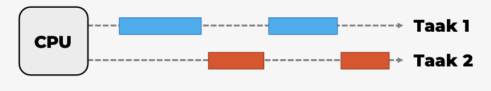
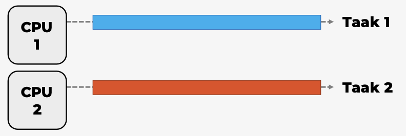
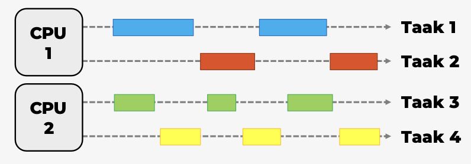
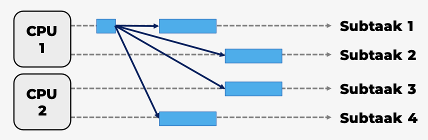

# Operating Systems : Hoofdstuk 4 - Concurrency

## Wat is concurrency?

In de meeste moderne computers kunnen er meerdere processen gelijktijdig actief zijn. Ze kunnen al dan niet gelijktijdig uitgevoerd worden. 

We kunnen een onderscheid maken tussen:

- **Multiprogramming**: het beheer van meerdere processen in het systeem met één processor

- **Multiprocessing**: het beheer van meerdere processen in het systeem met meerdere processoren

- **Gedistribueerde verwerking**: het beheer van meerdere processen die worden uitgevoerd op een aantal verspreide (= gedistribueerde) computersystemen

> **Concurrency** verwijst naar processen of activiteiten die gelijktijdig uitgevoerd worden. 

Deze processen onderling laten samenwerken (bv. door informatie uit te wisselen of bronnen te delen) is een hele challenge. 

:arrow_right: Het tegenovergestelde van concurrency zijn sequentiele processen. Hierbij worden alle stappen na elkaar uitgevoerd.

Doordat het mogelijk werd een grote rekencapaciteit in een kleine chip te steken, zijn **multiprocessors** de nieuwe standaard geworden. 

> **Een multiprocessor** is een computersysteem met twee of meer processoren. 

**Concurrency** verhoogt productiviteit, maar zorgt ook voor uitdagingen:
- Communicatie tussen processen
- Delen van, en vechten om bronnen
- Synchronisatie van meerdere procesactiviteiten
- Verdelen van processortijd over processen

**Concurrency** komt in verschillende situaties voor:

- *Meerdere toepassingen*: dynamisch verdelen processortijd over aantal actieve toepassingen
- *Gestructureerde toepassing*: toepassingen geprogrammeerd als een verzameling gelijktijdige processen
- *Structuur van het besturingssysteem*: besturingssystemen geïmplementeerd als een verzameling processen

**Concurrency** betekent dat een toepassing vooruitgang boekt op meer dan één taak. Dit kan echter niet wanneer de computer slechts één CPU heeft. Om vooruitgang te boeken met meer dan één taak, schakelt de CPU tussen de verschillende taken tijdens de uitvoering.

### Parallel Execution

> **Parallel Execution of parallele uitvoering** treedt op wanneer een computer meer dan één CPU of CPU-kern heeft en tegelijkertijd voortgang boekt op meer dan één taak. 

> [!important]
> Parallel Execution is niet hetzelfde als parallellisme!.

### Parallel Concurrent Execution

> Bij **Parallel Concurrent Execution** worden de taken verdeeld over verschillende CPU's. De taken op dezelfde CPU worden gelijktijdig uitgevoerd, terwijl de taken op verschillende CPU's parallel worden uitgevoerd.

### Parallellisme

> **Parallellisme** betekent dat de toepassing zijn werk opsplits in kleinere subtaken die parallel kunnen verwerkt worden.

Om echte parallellisme te bereiken moet een toepassing meer dan 1 subtaak hebben die wordt uitgevoerd, en elke subtaak moet op afzonderelijke CPU's / CPU-cores / GPU-cores draaien.

## Wederzijdse uitsluiting (mutual exclusion)