# Operating Systems : Hoofdstuk 5 - File Systems

## Persistente opslag

Processen halen hun instructies en data uit het RAM. Naast het RAM hebben processen ook nood aan **persistente** opslag.

- Data in het RAM gaan verloren na het afsluiten van het proces. Wil het proces data bewaren, dan moet dit op een persistent opslagmedium worden bewaard.
- RAM is beperkt in capaciteit. Persistente opslag bied een grotere capaciteit aan.
- Processen werken in hun eigen (virtuele) adresruimte en zijn afgescherm van elkaar. Via een persistent opslagmedium kunne processen data onderling delen.

### Hard disk drive (HDD)

>**Een hard disk drive (HDD)** is een magnetisch opslagmedium dat een grote opslagcapaciteit biedt voor een lage prijs.

Doordat een HDD werkt met draaiende schijven, is er telkens een kleine vertraging (= **seek time**) wanneer de leeskop zich moet positioneren boven de gevraagde data.

### Solid-state drive (SSD)

> **Een solid-state drive (SSD)** ise een performanter maar duurder alternatief voor een HDD. Een SSD heeft geen draaiende delen, de opslage gebeurt door circuits (IC's), waardoor de schijf robuuster is en geen seek time nodig heeft.

>[!important]
>Hogere prijs/GB dan een HDD

### CD/DVD

**CD's en DVD's** zijnoptische opslagmedia. Ze hebben een beperkte capaciteit en performantie en zijn bovendien vaak read-only.

Ze worden vooral gebruikt als distributiemedia of backups.

### USB stick

**USB sticks** maken gebruik van IC's. Het zijn externe opslagmedia die worden aangesloten via USB, waardoor ze een beperkte capaciteit en performantie hebben.

## Files

Een fysiek opslagmedium verdeelt zijn opslagruimte in **blokken**, vaak met een complexe layout.

>**Een file (bestand)** is een abstracte eenheid die data uit één of meerdere blokken groepeert en voorstelt als één geheel.

Het beheer van files en toekennen van blokken behoort tot de taken van een **file system**.

Een bestandssysteem verbergt de complexiteit van de fysieke opslag voor de gebruikers van het besturingssysteem.

### Voorstelling

Naar gebruikers toe wordt een file voorgesteld als een opeenvolging van bytes.

Dit is echter een abstractie: in realiteit kunnen deze bytes verspreid zijn over het opslagmedium.

### Eigenschappen

- Een naam, eventueel met extensie. Sommige besturingssystemen hechten veel belang aan de extensie, bij anderen is dit louter een conventie.
- Een huidige en maximale grootte
- Toegangsrechten
- De datum van aanmaak en laatste wijziging
- Een verwijzing naar de blokken waar de bytes van het bestand opgeslagen zijn.

Welke eigenschappen worden opgeslagen hangt af van besturingssysteem.

### Soorten

Op UNIX systemen worden heel wat zaken voorgesteld als files. Er zijn dus verschillende soorten bestanden:

- Gewone bestanden bevatten data
- **Directories**: bevatten andere bestanden of mappen. (zorgen voor de hiërarchische structuur in het bestandssysteem)
- **Links**: maken een bestand op verschillende plaatsen in het bestandssysteem zichtbaar
- **Block of character special files**: geven toegang aan de hardwer (bv. printers of `/dev/null`)
- **Sockets**: zorgen voor de netwerkcommunicatie
- **Pipes** (FIFO): verbinden de output van een proces met de input van een ander proces.

In de eerste kolom van deze uitvoer kunnen we het type bestand zien.

```bash
ward@ward:~s$ ls -l
total 22172
drwxrwxrwx 1 ward ward     4096 Jun 24  2023 '3D Objects'
drwxrwxrwx 1 ward ward     4096 Aug 10  2023  AppData
lrwxrwxrwx 1 ward ward       40 Aug 10  2023 'Application Data' -> '/mnt/c/Users/Ward Segers/AppData/Roaming'
-rwxrwxrwx 1 ward ward 15990784 May 19 21:24  NTUSER.DAT
-rwxrwxrwx 1 ward ward    65536 Nov  7  2023  NTUSER.DAT{bb781bed-3774-11ee-bef9-f8c5195da7f1}.TM.blf
```

De type bestanden kunnen we ook terugvinden in de MAN page van het commando `ls`

```bash
LS(1)                                             User Commands                                            LS(1)

NAME
       ls - list directory contents

SYNOPSIS
       ls [OPTION]... [FILE]...

DESCRIPTION
       -b, --escape
              print C-style escapes for nongraphic characters

       --block-size=SIZE
              with -l, scale sizes by SIZE when printing them; e.g., '--block-size=M'; see SIZE format below

       -B, --ignore-backups
              do not list implied entries ending with ~

       -c     with -lt: sort by, and show, ctime (time of last modification of file  status  information);  with
              -l: show ctime and sort by name; otherwise: sort by ctime, newest first

       -C     list entries by columns

       --color[=WHEN]
              colorize  the output; WHEN can be 'always' (default if omitted), 'auto', or 'never'; more info be‐
              low

       -d, --directory
              list directories themselves, not their contents

       -D, --dired
              generate output designed for Emacs' dired mode

       -f     do not sort, enable -aU, disable -ls --color

       -F, --classify
 Manual page ls(1) line 24/225 20% (press h for help or q to quit)
```

De output van `ls -F` toont het type via volgende suffix

<table>
    <thead>
        <th>suffix</th>
        <th>type</th>
    </thead>
    <tbody>
        <tr>
            <td>/</td>
            <td>map</td>
        </tr>
        <tr>
            <td>*</td>
            <td>uitvoerbaar bestand</td>
        </tr>
        <tr>
            <td>@</td>
            <td>link</td>
        </tr>
        <tr>
            <td>=</td>
            <td>socket</td>
        </tr>
        <tr>
            <td>|</td>
            <td>named pipe</td>
        </tr>
    </tbody>
</table>

```bash
ward@ward:~s$ ls -F
'3D Objects'/
 AppData/
'Application Data'@
 NTUSER.DAT*
 NTUSER.DAT{bb781bed-3774-11ee-bef9-f8c5195da7f1}.TM.blf*
```

### Bytes uitlezen

Bestanden kunnen op twee manieren toegang geven tot hun bytes:

- Een bestand met **sequentiële toegang** dient in volgorde uitgelezen te worden. (byte 100 kan niet gelezen worden als byte 1-99 niet gelezen zijn)
- Een bestand met willekeurige toegang (**random access**) kan in eender welke volgorde uitgelezen worden.

## Directories

> **Een directory** (map) groepeert files en kan zelf ook andere directories bevatten. Dit zorgt voor een hiërarchische structuur in het bestandssysteem.

De implementatie van directories is opnieuw de taak van het bestandssysteem. 

### Hiërarchie

Het voorbeeld hieronder toont een hiërarchische structuur waarbij de **root directory** (de hoofdmap) van het bestandssysteem één map per gebruiker bevat. Elke gebruikersmap bevat dan weer andere bestanden en mappen.

<p align='center'>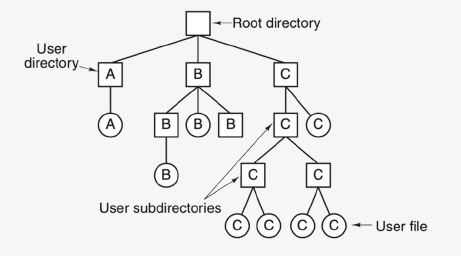</p>

### Padnamen

Het **absolute pad** naar een bestand of map start bij de root directory en beschrijft de weg naar dit bestand of naar deze map. Op Linux en Max wordt een slash (/) gebruikt als scheidingsteken in een pad. Op Windows is dit een backslash (\)

```bash
/home/hogent/os
C:\Users\hogent\os
```

Bij Windows start een absoluut pad telkens met een letter die gekoppeld is aan een bestandssysteem. Op Linux en Max worden alle bestadsystemen tot één virtueel bestandsysteem samengebracht en gebruiken we geen letters.

Een relatief pad start vanuit een bestaande directory en kan de speciale verwijzingen **.** (huidige directory) en **..** (parent directory) gebruiken

```bash
../hogent/os
..\hogent\os
```

## Mappenstructuur

### Windows

- I/O-apparaten worden gekoppeld via apparte **schijfletters** (C: , D: ...)
    - Schijfopslag, netwerkopslag, DVD/CD, USB-sticks,...
- **Program files**: uitvoerbare bestanden en applicaties
- **Windows\System32**: systeembestanden
- **User\<gebruikersnaam>**: home directories per gebruiker
- **User\Appdata**: configuratiebestanden (verborgen)
- Algemeen beheer van apparaten gebeurd via Device Manager
    - Apparaten die gelinkt moeten worden binnen folderstructuur worden een schijfletter toegewezen
- Opstartbestanden staan op een aparte bootpartitie (standaard zonder schijfletter)

### Linux

In tegenstelling tot de verschillende stationletters op Windows valt op Linux/Unix elk bestand onder de root-filestructuur. 

- `/home/<gebruiker>`: gebruikersbestanden
- `/dev`: apparaten
- `/mnt` of `/media`: I/O-apparaten 
- `/boot`: opstartbestanden
- `/etc`: configuratiebestanden
- `/(s)bin` en `/usr/(s)bin` of `/opt`: uitvoerbare bestanden
- `/var`: variabele bestanden (bv. logs)

### macOS

Wat op Windows de C-schijf is, heet op macOS de Main Disk

macOS heeft enkele standaardmappen:
- **Applications**: bevat de geïnstalleerde applicaties op de mac
- **Library**: bevat fonts en andere bestanden gebruikt door applicaties. Applicaties plaatsen hierin bestanden die ze nodig hebben om te functioneren. (gedeeld over alle gebruikers)
- **System**: hierin zit het macOS besturingssysteem (kan je niets in wijzigen)
- **Users**: bevat de home directories per gebruiker en een shared map met gedeelde bestanden tussen alle gebruikers.

Wanneer we het `ls -l` uitvoeren op de root van het file systeem merken we een gelijkaardige structuur als op Linux. MacOS verbergt deze mappen voor de eindgebruiker, maar ze zijn wel degelijk aanwezig.

We zien ook een extra map 'Volumes', die we niet zagen op de Main Disk. Deze map bevat alle gekoppelde volumes (bv. Main Disk, externe harde schijf).

<p align='center'>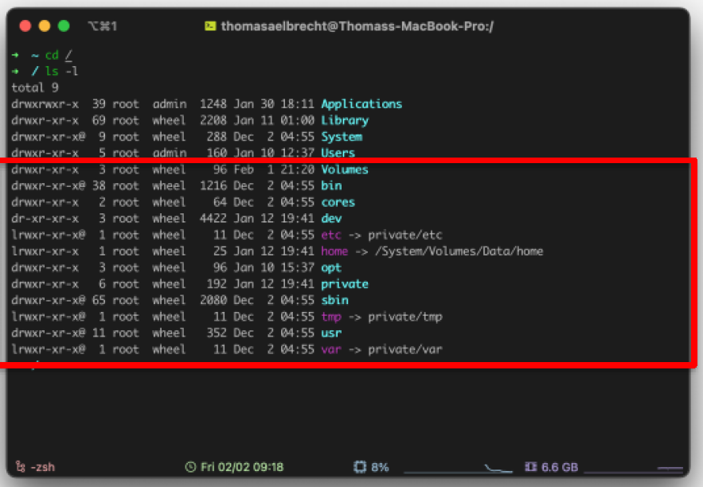</p>

## File System

> **Een file system** (bestandssysteem) is een onderdeel van een besturingssysteem. File systems beheren de fysieke opslagruimte en wijzen deze toe aan files en directories. File systems implementeren dus files en directories

De meeste besturingssystemen ondersteunen verschillende file sytems. Er kunnen meerder file systems tegelijkertijd actief zijn.

### Implementatie van files

De implementatie van files kan op verschillende manier gebeuren:

- Contiguous storage
- Linked lists
- File allocation table (FAT)
- Index nodes (inodes)

#### Contiguous storage

Bij **contiguous storage** (samenhangende opslag) wordt elk bestand in één of meer *aansluitende blokken* opgeslagen.

Dit is een eenvoudige methode met een *goede leessnelheid* en met ondersteuning voor *random access*.

Het heeft echter ook de volgende nadelen:
- Als een bestand groeit, dan moet het mogelijk verplaatst worden naar een grotere vrije ruimte.
- Als een bestand verwijderd wordt, en de vrije ruimte wordt ingenomen door een kleiner bestand dan onstaat er **fragmentatie** (*meer en meer kleine ruimtes die niet opgevuld geraken*) 

>Een systeem dat deze techniek gebruikt moet vaak gedefragmenteerd worden om de kleinere vrije ruimtes terug samen te voegen.

Dit is ideal voor read-only of write-once media, zoals een CD of DVD.

<p align='center'>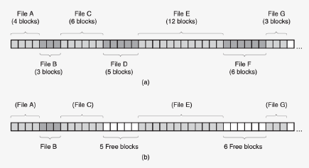</p>

In bovenstaand voorbeeld worden uit (a) bestanden D en F verwijderd, (b) toont de opslag na het verwijderen.

#### Linked lists

Bij **linked lists** (gelinkte lijsten) hoeven de datablokken van een bestand niet aan te sluiten. Elk blok bevat namelijk een **verwijzing** (link) naar het volgende blok, dat zich eender waar mag bevinden.

- lost probleem fragementatie op
- **slechte performantie**, (door de datablokken die verspreid staan, daalt de leesperformantie)
- ondersteund geen random access (blokken moeten in volgorde uitgelezen worden)

<p align='center'>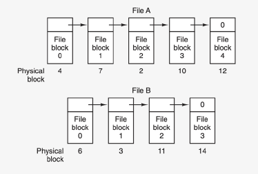</p>

#### File allocation table (FAT)

Een **file allocation table (FAT)** (toewijzingstabel) is een verbetering van de linked list techniek. De datablokken van elk bestand vormen nog steeds een linked list, maar alle verwijzingen tussen de blokken worden samengebracht in een tabel.

- kan snel een lijst vinden doordat de tabel in het RAM bewaard is.
- verhoogt leessnelheid
- maakt random access mogelijk
- FAT kan een hoog RAM-verbruik hebben

<p align='center'>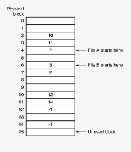</p>

#### Index nodes (inodes)

Een **index node (inode)** is een datastructuur die zowel de metadata van een bestand als verwijzingen naar de datablokken bevat. Een bestandssysteem dat inodes gebruikt, hoeft enkel de inodes van de geopende bestanden in het RAM te bewaren.

Deze techniek combineert dus een **goede leessnelheid** met een **beperkt RAM-verbruik**

<p align='center'>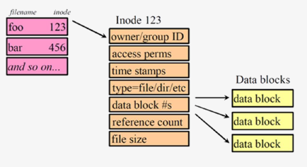</p>

### Implementatie van directories

Een directory kan opgeslagen worden in een bestand. Dit bestand bevat dan een **directory entry** voor elke file of subdirectory.

Elk file system kiest zelf welke informatie er wordt opgeslagen in een directory entry, maar deze informatie omvat zeker een verwijzing naar het eerste datablok (bij gebruik van contiguous storage, linked list, of FAT) of naar de inode (bij gebruik van inodes).

<p align='center'>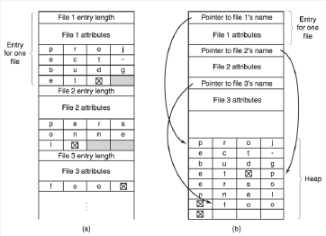</p>


Een belangrijke keuze die moet worden gemaakt is hoe/waar de naam van elke file of
subdirectory wordt opgeslagen. In Figuur (a) wordt de naam opgeslagen als deel van
de entry. In Figuur (b) worden de namen apart opgeslagen in een heap.
Versie (a) heeft als nadeel dat directory entries een variabele grootte hebben, en er
dus fragmentatie kan ontstaan binnen het directory-bestand. Versie (b) heeft dan
weer als nadeel dat er een heap moet beheerd worden.

### Implementatie van links

Een **link** is een bestand dat verwijst naar - of gekoppeld is aan - een ander bestand.

Links bestaan in twee vormen:

- Een **hard link** is een koppeling die wordt gecreëerd door dezelfde datablokken of inodes in meerdere directory entries in te schrijven. Deze entries blijven onafhankelijk maar delen wel dezelfde data.
- Een **soft link** (ook gekend als symbolic link of snelkoppeling) heeft een eigen datablok of inode. Dit soort link is een bestand waarvan de inhoud bestaat ui een verwijzing naar een ander bestand.

Soft links zijn flexibeler dan hard links omdat ze ook werken tussen verschillende bestandssystemen, terwijl hard links enkel mogelijk zijn binnen hetzelfde bestandssysteem. Een nadeel van soft links is dan weer da ze kunnen leiden tot **dangling pointers**.

>**Een dangling pointer** is een soft link die verwijst naar een bestand dat niet meer bestaat.

<p align='center'>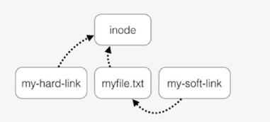</p>

In dit voorbeeld delen 'my-hard-link' en 'myfile.txt' dezelfde inode. 'my-soft-link' verwijst rechtstreeks naar het bestand 'myfile.txt'

### Journaling

Wanneer het bestandssysteem of besturingssysteem crasht tijdens een schrijfbewerking, dan kan er data corrupt worden of verloren gaan. Een schrijfbewerking kan namelijk uit verschillende stappen bestaan, die allemaal moeten uitgevoerd worden. Zo komt het verwijderen van een file neer op:

1. Verwijder de directory entry voor deze file.
2. Verwijder de inode voor deze file.
3. Markeer de datablokken van deze file als vrije ruimte.

Het onderbreken van deze stappen kan het bestandssyteem in een ongeduldige toestand brengen.

Door het bijhouden van een **journal** (logboek van bewerkingen) kan het bestandssysteem zichzelf herstellen na een crash.

<p align='center'>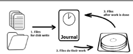</p>

Een bestandssysteem met journaling werkt als volgt:

1. Elke uit te voeren bewerking wordt eerst neergeschreven in het logboek.
2. Vervolgens wordt de bewerking zelf uitgevoerd
3. Tenslotte wordt in het logboek de bewerking gemarkeerd als voltooid.

Wanneer het bestandssysteem of besturingssysteem crasht tijdens de uitvoering van de bewerking, dan kan het bestandssysteem deze crash detecteren omdat er een nog-niet-voltooide bewerking in het logboek staat. Vervolgens kan het bestandssysteem de onvoltooide bewerking alsnog voltooien op basis van de informatie in het logboek.

### Virtual file systems

Op Windows krijgt elk bestandssysteem een drive letter toegewezen.

Op Linux en Mac daarentegen is er een **virtual file system**. Deze systemen brengen alle actieve bestandssystemen samen onder één hiërarchische structuur. Voor de gebruiker lijkt het alsof er slechts één bestandssyteem is.

<p align='center'>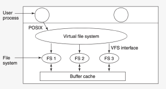</p>

Bovenstaande afbeelding toont aan hoe een virtual file system werkt:

- Processen gebruiken de algemene functies van het besturingssysteem om het virtual file system aan te spreken. Deze functies (op de figuur aangeduid als POSIX) zijn dus niet gebonden aan een specifiek file system.
- Het virtual file systeem vertaalt deze algemene functieoproepen naar oproepen voor de drivers van elk file system.

Een virtual file system verbergt dus de verschillen tussen de file systems. Processen zien slechts één bestandsstructuur, die op een uniforme manier kan worden bewerkt.

<p align='center'>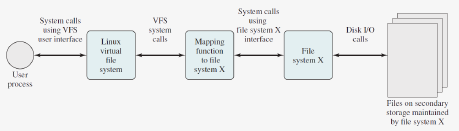</p>

Bovenstaande afbeelding toont nogmaals aan hoe een vfs (virtual file system) werkt.

Twee belangrijke bewerkingen bij een virtual file system  zijn:
- **mount**: het inladen van de root directory van een bestandssysteem in een directory van de virtuele hiërarchie. Zo kan je bv. kiezen om de root directory van een USB-stick in te laden in de map `/media/usb`. Vanaf dan verwijst deze map naar het bestandssysteem van de USB-stick.
- **unmount**: de omgekeerde beweging. Een reeds ingeladen bestandssysteem terug loskoppelen van het virtuele bestandssysteem.

## Partities

Een fysiek opslagmedium (zoals een harde schijf) kan zijn capaciteit onderverdelen in **partities**. Elke partitie heeft dan zijn eigen bestandssysteem.

Een opslagmedium met partities moet ook een **partitietabel** voorzien. Deze tabel beschrijft de partities en hun bestandssystemen. Twee systemen die hiervoor worden gebruikt zijn een **Master Boot Record (MBR)** of een **GUID Partition Table (GPT)**.

### MBR vs GPT

#### MBR

- Oude manier van werken, bestaat sinds 1983.
- Geïntroduceert als onderdeel van PC DOS 2.0
- Speciale boot sector wordt gebruikt aan het begin van de schijf om de partitietabel op te slaan.
- Maximum grootte van de schijf 2TB
- Maximum 4 (primaire) partities op 1 schijf
    - Kan omzeild worden door gebruik van extended partities (= virtuele partitie met meerdere logische partities)

<p align='center'>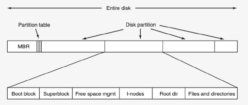</p>

In dit voorbeeld zien we in het begin van de schijf de Master Boot Record met de partietabel. Daarna volgen de verschillende partities.

Een Master Boot Record bevat naast de partitietabel ook een zogenaamde **boot loader**, die verantwoordelijk is voor het opstarten van het systeem. Deze boot loader gaat opzoek naar een partitie met een besturingssysteem en schakelt dan door naar de code in de **boot block** van deze partitie.

#### GPT

- Opvolger van MBR
- Onderdeel van UEFI
- Ondersteuning voor schijven groter dan 2TB 
- In theorie onbeperkt aantal partities (Windows beperkt wel tot 129 partities)
- Iedere partitie krijge een unieke ID, GUID (= Globally Unique Identifier), die opgeslagen wordt in de GUID partition table (GPT)

Windows is enkel bootable vanop een schijf met GPT voor 64-bit systemen die gebruik maken van UEFI (opvolger BIOS) als interface tussen de hardware en het besturingssysteem. Het is wel mogelijk om Linux te starten vanop een schijf met GPT in combinatie met BIOS firmware.

<p align='center'>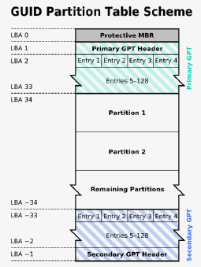</p>

GPT is achterwaards compatibel met MBR en kan ook gebruikt worden in combinatie met een BIOS (behalve bij Windows en macOS). GPT plaats de boot loader op een speciale **EFI System Partition**. Uiteraard kan er via de achterwaartse compatibiliteit met MBR nog steeds gebruik worden gemaakt van boot blocks.

## Booten

> **Booten** is het proces van een computer om op te starten en een besturingssysteem te laden.

Om een besturingssysteem in te laden hebben we een apart programma nodig, **de boot loader**. Deze bevindt zich in een opstartbare (of bootable) partitie van het secudaire geheugen, zoals een HDD of een SSD.

Als er meerder bootable partities aanwezig zijn, kunnen we in de BIOS/EFI instellen in welke volgorde de partities worden overlopen. Bij het booten wordt de eerst gevonden bootloader op een bootable partitie uitgevoerd.

Een bootloader is meestal afhankelijk van het besturingssysteem en specifiek ontworpen om alleen dat type besturingssysteem te laden. Enkele bekende bootloaders zijn:

- Linux: grub, lilo, rEFInd,...
- macOS: BootX
- Windows: Windows Boot manager

### Bootloader

#### Werking bootloader

1. Uitpakken gecomprimeerde bestanden op bootpartitie. 
    - Opstartbare bestanden bevinden zich niet om de partitie van het besturingssysteem zelf (maar afgeschermde partitie)
    - Kernel en root file system worden gecomprimeerd om plaats te besparen
    - Standaar is bootpartitie zeer klein (Windows = 128MB)
2. Inladen kernel in het geheugen
3. Inladen root file system in het geheugen
4. Control doorgeven aan kernel om OS verder in te laden en te starten

Telkens wanneer het besturingssysteem de kernel bijwerkt naar een nieuwe versie, worden er nieuwe bootbestande gegenereerd. 

>[!important]
>Zet nooit de computer uit tijdens het uitvoeren van een systeemupdate. Hierdoor kunnen de bootbestanden beschadigd raken, waardoor het besturingssysteem niet meer opstart.

### Multi-Boot

>**Multi-Boot** is wanneer er meerder OS'en geïnstalleerd zijn op een computersysteem.

Om te zorgen dat je elk OS afzonderlijk kan opstarten heb je dus een bootloader voor elke OS nodig. Aangezien bij de installatie van een ander OS meestal de huidige bootloader zal overschreven worden, is het van groot belang om elk OS in de juiste volgorde te installeren.

Wil je Windows en Linux samen op een toestel installeren, dan is het best eerst Windows te installeren en daarna Linux. Na de installatie van Linux kan je de Linux bootloader laten doorverwijzen naar de bootloader van Windows. Dit principe heet **chain loaden** van bootloaders. Windows heeft nl. geen boot menu en zal dus steeds meteen Windows opstarten i.p.v. de keuze te geven. (Grub bv kan dit wel)

>**Fallback starten** is een back-up optie om toch je systeem te kunnen opstarten.

<table>
<td>

- Arch Linux Boot files
    - Root file system (Back-up)
    - Root file system
    - Intel CPU patch (optioneel)
    - Kernel
- Windows Boot Files
- Bootloader (rEFInd)

</td>
<td>
<br>
<p align='center'></p>

</td>
</table>

## Voorbeelden FS (File System)

