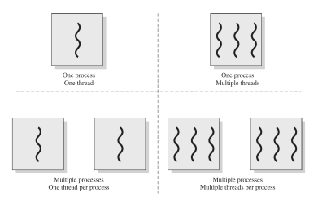
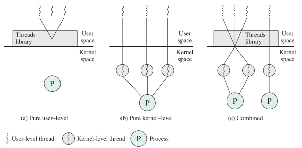
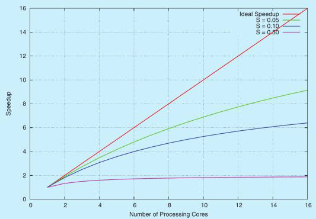
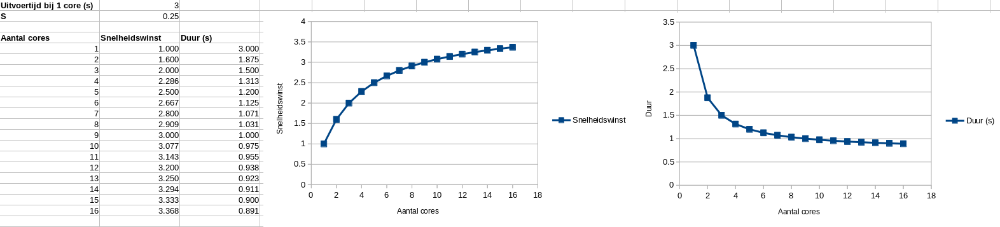

# Operating Systems : Hoofdstuk 6 - Threads

## Wat zijn threads?

### Processen: 2 concepten

Tot nu toe hebben we processen steeds behandeld als een onscheidbaar deeltje in het besturingssysteem. Een proces kan verschillende toestanden hebben via de scheduler, heeft toegang tot bestanden en rekenkracht, kan prioriteiten krijgen, ...

Als we dieper gaan kijken naar wat een proces nu precies is, zien we dat het idee van een proces eigenlijk hebben gebruikt voor twee aparte concepten: eigendom van bronnen en het uivoeren van de instructies.
- Eigendom van bronnen: Het besturingssysteem kent bronnen zoals bestanden, geheugenruimten, apparaten, ... toe aan een proces. Het besturingssysteem zorgt er ook voor dat processen elkaars bronnen niet zomaar kunnen beïnvloeden.
- Het uitvoeren van de instructies: de fetch-execute cyclus haalt continu instructies op en voert deze uit. Hiervoor wordt er gebruik gemaakt van een Program Counter om de volgende uit te voeren instructies bij te houden, registers en stack om informatie bij te houden. 

Deze twee concepten staan eigenlijk los van elkaar. Bv. of een proces nu actief is op de CPU of geblokkeerd is: bronnen zoals bestanden blijven toegewezen aan het proces.

### Proces: eigendom bronnen

- Elk proces krijgt controle of eigenaarschap over bronnen (locking)
- Afgeschermd van andere processen door het besturingssysteem
- Voorbeelden van bronnen:
    - Address space (geheugen voor procesbeeld: instructies, data,...)
    - Geheugen (in RAM, HDD, SSD,...)
    - Bestanden
    - Apparaten (CPU,...)

### Proces: uitvoering programma

- Uitvoeren van instructies
    - Via fetch-execute cyclus
- Bijhouden van registers en stack
    - bv. program counter (PC)
- Scheduling
    - Bijhouden toestand/staat
    - Is proces actief/geblokkeerd/...?

### Processen vs. threads

Een proces zal verschillende taken uitvoeren via de fetch-execute cyclus.  
Het uitvoeren van instructies binnen een proces gebeurt in een thread. Daarom wordt in de context van uitvoering ook vaak over threads gesproken, terwijl we voor eigendom van bronnen meestal spreken over processen of taken.

Een proces kan meerdere threads bevatten. Een thread is de kleinste eenheid van geprogrammeerde instructies die onafhankelijk van elkaar kunnen worden beheerd door een scheduler, dus met andere woorden: binnen één proces kunnen gelijkertijd meerdere threads actief zijn.

Wanneer een proces bestaat uit één enkele thread voor de uitvoering, spreken we van een **single-threaded proces**.

Wanneer een proces echter zijn werk verdeeld over meerdere threads, spreken we van een **multi-threaded proces**. Deze threads kunnen parallel uitgevoerd worden door het systeem, wat vooral interessant is voor systemen met meerdere processoren en/of multi-core CPU's.

Threads kunnen zich net zoals processen in verschillende toestanden bevinden. (geblokkeerd, actief,...) Het wisselen tussen threads op de CPU loopt bovendien analoog aan het wisselen tussen processen: er wordt een context switch voor threads uitgevoerd. (dit is wel "goedkoper" voor threads)

### Opbouw threads

Net zoals een computer de CPU, geheugen, hardware,... deelt met één of meerdere processen, deelt een proces de instructies, data, toegewezen bronnen,... met één of meerdere threads. Elke thread heeft dus toegang tot alle bronnen toegewezen aan dat proces. (bv. bestand toegewezen aan proces kan ook door thread gelezen worden)

Daarnaast heeft ook elke thread zijn eigen registers (bv. Program Counter), stack, toestand, thread id,... zodat het onafhankelijk van andere threads binnen het proces instructies kan uitvoeren.

Er is geen afscherming tussen threads binnen een proces. Threads binnen eenzelfde proces kunnen elkaars gegevens lezen, schrijven, verwijderen,... zonder beperking. Dit is een groot verschil met processen waar het besturingssysteem de processen van elkaar afschermt.

Threads hebben net als processen een toestand:
- actief
- gereed
- inactief
- ...

Een thread kan dus bv. gedeactiveerd worden en een andere thread van dat proces geactiveerd. Dit gebeurd net als bij processen met een context switch. De context voor een thread is de inhoud van diens register (inclusief de Program Counter) en de stack. Threads kunnen net als processen gesynchroniseerd worden. Aangezien zijn minder data bevatten (instructies, data, toegang tot bronnen zijn gedeeld) is deze context switch dus goedkoper.

>[!caution]
>De instructies zelf (opgeslagen in de adress space in het geheugen) behoren tot het proces

>[!caution]
>Het uitvoeren van de instructies is de verantwoordelijk van de threads. Met behulp van een eigen Program Counter kunnen ze de juiste instructie van het proces lezen om deze uit te voeren. (en nadien de volgende waarde voor de PC in te laden)

## Soorten threads

Er zijn twee soorten threads, User-Level threads en Kernel-Level threads

### User-level threads

- Programma maak gebruik van  een bibliotheek (Library) voor het aan maken en beheren van threads.
    - Gebeurd onafhankelijk van besturingssysteem
    - besturingssysteem kent deze (software) threads niet en beschouwt het programma als een single-threaded proces.
- Voordelen:
    - Sneller: niet nodig om gebruik te maken van system calls van het OS voor threading
    - Proces heeft volledige controle over scheduling van de threads
- Nadelen:
    - Volledig proces kan geblokkeerd worden door het OS wanneer één van de threads blokkeert. (bv. thread wacht op een antwoord van I/O operatie)
    - Niet mogelijk om gebruik te maken van multiprocessing (threads behorend tot eenzelfde proces kunnen niet parallel uitgevoerd worden.)

### Kernel-Level threads

- Logica voor de threads zit in het besturingssysteem. Besturingssysteem is verantwoordelijk voor het aanmaken en beheren van de threads.
- Voordelen:
    - Scheduling is mogelijk op threadniveau
    - Blokkeren van één thread binnen een proces zorgt **niet** dat alle threads binnen dat proces geblokkeerd worden.
    - multiprocessing is mogelijk (OS beheert de threads): threads kunnen parallel uitgevoerd worden op verschillende processoren of processorkernen.
    - OS gebruikt zelf threads om achtergrond taken uit te voeren.
- Nadelen:
    - Trager: voor het aanmaken van threads moet er gewisseld worden tussen programma en os

### Combinatie van ULT en KLT

- Combinatie tussen beide is mogelijk
- Beste van twee werelden
- Kan op verschillende manieren

## Voor- en nadelen

### Voordelen multi-threading

Het gebruik van meerdere threads binnen een proces heeft enkele voordelen ten opzicht van een single-threaded proces:

- Een interactief proces moet soms een langdurige operatie uitvoeren. 
    - Single-threaded: volledig proces moet wachten op afronding van de operatie
    - Multi-threaded: kan thread blokkeren en ondertussen een andere thread laten uitvoeren zodat het proces niet hoeft te wachten.
    - Voorbeeld: user interface wacht op langdurige operatie, wordt deze behandeld door eenzelfde thread zal het lijken of de applicatie vastloopt. Bij multi-threading kan het proces nogsteeds de thread van de user interface uitvoeren.

- Het delen van bronnen tussen processen wordt afgeschermd door het OS. Threads binnen eenzelfde proces kunnen wel bronnen met elkaar delen. Het is dus eenvoudiger en efficiënter om threads binnen een proces met elkaar te laten communiceren dan processen onderling.

- Het maken van een proces vergt rekenkracht en geheugen. Het aanmaken van een thread is minder belastend en dus lichter en sneller (van 10x tot 100x). Daarnaast is een context switch tussen threads ook lichter en sneller. Ook het afsluiten van een thread is minder belastend voor het systeem.

- Een multi-threaded proces kan efficiënt gebruik maken van multicore CPU's. 
    - Voorbeeld: bij het unzippen met 7-zip kan het werk opgesplits worden in evenveel threads als CPU cores. Elke core voert dan een thread van het 7-zip proces uit en unzipt dus een deel van het bestand. Dit wordt ook wel **parallellisme** genoemd. Single-threaded processen kunnen maar gebruik maken van een enkele CPU.

### Uitdagingen bij multi-threading

Ontwikkelen van multi-threaded programma's is ingewikkelder dan het ontwikkelen van single-threaded programma's

- Indelen van rekenwerk in mogelijke threads: Rekenwerk dat zich kan opslitsen in onafhankelijke problemen is ideaal om op te splitsen in threads.
    - bv. het unzippen van .7z-bestand
    - Wel is het niet nuttig om het rekenwerk op te splitsen als dit minder werk vraagt dan het creëren van een thread.

- Opsplitsen van data tussen threads: Als de data waarop gerekend moet worden kan opgesplits worden over verschillende threads, kunnen de threads onafhankelijk van elkaar goed doorwerken.

- Afhankelijkheid van data tussen threads: Als de data niet compleet kan opgesplitst worden over threads, dan moet er gesynchroniseerd worden tussen de threads. Er zal dus voor sommige threads gewacht moeten worden.

- Testen en debuggen: Het schrijven van multi-threaded programma's is erg complex. Taken kunnen op meerdere manieren en in meerdere volgordes afgewerkt worden dan bij een single-threaded programma. Dit maakt the enorm moeilijk om bugs te vinden, testen en op te lossen.

## Parallellisme

Bij parallellisme splitsen we taken op in verschillende subtaken, die onafhankelijk van elkaar uitgevoerd worden. Dit gebeurd op verschillende manieren:

- Bij **data parallellisme** wordt de te verwerken data opgesplits in stukken. Op elk stuk wordt dan dezelfde operatie uitgevoerd. De data wordt dus verdeeld over de threads. 
    - Voorbeeld: optellen van een array. Bij een array van 240 integers en een systeem met 8 cores wordt de array verdeeld in 8 deelarrays van 30 integers elk.
        - Voor elke deelarray wordt een thread aangemaakt die de 30 integers optelt in die deelarray.
        - Op het einde moet enkel de resultaten van alle threads opgeteld worden.
    - Voorbeeld: bereken van product van 2 matrices (vrij rekenintensief)
        - Elke thread kan één rij, kolom of zelfs één cel van de resulterende matrix berekenen.

- Bij **taken parallellisme** verdeelt het werk op in verschillende threads. Niet elke thread voert dus dezelfde operatie uit. Threads kunnen werken op dezelfde of andere data.
    - Voorbeeld: tekstverwerkingsprogramma
        - Thread voor GUI
        - Thread voor spellingscontrole
        - Thread om het bestand weg te schrijven
        - Thread om wijzigingen door externe programma's aan het bestand te detecteren
        - Thread om te checken op updates
        - ...

> In praktijk gebruiken we meestal een hybride combinatie van twee soorten parallellisme.

### Amdahl's Law

**De wet van Amdahl** is een manier om een theoretische schatting te makken hoe het toevoegen van CPU cores de uitvoering van een programma versneld. De formule heeft 2 parameters nodig:

- *S* is het percentage van het programma da sowieso niet versneld kan worden door meer CPU cores toe te voegen. (*% uitgedrukt als kommagetal*)
- *N* is het aantal CPU cores

$$snelheidswinst = {1 \over S + {1 - S \over N}} $$

- $ 1-S $ &nbsp; = percentage van het programma dat wel kan versneld worden door het toevoegen van CPU cores ($S = 0.25$ (25%) dan is $1-S = 0.75$ en dus 75%)

Bij een single-threaded proces is er geen snelheidswinst te behalen. Het gedeelte dat niet versneld kan worden door meer CPU cores toe te voegen is immers 100% of $S=1$. Als we dit in de formule invullen dan bekomen we snelheidswinst '1'. Het programma zal dus 1x sneller draaien (m.a.w. er veranderd niets aan de snelheid)

Bij een multi-threaded programma kan er vaak wel een snelheidswinst behaald worden. 
Bijvoorbeel: Stel dat een programma voor 25 % bestaat uit een gedeelte dat niet
versneld kan worden en voor 75 % uit een gedeelte dat wel versneld kan
worden met meerdere CPU cores:
-  Voor N = 2 CPU cores: het programma zal 1.6x (160%) sneller draaien met 2 CPU cores dan met 1 core
    $${1 \over 0.25 + {1 - 0.25 \over 2}} = 1.6 $$
-  Voor N = 4 CPU cores: het programma zal 2.29x (229%) sneller draaien met 4 CPU cores dan met 1 core
    $${1 \over 0.25 + {1 - 0.25 \over 4}} = 2.29 $$

Stel nu dat we een machine hebben met 1 000 000 cores. Als we $N=1000000$ plaatsen in de formule van het vorige voorbeeld, dan komen we aan een versnelling van bijna 4. Deze winst zal niet meer verhogen, ook al voegen we bijvoorbeeld een miljard cores toe. Dit komt omdat $S=0.25$ van het programma bijna geen tijd inneemt, gaat er toch nog steeds 25% tijd naar het S-gedeelte. Het programma kan dus nooit meer versnellen dan data.

Ondanks dat threads voor een serieuze snelheidswinst kan zorgen, wordt deze snelheid nog steeds beperkt door delen van het programma die niet versneld kunnen worden door multi-threading en multi-processing. Dit is bijvoorbeeld vaak het geval bij games. Veel zaken kunnen uitgespreid woren over meerdere threads, maar er is meestal één thread die de andere threads aanstuurt en beheert. Vaak is het deze thread die de snelheid bij multi-threaded games beperkt.

In de grafiek zien we de impact van $S$ op de snelheidswinst. Hoe groter $S$, hoe lager de maximale snelheidswinst zal zijn ongeacht het aantal CPU cores.

## Voorbeelden

### Voorbeeld: Game

- Main thread: beheert alle andere threads
- Render thread: genereert de visuals
- Audio thread: speelt de audio af
- I/O thread: uitwisseling data met RAM, HDD/SSD, netwerk,...
- Extra threads, bv:
    - Genereren werelden
    - Gedrag NPC's (AI)
    - Berekenen van paden
    - ...

### Voorbeeld: 3D modelling

- Thread voor UI
- Werk voor rendering wordt verdeeld over meerdere threads voor parallellisme
    - kan op CPU of GPU

### Voorbeeld: video conversies

- Werk voor het converteren word verdeeld over meerdere threads voor parallellisme