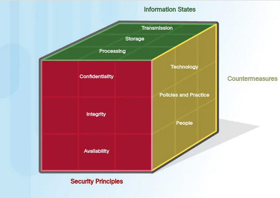

# CYBERSECURITY : Hoofdstuk 1 - Data, het virtuele goud

Een groot deel van onze persoonlijke data zit bij **bedrijven**:
- Private gegevens: chat, e-mails, foto's
- Financiële gegevens: bankrekeningen, overschrijvingen
- Medische gegevens: aandoeningen, ziektegeschiedenis, medicatie
- School: punten, verslagen, feedback
- Werk: loon, HR, werkbestanden
- Overheid: rechtszaken, boetes, eigendom

> Hackers zijn niet enkel geïnteresseerd in persoonlijke data, maar ook in **industriële data**. Vaak voor losgeld of (bedrijf)spionage

Typische interesse industriën zijn:
- Productie
    - Branchecontroles
    - Automatisering
    - SCADA (Supervisory Control And Data Acquisition)
- Energieproductie en -distributie
    - Elektrische distributie en Smart Grid
    - Olie en gas
- Communicatie
    - Telefoon
    - E-mail
    - Berichten
- Transportsystemen
    - Vliegreizen
    - Het spoor
    - Op de weg

Bedrijven hebben een verantwoordelijkheid om deze gegevens te beschermen:
- Tegen misbruik
- Tegen ongeoorloofde toegang

Een groei in gegevensverzameling en -analyse kan zorgen voor:
- Grote risico's
- Voorzorgsmaatregelen zijn nodig
- Plicht om gevoelige gegevens te beschermen tegen criminele om de schade te vermijden.

## Staten van data

Alles in de cyberwereld draait rond data. Cybersecurity specialisten focussen zich op het beveiligen van die data

Data heeft 3 mogelijke staten:
- Data in rust/opslag
- Data tijdens het verzenden
- Data tijdens het verwerken

### Data in rust

> Data in rust is data die opgeslagen is op opslagapparaten dat niet wordt gebruikt door personen of processen.

Opslagapparaten kunnen op volgende wijze aangesloten zijn:
- lokaal (harde schijf, USB)
- op afstand (Dropbox, NAS)

Deze data kan op verschillende manier verloren gaan of gestolen worden.

### Data tijdens verzenden

Data kan via verschillende netwerken verzonden worden:
- **Sneaker net**: opslagapparaten om data tussen computers over te zetten (USB, draagbare harde schijf,...)
- **Bedraad netwerk**: koper- of fiberkabels
- **Draadloos netwerk**: elektromagnetische golven (kan door iedereen in de buurt "gehoord" worden)

Uitdagingen cybersecurity:
- personeel beveiligen
- cybercriminele kunnen tijdes het verzenden:
    - afluisteren, kopiëren of stelen (vertrouwelijkheid)
    - aanpassen (integriteit)
    - verhinderen of verstoren (beschikbaarheid)

### Data tijdens het verwerken

Het bevat de data tijdens **de invoer**, **aanpassing**, **berekening** of **uitvoer**

Organisaties gebruiken verschillende manieren om data te verzamelen:
- manuele invoer, het uploaden van bestanden, dataverzameling van sensoren

> Elk van deze input-methodes is een mogelijk bedreiging voor **de integriteit**.

De data kan aangepast worden door manuele verandering door gebruikers, programma's die de data wijzigen, defecte apparaten. 

bv. encoderen/decoderen, compressie/decompressie, encryptie/decryptie

> Data dat zodanig wordt aangepast dat het fouten bevat of onbruikbaar wordt, noemt men **corrupte data**

## De CIA-driehoek

- **C**onfidentiality (vertrouwelijkheid)
    - Wie mag dit zien?
- **I**ntegrity (integriteit)
    - Klop dit wel? Is de informatie juist? Kom deze van de juiste persoon?
- **A**vailability (beschikbaarheid)
    - Kan ik er aan wanneer ik het nodig heb?

### Confidentiality (vertrouwelijkheid)

- verhindert de bekendmaking van informatie aan onbevoegde personen, bronnen of processen
- Organisaties moeten hun personeel opleiden om zo goed mogelijk om te gaan met gevoelige informatie om zichzelf en hun organisaties te beschermen tegen aanvallen
- vertrouwelijkheid kan gekregen worden door **encryptie**, **authenticatie** en **toegangscontrole**

### Integrity (integriteit)

- Integriteit is de nauwkeurige, consistentie en **betrouwbaarheid** van data zolag die data bestaat. Een andere term is *kwaliteit*
- De nood aan integriteit hangt af van de aard van de data
    - bv.: Facebook verifieert de data in een post niet. Maar de transacties en bedragen bij een bank moeten steeds 100% correct zijn.
- Verlies van integriteit kan enorme schade brengen aan personen en organisaties, en kan databronnen onbruikbaar of betrouwbaar maken.
- Een integriteitcontrole is een manier om te bekijken of gegevens nog steeds correct zijn.
    - hiervoor wordt vaak een **hash functie** gebruikt.

### Availability (beschikbaarheid)

- Informatiesystemen moeten op elk moment beschikbaar zijn 
- aanvallen en fouten kunnen toegang tot systemen in gevaar brengen
- Er bestaan vele maatregelen voor beschikbaarheid:
    - redundantie
    - backups
    - verhoogde weerstand
    - onderhoud
    - up-to-date software en OS
    - noodplannen om terug online te komen na een onvoorziene omstandigheid
    - gebruik van nieuwe technologieën
    - detectie ongebruikelijke activiteit en beschikbaarheidtesten

## De cybersecurity kubus

- Cybersecurityspecialisten proberen data in al zijn staten te beschermen voor elk aspect van de CIA-driehoek
- Dit doen ze aan de hand van verschillende **beveiligingsmaatregelen** op vlak van technologie, beleid en personeel.

|                  | In rust      | Tijdens verzenden | Tijdens verwerking |
| ---------------- | ------------ | ----------------- | ------------------ |
| Confidentiality  | Data veilig? | Data veilig?      | Data veilig?       |
| Integrity        | Data veilig? | Data veilig?      | Data veilig?       |
| Availability     | Data veilig? | Data veilig?      | Data veilig?       |

- Om bij het ontwerpen van een beveiligsplan niets te vergeten, wordt dit vaak gevisualiseerd als een kubus met 3 zijden:
    - Beveiligingsprincipes (== de CIA-driehoek)
    - De staten van data
    - Beveiliginsmaatregelen

> Deze kubus staat ook bekend als **de McCumber Cube**

## Meest gebruikt securitymaatregel, een wachtwoord

- **Lengte** is zeer belangrijk
- Beter wachtwoord is een **passphrase**
- Gebruik voor elke website een **apart** wachtwoord
- Bij **datalekken** worden vaak wachtwoorden op straat gegooid
    - niet alle bedrijven zijn even zorgvuldig met hun beveiliging
    - hackers proberen deze wachtwoorden (geautomatiseerd) uit op andere sites
    - hetzelfde wachtwoordn, kan groot dat ze op jouw andere accounts ook binnengeraken
- gebruikt **geen** trucjes
- tools zoals *hashcat* en *AI-hacktools* herkennen dit meteen en kunnen zo al een gedeelte van het wachtwoord achterhalen
- de effectieve ongekende lengte van het wachtwoord wordt zo kleiner

### Hoe onthouden?

- gebruik een **Passwoord manager**
    - *voordelen*:
        - Passwoord is **versleuteld** opgeslagen
        - je kan voor elke login een **aparte** username en wachtwoord instellen
        - heeft een ingebouwde **password generator**
        - vult automatisch paswoorden in
    - *nadelen*:
        - Je **master passwoord** is extreem belangrijk
        - Je **vertrouwt** het bedrijf achter de passwoord manager
        - De software/plugins moet je 100% vertrouwen, en deze kunnen ook **bugs** hebben

### Password policies

- Bedrijven hebben vaak password policies waardoor je je wachtwoord regelmatig moet wijzigen
- Volgende wachtwoordwijziging doe je best niet elke maand, of je personeel heeft wachtwoorden zoals: January123, February123,...
- Op deze manier heeft wachtwoord wijzigen geen zien
- Tegenwoordig is het ook afgeraden door NIST.

> [!tip]
> **Voor programmeurs:**
> - Introduceer een **time-delay** bij inlogpogingen
> - Dit gaat **bots/scripts** tegen en de kans is groot dat de gebruiker het nooit zal merken

| Nr. of attacks                                               | Password      | Time       | Security level |
| ------------------------------------------------------------ | ------------- | ---------- | -------------- |
| 100 times per second                                         | `Blablabla_1` | 2 months   | Low            |
| 1 time every 5 seconds                                       | `Blablabla_1` | 63 years   | Secure         |
| 1 time every 5 seconds with 1 hour penalty after 10 attempts | `Blablabla_1` | 1800 years | Very secure    |

> [!tip]
> **Voor systeembeheerders:**
>
> Introduceer programma's die bepaalde verbindingen blokkeren bij teveel pogingen
> Bv. Als iets 5x probeert in te loggen met een foutief wachtwoord in 20 minuten, wordt deze genegeerd voor 6 uur