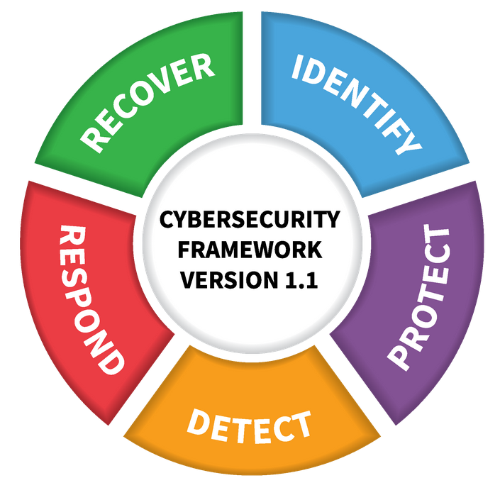

# CYBERSECURITY : Hoofdstuk 2 - Een wereld van experten en criminelen

## Ethiek en cyberwetten

Is het **ethisch** om:
- je wachtwoord van je studentenaccount even door te geven aan iemand anders, zodat deze persoon op eduroam gebruik kan maken van het internet?
- in te loggen op een website met een account waarvan je toevallig de credentials te pakken hebt gekregen (bv. op een post-it)
- wetende dat de website van je middelbare school een kwetsbaarheid heeft waarmee je data kan opvragen die niet mogelijk zou mogen zijn?
    - is het ethisch om het niet te vertellen aan de school?

> Zijn deze zeken legaal of illegaal?

### Wetgeving in cybersecurity

- Een van de basisprincipes binnen een samenleving of maatschappij is de **wetgeving**.
- Het is geen gemakkelijke taak om uit te voeren.
    - wetgeving loopt vaak achter op technologie
    - Het **op tijd** invoeren van "de juiste" regelgeving is essentieel
- Er zijn nationale en internationale pogingen om dit te regulariseren
    - België: wergeving rond "ethisch hacken"
    - Europa: NIS en NIS2 directives
    - VS: NIST framework
    - Wereldwijd: ISO/IEC cybersecurity model

- 15/02/2023 nieuwe wet uitgekomen in België.
    - Belgische bedrijven hacken mag zonder toestemming.
        - zonder frauduleuze bedoelingen of intentie of schade te berokken
        - bestaande kwetsbaarheden in netwerken in België opsporen en binnen de 72 uur melden.

### Het NIS en NIS2 directive

- NIS: eerste EU-brede wetgeving rond cybersecurity
    - ingevoerd in 2016
    - Invoering ging (te) langzaam
- NIS2:
    - meer verduidelijking
    - Hoe omgaan met snelle technologische vernieuwingen
    - mee samenwerking tussen lidstaten bij grote bedreigingen
    - verplicht meer organisaties en sectoren om te werken rond cyberssecurity
    - verplicht lidstaten om meer de wet te handhaven
    - Ingevoerd op 16 jan 2023, moet in de nationale wetgevingen van EU-lidstaten staan tegen 17 okt 2024

### NIST Framework

- National Institute of Standards and Technologies (NIST)
- Een **raamwerk** voor bedrijven en organisaties die cyberbeveiligingprofessionals nodig hebben.
- Stelt bedrijven in staat de belangrijkste soorten verantwoordelijkheden, functietitels en benodigde personeelsvaardigheden te identificeren.

### Het ISO/IEC cybersecurity model

- Het beveiligen van data is een enorme taak. Het is onmogelijk voor een persoon om alles van begin tot einde te weten.
- Het International Organization for Standardization (ISO)/International Electrotechnical Commission (IEC) heeft een volledig framework opgesteld om te helpen dit in goede banen te leiden. Dit framework noemt **het ISO/IEC cybersecurity model**
- Het ISO model is een hulpmiddel om complexe problemen te begrijpen en aan te pakken.
- Het ISO/IEC 27000 is een standaard opgesteld in 2005 (geupdated in 2023)
    - Alhoewel de standaard niet verplicht is, wordt het door veel landen en organisaties gebruikt als model voor cybersecurity
    - Bruikbaar voor elk type organisatie en bevat control doelstelling in de vorm van checklists
    - de organisatie moet zelf bepalen welke controle doelstellingen voor hen van toepassing zijn.

## Aanvallers

**Een hacker** (aanvaller) kan om verschillende redenen inbreken op computers of netwerken om toegang te krijgen:

- **White hat** hackers: breken in in netwerken of computersystemen om zwakke punten te ontdekken en zo de beveiliging te verbeteren
- **Gray hat** hackers: bevinden zich tussen de twee type hackers. Ze kunnen een kwetsbaarheid vinden en melden aan de eigenaar als die actie samenvalt met hun agenda.
- **Black hat** hackers: onetische criminelen die de computer- en netwerkbeveiling schenden voor persoonlijk gewin of om kwaardaardige redenen

### Scriptkiddies

> **Scriptkiddies** zijn meestal tieners of hobbyisten. Hun aanvallen worden meestal beperkt tot grappen en vandalisme. Ze hebben weinig tot geen vaardigheden en gebruiken vaak bestaande tools. 

### Vulnerability brokers

Dit zijn gray hat hackers die exploits proberen te ontdekken en deze aan leveranciers rapporteren, soms voor geldprijzen of beloningen.

### hackivisten

Dit zijn gray hat hackers die zich verzamelen en protesteren tegen verschillende politieke en sociale ideeën.

Ze protesteren publiek tegen organisaties of regeringen door artikelen en video's te plaatsen, gevoelige informatie te lekken en DDoS-aanvallen uit te voeren.

### Cybercriminelen

Dit zijn black hat hackers die ofwel als zelfstandige of voor grote cybercrime-organisaties werken. 

### State sponsored hackers

Afhankelijk van het perspectief van de persoon zijn dit ofwel white hat of black hat hackers die overheidsgeheimen stelen, inlichtingen verzamelen en netwerken saboteren. 

Doelwitten zijn vaak buitenlandse regeringen, terroristische groeperingen en bedrijven. 

## Verdedigers

### Cybersecurityspecialisten

Het dwarsbomen van cybercriminelen is een moeilijke taak. Vele bedrijven, overheden en internationale organisaties zijn daarom begonnen met het nemen van gecoördineerde acties om cybercriminelen te beperken of af te weren.

- **Vulnerability databases** - publiek beschikbare databases van gekende kwetsbaarheden. (bv. De Nation Common Vulnerabilites and Exposures (CVE)-database)
- **Early Warning Systems** - systemen voor vroegtijdige waarschuwing. (bv. Honeynet-project, EWS van het Centre for Cybersecurity Belgium, Belnet Threat Intelligence)
- **Share cyberthreat intelligence** - delen van cyber intelligence, vaak door middel van samenwerking tussen de publieke en private sector. (Bv. InfraGard, Mitre)
- **IMS-normen** - Standaarden en normen voor informatiebeveiligingsbeheer die een kader vormen voor het implementeren van beveiligingsmaatregelen binnen een organisatie (bv. ISO 27000)

### Organisaties voor samenwerking

- Cybersecurity-specialisten moeten regelmatig samenwerken met professionele collega's
- Internationale technologieorganisaties sponsoren vaak workshops en conferenties

### Conferenties, CTF's

- Cybersecurity-specialisten moeten dezelfde vaardigheden hebben als hackers, vooral black hat hackers, om zich te beschermen tegen aanvallen.
- Hoe kan een individu de vaardigheden opbouwen en oefenen die nodig zijn om een cyberbeveiligingspecialist te worden
- Conferenties en competities zijn een geweldige manier om kennis en vaardigheden op het gebied van cyberbeveiling op te bouwen.

### Organisaties tegen computermisdaad

- Er bestaan verschillende organisaties om computermisdaad te bestrijden
    - België: Federal Computer Crime Unit (FCCU), Centre for Cyber Security Belgium
    - Wereldwijd: Europol, ENISA, Interpol

## Security vs. Privacy

Er zijn vaak 2 kanten in het verhaal:
- Personen die vinden dat iedereen een fundamenteel recht heeft op Privacy
- Personen die vinden dat security belangrijker is dan privacy

Vaak worden de voorbeelden van terrorisme en kinderporno naar bovengehaald.
Deze personen maken gebruik van het recht op privacy om hen te beschermen

Overheden willen hierdoor achterpoortjes in ecryptiesoftware verplichten.
Echter is er onder tussen al gebleken dat de overheden hiervan misbruik maken (PRISM-schandaal)

### GDRP

- Bekend in België als AVG
- Europese wet voor bescherming van privacy
- Ingevoerd in 2018
- Recht:
    - van inzage
    - op correctie
    - om vergeten te worden
    - op overdracht van gegevens
    - beveiliging
- Organisaties moeten:
    - een goed doel hebben voor gegevensverzameling
    - enkel nodige gegevens opvragen
    - voor slecht beperkte duur
    - toestemming vragen
- Privacyverklaring
- Soms kan de wet je verplichten om gegevens te geven
- Wat is toestemming? GDPR legt regels op
    - Duidelijk
    - Niet automatisch aangevinkt (expliciete toestemming)
    - Geen negatieve gevolgen
    - intrekbaar
    - 13 jaar of ouder (of door voogd)
- Gegevensbeschermingsautoriteit controleert naleven van de GDPR
    - Hier kan je terecht indien jouw rechten geschonden worden