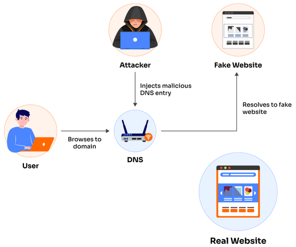
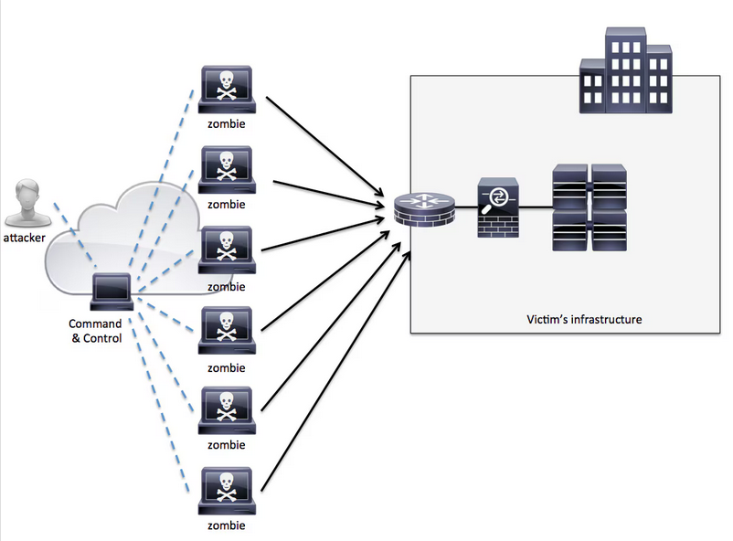
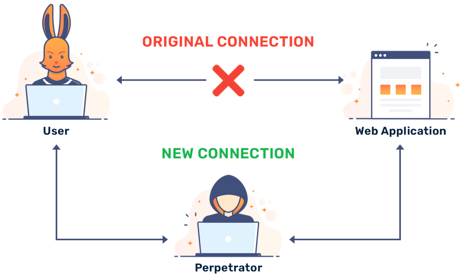
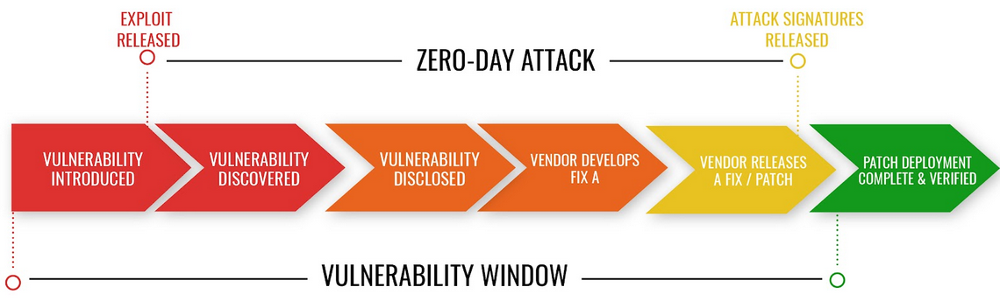
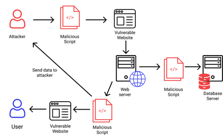
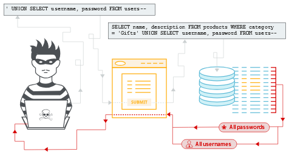

# CYBERSECURITY : Hoofdstuk 3 - Bedreigingen, aanvallen en kwetsbaarheden

## Inleiding

### Interne vs. Externe aanvallen

- Aanvallen kunnen afkomstig zijn van binnen organisatie of van buiten de organisatie.
- **Interne** aanvallen:
    - Afkomstig van een **interne gebruiker**, zoals medewerker of contractpartner
    - kan per ongeluk of opgezet zijn
    - Interne aanvallen kunnen grotere schade aanrichten dan externe dreigingen, omdat interne gebruikers rechtstreeks toegang hebben tot het gebouw en de bijbehorende infrastructuur/apparatuur
    - Interne aanvallers hebben doorgaans kennis van het bedrijfsnetwerk, de bronnen en de vertrouwelijke gegevens. Ze hebben mogelijk ook kennis van beveiligingsmaatregelen, beleidsregels en hogere niveaus van beheerdersrechten.

- **Externe** aanvallen:
    - van amateurs of ervaren aanvallers kunnen misbruik maken van kwetsbaarheden in netwerkapparaten, of kunnen social engineering gebruiken, zoals bedrog, om toegang te krijgen
    - maken misbruik van zwakheden of kwetsbaarheden om toegang te krijgen tot internen bronnen

### Opkomst van mobiele apparaten

- In het verleden gebruikten werknemers doorgaans door het bedrijf uitgegeven computers die waren verbonden met een bedrijfsnetwerk.
- Tegenwoordig wordt er steeds meer gebruik gemaakt van **mobiele apparaten** op de werkvloer.

> Dit noemt men **Bring Your Own Device (BYOD)** en is een groeiende trend

- Het moeilijk centraal beheren en updaten van mobiele apparaten, vormt een bedreiging voor organisaties die mobiele apparaten van werknemers op hun netwerken toestaan.

### Opkomst van Internet-of-Things (IoT)

> **Het Internet-of-Things** (IoT) is de verzameling technologieën die de verbinding van verschillende apparaten met het internet mogelijk maakt.

- IoT-technologieën stellen mensen in staat miljarden apparaten met het internet te verbinden.
- Deze apparaten omvatten lichten, sloten, motoren en entertainmentapparaten, om er maar een paar te noemen.
- Dit heeft invloed op de hoeveelheid gegevens die moet worden beschermd. Gebruikers hebben op afstand toegang tot deze apparaten, waardoor het aantal netwerken en toestellen dan moet worden beschermd toeneemt.
- Voorbeelden IoT:
    - Connected cars
    - Smart appliances
    - Connected security systems
    - Smart agriculture equipment
    - Connected retail
    - Connected healthcare monitors
    - Connected manufacturing equipment
    - Connected cities
- Fabrikanten geven weinig prioriteit aan de beveiliging van IoT-apparaten, daarom is het net een geliefd doelwit van criminelen.

### Impact van Big Data

> **Big Data** is het resultaat van *datasets* die groot en complex zijn, waardoor traditionele dataverwerkingstoepassingen ontoereikend zijn.

Big data biedt zowel uitdagingen als kans op basis van drie dimensies:
- Het volume of de hoeveelheid gegevens
- De verscheidenheid of het bereik van gegevenstypen en bronnen
- De snelheid van gegevens

> Worden ook wel de 3 V's genoemd, **V**olume, **V**ariety, **V**elocity.

### Bredere reikwijdte en cascade-effect

**Federatief identiteitsbeheer** verwijst naar meerdere ondernemingen die hun gebruikers dezelfde identificatiegegevens laten gebruiken om toegang te krijgen tot de netwerken van alle ondernemingen in de groep. Het doel van federatief identiteitsbeheer is om identificatieinformatie automatisch over domeingrenzen heen te delen.

De meest gebruikelijke manier om de federatieve identiteit te beschermen, is door inlogmogelijkheid te koppelen aan een geautoriseerd apparaat.

Voorbeelden van federatief identiteitsbeheer:
- Je kan op verschillende sites inloggen met facebook-/google-/steam-/... account, ook al heeft die website daarmee niets te maken.
- Je kan je op verschillende sites inloggen met je e-id

### Verhoogde waakzaamheid

De verdediging tegen cyberaanvallen aan het begin van het cybertijdperk was laag. Een slimme middelbare scholier of scriptkiddie kon toegang krijgen tot systemen.

- Nu zijn landen over de hele wereld zich meer bewust geworden van de dreiging van cyberaanvallen. De dreiging van cyberaanvallen staat nu in de meeste landen bovenaan de lijst van grootste bedreigingen voor de nationale en economische veiligheid.

- Hoe doen we het in België?
    - Je kan terecht als slachtoffer bij:
        - [safeonweb](https://www.safeonweb.be/nl/nuttige-links) voor nuttige links over cybercriminaliteit
        - de lokale politie om aangifte te doen

## Malware en kwaardaardige code

### Verschillende soorten malware

Cybercriminelen vallen de toestellen van de gebruikers aan door het installeren van kwaadaardige code.

#### Virussen

> **Een computervirus** is een kwaadaardig stukje code die vasthangt aan een uitvoerbaar bestand.

De meeste virussen hebben een zekere vorm van actie van de eindgebruiker nodig. De virussen kunnen dan onmiddelijk of op een bepaald moment worden geactiveerd.

#### Worm

> Een stukje kwaadaardig code die zich kenmerkt doordat het zichzelf repliceert door gebruik te maken van een kwetsbaardheid in het netwerk.

Worms zullen hierdoor vaak ook het netwerk vertragen.

**Verschil met een virus**: een virus heef een host programma nodig om te draaien, een worm kan op zichzelf draaien.

> Behalve de initiële infectie heeft de worm geen interactie van de gebruiker nodig.

#### Trojan Horse

> Malware die verborgen zit in gewenste bestanden zoals foto's of een game.

- Een gebruiker is hier niet van bewust
- Een Trojan Horse verschil van een virus omdate het een niet-uitvoerbaar bestand infecteert
- Een virus heeft een executable bestand nodig.
- Een Trojan Horse is dus geen programma dat zelfstandig beschadigingen aan de geïnfecteerde computer veroorzaakt.
- Het moet bovendien door de gebruiker zelf worden gekopieerd en kopieert zichzelf niet naar andere computers zoals een worm wel doet.

#### Logic bomb

> Een kwaadaardig programma die wordt geactiveerd op een bepaald moment (=trigger). 

- Wacht op de trigger om te activeren en schade toe te brengen
- Trigger kan een bepaalde datum zijn, een ander programma dat wordt opgestart, of een bepaalde actie die werd gedaan.

#### Ransomeware

> Een computersysteem of data wordt geblokkeerd of geëncrypteerd tot het moment dat het slachtoffer een geldsom betaalt.

- De key om data opnieuw te decrypteren blijft geheim tot er betaald wordt.
- Soms heb je geluik en kan je toch data decrypteren en herstellen
    - [No More Ransom - Decryptiontools](https://www.nomoreransom.org/en/decryption-tools.html#header) - samenwerken van politiediensten
    - Voorkomen is beter dan genezen! Maak vaak back-ups

#### Backdoor en Rootkits

> Een rootkit zal het operating system aanpassen en zo een backdoor creëren?

Deze backdoor wordt dan gebruikt om het gecompromitteerde systeem binnen te dringen, zonder enige vorm van authenticatie.

#### Keyboard logging

> Een computerprogramma die de toetsenbordaanslagen (keystrokes) gaat opnemen of loggen.

Dit stukje sofware wordt dan op het toestel van het slachtoffer geïnstalleerd. De dader programmeert de software om dan na afloop de log file of opname via mail door te sturen naar de dader. In de log file kan dan gevoelige informatie staan, zoals emailadressen, wachtwoorden, pincodes,...

## Misleiding en oplichting

### De kunst van het oplichten

#### Social engineering

- Gebruikt geen technologische hoogstandjes, maar is daarom niet minder doeltreffend. Het bestaat erin om het vertrouwen van jouw slachtoffer te winnen om dan nadien van het slachtoffer iets te verlangen.
- **voorbeeld**: voordoen als iemand van de beveiligingsfirma en vragen om de poort te openen
- Tegenwoordig een van de meest populaire hack-methodes
    - 80%
    - Zeer doeltreffend
    - Mensen zijn vaak de zwakste schakel$

#### Phishing

> Een vorm van fraude. Hierbij probeert de aanvaller informatie (meestal login-, credit card gegevens) te verkrijgen van het slachtoffer.

>**Phishing** = *Password Harvesting Fishing*

Vaak krijg je via social media of email een link doorgestuurd. De webpagina doet zich dan bv. voor als een loginscherm van een bank.

Gebruikers die denken dat dit loginscherm legitiem is, geven zo hun gegevens bloot aan de aanvallers.

#### Pretexting

> Het slachtoffer wordt opgebeld en gevraagd om gevoelige informatie vrij te geven om identificatie mogelijk te maken.

**Voorbeeld**: een credit card nummer wordt gevraagd aan het slachtoffer.

#### Vishing

> Ookwel **phone phishing**, is een vorm van criminele telefoonfraude, waarbij gebruik wordt gemaakt van social engineering via de telefoon om toegang te krijgen tot persoonlijke en financiële informatie met ook op een financiële beloning.

*SMSiShing* (SMS phishing): gebruikt SMS om valse berichten tte sturen. De dader zal op die manier proberen het slachtoffer te lokken naar een website of verleiden om te bellen naar een bepaald nummer

#### Quishing (QR phishing)

> Het verspreiden van QR codes die proberen het slachtoffer te lokken naar een website.

#### Cat phishing

> Het aanmaken van een valse identiteit om op die manier het vertrouwen van het slachtoffer te winnen. Soms gaat het hier over een liefdesrelatie op dating sites.

#### Spear phishing/whaling

> **Spear phishing**: phishing gericht op een specifiek persoon, doelgroep, organisatie of bedrijf

> **Whaling**: een vorm van spear phishing gericht op een specifiek zeer belangrijk persoon

#### Pharming

- Geen rechtstreekse interactie met gebruiker nodig
    - verschil met phishing: pharming is phishing without a lure

#### Typosquatting

> Misbruik maken van vaak voorkomende *typfouten*.

**Voorbeeld**: een website hosten die lijkt op https://paypal.com met een URL als https://paipal.com. Gebruikers voeren daar dan nietsvermoedend hun gegevens in.

#### Shoulder surfing

> Het aflezen/meelezen van PIN-codes of wachtwoorden en dergelijke. Hiervoor kan de dader dichtbij staan of kan hij een camera of verrekijker gebruiken.

#### Dumpster diving

> Het zoeken van info in afval

#### Impersonation

> Zich voordoen als iemand anders

#### Piggybacking/tailgating

> Het meeglippen met personen die wel toegang hebben tot een plaats met beperkte toegang

## E-mail en browser aanvallen

### SEO posoning

Zoekmachines zoals Google werken door resultaten te tonen op basis van de query van de gebruiker. Deze zoekresultaten worden geordend d.m.v. **Search Engine Optimization (SEO)**. 

Dit is een verzameling technieken die er moet voor zorgen dat jouw website hoog scoort bij de zoekmachines.

> Cybercriminelen durven SEO wel eens te misbruiken om hun kwaadaardige software hoog in Google te laten ranken.

### Browser hijacking

> Dit zorgt dat de browser instelling worden gewijzigd. Op die manier kunnen criminelen ervoor zorgen dat jouw browser doorlinkt naar de website van de "klant" van deze crimineel

### Spam

Spam, junk mail, ongewenste e-mail, allemaal synoniemen voor iets waar we ons dagdagelijks aan ergeren. In de meeste gevallen gaan de ongewenste e-mails over advertenties, maar deze kunnen ook verwijzen naar kwaadaardige links met mogelijks misleidende informatie.

### Hoaxes

- Een leugen, valse informatie
- Vaak onschadelijk, maar niet altijd

### Spyware

> Probeert informatie te vergaren over een gebruiker en stuurt dit door naar een externe partij.

Vaak worden hiervoor de beveilingsinstellingen aangepast. Het gaat dan soms over keystrokes verzamelen of data capture. Het doel van spyware is meestal om geld te verdienen.

### Adware

> Typisch zijn dit de lastige pop-ups. Deze pop-ups proberen op één of andere manier winst op te leveren voor de auteur. Het is dan ook advertentie-ondersteunende software.

Het woord spyware verwijst strikt genomen naar programma's die bijvoorbeeld surfgedrag en andere privacygevoelige informatie achterhalen. Intussen wordt de term gebruikt voor veel meer. Zo wordt adware vaak gemakshalve tot de spywarecategorie gerekend.

### Scareware

> Probeert de gebuiker te overtuigen door ze bang te maken. Het systeem doet zich bv. voor als een dialoogvenster van het besturingssysteem.

## Netwerkaanvallen

### Botnets

- C&C, C2 (**Command and Control**): computers, smartphones, IoT,... worden geïnfecteerd door malware. De malware maakt een connectie met de C&C server van de aanvaller. De C&C server kan nu opdrachten versturen naar het geïnfecteerd toestel om andere toestellen te infecteren om het botnet te doen groeien, of aanvallen uit te voeren.
- Een botnet kan bestaan uit honderden tot duizenden geïnfecteerde toestellen onder invloed van een aanvaller

### (Distributed) Denial-of-Service attack

> Een aanval die resulteert in het niet beschikbaar zijn van een bepaalde netwerk service (bv. website).

Een (D)DoS attack is een groot risico en kan ervoor zorgen dat je veel tijd en geld verliest. Je hoeft niet veel talent te hebben om een (D)DoS attack uit te voeren: deze zijn relatief makkelijk uit te voeren.

**DoS**: een computer/connectie voert de aanval uit

**DDoS**: meerdere computers/connecties nemen deel aan de aanval. (kan bv. door een botnet uitgevoerd worden)

### Sniffing

> Gelijkaardig aan iemand afluisteren. De dader zal alle netwerkverkeer die passeert aan de NIC (Network Interface Card) bekijken, ook het netwerkverkeer dat niet voor hem bedoeld was.

Daders gebruiken speciale software en/of hardware om het netwerk te sniffen.

--> Dit kan je zelf doen via Wireshark

### Spoofing

> De werkelijkheid vervalsen. Zo gaat de dader kenmerken aanpassen om te doen also hij/zij iemand anders is.

Zo zal men bij email spoofing de header (bv. From, Return-Path) aanpassen. Zo kan men doen alsof de mail door iemand anders verzonden is.

Andere vormen: URL-spoofing, IP-spoofing

> Spoofing verschilt van phishing omdat het technologie misleidt i.p.v. mensen

### Man-in-the-middle attack

> De cybercrimineel zal trachten informatie te stelen dat wordt verstuurd over een netwerk tussen twee toestellen. Hij kan ervoor kiezen om de boodschap aan te passen en op die manier valse informatie te verspreiden tussen de hosts. De hosts zijn zich op dat moment niet bewust van de aanval.

Een MitM-aanval laat de dader toe de controle over te nemen zonder dat de andere partijen dit weten.

### Frauduleuze (Rogue) Access Point

Wordt in een (vaak draadloos) netwerk geplaatst en doet zich voor als een vertrouwelijk apparaat.

- Dit laat je toe MitM-attacks uit te voeren.
- Access Point wordt geplaatst en zorgt ervoor dat mensen hun verkeer via dit Access Point versturen waardoor het de data kan zien en analyseren.

## Applicatie-aanvallen

### Zero-day attack

Er wordt geprobeerd om gebruik te maken van een kwetsbaardheid in software die nog niet gekend is.

Day zero (of zero houd) verwijst naar het moment waarop het lek wordt ontdekt.

### Cross-site scripting (XSS)

Een kwetsbaardheid in web applicaties. Via XSS kan je scripts injecteren in een webpagina die beschikbaar is voor de gebruiker.

De crimineel valt het slachtoffer niet rechtstreeks aan, maar wel de website. Uiteraard is het het slachtoffer die de website bezoekt.

De dader slaagt er soms in om files te bekijken op de webserver die niet voor hem bedoeld zijn.

### Code injections

Een van de meest gebruikte manier om data op te slaan voor een website is door gebruik te maken van een databank. Via een SQL-injection zal men bv. proberen om een SQL databank aan te vallen.

Men injecteert dan een query om deze uit te voeren. Developers dienen zich bewust te zijn van de potentiële gevaren. 

### Buffer 

Wanneer data over zijn limiet gaat. Buffers zijn geheugen die door een applicatie worden gebruikt. Door de data aan te passen en te vergroten tot het de buffers overschrijdt, gebruikt de applicatie geheugen dat door een ander proces wordt gebruikt en krijg je een error. Deze error kan dan een applicatie crash of het verlies van data zijn.

> bv. wanneer je in Java een `IndexOutOfBoundsException` krijgt heeft Java je tegengehouden een buffer overflow te begaan.

> Niet alle programmeertalen controleren hierop zoals bv. C/C++

### Remote Code Executions (RCE)

De dader gebruikt een kwetsbaardheid waarbij hij/zij code vanop afstand kan uitvoeren. Het is dan bv. mogelijk om over het netwerk of over het internet van het slachtoffer aan te vallen.

### Beschermen tegen deze aanvallen

- First-line defence: programmeurs moeten stabiele code schrijven
- Alle user input van buitenaf beschouwen als vijandige of kwaadaardige code
- Alle user input valideren en controleren
- Alle software waaronder plug-ins up-to-date houden door updates regelmatig uit te voeren
- Niet alle updates worden automatisch uitgevoerd, dus controleer zelf manueel ook altijd eens of er geen updates kunnen uitgevoerd worden.

## APT's

> **Een Advanced Persisten Threat** is een langdurige en doelgerichte cyberaanval waarbij een onbevoegd persoon onopgemerkt en langdurig toegang krijgt tot een netwerk.

Het doel is om continu toegang te krijgen en gegevens te stelen. APT-aanvallen richten zich vooral op landen en organisaties.

- **Advanced**: de schaal (incl. de middelen) zijn zeer geavanceerd van aard. Een enkel individu kan dit niet uitvoeren. Vaak gaat het om state-sponsered hackers of georganiseerde misdaad.
- **Persistent**: heeft als doel om heel lang onzichtbaar te blijven
- **Threat**: steelt logingegevens en gevoelige data. Het is vaak een vorm van spionage.

Aanvallende organisaties krijgen vaak code beginnend met APT:
- Fancy Bear (aka. APT28)
- Cozy Bear (aka. APT29)

### Voorbeel 1: Stuxnet

- Advanced: 
    - Een van de meest complexe en doelgerichte malware-aanvallen die tot nu bekend zijn
    - Maakte gebruik van verschillende zeo-day kwetsbaarheden om te infiltreren en zich te verspreiden
    - Opmerkelijk vanwege zijn vermogen om industriële controlsystemen te manipuleren, met name de systemen die worden gebruikt in kerncentrales en industriële faciliteiten
    - Bevatte ook digitale certificaten om zijn legitimiteit te verifiëren, wat suggereerde dat het door een zeer geavanceerde (state sponsored?) actor was ontwikkeld.
        - oorsprong van Stuxnet was eerst niet bekend, later werd onthuld dat het een gezamelijke operatie was van de Amerikaanse NSA en de Israëlische inlichtingendienst

- Persistent:
    - 2009-2010: jarenlang
    - ontdekt in Juni 2010

- Threat:
    - Het primaire doelwit was de nucleaire installatie in Natanz, Iran
    - Een van de eerste bekende voorbeelden van door state sponsored cyberwapens
    - een keerpunt in de wereld van cybersecurity, omdat het aantoonde dat fysieke systemen via digitale middelen kunnen worden aangevallen
    - illustreerde het potentieel voor grootschalige en verwoestende cyberaanvallen op industriële infrastructuren

### Voorbeeld 2: Belgacom

- Advanced:
    - op grote schaal uitgevoerd
    - door de Britse geheime dienst (GCHQ), in samenwerking met de Amerikaanse NSA

- Persistent:
    - 2010-2013: jarenlang
    - Ontdekt in 2013 en kreeg de naam "Operation Socialist"

- Threat
    - Malafide software werd gebruikt om toegang te krijgen tot het interne netwerk van het bedrijf voor het verzamelen van gevoelige informatie.
    - Het feit dat een overheidsinstantie van een ander land betrokken was bij de aanval deed veel stof opwaaien en riep vragen op over de grenzen en ethiek van digitale spionage.