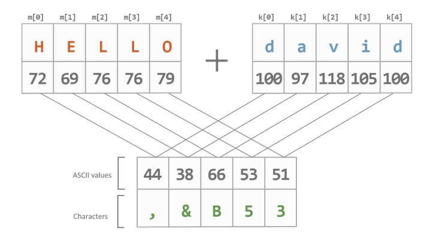

# CYBERSECURITY : Hoofdstuk 4 - Confidentiality

## Cryptografie

- **Cryptologie**: wetenschap maken en breken geheime codes
- **Cryptografie**:
    - manier om gegevens op te slaan en te verzenden, zodat alleen de ontvanger deze kan lezen
    - moderne cryptografie: gebruik van algoritmen om gevoelige data te beschermen
    - veel ouder dan computers
- **Crypto-analyse**: kraken van cryptografie

De geschiedenis van cryptografie begon duizen jaar geleden. Boodschappen van het hof van een koning brachten versleutelde berichten naar andere rechtbanken. Andere rechtbanken probeerden dan de berichten te stelen die verzonden werden naar een koninkrijk dat zij als een tegenstander beschouwden. Niet lang daarna begonnen militaire commandanten encryptie te gebruiken om berichten te beveiligen.

Elke versleutelingsmethode gebruikt een specifiek algoritme, **een cijfer** genaamd, om berichten te versleutelen en te ontsleutelen. Een cijfer is een reeks goed gedefinieerde stappen die worden gebruikt om berichten te versleutelen en ontsleutelen. Er zijn verschillende methoden om cijfertekst te maken:
- transpositie (omzetting)
- substitutie (vervanging)
- eenmalige pad

### Encrypteren

- Om vertrouwelijkheid (confidentiality) te garanderen kunnen we een bericht encrypteren met behulp van een specifiek algoritme (cipher)
- Hierbij wordt een bericht dat we kunnen begrijpen (plaintext) omgezet naar een onleesbaar bericht (ciphertext) via een aantal goe gedefinieerde stappen (algoritme), vaak met behulp van een geheime sleutel (key)

### Decrypteren

- Het omgekeerde is ook mogelijk, **decrypteren** zet een onleesbaar bericht terug om naar de originele leesbare tekst.
- Voor encrypteren en decrypteren wordt vaak een combinatie gebruikt van verschillende technieken:
    - transpositie (omzetting)
    - substitutie (vervanging)
    - One-time pad

### Transpositie

Een eenvoudig voorbeeld van transpositie waarbij de volgorde van de karakters wijzigt

### Substitutie

Voorbeelden substitutie waarbij karakters vervangen worden door andere karakters

### One-time pad

Voorbeeld one-time pad waarbij een random sleutel (pad) toegevoegd wordt aan de plaintext. Nadien wordt het resultaat omgezet naar een getal van 2 cijfers

>[!note]
> zie slides voor info video uitleg

### Randomheid

- One time pad kan gekraakt worden als er een patroon in de sleutel zit
    - de sleutel moet volledig random zijn

### Pseudorandom

- Computers zijn deterministisch
    - we maken ze juist heel precies zodat ze altijd hetzelfde uitkomen
- Computers bevatten pseudorandom generators
    - spuwen op basis van een startgetal (seed) schijnbaar random getallen
    - seed wordt heel vaak gebruikt in games
        - randomheid in AI, omgeving
        - gereren van werelden
- Pseudorandom algoritmes zijn zeer moeilijk om correct op te stellen
- Vaak wordt er gebruik gemaakt van natuurlijke random fenomenen
    - bv. https://random.org biedt random getallen aan op basis van atmosferische ruis
    - bv. Cloudflare filmt een muur van lavalampen en zet die om naar random getallen

### Twee types algoritmen

- Symmetrische algoritmen
    - zelfde gedeelde sleutel voor encrypteren (versleutel) en decrypteren (= geheim sleutelpaar)
    - verzender en afzender kennen de sleutel voor communicatie begint
        - Groot nadeel: hoe wissel je deze veilig uit?
            - Dit moet via een ander communicatiemiddel dan hetgeen je wil encrypteren.
            - Je kiest een medium dat niet gecompromiteerd is

- Asymmetrische algoritmen
    - Sleutelpaar: verschillende sleutels voor encrypteren en decrypteren
        - 1 sleutel is publiek, andere is privé
        - Hoeft geen sleutel op voorhand uit te wisselen
            - niet het grote nadeel van symmetrische encryptie
            - wel complexer en dus trager dan symmetrische algoritmen
        - Elke persoon can conderen met de openbare sleutel en enkel de ontvanger kan decoderen met privésleutel

> Asymmetrische algoritmen worden ook wel **publieke-sleutel-cryptografie** genoemd. 

#### Verschil tussen beide algoritmen

- **Private-key versleuteling (symmetrisch)**
    - Data Encryption Standard (DES)
        - Eenvoudig, encrypteert 64-bits blokken met 56-bits sleutel
        - Niet bruikbaar in de praktijk, **niet veilig!**
    - Triple DES (3DES)
        - 3x DES met verschillende sleutels
        - Gebruikt een verschillende sleutel voor ten minste 1 van de 3 passages
        - Sleutelsterkte: in praktijk 112-168 bits afhankelijk van gekozen combinatie
        - Niet bruikbaar in de praktijk, **niet veilig!**
    - International Data Encryption Algorithm (IDEA)
        - 64-bits blokken
        - 8 transformatieronden van elk 16 blokken die het resultaat zijn van het verdelen van 64-bits blok
        - Vervanging voor DES, gebruikt bij PGP (Pretty Good Privacy)
        - **Veilig** op dit moment
    - Advanced Encryption Standard (AES)
        - 128-bits blokken, sleutel van 128, 192 of 256 bits
        - Goedgekeurd door NIST, gebruikt door Amerikaanse overheid
        - **Veilig** op dit moment
        - Op dit moment de meest aangeraden (bv. voor performantie, implementeerbaarheid)

    - > aantal bits per blok: aantal bits dat in 1x door het encryptie-algoritme wordt geëncrypteerd. Indien het bestand groter is, wordt het in blokken gekapt en blok per blok geëncrypteerd.
    - > aantal bits voor de sleutel: hoe meer bits de sleutel bevat, hoe moeilijker het is om het encryptie-algoritme is te kraken

- **Public-key versleuteling (asymmetrisch)**
    - Rivest Shamir Adleman (RSA)
        - gebruikt product van 2 heel grote priemgetallen met gelijke lengte tussen 100 en 200 cijfers
        - vaak gebruikt in browsers
        - **veilig** op dit moment
    - Elliptic Curve Cryptography (ECC)
        - Alternatief voor RSA: nulpunten van elliptische curven i.p.v. priemgetallen
        - NSA gebruikt dit voor handtekeningen en uitwisselen van sleutels
        - **veilig** op dit moment
        - Wordt meer en meer gebruikt i.p.v. RSA vanwege kleinere sleutels
    - Diffie-Hellman
        - Gebruikt om geheime sleutel (sessiesleutel) voor symmetrisch algoritme veilig uit te wisselen
        - Vaak gebruikt: SSL (Secure Sockets Layer), TLS (Transport Layer Security), SSH (Secure Shell), IPSec (Internet Protocol Security),...
        - **veilig** op dit moment
    - El Gamal
        - Amerikaanse overheidsstandaard voor digitale handtekeningen
        - Niemand heeft patent ...
            - Vroeger was er een patent op RSA (nu niet meer)
            - Werd daarom gebruikt bij PGP (Pretty Good Privacy)
        - **veilig** op dit moment

    - > SSL/TLS: Een encryptie-algoritme dat bijvoorbeeld gebruikt wordt in HTTPS (beveiligd surfen op het internet)
    - > SSH: Een manier om op een veilige manier vanop afstand in te loggen op een toestel en deze te beheren alsof je er zelf ter plekke zit
    - > IPSec: Een vaak gebruikt protocol voor VPN's

#### Symmetrische vs. asymmetrische codering

| Symmetrisch                                                                        | Asymmetrisch                                                           |
| ---------------------------------------------------------------------------------- | ---------------------------------------------------------------------- |
| Snel                                              | Niet nodig om beide sleutels te delen |
| Verbruikt weinig resources                        | Kan gebruikt worden voor encryptie en validatie (=handtekening) |
| Kan gebruikt worden voor korte en lange berichten | Gebruikt veel resources |
| Sleutel moet op veilige manier gedeeld worden       | Enkel bruikbaar voor relatief kleine berichten |

#### In de praktijk

1. We gebruiken **asymmetrische encryptie** om een geëncrypteerde tunnel op te zetten
2. We gebruiken dan **Diffie-Hellman** om via de tunnel een gemeenschappelijk symmetrische sessie-sleutel te genereren zonder onze private keys uit te wisselen
3. We gebruiken daarna de **symmetrische sessiesleutel** om een (snellere) tunnel op te zetten

> **Een tunnel** betekent dat we berichten in een enkele of beide richting encrypteren. Anderen kunnen deze berichten niet lezen. Het lijkt alsof we een eigen tunnel hebben voor onze berichten door het internet.

#### Public-key versleuteling

- Bij asymmetrische algoritmen heeft elke gebruiker een public en private key. 
- iedereen mag de public key zien
- Anderen gebruiker deze key om berichten naar jou te encrypteren
- De private key mag niemand zien
    - wordt door jou gebruikt om berichten te decrypteren
    - indien deze gelekt is kan die persoon jou berichten decrypteren
    - best nieuwe keys genereren en iederen op de hoogte stellen met *revocation certificate*

- Naast encrypteren kunnen asymmetrische algoritmen ook digitale handtekeningen genereren.
- Hiermee kan je bewijzen:
    - dat het bericht/bestand van jou afkomstig is
    - het bericht/bestand niet gemanipuleerd of bewerkt is

- Met behulp van een public key kan je controleren of de handtekening klopt.
- Je genereerd ze met jouw private key