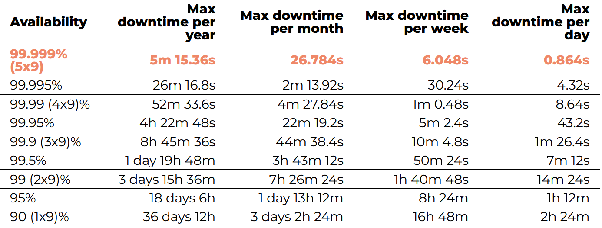
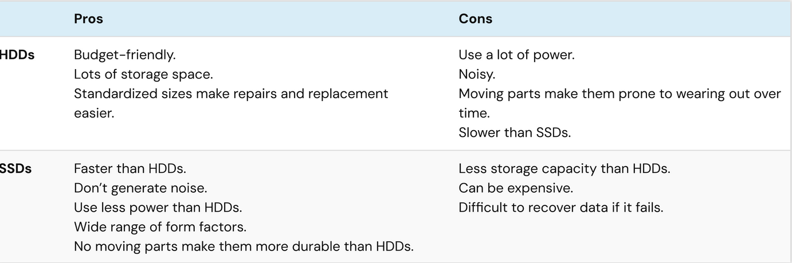

# CYBERSECURITY : Hoofdstuk 6 - Availability

## Onvoorziene problemen

### Disaster Recovery Planning

- Het is nodig om een organisatie draaiende te houden wanneer een ramp optreedt.
- Hee ramp omvat zowel natuurlijke als menselijke acties die schade toebrengen
    - Kan de organisatie beletten om zijn acties voort te zetten

### Natuurlijke rampen

- Geologische rampen
    - bv. aardbevingen
- Meteorologische rampen
    - bv. bliksem, hagel, tornado,...
- Gezondheidsramp
    - bv. pandemieën, quarantaines,...

### Menselijke rampen

- Gebeurtenissen op het werk
    - bv. staking, ontslag, bewust trager werken,...
- Socio-politieke gebeurtenissen
    - bv. vandalisme, blokkades protesten, sabotage, terreur,...
- Onderbreking in nutsvoorzieningen
    - bv. stroom, internet,...

## Hoge beschikbaarheid

### 5x9 principe

- In het Engels: **Five Nines**
- Systemen en services kennen een uptime van 99.999%
    - ofwel: ze zijn beschikbaar in 99.999% van de tijd
    - concreet: downtime bedraagt minder dan 5 minuten 15;36 seconden per jaar

| Availability | Uptime (%) | Max downtime per year |
| ------------ | ---------- | --------------------: |
| five nines   | 99.999     | 5m 15.36s             |
| four nines   | 99.99      | 52m 33.6s             |
| three nines  | 99.9       | 8h 45m 36s            |
| two nines    | 99         | 3 days 15h 36m        |
| one nines    | 90         | 26 days 12h           |

### Omgevingen met hoge beschikbaarheid (cruciale sectoren)

- Financiële sector:
    - trading, diensten beschikbaar voor klant, vertrouwen van de klant
- Gezondheidssector:
    - Patiëntenzorg de klok rond
- Industrie
    - Fabrieken, assemblage
- Transportsector:
    - NMBS, luchtvaart;
- Openbare veiligheid:
    - brandweer, politie, leger
- Nutsvoorzieningen
    - Energiecentrales, waterzuiveringstations
- Telecom sector:
    - Telefoon, internet, TV
- Retail industrie:
    - Supply chain, leveren van producten
    - Denk aan eindejaarsperiode

### Bedreigingen van de beschikbaarheid

Er zijn heel wat oorzaken van verlies van beschikbaarheid. Van het falen van een systeem tot een natuurramp
- System failure
- Niet-doelbewuste oorzaak
- Doelbewuste aanval
- Natuurramp

### Hoge beschikbaarheid kan je bekomen door

- Een zo hoog mogelijke uptime van diensten
    - Door te mikken naar veel "nines" uit the 5x9 principe
- Redundantie om single points of failure (SPoF) te vermijden
- Robuuste systemen te bouwen
- Het monitoren van de systemen
- Het maken van backups

#### Vermijden van SPoF

- Single points of failure zijn de zwakke schakels die ervoor kunnen zorgen dat het ganse systeem faalt.

#### Redundantie

- Een single point of failure moet altijd worden vermeden:
    - hardware, data, processen, software, personeel
- Oplossing: zorg je niet op één element vertrouwt.
- Faalt een kritiek onderdeel?
    - Redundantie: een reserve neemt over
    - bv. meerdere load balancers voorzien (die eigenlijk allemaal hetzelfde doel hebben)
- N+1 Redundantie zorgt ervoor dat systemen beschikbaar blijven als er eentje faalt
- Componenten (N) moeten steeds minimum één backup component hebben (+1)
    - bv. een auto heeft een reservewiel in de koffer als 1 van de wielen faalt.

### Systemen zullen falen

- Elk systeem zal ooit falen, wat dan?
- Robuuste systemen hebben een hoge tolerantie voor falen.
    - bv. routing protocols in een netwerk: als een toestel faalt, wordt er automatisch een andere weg gezocht tussen A en B
- Robuustheid inbouwen is meer dan enkel redundantie voorzien
- Meer en meer applicaties worden ontwikkeld waarbij men er van uit gaat dat de applicatie vroeg of laat kan crashen
    - bv. video wordt hervat na connectie-verlies bij een video call
    - bv. als je webbrowser crasht, kan je toch nog je openstaande tabs recupereren
- Ook bij het nemen van back-ups of rond het beheer van schijven (storage) zijn er systemen die **self-healing** zijn zoals ZFS.

### Monitoring

- Problemen (failures) detecteren wanneer ze zich voordoen
- Meldingen (alerts) weergeven op communicatieplatformen
    - Discord, Microsoft Teams, Slack,...
- Visualisatie
    - vrije ruimte op harde schijven
    - Temperaturen van fysieke machines
    - CPU/mermory load

## Back-ups

### De 3-2-1 regel

- Minstens 3 kopieën
- Op minstens 2 verschillende media
- Waarvan minstens 1 op een andere locatie
- Meer mag altijd!

Voorbeeld:

- 1 kopie op laptop
- 1 kopie op een NAS
- 1 kopie op de cloud

Strategie:

- 1+1+1 = 3 kopieën
- Laptop/NAS/cloud = 2+ verschillende media
- Cloud = 1 off-site media

### Varianten op de 3-2-1 regel

- De 3-2-1 regel is uitgevonden voor cloud storage bestond
    - 1 of meer van de kopieën was vroeger bijna sowieso steeds offline
    - Als alles verbonden is, kan het ook beschadigd worden
        - bv. ransomware --> laptop, NAS, Cloud,...
    - ⚠️ Synchronisatie ≠ back-up
- Nog steeds een goede leidraad
    - Beter 3-2-1 dan geen back-ups!

- 3-2-1-1-0
    - 1 van de kopieën  meot offline staan zonder enige verbinding (air gapped)
        - net als toen de cloud nog niet bestond
    - Verifiëer de kopieën: ze mogen 0 (geen) fouten bevatten
        - ⚠️ test de back-ups zelf en het herstellen van back-ups!
- 4-3-2
    - 4 kopieën, minstens 3 verschillende media, minstens 2 andere locaties
    - Vooral gespecialiseerde bedrijven

### Welke media

- Tapes
- HDD:
    - Kan niet tegen schokken of magnetisme
    - Hot storage:
        - Datacenters houden statistieken bij over welke HDD's (niet) lang meegaan
            - welk model, merk, grootte
        - Voorlopige cijfers geven een gemiddelde levensduur van 6 a 7 jaar
    - Cold storage:
        - geen exacte cijfers +/- 5 jaar max
    - Bekijk de S.M.A.R.T. waarden
- SSD:
    - Beperkt aantal writes en kan niet goed tegen hoge temperaturen
    - Hot storage:
        - Datacenters houden ook statistieken over SSD's bij
        - Technologie is nieuw: nog geen harde conclusies t.o.v. HDD's
    - Cold storage:
        - Alweer geen exacte cijfers
        - Best sowieso jaarlijks eens aansluiten tegen bit rot volgens JEDEC standaard
    - Bekijk de S.M.A.R.T. waarden
        - Andere dan bij HDD's
- USB
- CD/DVD/Blu-ray
- NAS (Network attached storage)
- Cloud:
    - Handig voor off-site back-ups
    - Automatisch
        - Hoeft er niet aan te denken om een back-up te maken
    - Wat met privacy/kost
        - Let op met "free tiers"
        - Als je niet betaald, kan jouw data het product zijn
    - Synchronisatie is geen back-up
        - Ransomeware wordt gesynct
        - Verwijderingen worden niet tegengehouden
        - Nood aan 'immutability of data'
    - Cloud kan on-/off-prem geeïnstalleerd worden
        - Ook gekend als on-/-off-site

#### HDD vs. SSD

### Hoeveel back-ups bijhouden en hoelang?

- Je houdt best meerdere back-ups over langere tijd bij
    - Je hebt niet altijd door wanneer er fouten of malware in je back-ups zitten
    - Je wil zo ver kunnen terugkeren in de back-ups als nodig om een correcte kopie van een beschadigd bestand terug te vinden. 

### Incrementele back-ups

- Automatiseer back-ups zodat je deze niet vergeet!
- Full back-up
    - telkens opnieuw de volledige inhoud opslaan (copy-paste)
    - verbruikt veel tijd en ruimte
- Incrementele back-ups
    - houdt 1 kopie bij, samen met alle verschillen ("delta's") die later gebeurd zijn.
    - Bespaart veel tijd en ruimte
    - Maakt het mogelijk om bv. 30 wekelijkse back-ups +20 maandelijkse + 5 jaarlijkse kopieën bij te houden

### Test de back-ups

- ⚠️ test dat
    - de backups worden gemaakt
    - de data correct hestelt wordt van de backups

### Heb je wel alles geback-upt?

- smartphones
    - SMS,...
- Tablets
- USB-sticks, CD's, DVD's, videocassettes,...
- Social media (bv. foto's en bestanden in chats)
    - Facebookn, whatsapp, Discord
- Cloud
    - Google Drive, OneDrive, Dropbox, MEGA,...
- E-mails