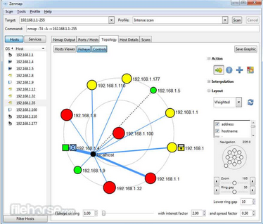
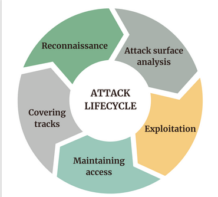
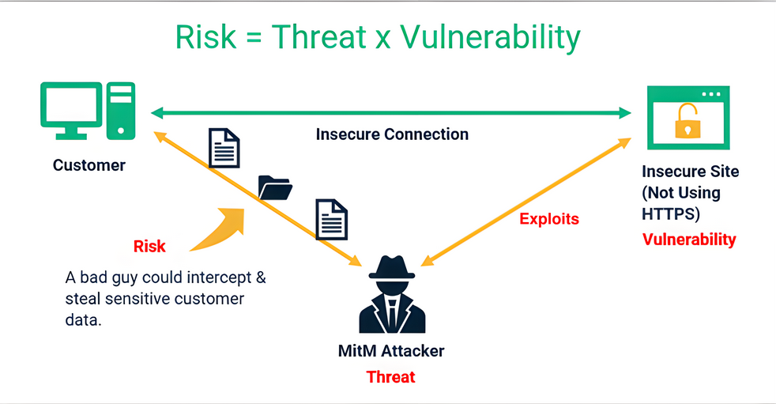
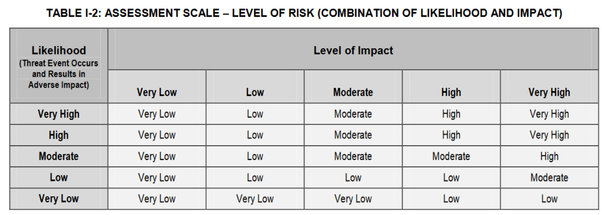

# CYBERSECURITY : Hoofdstuk 8 - Red Team

## Taak van het red team

- Proberen inbreken
- Verdediging testen
- Zwakke punten blootleggen

- Het red team doet deze acties binnen volgende omgeving:
    - niet enkel cyberspace, ook in gebouwen proberen binnen geraken en bestanden stelen, veiligheidscamera's onschadelijk maken
    - Legaal en in dienst van de organisatie die ze aanvallen
- De verdediging wordt het "Blue team" genoemd
- Deze hackers worden "White hat hackers" genoemd

## De 5 fasen

<p align='center'></p>

- Reconnaissance: Onopvallend informatie verzamelen
    - zeer algemeen
- Scanning and enumeration: Actief zoeken naar zwakke punten
    - specifiek ingezoomd op mogelijk aanvalpistes
    - vaak specifieke tools gebruikt die zoeken naar bepaalde zwaktes
    - gebaseerd op info uit de reconnaissance fase
- Gaining access: De gevonden zwaktes aanvallen
- Maintaining access: Zorgen voor manieren om later opnieuw in te breken
- Covering tracks: zorgen dat het doelwit geen sporen terugvindt

- In dit vak zien we:
    - intro in fase 1
    - intro in fase 2
    - oppervlakkig (nog niet genoeg kennis)
- Verder uitwerken in specialisatie System & Network administration
    - Meer technisch
    - 2e jaar: Cybersecurity and virtualization
        - red team: aanvallen
    - 3e jaar: Cybersecurity advanced
        - Blue team: verdedigen

## Fase 1: Reconnaissance

- Zo veel mogelijk informatie verzamelen (footprinting)
- Zo onopvallend mogelijk
- Doel:
    - Het doelwit begrijpen
        - Wie? Wat? Hoe? Waar?
        - Hoe beveiligen zich?
        - Waar zit de waardevolle data?
    - De toekomstige aanval accurater maken door het aanvalsdomein te beperken
        - kan bv. een ip-range zijn 
- Deze data wordt bv. in een informatiedatabank opgeslagen, zodat het red team daar makkelijk aan kan en bijvoorbeeld verbanden kan leggen tussen verschillende bevindingen

### Reconnaissance: types

- **Passief**:
    - Geen direct contact met het doelwit
    - Anoniem
    - voorbeelden
        - publieke bronnen: overheidsdata, kranten, social media
- **Actief**:
    - Wel direct contact met het doelwit
        - Doelwit heeft informatie over de aanvaller
        - Maar doelwit wee (normaal gezien/nog) niet dat die data gelinkt is aan een toekomstige aanval
        - voorbeeld:
            - helpdesk bellen
            - Werknemer om een naamkaartje vragen
            - solliciteren
- Soms dunne grens: bv. website bezoeken
    - is in principe niet anoniem, de server van het doelwit heeft mogelijk informatie over de aanvaller
    - moeilijk te achterhalen dat dit bezoek te maken had met een toekomstige aanval
    - atypisch gedrag (zoals SQL injecties proberen) doet wel alarm bellen afgaan (*zeker geen passive reconnaissance*)

### Reconnaissance: zoekmachines

- Gebruik verschillende zoekmachines (verschillende resultaten)
- Gebruik operatoren om efficiënter te zoeken.

### Reconnaissance: openbare databanken

Openbare databanken bevatten publieke beschikbare, maar soms zeer interessante data.

Voorbeelden:

- [Nationale Bank België](https://nbb.be/)
- [Belgisch staatsblad](https://www.ejustice.just.fgov.be/cgi/welcome.pl)
- [Vlaamse databanken en zoeksystemen](https://www.vlaanderen.be/intern/werkplek/digitale-tools-en-digitale-veiligheid/bibliotheken-vlaamse-overheid/databanken-en-zoeksystemen)

> Deze databanken zijn ideaal (of worden vaak gebruikt) voor phishing aanvallen.

Ze bevatten:
- Adressen (ook e-mail)
- Namen van belangrijke personen
- Financiële data

### Reconnaissance: vacatures

- Informatie over belangrijke (open) posities
- Informatie over gebruikte technologieën

### Reconnaissance: Social Media

- Mensen delen vaak (onbewust) gevoelige informatie
    - locatie
    - Afbeeldingen van beveiligingsmechanismen of sleutels
    - Biometrische data

- Gespecialiseerde tools om informatie van sociale media te verzamelen:
    - Online: Pipl, Maltego
    - Commandline: bv. theHarvester, recon-ng,...
    - nog niet per se "Scanning en enumeration"
        - We zoeken bruikbare informatie
        - tijdens scanning en enumeration fase kunnen we specifiek gaan zoeken naar vingerafdrukken als we een scanner willen omzeilen

### Reconnaissance: e-mailadressen

- eenvoudig met tools als [hunter.io](https://hunter.io/)

### Reconnaissance: websites

- De meeste organisaties hebben een website
- Bevat vaak veel informatie
    - Contactgegevens
    - Foto's (personeel, gebouwen)
    - Structuur van het bedrijf
- Gebruikte technologie
    - [Netcraft](https://www.netcraft.com/), [BuiltWith](https://builtwith.com/), [Wappalyzer](https://www.wappalyzer.com/)
    - Met developper tools/plug-ins (bv. `F12`)
- Soms beter om een hele website te downloaden
    - onopvallend experimenteren
    - bv. met [HTTrack](https://www.httrack.com/)

### Reconnaissance: Whois


- informatie over registratie domein
- [whois.domaintools.com](https://whois.domaintools.com/)

### Reconnaissance: DNS

- Vertaalt een domeinnaam naar een ip-adres
- Informatie over website, netwerk, infrastructuur
- Soms gevoelige informatie in slecht beveiligde DNS-servers
- Verschillende tools om info te achterhalen
    - `nslookup`, `dig`, `dnsrecon`, `dnsmap`

```console
$ nslookup hogent.be
Server:         127.0.0.53
Address:        127.0.0.53#53

Non-authoritative answer:
Name:   hogent.be
Address: 193.190.173.135
```

```console
$ dig hogent.be

; <<>> DiG 9.18.28 <<>> hogent.be
;; global options: +cmd
;; Got answer:
;; ->>HEADER<<- opcode: QUERY, status: NOERROR, id: 36822
;; flags: qr rd ra; QUERY: 1, ANSWER: 1, AUTHORITY: 0, ADDITIONAL: 1

;; OPT PSEUDOSECTION:
; EDNS: version: 0, flags:; udp: 65494
;; QUESTION SECTION:
;hogent.be.                     IN      A

;; ANSWER SECTION:
hogent.be.              440     IN      A       193.190.173.135

;; Query time: 0 msec
;; SERVER: 127.0.0.53#53(127.0.0.53) (UDP)
;; WHEN: Sun Sep 22 12:57:47 CEST 2024
;; MSG SIZE  rcvd: 54
```

### Reconnaissance: IoT

- IoT devices zijn vaak slech beveiligd en bieden zo toegang to een bedrijf
- Zoeken naar publiek toegankelijke devices kan met [Shodan](https://www.shodan.io/)

## Fase 2: Scanning en enumeration

### Doel

- Zoeken naar zwakke punten
    - Bedrijven houden dit zelf ook in de gaten (asset management)
- Gebruikte technologieën en versies vinden en linken aan gekende kwetsbaarheden
    - [CVE](https://www.cve.org/), [exploit-db.com](https://www.exploit-db.com/)

> Dit is de hoofdreden dat (vooral publiek toegankelijke) software regelmatig upgedated dient te worden. Gekende kwetsbaarheden worden vaak (hopelijk) met hoge prioriteit opgelost, maar die fix werkt natuurlijk enkel als de beheerder ook de nieuwe versie van de software installeert

- Technischer en actiever dan reconnaissance

### Scanning

- **Port scanning**: detecteren van open poorten en services
- **Network scanning**: Netwerk in kaart brengen
    - Detecteren van gebruikte IP-adressen, besturingssystemen, netwerktoestellen, verbindingen
- **Vulnerability scanning**: onderzoeken of er gekende kwetsbaarheden of zwaktes in het netwerk aanwezig zijn

#### Basistools

- `Ping`:
    - welke toestellen zijn bereikbaar?

```console
$ ping www.cve.org
PING cve.org (18.239.208.25) 56(84) bytes of data.
64 bytes from server-18-239-208-25.bru50.r.cloudfront.net (18.239.208.25): icmp_seq=1 ttl=248 time=13.7 ms
64 bytes from server-18-239-208-25.bru50.r.cloudfront.net (18.239.208.25): icmp_seq=2 ttl=248 time=13.5 ms
64 bytes from server-18-239-208-25.bru50.r.cloudfront.net (18.239.208.25): icmp_seq=3 ttl=248 time=11.1 ms
64 bytes from server-18-239-208-25.bru50.r.cloudfront.net (18.239.208.25): icmp_seq=4 ttl=248 time=11.1 ms
^C
--- cve.org ping statistics ---
4 packets transmitted, 4 received, 0% packet loss, time 3002ms
rtt min/avg/max/mdev = 11.069/12.346/13.726/1.256 ms
```

- `traceroute` `tracert`
    - welke route leggen berichten in het netwerk af?

```console
$ traceroute www.google.com
traceroute to www.google.com (64.233.167.104), 30 hops max, 60 byte packets
 1  _gateway (xxx.xxx.xxx.xxx)  2.106 ms  3.065 ms  3.973 ms
 2  * * *
 3  * * *
 4  * * *
 5  xxx.xxx.xxx.xxx (xxx.xxx.xxx.xxx)  35.232 ms  34.754 ms  35.585 ms
 6  * * *
 7  209.85.254.112 (209.85.254.112)  23.553 ms 209.85.255.16 (209.85.255.16)  27.798 ms 142.251.246.110 (142.251.246.110)  22.723 ms
 8  142.251.224.10 (142.251.224.10)  28.168 ms  17.845 ms 192.178.86.8 (192.178.86.8)  21.745 ms
 9  64.233.174.221 (64.233.174.221)  18.498 ms  18.465 ms 142.251.247.73 (142.251.247.73)  19.225 ms
10  64.233.175.102 (64.233.175.102)  18.457 ms  17.870 ms 142.251.68.157 (142.251.68.157)  24.147 ms
11  209.85.253.215 (209.85.253.215)  17.871 ms 216.239.40.11 (216.239.40.11)  21.413 ms 108.170.231.219 (108.170.231.219)  20.510 ms
12  wl-in-f104.1e100.net (64.233.167.104)  30.961 ms  34.893 ms *
```

#### Poortscanners

- Scant de netwerkpoorten van een toestel
- 3 mogelijkheden:
    - **Open**: een programma aanvaart connecties (interessant!)
    - **Gesloten**: connectie niet aanvaard
        - bv. geen programma actief op die poort
    - **Gefilterd**: geen antwoord
        - misschien vanwege een firewall

- tools: [nmap](https://nmap.org/), [masscan](https://github.com/robertdavidgraham/masscan), [megaping](https://magnetosoft.com/product-megaping/)

- vele tools gebruiken specifieke poorten

| Poort | Tool    |
| ----: | ------- |
| 22    | SSH     |
| 80    | HTTP    |
| 443   | HTTPS   |
| 3306  | MySQL   |

*nmap*

- zeer populaire poortscanner
- Kan gokken welk programma en versie draait achter een open poort
- ook netwerscanner functionaliteit
- features
    - Host Discovery (ontdekken van machines op het netwerk)
    - OS-detectie (welk besturingssysteem draait de host)
    - Versiedetectie van applicaties
    - Nmap scripting engine, waardoor je eigen scripts kan schrijven
- Grafische wrapper: Zenmap

<p align='center'></p>

```console
$ sudo nmap scanme.nmap.org
Starting Nmap 7.92 ( https://nmap.org ) at 2024-09-22 13:20 CEST
Nmap scan report for scanme.nmap.org (45.33.32.156)
Host is up (0.17s latency).
Other addresses for scanme.nmap.org (not scanned): 2600:3c01::f03c:91ff:fe18:bb2f
Not shown: 994 closed tcp ports (reset)
PORT      STATE    SERVICE
22/tcp    open     ssh
25/tcp    filtered smtp
80/tcp    filtered http
427/tcp   filtered svrloc
9929/tcp  open     nping-echo
31337/tcp open     Elite

Nmap done: 1 IP address (1 host up) scanned in 10.77 seconds
```

####  netwerkscanners

- Scant het netwerk af naar hosts (= toestellen) en verbindingen
-  Moet toegang tot het netwerk hebben
- Verschillende opties: [LANState (Pro)](https://www.10-strike.com/lanstate/), [PRTG Network Monitor](https://www.paessler.com/prtg), [SolarWinds network topology mapper](https://www.solarwinds.com/network-topology-mapper/use-cases/network-mapping), ...

#### vulnerability scanners

- Scant het netwerk af naar gekende kwetsbaarheden
-  Moet ook toegang tot het netwerk hebben
- Verschillende opties: [OpenVAS](https://openvas.org/), [Nessus](https://www.tenable.com/products/nessus), [Metasploit](https://www.metasploit.com/)

### Enumeration

- Informatie verzamelen op applicatie-niveau
    - niet enkel toestellen, IP-adressen en poorten
- Vervolg op scanning
- **Netwerkprotocollen** misbruiken voor informatie over
    - Netwerkschijven
    - Loginsystemen
    - FTP servers
    - SMB servers

## Fase 3-5: gaining access, maintaining access, covering tracks

### Gaining access

- Ontfutselen van loginggegevens
    - Vele hackaanvalle gebruiken ook social engeneering
        - targets: mensen met veel toegansrechten, maar geen IT-specialisten
    - Reconnaissance is zeer belangrijk om kwetsbare targets te vinden
- Exploits
    - Het uitbuiten van zwaktes/foutjes in software
    - Veel makkelijker als systemen niet up to date zijn
- Password cracking
    - korte wachtwoorden: brute force
    - gekende wachtwoorden: dictionary attacks

### Maintaining access

- Ook gekend als **persistence**
- bv. Je breekt binnen op een toestel in het netwerk. Dat toestel wordt fysiek afgesloten. Dan kan je weer opnieuw beginnen om binnen te geraken
- Om dat te vermijden: verschillende opties
    - Malware isntalleren (rootkits, backdoors, reverse shells)
    - Nieuwe gebruiker aanmaken
    - **Pivoting** (naar een ander toestel springen)
- Vaak nodig om administratorrechten (root access) te verkrijgen via privilege escalation
    - kan met andere exploits
- Ondertussen zo onzichtbaar mogelijk blijven (evasion)

### Covering tracks

- Onopgemerkt blijven: bewijsmateriaal wegmoffelen
    - Gebruikte bestanden verwijderen of verstoppen
        bv. in `/tmp`-map
    - Logs aanpassen
        - Log files verwijderen valt juist extra op
    - Timestamps aanpassen

### De cyber attack cycle

- De fases zijn vaak niet mooi opeenvolgend, maar eerder cyclisch
- Een interessante ontdekking in later fasen kan zorgen voor een nieuwe reconnaissance, om te zien hoe deze informatie uitgebuit kan worden.

<p align='center'></p>

## Pentests en audit reports

### Pentests

- Van de 5 fases is enkel **passieve reconnaissance** standaard toegelaten
- Elke andere interactie heeft **expliciete toestemming** van het doelwit nodig
    - Daarbij hoort vaak een **non-disclosure agreement (NDA)**
        - gevoelige informatie
    - Tegelijk wordt ook een scope afgesproken
        - Wat mag? Wat mag niet?
- Dit onderzoek heet dan een **pentest** (penetration test) of **security audit**

### White / Grey / Black box

- **White box**: het red team kent het systeem volledig, en zal die kennis gebruiken bij de aanval
    - documentatie, broncode, werknemers
- **Black box**: het red team begint zonder enige informatie, net zoals een externe hacker dat zou moeten doen
    - duurt vaak langer, dus ook duurder
- **Grey box**: het red team heeft een beetje informatie
    - bv. welke IP range is mogelijk kwetsbaar

### Audit report

Vaak wordt de pentest afgesloten met een geschreven rapport, het **Audit report**
- Dit rapport bevat meestal:
    - Een conclusie die begrijpbaar is voor niet-technisch personeel
    - Een gedetailleerde lijst van vulnerbilities, exploits en threats waar het IT-team mee aan de slag kan
- Dit is een momentopname, en is nooit compleet

### Vulnerabilites en exploits

- **Vulnerabilites** zijn foutjes in software of configuratie die een zwakke plek vormen
- **Exploits** zijn manieren om vulnerbilities te misbruiken

### Threats en risk

- Een **threat** is dan het gebruik van een exploit door een aanvaller
- **Risk** is de maat van ernst van een bepaalde vulnerability, gebaseerd op hoe waarschijnlijk het is dat er een threat komt, hoe ernstig het is al dat gebeurt
- Methodes om risk te berekenen: bv. van [NIST](https://doi.org/10.6028/NIST.SP.800-30r1)

<p align='center'></p>

### Risk matrix

<p align='center'></p>

- Dit soort matrices wordt gebruikt om te bepalen wat de risk is, gebaseerd op de *likelihood* (=kans op een threat) en *impact* (=ernst van de threat)
- likelihood en impact worden bepaald door het bedrijf zelf, ze zijn relatief
- voorbeeld:
    - High impact threat (website dag down) met een very low likelihood (moeilijk te exploiten) heeft als totale risk-score low


- Vulnerabilites die niet gekend zijn kan je ook niet in rekening brengen.
    - best enkele defensieve tactieken toe te passen
    - verder focussen op gekende vulnerbilities
- Niet alle vulnerbilities hebben exploits
- vulnerbilities met exploits hebben een hogere likelihood en dus hogere risk
- Vulnerabilites waar je op focust:
    - Die bij jou voorkomen
    - Die gekend zijn
    - EN die een exploit hebben