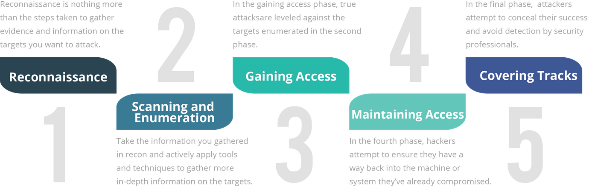

# CYBERSECURITY : Hoofdstuk 8 - Red Team

## Taak van het red team

- Proberen inbreken
- Verdediging testen
- Zwakke punten blootleggen

- Het red team doet deze acties binnen volgende omgeving:
    - niet enkel cyberspace, ook in gebouwen proberen binnen geraken en bestanden stelen, veiligheidscamera's onschadelijk maken
    - Legaal en in dienst van de organisatie die ze aanvallen
- De verdediging wordt het "Blue team" genoemd
- Deze hackers worden "White hat hackers" genoemd

## De 5 fasen

- Reconnaissance: Onopvallend informatie verzamelen
    - zeer algemeen
- Scanning and enumeration: Actief zoeken naar zwakke punten
    - specifiek ingezoomd op mogelijk aanvalpistes
    - vaak specifieke tools gebruikt die zoeken naar bepaalde zwaktes
    - gebaseerd op info uit de reconnaissance fase
- Gaining access: De gevonden zwaktes aanvallen
- Maintaining access: Zorgen voor manieren om later opnieuw in te breken
- Covering tracks: zorgen dat het doelwit geen sporen terugvindt