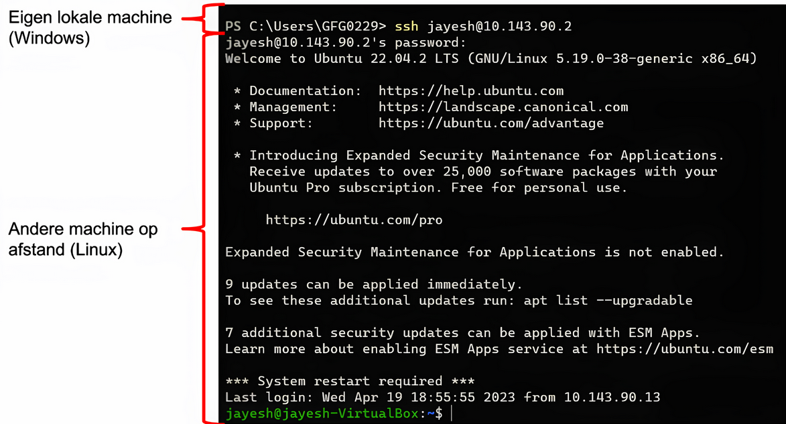
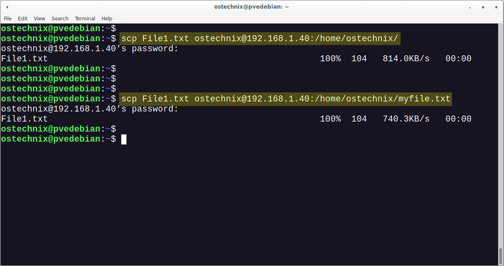
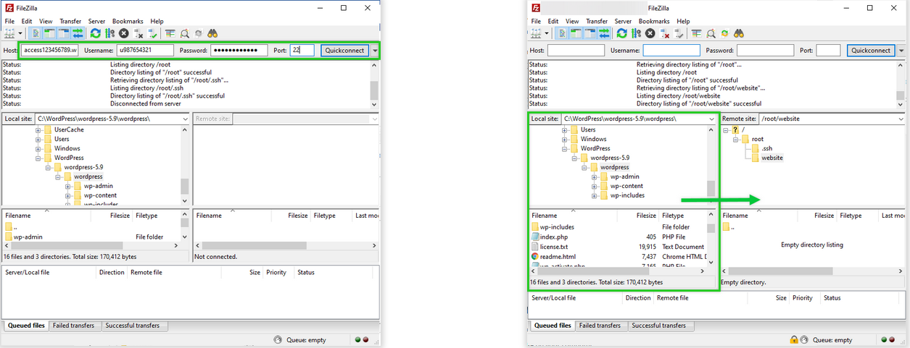
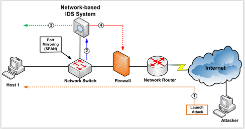
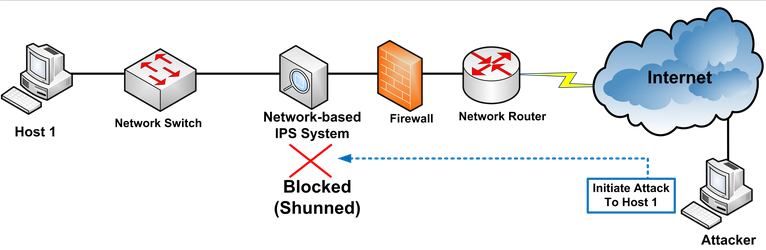

# CYBERSECURITY : Hoofdstuk 9 - Blue team

## Een diepe verdediging

- **Layering** (gelaagdheid) : zorgt voor de meest omvangrijke beveiliging
    - wanneer cybercriminelen de eerste laag kunnen binnendringen is er nog steeds de tweede
    - beveiligen in lagen betekent dat je meerdere barrières gaat maken
- **Limiting** (beperking) : het beperken van toegang tot informatie vermindert de kans op een aanval
    - een organisatie beperkt best de toegang om er voor te zorgen dat werknemers alleen toegang hebben tot de info die ze nodig hebben om hun job uit te voeren
- **Diversity** (diversiteit) : verieer in manieren van beveiliging
    - toegang tot eerste laag, mag niet de andere lagen in gevaar brengen
    - gebruik in andere lagen bv. een ander encryptie algoritme
- **Obscurity** (verduistering) : verduisteren van informatie
    - Een organisatie hoeft niet vrij te geven welke OS versie of firewall ze gebruikt
    - Security through Obscurity kan handig zijn, maak hier echter nooit de hoeksteen van je beveiliging van
- **Simplicity** (eenvoud) : lijdt meestal tot een hogere beschikbaarheid
    - Complexe beveiliging vergroot de kans op fouten

> Steun nooit op slechts een concept
> Streef naar een gevarieerde combinatie

## Systemen en apparaten beschermen

Er zijn verschillende aspecten aan het beheren van ICT-omgevingen die we moeten beschermen:
- Fysieke toegang
- Gebruikersbeheer
- Hosts (individuele gebruikerstoestellen)
    - Laptops, smartphones,...
- Servers
- Netwerk(apparaten)

### Fysieke bescherming

- Mag je niet vergeten!
- Kan enorm schadelijk zijn
    - Diefstal
    - Rogue device planten
    - Vandalisme

#### Hoe voorkomen?

- Sluit toegang af
    - Omheining, barricades, bewaking,...
    - Beperkte toegangstijden
- Dwing identificatie af
    - Biometrie
    - Badge
- Beveilig toestellen
    - Kabelsloten
    - Veiligheidskooien
    - Logout timers (automatisch vergrendelen na periode van inactiviteit)

#### Wat bij diefstal?

- Hou logboeken bij
    - wie had het laatst toegang?
- GPS tracking

#### Hou je toestellen blij

- Redundante en voldoende stroomvoorziening
- HVAC
    - Verwarming, ventilatien, airco
    - Regelt de omgeving (temperatuur, vochtigheidn, luchtstroom en luchtfiltering)
- Monitor de hardware
    - Alerts als er iets foutgaat

### Gebruikersbeheer

#### De zwakste schakel

- Gebruikers (klanten, werknemers, IT-personeel) zijn onvoorspelbaar
    - Hebben soms slechte bedoelingen
    - Maken fouten
- Limiteer de rechten van een gebruiker zoveel mogelijk

> Principle of least privilege!

#### AAAA framework

- **A**uthentication
    - Wie mag iets doen?
- **A**uthorisation
    - Wat mag iemand wel/niet doen?
- **A**ccounting
    - Wie heeft wat gedaan?

Voorbeeld 1: Bankautomaat

- **A**uthentication
    - Enkel iemand met de juiste bankkaart en pincode heeft toegang tot de bankrekening
- **A**uthorisation
    - Iemand kan niet meer geld afhalen dan hij heeft
    - Er is een maximum bedrag dat afgehaald kan worden per dag
- **A**ccounting
    - Op de rekeninguitreksels staat er welk bedrag er wanneer is gestort op of afgehaald van de rekening

> [!tip]
> Meer voorbeelden in de slides 
> [voorbeeld Forum](https://hogenttin.github.io/cybersecurity-slides/h9.html?showNotes=true#/24)

#### Hulpmiddel voor authenticatie

- **Multi-Factor Authentication (MFA/2FA)**
    - What you know
        - wachtwoorden, wachtwoordzinnenn, pincodes
    - What you have
        - Smartcards, beveiligingssleutelhangers, toegang tot GSM (authenticator app of SMS), toegang tot e-mailaccount (verificatie e-mail)
    - Who you are
        - Biometrie: een uniek fysiek kenmerk zoals vingerafdruk, netvlies, stem
    - **Minstens 2 van de 3 nodig**

#### Hulpmiddel voor autorisatie

- Rechten
    - Op basis van niveau's
        - bv. *unclassified* > *confidential* > *secret* > *top secret* niveau's in het leger
    - Op basis van rechten toegekend door eigenaar
        - bv. `rwxrwxrwx` bij Linux bestanden
    - Op basis van functie
        - bv. enkel dokters mogen patiëntendossiers zien

#### Hulpmiddel voor accounting

- Logfiles
    - Inlogtijd
    - Succesvol aangemeld?
    - Welke bronnen gebruikt?

### Host Hardening

- Beveiliging van het besturingssysteem
    - Standaardconfiguratie aanpassen
    - Verwijderen onnodige software
    - Beveiligingspatches en updates
- Installeren **anti-malware**
    - bescherming tegen virussen, worms, keyloggers, spyware,...
    - Mobiele apparaten zijn ook kwetsbaar
    - **Let op met gratis software!**
        - frauduleuze anti-malware, kan zelf malware bevatten
- Beheer van **patches**

    - > **Patches** zijn code-updates die fabrikanten bieden om te voorkomen dat een nieuw ontdekt virus of worm een succesvolle aanval plaatst 

    - kunnen centraal beheerd worden
        - automatisch
        - eventueel verplicht
    - > Combinatie van patches en upgrades noemen we **een servicepack**
- Host-gebaseerde firewall
    - regelt inkomend en uitgaand netwerkverkeer op het eigen toestel
- **Host Intrusion Detection System** (HIDS)
    - Controleert verdachte activiteiten op het eigen toestel

#### Draadloze en mobiele apparaten

- **Wired Equivalent Privacy** (WEP)
    - Basisbescherming Wi-Fi
    - 10 tot 26 hexadecimale karakters (40-104 bits)
    - ⚠️ **Niet meer veilig!**
- **Wi-Fi Protected Access** (WPA/WPA2)
    - Grote verbetering ten opzichte van WEP
    - Gebaseerd op AES
    - ✅ Tegenwoordig is WPA2 de standaard
- Toevoegen van **wederzijdse authenticatie**:
    - voorkomt MitM aanval (rogue access point)
    - Authenticatie tussen beide entiteiten

#### Bescherming van (host) data

- **Bestandstoegangscontrole**
    - Machtigingen op bestanden en mappen
    - Ingesteld per gebruiker of groep gebruikers
- **File encryption**
    - Encrypteren van gevoelige data
    - Kan op individuele bestanden of op hele harde schijven
        - bv. BitLocker op Windows of LUKS op Linux
- Systeem- en gegevens **back-ups**
    - reserve kopie van gevoelige data
    - Typisch op verwijderbare media
    - > Een van de meest effectieve manieren om gegevensverlies te voorkomen

#### Content control

- Content screening en blokkering
    - Beperkt de inhoud waartoe een gebruiker toegang heeft met een webbrowser via internet
    - Kan bepaalde sites blokkeren

#### Disk cloning, deep freeze

- Software om besturingssysteem en configuratiebestanden te beschermen
- **Disk clone**
    - Image (bv. ISO) van volledige harde schijf
- **Deep freeze**
    - "Bevriest" de partitie van de harde schijf
    - Alle wijzigingen door gebruiker verloren bij herstarten
    - Vooral nuttig voor publieke toestellen
        - bv. internet café

#### Kiosk mode

- Afgesloten omgeving waar je niet zomaar uit kan
- Heeft niets te maken met harde schijven of partities, het is meer een software matige gevangenis
- Meer preventief t.o.v. disk clone en deep freeze
- Vooral nuttig voor publieke toestellen (bibliotheek, zelf-scan, bestelkassa)

#### Virtualisatie / Sandboxing

- Programma's worden uitgevoerd in een virtuele omgeving (ook soms sandbox)
- Programma's hebben niet door dat ze in een virtuele omgeving draaien
- Als hackers via de software zich een weg naar binnen hacken, zitten ze nog steeds vast in de virtuele omgeving en niet direct op het besturingssysteem van het toestel
- Soms lukt het daders echter om deze sandbox te omzeilen en zo toch code uit te voeren op het besturingssysteem van het slachtoffer

Een gelijkaardig voorbeeld in *Webhosting*.

- het is economisch niet voordelig om elke website op een server te draaien
- vaak wordt dus op 1 server verschillende virtuele servers geeïnstalleerd
- Dankzij deze virtualisatie kunnen gebruikers van de ene virtuele machine niet aan de andere

> Voorbeeld **Docker**

### Server hardening

#### Beveiligde toegang op afstand

- Inloggen op een toestel en commando's uitvoeren (CLI op afstand):
    - **Telnet**
        - Verouderd
        - Data verzonden in plaintext
            - ook o.a. login en wachtwoord
            - ⚠️ Niet veilig!
    - **SSH** (Secure Shell)
        - Opvolger Telnet
        - Encryptie van data tijdens verzending

*Voorbeeld SSH:*

- bestanden overzetten tussen toestellen
    - **SCP** (Secure Copy Protocol)
        - Maakt onderliggend gebruik van **SSH**
            - Authenticaties + bescherming van data tijdens verzendin
    - **SFTP** (SSH File Transfer Protocol)
        - Gelijkaardig aan SCP
        - Maakt ook onderliggend gebruik van SSH
        - Makkelijker in gebruik met visuele programma's

*Voorbeeld SCP:*

*Voorbeeld SFTP:*

- Vanop een publiek netwerk veilig verbinden met een privaat netwerk
    - **VPN**
        - Geëncrypteerde "tunnel" opzetten
            - Authenticatie + bescherming van data in beweging
        - Meer mogelijk dan CLI of overdracht bestanden

#### Administratieve maatregelen

- Poorten en services beveiligen
    - Via open poorten kunnen cybercriminelen achterhalen welke services er draaien op een host
    - Op veel systemen draaien meer services dan nodig
    - Beheerder moet elke service bekijken en nagaan of deze noodzakelijk is, alsook de mogelijke risico's inschatten

- Geprivilegieerde accounts
    - bv. `root`, `admin`, `superuser`
    - **Krachtigste** accounts op een systeem
    - Hebben vaak verhoogde of zelfs onbeperkte toegang
    - Beheerder moet deze accounts voldoende beveiligen of eventueel verwijderen om risico's te vermijden

- Group Policies
    - Onderdeel van Active Directory
    - Voor gebruik in **Windows** omgeving
    - Laat toe om bepaalde **veiligheidsmaatregelen** in te stellen voor een groep gebruikers
        - bv. password policy, vergendelingsbeleid, toegang tot bronnen

- Logboeken en waarschuwingen
    - Een logboek registreert **gebeurtenissen** op een systeem
    - Bevatten uitgebreide informatie voor elke gebeurtenis
    - Belangrijk voor computerbeveiliging (AA**A**: accounting)

### Network Hardening

#### Netwerkapparaten beschermen

- Network Operations Centers (NOC)
    - Op één of meerdere locaties
    - Bieden gedetailleerde status van netwerk
    - Ground zero voor oplossen van netwerkproblemen, prestatiebewaking, softwaredistributie en updates, communicatiebeheer en apparaatbeheer

- Netwerkapparaten: switches, routers,...
    - Hart van het moderne netwerk
    - kwetsbaar voor diefstal, hacking en toegang op afstand
    - Doelwit voor aanvallen op netwerkprotocollen of DOS aanvallen

- Firewalls
    - hardware- of software die het netwerk beveiligen
    - Voorkomt dat ongeautoriseerd of potentieel gevaarlijk verkeer het netwerk binnenkomt
    - Zorgt ervoor dat alleen de noodzakelijke poorten zichtbaar en beschikbaar zijn

- IDS (Intrusion Detection System)

- IPS (Intrusion Prevention System)

#### Een modern beveiligingsoperatiecentrum

- Security Operations Centers (SOC) zijn gelijkaardig aan NOC's maar dan voor security
- SOC's bieden een aantal diensten aan zoals monitoring, beheer, oplossingen voor bedreigingen, gehoste beveiliging
- Als bedrijf kun je zelf een SOC opzetten of die uitbesteden aan gespecialiseerde firma's.

#### Security Information and Event Management (SIEM) systemen

- Software gebruikt in SOC's:
    - Verzamel en filter gegevens
    - Detecteer en classificeer bedreigingen
    - Analyseren en onderzoeken van bedreigingen
    - Uitvoeren van preventieve maatregelen
    - Pak toekomstige bedreigingen aan

## Assets management

- Bedrijven moeten weten welke hardware- en software assets in het bedrijf aanwezig zijn. Deze assets moeten immers beveiligd worden
- Assets management
    - omvat het beheren van al deze assets
    - Een volledig overzicht (inventaris) te zijn alle hard- en software
- Het bedrijf kan zo een inschatting maken van welke beveiligingsgevaren er zouden kunnen zijn
- Moet minstens het volgende in de gaten houden:
    - Elk hardware systeem
    - Elk besturingssysteem
    - Elk hardware netwerk toestel
    - Elk network operating system
    - Elke software applicatie
    - Elke firmware
    - Alle language runtime environments (Java, C#, Python,...)
- Sommige bedrijven kiezen voor software die automatisch deze zaken bijhoudt (bv. naturalhr)
- voordelen:
    - Beveiliging
    - Updatebeleid
        - Welke hardware- of software is (binnenkort) verouderd?
    - Helpdesk
        - Log van vorige problemen
        - Weet alle specs van klant/toestel met probleem

## Nood aan experten

### Hoe wordt je een cybersecurity expert?

- *Wees een levenslange leerling*: 
    - leer basis door IT cursussen te volgen
    - blijf up-to-date
    - cybersecurity veranderd constant

- *Behaal certificeringen*:
    - van bv. Microsoft en Cisco
    - bewijs van kennis

- *Stages*:
    - zoeken van stage binnen cybersecurity domein kan leiden tot mogelijkheden in de toekomst

- *Professionele organisaties, conferenties, CTF's*:
    - word lid van computerbeveiligingsorganisaties
    - woon vergaderingen en conferenties bij
    - sluit je aan op forums

### Certificeringen

- De IT-industrie heeft standaarden opgesteld voor cybersecurity specialisten om professionele certificeringen te verkrijgen die het bewijs leveren van vaardigheden en kennisniveau.
- Enkel bekende certificaten:
    - **CompTIA Security+**:
        - Een door CompTIA gesponsord testprogramma dat de competenties van IT-beheerders op het gebied van informatieborging cerificeert.
    - EC-Council **Certified Ethical Hacker** (CEH): certificering op gemiddeld niveau die beweert Cybersecurityspecialisten met deze referentie over de vaardigheden en kennis beschikken voor verschillende hackpraktijken
    - **SANS GIAC Security Essentials** (GSEC): 
        - goede keuze als instapmodel voor Cybersecurityspecialisten
        - toont aan dat ze de beveiligingsterminologie en -concepten begrijpen
        - toont aan dat ze beschikken over de vaardigheden en expertise voor 'hands-on' beveiligingsrollen
        - aanvullende specifieke certificeringen op gebied van beveiliginsadministratie, forensisch onderzoek en auditing
    - **ISC2 Certified Information Systems Security Professional** (CISSP): 
        - leverancier-neutrale certificering voor Cybersecurityspecialisten met veel technische en management ervaring
        - formeel goedgekeurd door het Amerikaans ministerie van Defensie (DoD)
        - wereldwijd erekende branchecertificering op gebied van beveiliging
    - **ISACA Certified Information Security Manager** (CISM):
        - Cybersecurityspecialisten die verantwoordelijk zijn voor het beheren, ontwikkelen en toezichthouden op informatiebeveiligingssystemen op bedrijfs niveau
        - of, voor diegene die beste beveiligingspraktijken ontwikkelen
    - **Cisco Certified Network Associate Security** (CCNA Security):
        - valideert dat een cyberbeveiligingspecialist over de kennis en vaardigheden beschikt die nodig zijn om cisco-netwerken te beveiligen

### Websites van cybersecurity organisaties

-   National Vulnerability Database (NVD)
    -   https://nvd.nist.gov
-   Computer Emergency Response Team (CERT)
    -   https://sei.cmu.edu/about/divisions/cert
    -   https://cert.be
-   Internet Storm Center (ISC)
    -   https://isc.sans.edu
-   The Advanced Cyber Security Center (ACSC)
    -   https://www.acscenter.org

### Websites over cybersecurity nieuws

> Het is enorm belangrijk om op de hoogte te blijven van de laatste bedreigingen en verdedigingen!

-   https://www.reddit.com/user/goretsky/m/security
    -   (verzameling van reddit threads i.v.m. cybersecurity)
-   https://www.csoonline.com
-   https://www.darkreading.com
-   https://www.bleepingcomputer.com
-   https://news.ycombinator.com
-   https://nakedsecurity.sophos.com
-   https://threatpost.com
-   https://blog.erratasec.com
-   https://krebsonsecurity.com
-   https://medium.com/mitre-attack
-   https://risky.biz
-   https://latesthackingnews.com
