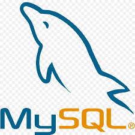

# Databases : Hoofdstuk 1 - Inleiding

## Databanken inleiding

Enkele voorbeelden van het gebruik van databases in het dagelijks leven:
- Betalen aan de kassa: De barcode van producten wordt gescand en in de databank wordt de prijs van het product opgezocht. Bij het kopen van het product wordt ook de stock-lijst met 1 verminderd.
- Bibliotheek: houdt een databank bij met de details van boeken, lezers, reservaties,... 
- Bankautomaat: Wanneer je geld opvraagt moet er nagegaan worden of je nog genoeg geld hebt. Wanneer je genoeg hebt staan moet er aan de databank doorgegeven worden welk bedrag er moet aangepast worden.

### Gegevensmanagement via bestanden

Vroeger werd data opgeslagen in bestanden.

> Deze aanpak is grotendeels verouderd. Enkele databankmanagement systemen maken hiervan nog gebruik. (bv. Enscribe, gebruikt door HP-NonStop mainframe)

In een bestandsgebaseerde oplossing, definieert elke toepassing zijn eigen bestanden. We gebruiken dus verschillende bestanden zonder relaties tussen deze bestanden. 

Stel we hebben een traditionele facturatie-applicatie en CRM systeem en een GIS toepassing die elk gebruik maken van informatie zoals klantnummer, klantnaam, postcode,... Wanneer deze gegevens opgenomen worden in afzonderlijke gegevensbestanden zal deze benadering voor problemen zorgen. (Elke wijziging moet op 3 verschillende locaties uitgevoerd worden.)

#### Nadelen gegevensmanagement via bestanden

##### 1. Verspreiding en isolatie van gegevens

Gegevensmanagement met bestanden kan ingewikkeld worden wanneer men gegevens wil combineren uit verschillende gegevens. Stel gegevens die in twee verschillende bestanden zitten (bv. salarisgegevens en certificaten). In zo een geval dienen we beide bestanden regel per regel overlopen. De verworven gegevens worden dan naar een tijdelijk bestand opgeslagen.

##### 2. Gegevens redundantie

> Wanneer gegevens in afzonderlijke bestanden worden opgeslagen, is het mogelijk dat dezelfde gegevens meer dan eens worden opgeslagen. We spreken dan over **gegevensredundantie**.

Verschillende nadelen gekoppeld aan veelvuldig opslaan van data:

- Gegevensredundantie is verspilling. Het kost tijd en geld om de gegevens meer dan eens in te voeren.
- Het neemt extra opslagruimte in beslag, met bijbehorende kosten.
- Het belangrijkste nadeel is dat gegevensredundantie kan leiden tot het verslies van **data-integriteit**: de date is niet meer consistent. 

##### 3. Data afhankelijkheid

Er is een zeer gorte verwevenheid tussen het programma dat gebruik maakt van het bestand en de structuur van de data in het bestand. 
Stel een programma dat de data inleest op basis van de character positie. Wanneer er extra data wordt toegevoegd moet ook het programma aangepast worden.

##### 4. Incompatibiliteit

Incompatibiliteit kan onstaan wanneer de data wordt geraadpleegd door verschillende programma's geschreven in verschillende talen. Hier is er dan een conversieprogamma nodig zodat de data compatible blijft in beide programma.

##### 5. Fixed queries

Na het overschakelen van fysieke opslag voor data naar een datamanagementsysteem (DBMS(en)) werd duidelijk dat gebruikers ingewikkelde vragen stelden die niet meteen mogelijk waren. (bv. wanneer enkel de gemiddelde lonen werd bijgehouden. Wanneer men het maximuumloon wil weten moet eerst het programma aangepast worden.)

### Basisbegrippen

> **Een databank** is een gedeelde verzameling van logisch met elkaar verbonden gegevens en hun beschrijving, ontworpen om aan de informatienoden van een organisatie te voldoen.

Om een databank te kunnen opzetten, beheren en efficiënt te gebruiken, zijn computerprogramma's nodig.

> **Het databankmanagementsysteem (DBMS)** is een verzameling van programma's waarmee een databank kan worden gecreëerd en beheerd en waarmee gegevens in de databank kunnen worden geladen, gewijzigd en opgevraagd. Het is de interface tussen de gebruikerprogramma's en de databank. 

> [!important]
> Alle interactie met een databank gebeurd via het DBMS!
> Buiten het DBMS hebben geen applicaties rechtstreekse toegang tot de databank.

Een DBMS staat het volgende toe:

- het definiëren van gegevens
- het manipuleren van gegevens
- het bewaken van de integriteit
- de beveiliging ondersteunen, zodat gebruikers en groepen allen toegang hebben waarvoor ze geautoriseerd zijn.
- back-up en recovery van data
- beheerstools om de prestaties van de databank te monitoren en te optimaliseren.

**Voordelen van DBMS:**

- Beheersen van dataredundantie 
- Data consistentie (waneer een data item maar één keer wordt opgeslagen is één update voldoende)
- Meer informatie uit dezelfde data: Het gebruik van een DBMS laat toe om data op andere manieren te bevragen, waardoor we meer informatie kunnen halen uit dezelfde data.
- Data delen: Bestanden behoren meestal tot één persoon. Een databank is vaak beschikbaar voor een organisatie.
- Verbeterde data-integriteit: Databank-integriteit verwijst naar de validiteit en consistentie van de opgeslagen data. Er kunnen constraints aan een databank toegevoegd worden. (eisen waaran de opgeslagen data moet voldoen. Bv. geboortedatum kan niet in de toekomst liggen)
- Verbeterde beveiliging: Databankbeveiliging is het afschermen van de data in de databank tegen ongeoorloofde gebruikers. Dit kan afgedwongen worden door het gebruik van gebruikersnamen en paswoorden voor alle gebruikers van de databank. Sommige gebruikers kunnen toegang hebben tot meer of minder data.

**Nadelen van DBMS:**

- Complexiteit: Alle functionaliteit die verwacht wordt van een goed DBMS zorgt ervoor dat dit om een ingewikkeld stuk software gaat.
- Grootte: Een DBMS vergt veel schijfruimte en geheugenruimte
- Kost: Een professionele DBMS voor veel gebruikers kan extreem duur zijn.
- Grote impact bij het falen van het systeem: Alle gebruikers en applicaties zijn afhankelijk van de beschikbaarheid van de centrale DBMS, het uitvallen bepaalde componenten kan een enorme impact hebben op de rest van het systeem.
- Performantie: bestandsgebaseerde databanken werken vaak met zeer specifiek geschreven applicaties, waardoor de performantie beter is dan bij algemene databanken.

#### RDBMS

> **Een RDBMS** of een relationeel databankbeheersysteem (= Relational Database Management System) is een systeem voor het beheren van *relationele* databanken. 

Bekende voorbeelden:

<table>
<tr>
    <th>ORACLE</th>
    <td width="15%"></td>
    <td>Het grootste en eerste commerciële RDBMS. Wordt gebruikt in veel van 's werelds grootste bedrijven</td>
</tr>
<tr>
    <th>MS SQL Server</th>
    <td width="15%"></td>
    <td>RDBMS-product van Microsoft. Leverbaar in vele versies voor verschillende bedrijfsbehoeften.</td>
</tr>
<tr>
    <th>DB 2</th>
    <td width="15%"></td>
    <td>RDBMS van IBM. Wordt gebruikt als databank bij mainframes.</td>
</tr>
<tr>
    <th>MySQL</th>
    <td width="15%"></td>
    <td>Het populairste open source RDBMS. Sinds 2010 wordt het ontwikkeld, gedistribueerd en ondersteund door Oracle Corporation.</td>
</tr>
<tr>
    <th>PostGreSQL</th>
    <td width="15%"></td>
    <td>Ook een gratis, open source RDBMS. Sommigen zouden zeggen krachter dan MySQL.</td>
</tr>
</table>

#### Databanksysteem

> De combinatie van een DBMS en een databank wordt vaak **een databanksysteem** genoemd.

**Toepassingsprogramma's**

Je kunt op indirecte wijze werken met een databank via toepassingssoftware. De software zorgt eerst voor de verbinding met het DBMS en deze verzorgt de toegang tot de relevante databanken. Daarna worden de gebruikers acties vertaald naar databankoperaties die dan verwerkt worden door het DBMS. Na het uitvoeren van deze operaties stuurt het DBMS eventuele resultaten terug.

**Databankgebruikers**

- *De data-administrators (DA)* zijn de personen die centraal verantwoordelijk zijn voor de data. De DA beslist welke data, in welk formaat, in welke databank moet opgeslagen worden. Hij speelt een belangrijke rol bij het ontwerpen van een DB. Hij ontwikkelt de modellen, legt de constraints vast. (vooral belangrijke functie bij grote conversies of aanpassingen aan een DB)

- *De databankontwerper* vertaalt het conceptueel model naar logisch en intern model

- *De databank administrators (DBA)* zijn personen die technisch verantwoordelijk zijn voor de implementatie en onderhoud van de databanken. Verzorgt genoeg performantie en is verantwoordelijk voor het herstel na falen (back-up en restore)

- *De applicatieontwikkelaar* staat in voor de ontwikkeling van interactieve, gebruiksvriendelijke applicaties die toestaan te werken met een databanksysteem. De ontwikkelaar moet beschikken over een werkkopie om de software te kunnen testen.

- *De eindgebruikers* kunnen we opsplitsen in twee groepen. De gebruikers die niet bewust zijn van de databank. (bv. kassierster) En de gebruikers die bekend zijn met de structuur van de DB en deze raadplegen op via complexere instructies uit de databanktaal.

####  Elementen van een databanksysteem

> **Het databankmodel** of databank schema beschrijft de data op verschillende detailniveaus en specifieert de verschillende data items die worden opgeslagen in de databank, hun kenmerken, hun onderlinge relaties en details in verband met de opslag.

Het databankmodel wordt vastgelegd bij het ontwerpen van de databank en verandert doorgaans niet dikwijls.

Het databankmodel wordt opgeslagen in **de cataloog**, wat het hart is van de DBMS.

> **De toestand** van een databank is de data die de databank op dat ogenblik bevat en wijzigt voortdurend, door het toevoegen, verwijderen of bijwerken van data.

##### datamodel

Een databankmodel bestaat uit verschillende datamodellen, die elk de data vanuit een ander perspectief beschrijven. Een goed datamodel zorgt voor een duidelijke en ondubbelzinnige beschrijving van de data items, de relaties tussen de data items en de constraints die van toepassing zijn.

- **Het conceptueel datamodel** voorziet een beschrijving van de data op hoog niveau, samen met karakteristieken en hun onderlinge relaties.
    - voorbeeld:
        - beschrijving hoog niveau: LEVERANCIER, PRODUCT
        - karakteristieken: leveranciersnaam
        - relatie: een LEVERANCIER kan een PRODUCT leveren
    - het model is een instrument om te communiceren tussen de informatie architect en de opdrachtgever. (zeker zijn data data voldoende correct begrepen en voorgesteld wordt)
    - het model is onafhankelijk van de concrete implementatie van de databank. Het moet gebruiksvriendelijk zijn en aanleunen bij hoe de business de data ziet
    - meest gebruikte model: **het ER model** wordt meestal voorgesteld door het ERD (*Entity Relationship Diagram*)
    - Het ERD is de blauwdruk van de databank.q
    - voordelen:
        - geeft een beeld van de volledige data dat relatief eenvoudig te begrijpen is
        - onafhankelijk van software en hardware (DBMS-software maakt niet uit)

> Het conceptuele datamodel moet een gebruiksvriendelijk, implementatieonafhankelijk en transparant datamodel zijn. Gebouwd in nauwe samenwerking tussen de informatiearchitect en de zakelijke gebruiker(s). 

> Later wordt het verfijnd tot een logisch gegevensmodel op basis van de gekozen DBMS.

- **Het logisch datamodel** is een vertaling van het conceptuele model naar een specifieke omgeving.
    - data items zijn steeds begrijpelijk voor niet IT'ers
    - leunen aan bij hoe de data fysiek wordt opgeslagen (men maak bv. reeds de keuze om een NoSQL database te gebruiken

- **Het fysiek databankmodel** beschrijft hoe de data in de databank zal worden opgeslagen: welke data waar zullen worden opgeslagen, wat de grootte is van de datavelden, welke indexen er worden voorzien voorzien voor het zoeken van de data te vereenvoudigen. 

##### drielagen architectuur

De hedendaagse databasemanagementsystemen zijn vrijwel allemaal gebouwd volgens een drielagenarchitectuur. De belangrijkste reden voor het gebruik van een meerlagenarchitectuur is het verkrijgen van dataonafhankelijkheid.

De lagen van de drielagenarchitectuur:
- externe laag:
    - bevat het externe datamodel, dat views bevat
        - view is een venster dat toegang biedt op een zorgvuldig geselecteerd deel van het logische datamodel voor een specifieke groep gebruikers.
        - een view beschrijft beschrijft het deel van de databank waaron een bepaalde applicatie of groep gebruikers in geïnteresseerd is en verbergt de rest van de database
        - een view kan één of meerdere applicaties bedienen
    - wordt gebruikt om de toegang tot gegevens te controleren en beveiliging af te dwingen
- logische laag (middelste of conceptuele laag):
    - bevat het conceptueel en logisch datamodel
        - beide focussen op de karakteristieke eigenschappen van de data en de onderlinge relaties zonder te focussen op de fysieke implementatie
    - houdt alle fysieke opslagdetails verborgen, zodat aandacht kan gaan naar de abstracte beschrijving van alle in de databank voorkomende entiteiten, verwantschappen tussen entiteiten, gebruikersgedefinieerde operatoren en integriteitsbeperkingen.
- interne laag:
    - bevat het interne datamodel, dat vastlegt hoe data fysiek georganiseerd en opgeslagen wordt.

> In het beste geval leiden wijzigingen in de ene laag tot slechts minimale wijzigingen in de andere lagen.

##### Gegevensonafhankelijkheid

> Will zeggen dat wijzigingen aan de gegevensbeschrijving weinig to geen impact hebben op de applicaties.

- *Fysieke gegevensonafhankelijkheid*: wijzigingen van de opslagspecificaties hebben geen invloed op het logische model noch op de applicatie. Deze worden opgevangen door het DBMS
- *Logische gegevensonafhankelijkheid*: minimale aanpassingen aan de applicaties bij wijzigingen aan het logische model

##### Gestructureerde, ongestructureerde en semi-gestructureerde gegevens

Niet alle soorten data kunnen beschreven worden volgens een logisch datamodel. Dit is enkel mogelijk voor **gestructureerde gegevens**.

Met gestructureerde gegevens kunnen individuele kenmerken van gegevensitems worden geïdentificeerd en formeel worden gespecifieerd, zoals:
- nummer
- naam
- adres
- e-mailadres
- nummer en naam van een cursus

> Voordeel van gestructureerde gegevens is de mogelijkheid om integriteitsregels uit te schrijven en zo de correctheid van de gegevens af te dwingen.

Bij **ongestructureerde gegevens** zijn er geen onderlinge subcomponenten die op een zinvolle manier geïnterpreteerd kunnen worden. 
Stel een document met biografieën van bekende inwoners van New York. Het is mogelijk om te zoeken naar verschillende termen (bv. naam) maar het is onmogelijk te achterhalen indien ze in New York woonden, studeerden,... Veel recente databasemanagementsystemen kunnen dergelijk plain-text documenten efficiënt opslaan en doorzoeken.

Dit is belangrijk omdat vele bedrijven meer ongestructureerde data bevatten. Ook de ongestructuureerde gegevens kunnen veel nuttige informatie bevatten, indien ze efficiënt kunnen worden geëxtraheerd.

Denk bijvoorbeeld aan het opslaan en analyseren van klachtenbrieven op basis van hun inhoud.

Bovendien beperken de meest recente DBMS'en zich niet enkel tot geschreven gegevens, maar ook beelden zoals video en audio.

Tot slot zijn er ook **semi-gestructureerde gegevens**. Dit zijn gegevens die een bepaalde structuur hebben, maar de structuur kan zeer onregelmatig zijn. Typische voorbeelden zijn webpagina's van individuele gebruikers op een groot social media platform of cv-documenten in een personeelsdatabank.

##### Dataredundantie beheren

één van de belangrijkste nadelen van de bestandsgebaseerde benadering van gegevensbeheer was ongewenste redundantie van gegevens, wat gemakkelijk kan leiden tot inconsistente gegevens.

Het dupliceren van data kan in sommige wenselijk zijn omwille van de veiligheid en om de prestaties bij het ophalen van de gegevens te verbeteren. (bv. lokale verbindingen tov. netwerkverbindingen) Het DBMS is verantwoordelijk voor het beheer van redundantie door synchronisatiemogelijkheden te bieden. 

Een update van lokale gegevenskopie wordt bijvoorbeeld automatisch doorgevoerd naar alle duplicaatgegevens.

##### Integriteitsregels

- Kunnen expliciet gedefinieerd worden
- Kunnen gebruikt worden om correctheid van gegevens af te dwingen
- Syntactische regels specifieren hoe de gegevens opgeslagen moeten worden
- Semantische regels richten zich tot semantische correctheid of betekenis van de gegevens (Bv. klantID moet uniek zijn, saldo > 0)

Deze regels worden gespecificeerd als onderdeel van het conceptuele/logische datamodel en centraal opgeslagen in de cataloog. 

> Dit verbetert de efficiëntie en de onderhoudbaarheid omdat de regels direct afgedwongen worden.

##### Cataloog

> **De cataloog** is het hart van de DBMS. Het bevat de datadefinities, of metadata, van je databasetoepassing. Het slaat de definities op van de views, logische en interne datamodellen en synchroniseert deze drie datamodellen om huin consistentie te garanderen. Het is een opslagplaats voor integriteitsregels en andere informatie, zoals gebruikers,... 

## 'Goede' databank

Voorwaarden voor een goede databank:

- Vanuit perspectief van de gebruikers:
    - betrouwbaar: gegevens moeten up-to-date en juist zijn
    - volledig: de databank moet alle gegevens bevatten die de applicatie(s) nodig hebben
    - efficiënt: een gebruiker moet antwoord krijgen binnen een 'redelijke' termijn
    - verstaanbaar: de gegevens moeten voldoen aan vooraf bepaalde eisen voor verstaanbaarheid. Het kan zijn dat in specifieke gevallen een scholing nodig is. In de meeste gevallen zou de databank verstaanbaar moeten zijn in de gebruikers hun eigen taal.

- Vanuit perspectief van de ontwerpers, bouwers en beheerders:
    - testbaar: de applicaties op een databank moeten goed te debuggen zijn, er moeten hulpmiddelen zijn om de software te ontdoen van fouten.
    - aanpasbaar: er kunnen altijd wijzigingen in gegevensstructuren en applicaties nodig zijn. Het mag niet onnodig moeilijk zijn deze wijzigingen aan te brengen.

- Vanuit het perspectief van de organisatie als een geheel:
    - apparatuuronafhankelijk: organisaties kopen nieuwe apparatuur. Databanken moeten daartegen bestand zijn: het database management systeem moet op allerlei hardware en onder allerlei besturingssystemen kunnen draaien.
    - organisatieonafhankelijk: wanneer er fusies of samenwerkingsverbanden onstaan worden dikwijls gegevens gedeeld tussen de betrokken organisaties. Het is dan erg waardevol wanneer de gegevensdefinities die men hanteert met elkaar overeenstemmen.

## Geschiedenis

- Eerst waren er bestandsgesbaseerde systemen

- In 1964 (rond de tijd van het Apollo maanlandingsproject) ontwikelde IBM GUAM (Generalized Update Access Methode)
    - GUAM is een hiërarchisch model en was gebaseerd op het concept dat kleinere concepten samengebracht kunnen worden als onderdelen van grotere componenten. 
    > Deze structuur stemt overeen met een boomstructuur
    - kenmerken van een hiërarchisch model:
        - Elk record in een databank (parent) kan verwijzen naar een n-aantal andere records (children)
        - Elk recordtype heeft één een niet meer dan één eigenaar (owner)
        - Het hiërarchische model kent maar één boomstructuur per databank
        - De takken hebben zijdelings geen samenhang (alleen parent en children)
        - De enige ingang (root) van de boomstructuur is van bovenaf
    - nadelen van een hiërarchisch model:
        - Er bestaan enkel één-op-veel verbanden
        - De gegevens zijn niet direct toegankelijk. Navigatie is enkel mogelijk via de parent-child-relaties

- GUAM werd verder ontwikkeld naar IMS (Information Management System)

- Charles Bachman ontwierp een meer flexibel model: de hiërarchische structuur werd vervangen door een netwerkmodel en de kinderen in de boom konden meerdere ouders hebben.

- In 1969 legt de CODASYL (Conference on Data Systems Languages) Databank Task Group (DBTG) de standaarden vast voor netwerkdatabanken. 

- In 1970 schrijft E.F. (Ted) Codd (IBM) een paper over het relationeel datamodel. Hij past concepten uit de relationele algebra toe op het opslaan van grote hoeveelheden data.
    - Een relationeel datamodel wordt georganiseerd met behulp van eenvoudige tabellen die gerelateerde informatie bevatten
    - Niet langer gebruik van pointers
    - Tabellen zijn verbonden via overeenkomstige datavelden
    - wordt gebruik gemaakt van **vreemde sleutels** om logische ipv. fysieke verbanden
    - Gemakkelijker om data terug te vinden, te wijzigen of samen te voegen.

- Gedurende de jaren '70 bleef men onderzoek uitvoeren naar het relationeel model. Initieel was er veel weerstand.

- C.J. Daten (IBM) en Codd schreven samen verschillende papers over het relationele model. Doordat het concurreerde met een winstgevend product van IBM was er oorspronkelijk veel tegenwerk door IBM.

- In 1973 maakte het team van Michael Stonebraker gebruik van Codd's idee om de INGRES relationele databank te creëren.  Deze was beschikbaar tegen een beperkte vergoeding en werd door vele bedrijven gebruikt als basis voor commerciële succesvolle producten.

- 1975 creëerde IBM een eerste relationele databank. (System /R)
    - Gebruikte SEQUEL
        - taal om gestructureerd databank queries voor opzoeken en wijzigen van data
        - Structured English Query Language
        - Ontwikkeld door Don Chamberlin (IBM) en Raymond Boyce (IBM)

- In 1977 richtte Larry Ellison samen met Rob Miner en Ed Oates een nieuw software bedrijf 'Relational Software Laboratories' op.
    - In 1979 veranderde de naam naar 'Relational Software Inc.'
    - Doel: eerste commercieel beschikbare databank ontwikkelen en verkopen, die compatibel was met System /R
    - Belangrijkste product 'Oracle' (ontstaan 1979)
        - eerst enkel voor op mini-computers
        - 1983 compatibel op IBM PC's en mainframes
    - In 1983 werd de naam 'Relational Software Inc.' omgedoopt naar 'Oracle System Corporation'

- In 1980 werd 'Relational Technology Inc.' op gericht door enkel academici die Berkeley verlieten. Met als doel een commerciële versie van Ingres te bouwen
    - Ingres kon nooit concurreren met Oracle (door aggressieve marketingsstrategie van Oracle)

- In 1983 bracht IBM een commerciële relationele databank uit, DB2 voor mainframes.
    - Dit was echter te laat om de minicomputers markt te domineren

- In de late '80 wint SQL aan populariteit

- Begin '90 maakten gestaag verbeterde SQL-implementaties en drastische verbeteringen in processorsnelheden SQL tot een praktische oplossing voor transactieverwerkingstoepassingen.
    - Dezelfde periode was er een toename in populariteit van Object Georiënteerd programmeren. Men verwachtte hetzelfde van object-relationele databanken (relationele DBMSen met object georiënteerde faciliteiten) en object-georiënteerde databanken (OODBMS)
    - SQL en relationele databanken hebben de uitdaging echter meer dan doorstaan

- De hoeveelheden data die verwerkt worden door social media en hun typische eigenschappen (foto's, video's) hebben bijgedragen tot de groei van NoSQL (Not Only SQL) databanken.

