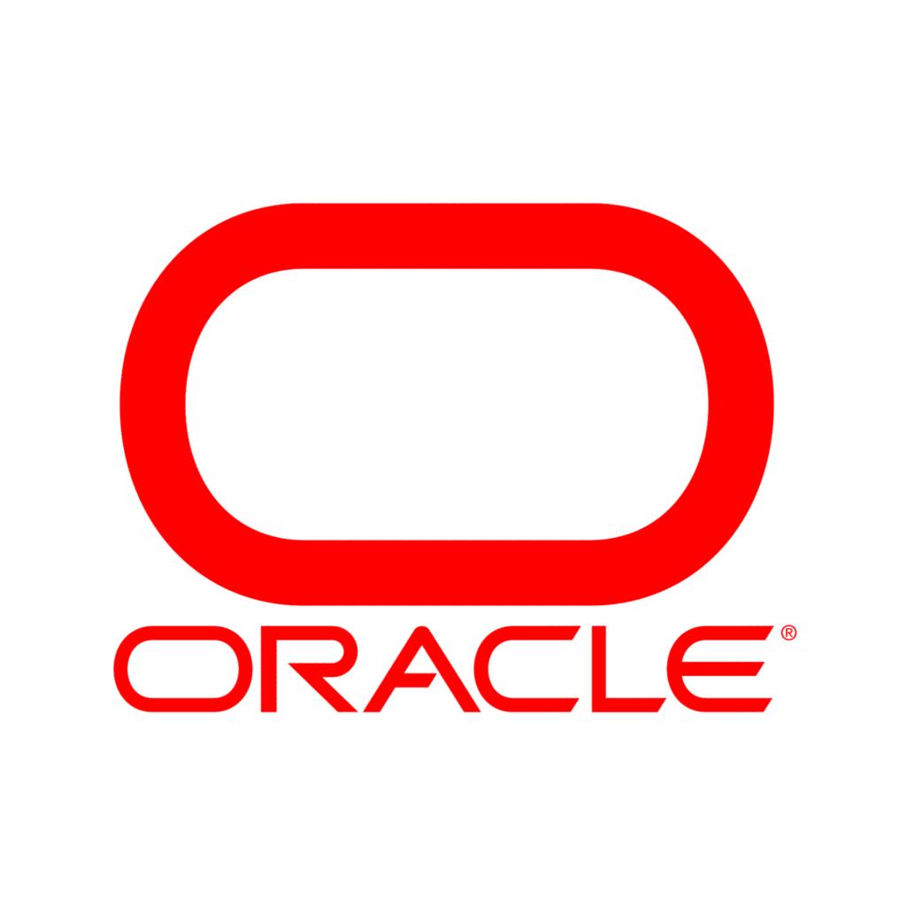

# Databases : Hoofdstuk 1 - Inleiding

## Databanken inleiding

Enkele voorbeelden van het gebruik van databases in het dagelijks leven:
- Betalen aan de kassa: De barcode van producten wordt gescand en in de databank wordt de prijs van het product opgezocht. Bij het kopen van het product wordt ook de stock-lijst met 1 verminderd.
- Bibliotheek: houdt een databank bij met de details van boeken, lezers, reservaties,... 
- Bankautomaat: Wanneer je geld opvraagt moet er nagegaan worden of je nog genoeg geld hebt. Wanneer je genoeg hebt staan moet er aan de databank doorgegeven worden welk bedrag er moet aangepast worden.

### Gegevensmanagement via bestanden

Vroeger werd data opgeslagen in bestanden.

> Deze aanpak is grotendeels verouderd. Enkele databankmanagement systemen maken hiervan nog gebruik. (bv. Enscribe, gebruikt door HP-NonStop mainframe)

In een bestandsgebaseerde oplossing, definieert elke toepassing zijn eigen bestanden. We gebruiken dus verschillende bestanden zonder relaties tussen deze bestanden. 

Stel we hebben een traditionele facturatie-applicatie en CRM systeem en een GIS toepassing die elk gebruik maken van informatie zoals klantnummer, klantnaam, postcode,... Wanneer deze gegevens opgenomen worden in afzonderlijke gegevensbestanden zal deze benadering voor problemen zorgen. (Elke wijziging moet op 3 verschillende locaties uitgevoerd worden.)

#### Nadelen gegevensmanagement via bestanden

##### 1. Verspreiding en isolatie van gegevens

Gegevensmanagement met bestanden kan ingewikkeld worden wanneer men gegevens wil combineren uit verschillende gegevens. Stel gegevens die in twee verschillende bestanden zitten (bv. salarisgegevens en certificaten). In zo een geval dienen we beide bestanden regel per regel overlopen. De verworven gegevens worden dan naar een tijdelijk bestand opgeslagen.

##### 2. Gegevens redundantie

> Wanneer gegevens in afzonderlijke bestanden worden opgeslagen, is het mogelijk dat dezelfde gegevens meer dan eens worden opgeslagen. We spreken dan over **gegevensredundantie**.

Verschillende nadelen gekoppeld aan veelvuldig opslaan van data:

- Gegevensredundantie is verspilling. Het kost tijd en geld om de gegevens meer dan eens in te voeren.
- Het neemt extra opslagruimte in beslag, met bijbehorende kosten.
- Het belangrijkste nadeel is dat gegevensredundantie kan leiden tot het verslies van **data-integriteit**: de date is niet meer consistent. 

##### 3. Data afhankelijkheid

Er is een zeer gorte verwevenheid tussen het programma dat gebruik maakt van het bestand en de structuur van de data in het bestand. 
Stel een programma dat de data inleest op basis van de character positie. Wanneer er extra data wordt toegevoegd moet ook het programma aangepast worden.

##### 4. Incompatibiliteit

Incompatibiliteit kan onstaan wanneer de data wordt geraadpleegd door verschillende programma's geschreven in verschillende talen. Hier is er dan een conversieprogamma nodig zodat de data compatible blijft in beide programma.

##### 5. Fixed queries

Na het overschakelen van fysieke opslag voor data naar een datamanagementsysteem (DBMS(en)) werd duidelijk dat gebruikers ingewikkelde vragen stelden die niet meteen mogelijk waren. (bv. wanneer enkel de gemiddelde lonen werd bijgehouden. Wanneer men het maximuumloon wil weten moet eerst het programma aangepast worden.)

### Basisbegrippen

> **Een databank** is een gedeelde verzameling van logisch met elkaar verbonden gegevens en hun beschrijving, ontworpen om aan de informatienoden van een organisatie te voldoen.

Om een databank te kunnen opzetten, beheren en efficiënt te gebruiken, zijn computerprogramma's nodig.

> **Het databankmanagementsysteem (DBMS)** is een verzameling van programma's waarmee een databank kan worden gecreëerd en beheerd en waarmee gegevens in de databank kunnen worden geladen, gewijzigd en opgevraagd. Het is de interface tussen de gebruikerprogramma's en de databank. 

> [!important]
> Alle interactie met een databank gebeurd via het DBMS!
> Buiten het DBMS hebben geen applicaties rechtstreekse toegang tot de databank.

Een DBMS staat het volgende toe:

- het definiëren van gegevens
- het manipuleren van gegevens
- het bewaken van de integriteit
- de beveiliging ondersteunen, zodat gebruikers en groepen allen toegang hebben waarvoor ze geautoriseerd zijn.
- back-up en recovery van data
- beheerstools om de prestaties van de databank te monitoren en te optimaliseren.

**Voordelen van DBMS:**

- Beheersen van dataredundantie 
- Data consistentie (waneer een data item maar één keer wordt opgeslagen is één update voldoende)
- Meer informatie uit dezelfde data: Het gebruik van een DBMS laat toe om data op andere manieren te bevragen, waardoor we meer informatie kunnen halen uit dezelfde data.
- Data delen: Bestanden behoren meestal tot één persoon. Een databank is vaak beschikbaar voor een organisatie.
- Verbeterde data-integriteit: Databank-integriteit verwijst naar de validiteit en consistentie van de opgeslagen data. Er kunnen constraints aan een databank toegevoegd worden. (eisen waaran de opgeslagen data moet voldoen. Bv. geboortedatum kan niet in de toekomst liggen)
- Verbeterde beveiliging: Databankbeveiliging is het afschermen van de data in de databank tegen ongeoorloofde gebruikers. Dit kan afgedwongen worden door het gebruik van gebruikersnamen en paswoorden voor alle gebruikers van de databank. Sommige gebruikers kunnen toegang hebben tot meer of minder data.

**Nadelen van DBMS:**

- Complexiteit: Alle functionaliteit die verwacht wordt van een goed DBMS zorgt ervoor dat dit om een ingewikkeld stuk software gaat.
- Grootte: Een DBMS vergt veel schijfruimte en geheugenruimte
- Kost: Een professionele DBMS voor veel gebruikers kan extreem duur zijn.
- Grote impact bij het falen van het systeem: Alle gebruikers en applicaties zijn afhankelijk van de beschikbaarheid van de centrale DBMS, het uitvallen bepaalde componenten kan een enorme impact hebben op de rest van het systeem.
- Performantie: bestandsgebaseerde databanken werken vaak met zeer specifiek geschreven applicaties, waardoor de performantie beter is dan bij algemene databanken.

#### RDBMS

> **Een RDBMS** of een relationeel databankbeheersysteem (= Relational Database Management System) is een systeem voor het beheren van *relationele* databanken. 

Bekende voorbeelden:

<table>
<tr>
    <th>ORACLE</th>
    <td width="15%"></td>
    <td>Het grootste en eerste commerciële RDBMS. Wordt gebruikt in veel van 's werelds grootste bedrijven</td>
</tr>
<tr>
    <th>MS SQL Server</th>
    <td width="15%"></td>
    <td>RDBMS-product van Microsoft. Leverbaar in vele versies voor verschillende bedrijfsbehoeften.</td>
</tr>
<tr>
    <th>DB 2</th>
    <td width="15%"></td>
    <td>RDBMS van IBM. Wordt gebruikt als databank bij mainframes.</td>
</tr>
<tr>
    <th>MySQL</th>
    <td width="15%"></td>
    <td>Het populairste open source RDBMS. Sinds 2010 wordt het ontwikkeld, gedistribueerd en ondersteund door Oracle Corporation.</td>
</tr>
<tr>
    <th>PostGreSQL</th>
    <td width="15%"></td>
    <td>Ook een gratis, open source RDBMS. Sommigen zouden zeggen krachter dan MySQL.</td>
</tr>
</table>

#### Databanksysteem

> De combinatie van een DBMS en een databank wordt vaak **een databanksysteem** genoemd.

**Toepassingsprogramma's**

Je kunt op indirecte wijze werken met een databank via toepassingssoftware. De software zorgt eerst voor de verbinding met het DBMS en deze verzorgt de toegang tot de relevante databanken. Daarna worden de gebruikers acties vertaald naar databankoperaties die dan verwerkt worden door het DBMS. Na het uitvoeren van deze operaties stuurt het DBMS eventuele resultaten terug.

**Databankgebruikers**

- *De data-administrators (DA)* zijn de personen die centraal verantwoordelijk zijn voor de data. De DA beslist welke data, in welk formaat, in welke databank moet opgeslagen worden. Hij speelt een belangrijke rol bij het ontwerpen van een DB. Hij ontwikkelt de modellen, legt de constraints vast. (vooral belangrijke functie bij grote conversies of aanpassingen aan een DB)

- *De databankontwerper* vertaalt het conceptueel model naar logisch en intern model

- *De databank administrators (DBA)* zijn personen die technisch verantwoordelijk zijn voor de implementatie en onderhoud van de databanken. Verzorgt genoeg performantie en is verantwoordelijk voor het herstel na falen (back-up en restore)

- *De applicatieontwikkelaar* staat in voor de ontwikkeling van interactieve, gebruiksvriendelijke applicaties die toestaan te werken met een databanksysteem. De ontwikkelaar moet beschikken over een werkkopie om de software te kunnen testen.

- *De eindgebruikers* kunnen we opsplitsen in twee groepen. De gebruikers die niet bewust zijn van de databank. (bv. kassierster) En de gebruikers die bekend zijn met de structuur van de DB en deze raadplegen op via complexere instructies uit de databanktaal.

####  Elementen van een databanksysteem

> **Het databankmodel** of databank schema beschrijft de data op verschillende detailniveaus en specifieert de verschillende data items die worden opgeslagen in de databank, hun kenmerken, hun onderlinge relaties en details in verband met de opslag.

Het databankmodel wordt vastgelegd bij het ontwerpen van de databank en verandert doorgaans niet dikwijls.

Het databankmodel wordt opgeslagen in **de cataloog**, wat het hart is van de DBMS.

> **De toestand** van een databank is de data die de databank op dat ogenblik bevat en wijzigt voortdurend, door het toevoegen, verwijderen of bijwerken van data.

##### datamodel

Een databankmodel bestaat uit verschillende datamodellen, die elk de data vanuit een ander perspectief beschrijven. Een goed datamodel zorgt voor een duidelijke en ondubbelzinnige beschrijving van de data items, de relaties tussen de data items en de constraints die van toepassing zijn.

- **Het conceptueel datamodel** voorziet een beschrijving van de data op hoog niveau, samen met karakteristieken en hun onderlinge relaties.
    - voorbeeld:
        - beschrijving hoog niveau: LEVERANCIER, PRODUCT
        - karakteristieken: leveranciersnaam
        - relatie: een LEVERANCIER kan een PRODUCT leveren
    - het model is een instrument om te communiceren tussen de informatie architect en de opdrachtgever. (zeker zijn data data voldoende correct begrepen en voorgesteld wordt)
    - het model is onafhankelijk van de concrete implementatie van de databank. Het moet gebruiksvriendelijk zijn en aanleunen bij hoe de business de data ziet
    - meest gebruikte model: **het ER model** wordt meestal voorgesteld door het ERD (*Entity Relationship Diagram*)
    - Het ERD is de blauwdruk van de databank.
    - voordelen:
        - geeft een beeld van de volledige data dat relatief eenvoudig te begrijpen is
        - onafhankelijk van software en hardware (DBMS-software maakt niet uit)

- **Het fysieke databankmodel** beschrijft hoe de data in de databank zal worden opgeslagen: welke data waar zullen worden opgeslagen, wat de grootte
    - de data items zijn nog steeds begrijpelijk voor niet IT-ers
    - leunt dichter bij hoe fysiek de data zal opgeslagen worden. (bv. door al een beslissing te maken of een relationele databank of een object-georiënteerde databank of een NoSQL databank gebruikt zal worden)
