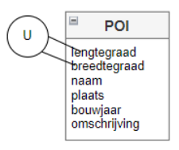
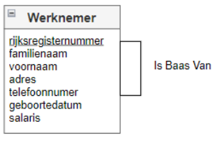
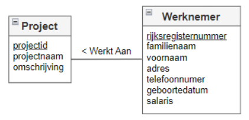
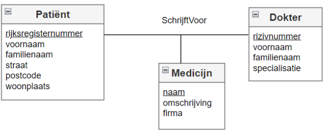

# DATABASES : Hoofdstuk 2 - Conceptueel Model

## Inleiding

Verreweg het populairste databanksysteem van de laatste 40 jaar is de relationele databank. 
- Ontworpen door Edgar F. Cobb in 1970
- Schreef nieuw theoretisch ontwerp voor databanken
- Ontwerp was gebaseerd op verzamelingenleer en predikaatlogica
- Basisprincipes van het van het relationele databankontwerp werd geformuleerd in 12 regels
- De eerste regel: 'de informatieregel' stelt:
    > "All information in a relational databank is represented explicitly at the logical level and in exactly one way -- values in tables"
    - In het kort: in een relationeel model worden de gegevens georganiseerd in tabellen.
    - Zelfs de informatie over de tabellen wordt opgeslagen in een tabel
    - Tabellen definiëren onderling de relaties door middel van het herhalen van een attribuut of kolom van de ene tabel in een andere tabel.
        > Deze attributen worden **sleutels** genoemd.
- Het stelt ook dat het logische model los moet staan van het fysieke ontwerpoverwegingen.

> Het gebruik van "sleutels" lostte het belangrijke probleem op destijds, nl. het verbinden van gegevens uit verschillende delen van de databank met elkaar.

In vele vroegere databankontwerpen moest een programmeur een routine schrijven in een taal als Fortran of Cobol om de gegevens te extraheren uit de databank en met elkaar te vergelijken. In een goed ontworpen relationele databank kan elk gegeven met elkaar vergeleken of samengevoegd worden.

- Grootste nadeel: de inherente complexiteit van het ontwerp.

- Cruciaal om een ontwerpproces te volgen dat zowel de aard van de gegevens, als de structuur van de databank verduidelijkt.

- Grootste voordeel: **gegevensintegriteit** en efficiëntie

### Fases in een databank ontwerp

Ontwerp van een databank start bij een bedrijfsproces.

#### STAP 1: verzamelen en analyseren van informatie en eisen.

**Doel**: verschillende stappen en gegevensbehoeften van het proces zorgvuldig begrijpen

De informatie-architect werkt samen met de zakelijke gebruiker om de databankeisen te verhelderen.

Technieken:
- interviews of enquêtes met eindgebruikers om hun eisen met betrekking tot de data te begrijpen en documenteren
- inspecties van documenten die in het huidige proces gebruikt worden

Het resultaat van deze stap is een beknopt geschreven set van gebruikerseisen. Deze eisen moeten zo gedetailleerd en volledig mogelijk gespecificeerd worden

#### STAP 2: maken van een conceptueel model

Dit gebeurd met behulp van een conceptueel gegevensmodel op hoog niveau en wordt **een conceptueel ontwerp** genoemd.

Tijdens het conceptueel ontwerp proberen beide partijen de gegevensvereisten te formaliseren in een conceptueel datamodel.

- Dit moet een high-level model zijn (eenvoudig te begrijpen voor beide partijen)
- Conceptueel model moet gebruiksvriendelijk zijn
- Heeft bij voorkeur een visuele voorstelling
- Is flexibel genoeg om nieuwe of veranderde gegensvereisten gemakkelijk aan het model toe te voegen.
- Moet DBMS- of implementatieonafhankelijk te zijn.
- Het model zal beperkingen hebben die ook gedocumenteerd en opgevolgd worden tijdesn de ontwikkeling van de applicatie.

#### STAP 3: maken van een logisch model

Wanneer alle partijen akkoord zijn over het conceptuele model, kan het omgezet worden naar **een logisch datamodel** door de databankontwerper. 

Het conceptueel model dat bestaat uit entiteittypes, attribuuttypes en relatietypes, wordt omgezet naar een logisch model.

In deze stap is al bekend welke DBMS er gebruikt gaat worden (RDBMS, OODBMS). Maar het product zelf (Microsoft, Oracle) ligt nog niet vast.

Aangezien de meeste commerciële DBMS'en gebruik maken van het relationeel gegevensmodel, betekent dat concreet dat de entiteittypes, attribuuttypes en relatietypes worden omgezet naar 'onderling verbonden' tabellen die elk meestal bestaan uit verschillende kolommen.

Met de opkomst van BigData nemen de niet-relationele databanken een steeds prominentere plaats in. Deze staan bekend onder de verzamelnaam NoSQL-databanken.
- MongoDB
- Cassandra
- Redis
- Neo4j

> Het mappen van het conceptueel naar logisch datamodel kan een verlies van data te weeg brengen. Deze moet goed gedocumenteerd worden en opgevolgd worden tijdens de applicatieontwikkeling. Mogelijks moet er aanvullende informatie toegevoegd worden aan het logische datamodel.

#### STAP 4: Implementeren van de databank

Als laatste stap implementeren we de databank met het gekozen RDBMS. Dit noemen we **het fysiek model**. 

- We specifiëren interne opslagstructuren, fysieke ontwerpparameters, indexen,...
- De DBA kan tijdens deze stap aanbevelingen doen met betrekking tot performantie
- Hier is het DBMS-product bekend (MS SQL Server, MySQL,...)
- De DDL-code wordt gegenereerd en de datadefinities worden opgeslagen in de catalogus

De databank is hierna klaar voor het toevoegen van data en is klaar voor gebruik.

> Indien mogelijk worden de functionele beschrijvingen vertaald naar databankconcepten. 

## Entity Relationship Diagram

- Het ER (Entity Relationship) model werd geïntroduceerd en geformaliseerd in 1976 door Peter Chen
- één van de populairste datamodellen voor conceptuele datamodellering
- Heeft een aantrekkelijke en gebruiksvriendelijke grafische notatie onder de vorm van ERD's
- Heeft 3 bouwstenen: entiteitstypes, attribuuttypes en relatietypes

### Entiteittypes, attribuuttypes en sleutels

Het ER model beschrijft data met behulp van entiteiten, relaties en attributen.

#### Entiteittype

- vertegenwoordigt een concept met een ondubbelzinnige betekenis voor een bepaalde groep gebruikers. 
- voorbeelden: LEVERANCIER, STUDENT, PRODUCT, WERKNEMER
>  **Een entiteit** is een specifieke instantie van een entiteittype.
- Entiteiten kunnen fysieke objecten of abstracties zijn.
    - voorbeelden:
        - bepaalde personen
        - auto
        - huis
        - vliegroutes
        - muziekconcerten
        - opleiding
- Een entiteittype definieert dus een verzameling entiteiten die vergelijkbare kenmerken hebben. 
- Bij het bouwen van een conceptueel gegevensmodel richten we ons op entiteittypen en niet op individuele entiteiten

#### Attribuuttype

> Een attribuuttype vertegenwoordigt een eigenschap van een entiteittype. 

Bijvoorbeeld: Voornaam, familienaam, adres, telefoonnummer, geboortedatum en salaris zijn attribuuttypes van het entiteittype WERKNEMER.

Een bepaalde entiteit heeft een waarde voor elk van zijn attribuuttypes (bv. de voornaam is Jan en familienaam Janssens).
Een attribuut definieert een verzameling van gelijksoortige attributen, of, een attribuut is een instantie van een attribuuttype. De attribuutwaarden die elke entiteit beschrijven, vormen een belangrijk deel van de gegevens die in de databank zijn opgeslagen.

#### Domein

> Een domein specifieert de verzameling waarden die een attribuuttype van een individuele entiteit, kan krijgen.

Bv. Het maandsalaris van een WERKNEMER kan een positief getal zijn tussen 1000 EUR en 10000 EUR. 

Een domein kan ook nulwaarden bevatten. Dit betekend dat de waarde niet bekend is, niet van toepassing is of niet relevant is. 

> Dit is niet hetzelfde als de waarde 0 of een lege string ("").

Denk bijvoorbeeld aan een e-mailadres van een domein dat nulwaarden toestaat voor het geval dat het e-mailadres niet bestaat.

> Bij conventie wordt het domein niet weergegeven in het ER-model.

In een ER-model komen er verschillende types attributen voor:

- **Enkelvoudige of atomaire versus samengestelde attributen**:
    - Enkelvoudige attributen kunnen niet verder opgesplitst worden? (bv. familienaam)
    - Samengestelde attributen kunnen opgesplitst worden in betekenisvolle subdelen (bv. attribuut adres van entiteit WERKNEMER kan onderverdeeld worden in straat, huisnummer, postcode,...)
        - geen nood om onder te verdelen als alleen naar het geheel verwezen wordt.
        - adres kan als één attribuut bestaan als niet naar de straat, huisnummer,... verwezen wordt.

    > Wij werken in het conceptueel model steeds op het niveau van enkelvoudige attribuuttypes

- **Enkelwaardige versus meerwaardige attributen**:
    - Meeste attributen hebben één waarde voor een bepaalde entiteit, deze noemen we **enkelwaardige attributen** (bv. geboortedatum van WERKNEMER)
    - In sommige gevallen kan een attribuut een reeks aan waarden hebben, deze noemen we **meerwaardige attributen** (bv. hobby's of talenkennis van een WERKNEMER)

    > In een ERD mogen beide principes voorkomen. In deze cursus worden ze de meerwaardige attributen vermeden omdat ze niet opgenomen kunnen worden in een RDBMS.

- **Berekende of afgeleide attributen**:
    - Waarde van een afgeleid attribuut kan berekend worden op basis van de waarden van andere attributen. (bv. leeftijd wordt berekend op basis van de huidige datum en geboortedatum)
    - Afgeleide attributen worden niet opgeslagen in de databank. (kan inconsistent zijn) Dit wordt vervangen door de basisinfo waaruit de waarde van het attribuuttype kan berekend worden.

- **NULL waarden**:
    - Soms heeft een bepaalde entiteit geen toepasselijke waarde voor een attribuut. (bv. busnummer van een adres)
    - Attribuut krijgt de speciale waarde *NULL*.

#### Kandidaatsleutelattributen

> 1 attribuut dat de entiteiten van een entiteittype op een unieke manier kan identificeren, vormt een kandidaatsleutel van het entiteittype (attribuut met één waarden die verschillend is voor elke individuele entiteit)

Voorbeelden: leveranciersnummer voor LEVERANCIER, productnummer voor PRODUCT, ...

In het ERD worden kandidaatsleutels onderlijnd. Er kunnen meerdere kandidaatsleutels zijn. Later wordt er één primaire sleutel gekozen.

Is er geen afzonderlijk attribuut dat kan fungeren als kandidaatsleutel, dan kunnen verschillende attributen samen een kandidaatsleutel vormen. (combinatie van attribuutwaarden moet uniek zijn.)

Een samengestelde sleutel moet minimaal zijn. Overige attributen, die niet bijdragen aan de uniciteit van de entiteit mogen niet opgenomen worden in een sleutel.

Voorbeeld: entiteit POI (Point Of Interest), naam is hier geen goede keuze. (citadelpark zowel in Namen als in Gent) De beste keuze hier is de combinatie van lengtegraad en breedtegraad als unieke sleutel.

In het ERD wordt een samengestelde kandidaatsleutel aangeduid met *de u-constraint*

Sleutels die gebaseerd zijn op attributen die van nature bij de entiteit horen, noemen we *natuurlijke sleutels*.

Velen pleiten voor het gebruik van natuurlijke sleutels om te beschermen tegen onbedoelde duplicatie. Zo mogen geen twee personen hetzelfde e-mailadres hebben. Wordt dit toch toegevoegd aan de database, geeft het databankbeheersysteem een foutmelding. 

Anderen beweren dat sleutels willekeurig moeten zijn. Ze stellen dat het moeilijk is om steeds een natuurlijke sleutel te vinden en dat ontwerpers vaak een toevlucht moeten nemen to moeilijk samengestelde sleutels. Zij pleiten om een uniek nummer te geven aan elk exemplaar van een entiteit. Dit worden *surrogaatsleutels* genoemd.

#### Relatietype

Een relatie stelt een verband tussen twee of meer entiteiten voor. (bv. ACTEUR speelt in een FILM)

> Een relatietype is een verzameling van relaties tussen instanties van één, twee, of meer al dan niet verschillende entiteittypes. (elk relatietype krijgt een naam)

Voorbeeld: relatie tussen WERKNEMER en PROJECT

Deze kan als volgt beschreven worden: een WERKNEMER kan meewerken aan veel PROJECTen en aan een PROJECT wordt door veel WERKNEMERs gewerkt.

#### Graad

> De graad van een relatietype is het aantal verschillende entiteittypes dat deelneemt aan het relatietype.

- Een unair (n=1) of recursief relatietype heeft graad één.

- Een binair (n=2) relatietype heeft twee deelnemende entiteittypen

- Een n-air relatatie type heeft *n*-deelnemende entiteitstypen

> In deze cursus beperken we ons to unaire en binaire relatietypes

#### Rolnamen

Elke entiteitstype dat deelneemt in een relatietype speelt een bepaalde rol in de relatie. De rolnaam geeft aan welke rol de deelnemende entiteit speelt in elke relatie-instantie. 

> Een rolnaam helpt ons uitleggen wat de relatie betekent.

Voorbeeld: binnen het relatietype *Werkt Aan* speelt de WERKNEMER de rol van werknemer en PROJECT de rol van project of opdracht.

Rolnamen zijn technisch gezien niet noodzakelijk in relatietypen waarbij alle deelnemende entiteitstypen verschillend zijn (n>=2), aangezien de naam van elk deelnemend entiteitstype kan worden gebruikt als rolnaam.

>[!important]
>In het geval van unaire of recursieve relaties, neemt één entiteitstype meer dan één keer deel aan de relatie. In deze gevallen is het essentieel om de rolnaam te vermelden voor het onderscheiden van de betekenins die elke deelnemende entiteit speelt.
>
> Voorbeeld: relatietype *Is Baas Van* relateert een WERKNEMER aan een BAAS (beide zijn entiteiten van het entiteittype WERKNEMER). De WERKNEMER neemt tweemaal deel aan de relatie, één keer in de rol van baas, en één maal in de rol van ondergeschikte.
>

