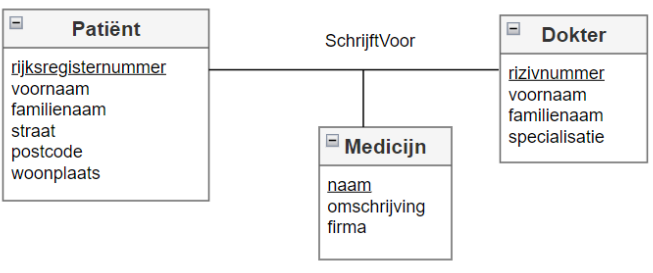

# DATABASES : Hoofdstuk 2 - Zwakke entiteiten

## Inleiding

Stel we maken een website dat helpt recreatieve lopers een overzicht te bewaren van de gelopen afstanden tijdens opeenvolgende trainingsessies. Bij registratie wordt een (uniek) emailadres, paswoord, voornaam, familienaam, geslacht en geboortedatum gevraagd.

Vervolgens kan men inloggen door het emailadres en passwoord in te geven.

De ingelogde gebruiker krijgt het volgende scherm te zien:

*Welke entiteittypes zijn nodig in de databank om bovenstaand overzicht te kunnen genereren per deelnemer?*

- We moeten ervan uitgaan dat het begintijdstip (datum en uur) en eindtijdstip (datum en uur) van de training worden opgeslagen in de databank. (maar niet weergegeven op de pagina)
- Met de opgeslagen tijdstippen wordt de sporttijd berekend.

Totale afstand = de totale afstand over alle trainingen van de ingelogde gebruiker.

Een eerste poging tot ERD zou er als volgt kunnen uitzien:

- tijdstip volgens timestampnotatie: jaar-maand-dag-uur-minuten

- kandidaatsleutelattribuuttype van het entiteitstype GEBRUIKER is *emailadres*
- Voor het entiteitstype TRAINING is dit niet vanzelfsprekend. (geen attribuut of combinatie van attributen is uniek)

Bovendien is het entiteitstype TRAINING bestaansafhankelijk van GEBRUIKER. (minimumcardinaliteit is één)

> Indien aan **beide** voorwaarden voldaan wordt: een entiteitstype is bestaansafhankelijk van een ander entiteitstype EN dit entiteitstype kan niet uniek geïdentificeerd worden aan de hand van zijn eigen attribuuttypes, dan spreken we van **een zwak entiteitstype**

## Zwakke entiteiten

In een ERD worden zwakken entiteiten aangeduid met een stippellijn.

Voor de identificatie wordt een kandidaatsleutelattribuut van het zwak entiteitstype gekoppeld aan de **relatie**. Dit attribuuttype wordt **niet onderlijnd**. (het is geen kandidaatsleutel maar maakt onder deel van een kandidaatsleutel)

In ons voorbeeld:
- identificatie aan de hand van begintijdstip en de relatie met GEBRUIKER
- het attribuuttype begintijdstip wordt **niet onderlijnd**

### Bestaansafhankelijkheid

> Wanneer de minimumcardinaliteit gelijk is aan 1, moet een entiteit altijd verbonden zijn met ten minste één andere entiteit via een relatie. Dit noemen we **bestaansafhankelijk**.

Een zwak entiteitstype is dus bestaansafhankelijk van 1 of meerdere andere entiteittype en heeft die entiteittypes nodig om zich te kunnen identificeren. Deze entiteitstype noemt met **de identificerende entiteittypes** van het zwakke entiteittype.

Zwakke entiteittypes kan men niet uniek identificeren **zonder** hun identificerende entiteittypes => zwakke entiteittypes kunnen geen kandidaatsleutel hebben.

Zwakke entiteittypes hebben wel kandidaatsleutelattribuuttypes. Die zorgen, samen met de kandidaatsleutelattribuuttypes van de identificerende entiteittypes, voor een unieke, irreducibele identificatie van de zwakke entiteittypes. We zeggen dat de kandidaatsleutelattribuuttypes van het zwakke entiteittype **een partiële kandidaatsleutel** vormen.

## Zwak entiteittype versus bestaansafhankelijk

> Specifieke bedrijfregels bepalen of een entiteittype zwak is of niet.

Stel: in de bedrijfregels legt men vast dat TRAININGen oplopend genummerd worden.

- TRAINING is nog steeds bestaansafhankelijk van GEBRUIKER
- maar TRAINING is niet langer een zwak entiteittype (trainingsnummer kan TRAINING identificeren)

> [!important]
> Bestaansafhankelijkheid alleen is niet voldoen om te spreken van een zwak entiteittype

## Historiek

Een context waarbinnne zwakke entiteiten vaak optreden is het begrip Historiek.

EXEMPLAAR is een zwakke entiteit: het is bestaansafhankelijk van BOEK en heeft niet voldoende attributen om zichzelf te identificeren.

Nadeel ERD: datum waarop LID een EXEMPLAAR van BOEK uitleent, verdwijnt uit de databank wanneer het LID dit EXEMPLAAR terug brengt. Dit strookt met wat we gewend zijn uit de realiteit.

*Soms is het noodzakelijk een overzicht van bepaalde historische gegevens te kunnen weergeven.*

Hier: ontleningen van elk EXEMPLAAR van een BOEK sedert dit werd aangekocht.

We voegen een extra zwak entiteittype ONTLENING toe. ONTLENING is een zwak entiteittype want het is bestaansafhankelijk van LID en van EXEMPLAAR en beschikt niet over voldoende attribuuttypes om zich te identificeren. We noemen het entiteittype ONTLENING **een historiek**.

> Een historiek wordt altijd voorgesteld door een apart, zwak entiteittype en zal altijd een datum-attribuut bevatten.

## Ternaire relatie modelleren met behulp van binaire relaties

Stel volgende ternaire relatie:

Eerste poging dit de modelleren met behulp van binaire relaties:

Dit is echter geen goede oplossing. Het is hier wel welke PATIËNT in behandeling is bij welke DOKTER en welke MEDICIJNen de PATIËNT inneemt, maar het is niet duidelijk welke DOKTER welk MEDICIJN heeft voorgeschreven voor een specifieke PATIËNT.

Bovendien, stel dat er een relatieattribuut *voorschrijfdatum* (datum dat DOKTER het MEDICIJN voor de PATIËNT voorschreef) zou bestaan, waar moet dit dan in het ERD opgenomen worden?

Dit kunnen we oplossen door gebruik te maken van zwakke entiteiten.

